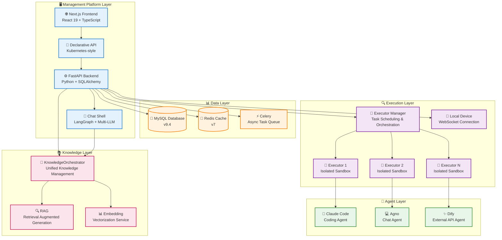
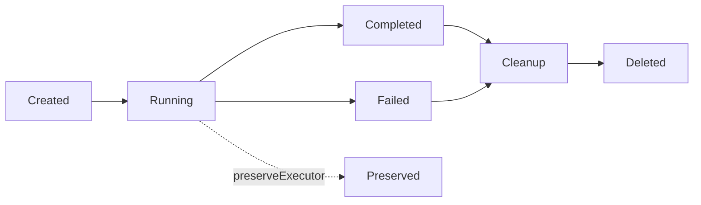
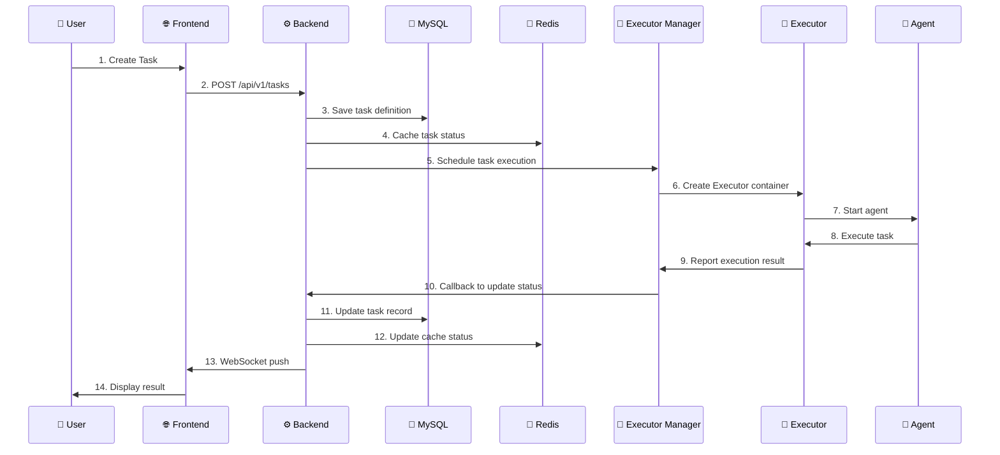

# 🏗️ System Architecture

This document provides a detailed overview of Wegent's system architecture, component design, and technology stack.

---

## 📋 Table of Contents

- [Architecture Overview](#architecture-overview)
- [Core Components](#core-components)
- [Data Flow and Communication Patterns](#data-flow-and-communication-patterns)
- [Technology Stack](#technology-stack)
- [Design Principles](#design-principles)
- [Scalability and Deployment](#scalability-and-deployment)

---

## 🌐 Architecture Overview

Wegent adopts a modern layered architecture design based on Kubernetes-style declarative API and CRD (Custom Resource Definition) design patterns, providing a standardized framework for creating and managing AI agent ecosystems.

### System Architecture Diagram



### Architecture Layers

| Layer | Responsibilities | Core Technologies |
|-------|-----------------|-------------------|
| **Management Platform Layer** | User interaction, resource management, API services, chat processing | Next.js 15, FastAPI, React 19, Chat Shell |
| **Data Layer** | Data persistence, cache management, async task scheduling | MySQL 9.4, Redis 7, Celery |
| **Execution Layer** | Task scheduling, container orchestration, resource isolation, local device management | Docker, Python, WebSocket |
| **Agent Layer** | AI capabilities, code execution, chat processing, external API integration | Claude Code, Agno, Dify |
| **Knowledge Layer** | Knowledge base management, RAG retrieval, vectorization | KnowledgeOrchestrator, Embedding |

---

## 🔧 Core Components

### 1. 🌐 Frontend

**Responsibilities**:
- Provide user interface for resource definition and management
- Implement task creation, monitoring, and result display
- Provide real-time interaction and status updates
- Manage local devices and executors

**Technology Stack**:
- **Framework**: Next.js 15 (App Router)
- **UI Library**: React 19, shadcn/ui
- **Styling**: Tailwind CSS 3.4
- **State Management**: React Context + Hooks
- **Internationalization**: i18next 25.5
- **Icons**: Heroicons, Tabler Icons, Lucide React

**Core Features**:
- 🎨 Configuration-driven UI with YAML visualization
- 🔄 Real-time task status updates (WebSocket)
- 🌍 Multi-language support (Chinese/English)
- 📱 Responsive design (Mobile/Desktop component separation)
- 📱 Local device management interface
- 💭 Thinking process visualization

**Key File Structure**:
```
frontend/src/
├── app/              # Next.js App Router
│   ├── (tasks)/     # Task-related pages
│   ├── (settings)/  # Settings pages
│   └── admin/       # Admin pages
├── features/        # Feature modules
│   ├── admin/       # Admin dashboard
│   ├── devices/     # Device management (new)
│   ├── feed/        # Discovery and subscriptions
│   ├── knowledge/   # Knowledge base management
│   ├── settings/    # Agent configuration
│   └── tasks/       # Core task functionality
├── components/      # Shared components
│   ├── ui/          # shadcn/ui base components
│   └── common/      # Business common components
└── hooks/           # Custom hooks
```

**Feature Modules**:

| Module | Purpose |
|--------|---------|
| **tasks** | Task creation, chat, group chat, workbench |
| **devices** | Local device management, executor guide |
| **knowledge** | Knowledge base, documents, permissions |
| **settings** | Agent, model, shell, skill configuration |
| **feed** | Subscription market, trigger management |

---

### 2. ⚙️ Backend

**Responsibilities**:
- Implement declarative API for resource CRUD operations
- Manage user authentication and authorization
- Coordinate execution layer for task scheduling
- Provide WebSocket support for real-time chat communication (Socket.IO)
- Unified knowledge management (KnowledgeOrchestrator)
- Manage local device connections

**Technology Stack**:
- **Framework**: FastAPI 0.68+
- **ORM**: SQLAlchemy 2.0
- **Database Driver**: PyMySQL
- **Authentication**: JWT (PyJWT), OAuth (Authlib), OIDC
- **Async Support**: asyncio, aiohttp
- **Cache**: Redis client
- **Real-time Communication**: Socket.IO (python-socketio) with Redis adapter
- **Async Tasks**: Celery

**Core Features**:
- 🚀 High-performance async API
- 🔒 JWT-based authentication
- 📝 Complete CRUD operation support
- 🔄 Real-time status synchronization
- 🛡️ Data encryption (AES-256-CBC)
- 👥 Role-based access control (admin/user)
- 🎼 Unified knowledge management (KnowledgeOrchestrator)
- 📱 Local device management (Device Provider)

**API Design**:
```
/api/v1/
├── /ghosts          # Ghost resource management
├── /models          # Model resource management
├── /shells          # Shell resource management
├── /bots            # Bot resource management
├── /teams           # Team resource management
├── /workspaces      # Workspace resource management
├── /tasks           # Task resource management
├── /devices         # Device management (new)
├── /knowledge       # Knowledge base management
├── /groups          # Organization/group management
├── /share           # Share link management
└── /admin           # Admin operations (user management, public models)
```

**Service Layer Architecture**:

| Service | Responsibility |
|---------|----------------|
| **KindService** | Unified CRD resource management |
| **KnowledgeOrchestrator** | Knowledge management entry point (REST API + MCP tools) |
| **DeviceService** | Local device management |
| **ChatService** | Chat processing and RAG |
| **SubtaskService** | Subtask management |
| **GroupService** | Multi-tenant group management |
| **UserService** | User management |

**Key Dependencies**:
```python
FastAPI >= 0.68.0      # Web framework
SQLAlchemy >= 2.0.28   # ORM
PyJWT >= 2.8.0         # JWT authentication
Redis >= 4.5.0         # Cache
httpx >= 0.19.0        # HTTP client
python-socketio >= 5.0 # Socket.IO server
celery >= 5.0          # Async tasks
```

---

### 3. 💬 Chat Shell (Conversation Engine)

**Responsibilities**:
- Provide lightweight AI conversation engine
- Support multiple LLM models (Anthropic, OpenAI, Google)
- Manage conversation context and session storage
- Integrate MCP tools and skill system
- Support knowledge base retrieval augmentation (RAG)

**Technology Stack**:
- **Framework**: FastAPI
- **Agent Framework**: LangGraph + LangChain
- **LLM**: Anthropic, OpenAI, Google Gemini
- **Storage**: SQLite, Remote API
- **Observability**: OpenTelemetry

**Three Deployment Modes**:

| Mode | Description | Use Case |
|------|-------------|----------|
| **HTTP** | Standalone HTTP service `/v1/response` | Production |
| **Package** | Python package, imported by Backend | Monolithic deployment |
| **CLI** | Command-line interactive interface | Development/Testing |

**Core Features**:
- 🤖 Multi-LLM support (Anthropic, OpenAI, Google)
- 🛠️ MCP tool integration (Model Context Protocol)
- 📚 Dynamic skill loading
- 💾 Multiple storage backends (SQLite, Remote)
- 📊 Message compression (auto-compress when exceeding context limit)
- 📈 OpenTelemetry integration

**Module Structure**:
```
chat_shell/chat_shell/
├── main.py           # FastAPI application entry
├── agent.py          # ChatAgent creation
├── interface.py      # Unified interface definitions
├── agents/           # LangGraph agent building
├── api/              # REST API endpoints
│   └── v1/          # V1 version API
├── services/         # Business logic layer
│   ├── chat_service.py
│   └── streaming/   # Streaming response
├── tools/            # Tool system
│   ├── builtin/     # Built-in tools (WebSearch, etc.)
│   ├── mcp/         # MCP tool integration
│   └── sandbox/     # Sandbox execution environment
├── storage/          # Session storage
│   ├── sqlite/      # SQLite storage
│   └── remote/      # Remote storage
├── models/           # LLM model factory
├── messages/         # Message processing
├── compression/      # Context compression
└── skills/           # Skill loading
```

---

### 4. 💯 Executor Manager

**Responsibilities**:
- Manage Executor lifecycle
- Task queue and scheduling
- Resource allocation and rate limiting
- Callback handling
- Support multiple deployment modes

**Technology Stack**:
- **Language**: Python
- **Container Management**: Docker SDK
- **Networking**: Docker bridge network
- **Scheduling**: APScheduler

**Deployment Modes**:

| Mode | Description | Use Case |
|------|-------------|----------|
| **Docker** | Use Docker SDK to manage local containers | Standard deployment |
| **Local Device** | Connect to local device for execution | Development environment |

**Core Features**:
- 🎯 Maximum concurrent task control (default: 5)
- 🔧 Dynamic port allocation (10001-10100)
- 🐳 Docker container orchestration
- 📊 Task status tracking
- 📱 Local device support

**Configuration Parameters**:
```yaml
MAX_CONCURRENT_TASKS: 5              # Maximum concurrent tasks
EXECUTOR_PORT_RANGE_MIN: 10001      # Port range start
EXECUTOR_PORT_RANGE_MAX: 10100      # Port range end
NETWORK: wegent-network              # Docker network
EXECUTOR_IMAGE: wegent-executor:latest # Executor image
```

---

### 5. 🚀 Executor

**Responsibilities**:
- Provide isolated sandbox environment
- Execute agent tasks
- Manage workspace and code repositories
- Report execution results

**Technology Stack**:
- **Container**: Docker
- **Runtime**: Claude Code, Agno, Dify
- **Version Control**: Git

**Agent Types**:

| Agent | Type | Description |
|-------|------|-------------|
| **ClaudeCode** | local_engine | Claude Code SDK, supports Git, MCP, Skills |
| **Agno** | local_engine | Multi-agent collaboration, SQLite session management |
| **Dify** | external_api | Proxy to Dify platform |
| **ImageValidator** | validator | Custom base image validation |

**Core Features**:
- 🔒 Fully isolated execution environment
- 💼 Independent workspace
- 🔄 Automatic cleanup mechanism (can be preserved with `preserveExecutor`)
- 📝 Real-time log output
- 🛠️ MCP tool support
- 📚 Dynamic skill loading

**Lifecycle**:


---

### 6. 💾 Database (MySQL)

**Responsibilities**:
- Persistent storage of all resource definitions
- Manage user data and authentication information
- Record task execution history

**Version**: MySQL 9.4

**Core Table Structure**:
```
wegent_db/
├── kinds            # CRD resources (Ghost, Model, Shell, Bot, Team, Skill, Device)
├── tasks            # Task and Workspace resources (separate table)
├── skill_binaries   # Skill binary packages
├── users            # User information (with role field)
├── groups           # Organizations/groups
├── namespace_members # Namespace members
├── knowledge_bases  # Knowledge bases
├── documents        # Documents
└── public_models    # System-wide public models
```

**Data Model Features**:
- Uses SQLAlchemy ORM
- Supports transactions and relational queries
- Automatic timestamp management
- Soft delete support
- CRD resources uniquely identified by (namespace, name, user_id) tuple

---

### 7. 🔴 Cache (Redis)

**Responsibilities**:
- Task status caching
- Session management
- Temporary real-time data storage
- Task expiration management
- Socket.IO multi-instance adapter

**Version**: Redis 7

**Use Cases**:
- 🔄 Chat task context caching (2-hour expiration)
- 💻 Code task status caching (2-hour expiration)
- 🎯 Executor deletion delay control
- 📊 Real-time status updates
- 🔌 Socket.IO Redis adapter (multi-instance communication)

---

### 8. ⚡ Celery (Async Tasks)

**Responsibilities**:
- Knowledge base document indexing (async)
- Document summary generation
- Long-running task processing

**Core Tasks**:

| Task | Purpose |
|------|---------|
| `index_document_task` | Document vectorization indexing |
| `generate_document_summary_task` | Document summary generation |

---

### 9. 🎼 KnowledgeOrchestrator

**Responsibilities**:
- Unify knowledge management for REST API and MCP tools
- Automatically select retriever, embedding model, summary model
- Coordinate Celery async tasks

**Architecture**:
```
Entry Layer (REST/MCP)
    ↓
KnowledgeOrchestrator
    ↓
Service Layer (knowledge_service.py)
    ↓
Celery Tasks (async processing)
```

**Core Features**:
- 🔗 Unified entry point: REST API and MCP tools share the same business logic
- 🤖 Auto model selection: Task → Team → Bot → Model chain resolution
- 📚 Multi-scope support: Personal, group, organization knowledge bases
- ⚡ Async indexing: Handle large documents via Celery

---

## 🔄 Data Flow and Communication Patterns

### Task Execution Flow



### Communication Protocols

| Communication Type | Protocol | Purpose |
|-------------------|----------|---------|
| **Frontend ↔ Backend** | HTTP/HTTPS, WebSocket (Socket.IO) | API calls, real-time chat streaming |
| **Backend ↔ Database** | MySQL Protocol | Data persistence |
| **Backend ↔ Redis** | Redis Protocol | Cache operations, Socket.IO adapter |
| **Backend ↔ Executor Manager** | HTTP | Task scheduling |
| **Executor Manager ↔ Executor** | Docker API | Container management |
| **Executor ↔ Agent** | Process invocation | Task execution |

### WebSocket Architecture (Socket.IO)

The chat system uses Socket.IO for bidirectional real-time communication:

**Namespace**: `/chat`
**Path**: `/socket.io`

**Client → Server Events**:
| Event | Purpose |
|-------|---------|
| `chat:send` | Send a chat message |
| `chat:cancel` | Cancel ongoing stream |
| `chat:resume` | Resume stream after reconnect |
| `task:join` | Join a task room |
| `task:leave` | Leave a task room |
| `history:sync` | Sync message history |

**Server → Client Events**:
| Event | Purpose |
|-------|---------|
| `chat:start` | AI started generating response |
| `chat:chunk` | Streaming content chunk |
| `chat:done` | AI response completed |
| `chat:error` | Error occurred |
| `chat:cancelled` | Stream was cancelled |
| `chat:message` | Non-streaming message (group chat) |
| `task:created` | New task created |
| `task:status` | Task status update |

**Room-based Message Routing**:
- User Room: `user:{user_id}` - For personal notifications
- Task Room: `task:{task_id}` - For chat streaming and group chat

**Redis Adapter**: Enables multi-worker support for horizontal scaling

---

## 🛠️ Technology Stack

### Frontend Stack

```typescript
{
  "framework": "Next.js 15",
  "runtime": "React 19",
  "language": "TypeScript 5.7",
  "ui": [
    "shadcn/ui",
    "Tailwind CSS 3.4",
    "Lucide React",
    "Heroicons 2.2"
  ],
  "i18n": "i18next 25.5",
  "markdown": "react-markdown",
  "realtime": "socket.io-client",
  "devTools": [
    "ESLint 9.17",
    "Prettier 3.4",
    "Husky 9.1"
  ]
}
```

### Backend Stack

```python
{
    "framework": "FastAPI >= 0.68.0",
    "language": "Python 3.10+",
    "orm": "SQLAlchemy >= 2.0.28",
    "database": "PyMySQL 1.1.0",
    "auth": [
        "PyJWT >= 2.8.0",
        "python-jose 3.3.0",
        "passlib 1.7.4",
        "authlib"  # OIDC support
    ],
    "async": [
        "asyncio >= 3.4.3",
        "aiohttp >= 3.8.0",
        "httpx >= 0.19.0"
    ],
    "cache": "redis >= 4.5.0",
    "realtime": "python-socketio >= 5.0",
    "tasks": "celery >= 5.0",
    "security": [
        "cryptography >= 41.0.5",
        "pycryptodome >= 3.20.0"
    ],
    "telemetry": "opentelemetry-*",
    "testing": [
        "pytest >= 7.4.0",
        "pytest-asyncio >= 0.21.0"
    ]
}
```

### Chat Shell Stack

```python
{
    "framework": "FastAPI",
    "agent": "LangGraph + LangChain",
    "llm": [
        "langchain-anthropic",
        "langchain-openai",
        "langchain-google-genai"
    ],
    "storage": "SQLite / Remote API",
    "telemetry": "opentelemetry-*"
}
```

### Infrastructure

```yaml
database:
  mysql: "9.4"

cache:
  redis: "7"

container:
  docker: "latest"
  docker-compose: "latest"

task_queue:
  celery: "5.0+"
  broker: "redis"

executor_engines:
  - "Claude Code (Anthropic)"
  - "Agno"
  - "Dify"
```

---

## 🎯 Design Principles

### 1. Declarative API Design

Following Kubernetes CRD design patterns:
- ✅ Resources defined declaratively in YAML
- ✅ Clear resource hierarchy
- ✅ Unified API version management
- ✅ Separation of status and desired state

**Example**:
```yaml
apiVersion: agent.wecode.io/v1
kind: Bot
metadata:
  name: developer-bot
  namespace: default
spec:
  # Desired state
  ghostRef:
    name: developer-ghost
status:
  # Actual state
  state: "Available"
```

### 2. Separation of Concerns

- 🎨 **Frontend**: Focused on user interaction and presentation
- ⚙️ **Backend**: Focused on business logic and data management
- 🚀 **Execution Layer**: Focused on task scheduling and resource isolation
- 🤖 **Agent Layer**: Focused on AI capability provision

### 3. Microservices Architecture

- 🔧 Each component deployed independently
- 📦 Containerized packaging
- 🔄 Loose coupling between services
- 📊 Independent scaling capability

### 4. Security First

- 🔒 JWT authentication mechanism
- 🛡️ AES-256-CBC encryption for sensitive data
- 🔐 Sandbox environment isolation
- 🚫 Principle of least privilege
- 👥 Role-based access control (admin/user roles)
- 🔑 OIDC enterprise single sign-on support

### 5. Observability

- 📝 Structured logging (structlog)
- 📊 Status tracking and monitoring
- 🔍 Detailed error information
- 📈 Performance metrics collection
- 🔭 OpenTelemetry integration (distributed tracing)

---

## 📈 Scalability and Deployment

### Horizontal Scaling

#### Frontend Scaling
```yaml
# Multi-instance deployment
frontend:
  replicas: 3
  load_balancer: nginx
```

#### Backend Scaling
```yaml
# Stateless design, supports multiple instances
backend:
  replicas: 5
  session: redis
  socket_adapter: redis  # Socket.IO multi-instance support
```

#### Chat Shell Scaling
```yaml
# Standalone service, supports multiple instances
chat_shell:
  replicas: 2
  storage: remote  # Remote storage for multi-instance
```

#### Executor Scaling
```yaml
# Dynamic creation and destruction
executor_manager:
  max_concurrent_tasks: 20
  auto_scaling: true
```

### Vertical Scaling

#### Database Optimization
- Read-write separation
- Index optimization
- Query caching

#### Redis Optimization
- Memory optimization
- Persistence strategy
- Cluster mode

### Deployment Modes

#### 1. Single-Machine Deployment (Development/Testing)
```bash
docker-compose up -d
```

**Use Cases**:
- Local development
- Feature testing
- Small-scale usage

#### 2. Distributed Deployment (Production)
```yaml
architecture:
  frontend: "Multi-instance + Nginx load balancing"
  backend: "Multi-instance + API gateway"
  mysql: "Master-slave replication + read-write separation"
  redis: "Redis Cluster"
  executor: "Dynamic scaling"
```

**Use Cases**:
- Production environment
- High concurrency requirements
- Large-scale teams

```yaml
architecture:
  frontend: "Multi-instance + Nginx load balancing"
  backend: "Multi-instance + API gateway + Redis Socket.IO adapter"
  chat_shell: "Multi-instance + Remote storage"
  mysql: "Master-slave replication + read-write separation"
  redis: "Redis Cluster"
  celery: "Multi-worker"
  executor: "Dynamic scaling"
```

#### 3. Cloud-Native Deployment (Kubernetes)
```yaml
apiVersion: apps/v1
kind: Deployment
metadata:
  name: wegent-backend
spec:
  replicas: 3
  template:
    spec:
      containers:
      - name: backend
        image: wegent-backend:latest
```

**Use Cases**:
- Cloud environments
- Auto-scaling
- High availability requirements

### Performance Metrics

| Metric | Target Value | Description |
|--------|--------------|-------------|
| **API Response Time** | < 200ms | P95 latency |
| **Task Startup Time** | < 5s | From creation to execution |
| **Concurrent Tasks** | 5-100 | Configurable |
| **Database Connection Pool** | 20 | Default configuration |
| **WebSocket Connections** | 1000+ | Concurrent online |

### Monitoring and Alerting

#### Key Metrics
- 📊 Task success rate
- ⏱️ Task execution time
- 💾 Database performance
- 🔴 Redis cache hit rate
- 🐳 Container resource usage

#### Log Collection
```python
import structlog

logger = structlog.get_logger()
logger.info("task.created",
    task_id=task.id,
    team=task.team_ref.name)
```

---

## 🔗 Related Resources

- [Core Concepts](../concepts/core-concepts.md) - Understand Wegent's core concepts
- [Collaboration Models](../concepts/collaboration-models.md) - Deep dive into collaboration patterns
- [YAML Specification](../reference/yaml-specification.md) - Complete configuration guide
- [CRD Architecture](./crd-architecture.md) - CRD design details
- [Skill System](../concepts/skill-system.md) - Skill development and integration
- [Local Device Architecture](./local-device-architecture.md) - Local device support

---

<p align="center">Understanding the architecture is key to mastering Wegent! 🚀</p>
