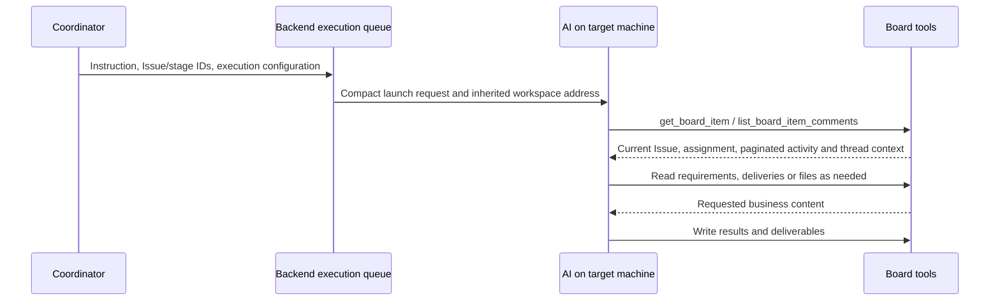
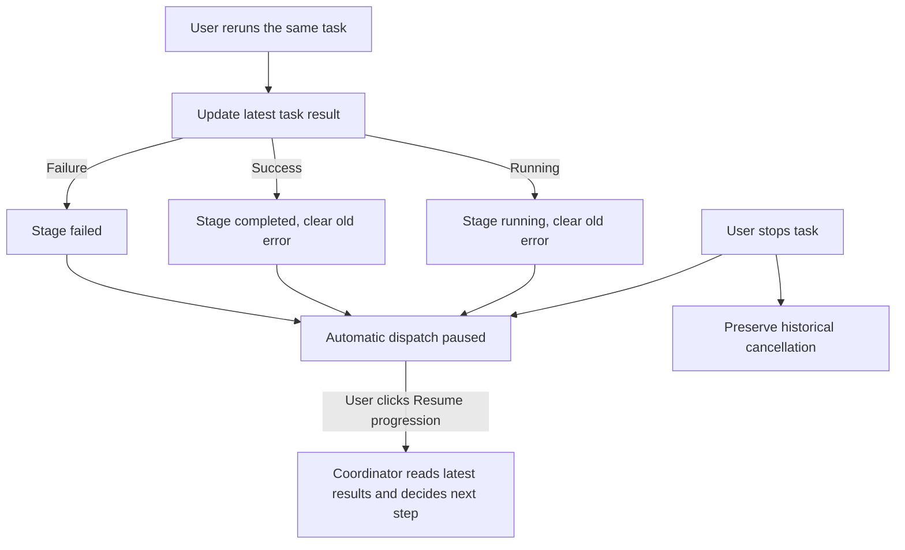
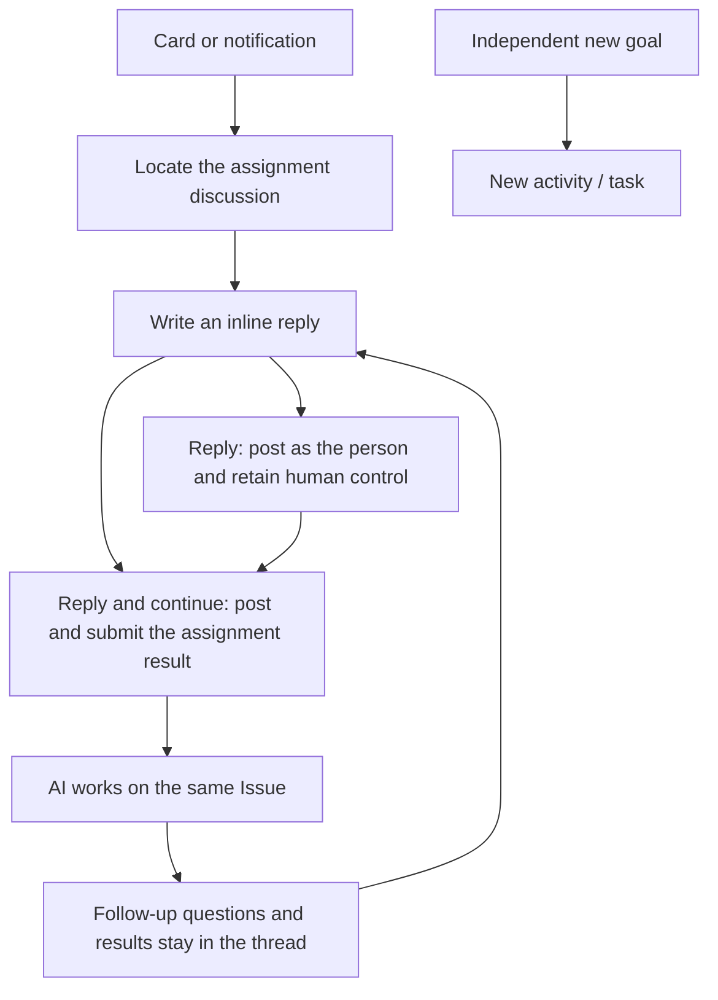
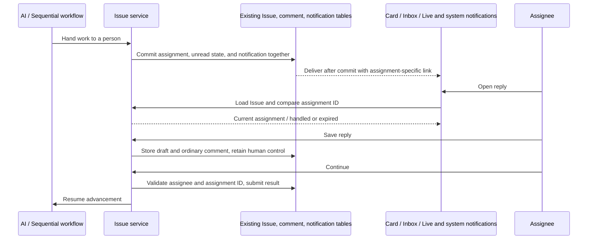
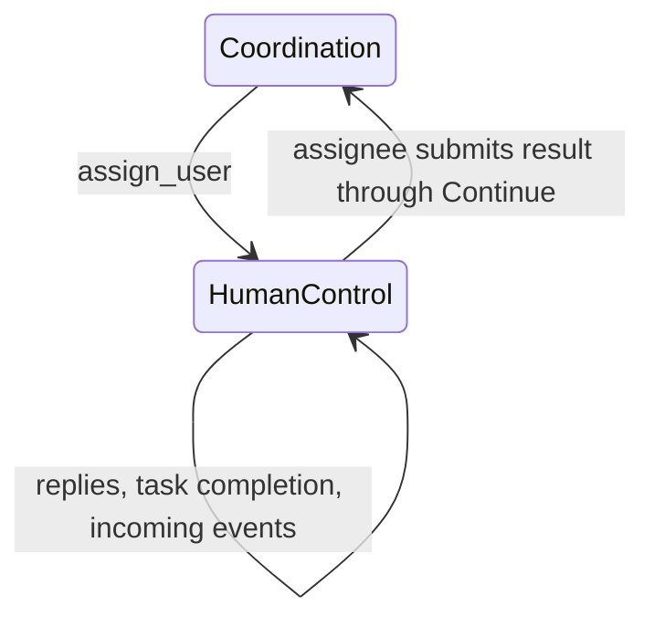
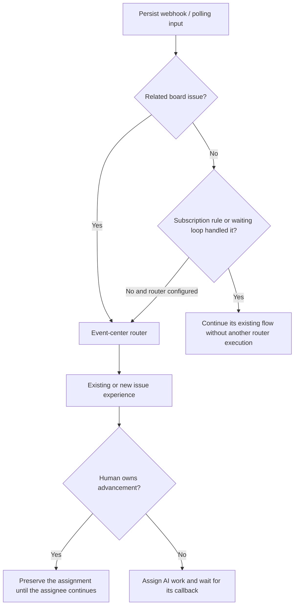
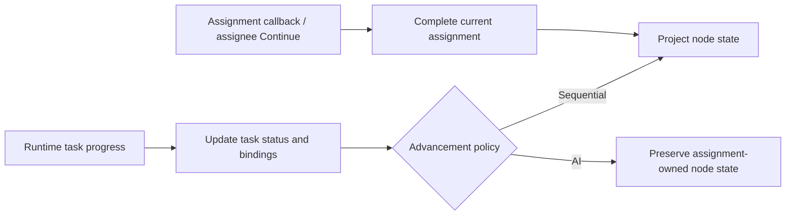
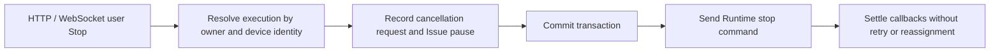

# Board automation interaction and acceptance

## 2026-09-10 AI reads context on demand

Launch requests retain the current instruction, Issue/stage identifiers, execution configuration, and inherited workspace address. Activity, historical conclusions, and delivery content stay in their original stores. Enqueueing, task binding, and dispatch no longer read, freeze, or copy them into execution_payload. The obsolete path that expanded stage content into origin, prompts, and additional context was removed. No database capacity change or content truncation is used.



list_board_item_comments enforces Issue access, pages backward from recent activity, and reuses thread context inclusion. It does not read unrelated Issue activity, reconcile execution state, or dispatch work. get_workflow_stage_context reads current content on invocation without persisting a binding snapshot. Launches still resolve predecessor workspace addresses for inherit and preserve existing execution target validation.

Regression sources cover large Issue content excluded from launch payloads, no eager content reads, bindings without snapshots, comment pagination/access isolation, workspace inheritance, and real MCP reads in the CI event-center scenario. Tests and application verification were not run as requested. The commit is synchronized to Test-Wegent for user deployment and acceptance.

## 2026-09-09 Work results and orchestration state are independent

A rerun of the same task uses its latest runtime result. A successful AI task marks its stage completed and clears previous failure or cancellation messages, without adding approval, acceptance, or deliverable gates. Historical assignment results remain history. Among multiple bindings, the existing binding order identifies the latest task; an older task cannot override that result.

Result updates do not mutate assignments, Issue status, orchestration state, or dependent stages. After a manual stop, even a successful rerun leaves dispatch paused until the user clicks Resume progression. A new assignment being dispatched cannot be completed by its old task result, and human-owned work still requires explicit human continuation. Existing successful-task snapshots with stale failed stages are corrected for display and persisted when resuming so the coordinator reads current results.



Regression sources cover cancellation followed by a successful same-task rerun, another failed attempt after success, stale error cleanup, latest binding precedence, human ownership, no automatic dispatch while paused, and explicit UI resume. Backend/frontend tests and the CI event-center scenario were updated but not run, as requested. Test-Wegent owns acceptance. Resume remains beside the stage graph and uses the existing endpoint.

## 2026-09-09 Continue the same work in its comment thread

This supersedes the separate reply panel: the AI question is the parent comment, with the person's answers and later AI follow-ups in chronological replies. Cards and notifications locate the active assignment's discussion and composer. The same goal stays in its discussion even after a task ends; a new independently deliverable goal starts a new activity and task.



Questions and answers use existing comment reply/root fields. Human results are authored by the person instead of appearing as new top-level AI comments. Continuing after posting does not duplicate the reply. Comment and assignment changes commit together, then broadcast; rolled-back comments are never published. Message pages include their parent comments and the active question so long discussions retain a usable reply entry.

Acceptance covers card/notification navigation, multiple replies retaining human control, AI follow-ups in the same thread, cleared sent text, preserved unsent drafts, stale notifications, and independent comments/task conversations. Regression sources and the CI event-center scenario were updated. Tests and application verification were not run per user instruction; acceptance remains with the user in Test-Wegent.

## 2026-09-09 Human replies and handoff notifications

Issue details and the activity modal share a prominent reply panel with the assignee, requested work, and input. Board cards, handoff activities, and notifications open this panel. Ordinary comments accept replies without an AI task; replies to actual tasks continue their existing conversations.



Drafts use existing workflow JSON; no new table is required. Only the current assignee can save or submit. Typing, saving, commenting, and completing independent tasks retain human control. Explicitly paused workflows allow saving but require resumption before Continue. Old notification links cannot submit to newer assignments. Unsaved input is isolated by user, Issue, and assignment; saved replies are available across devices.

Pending user acceptance:

| Scenario | Steps and expected result |
| --- | --- |
| Handoff | Assignee receives an unread inbox item and live prompt; system notification appears when permitted; card names the awaited person |
| Entry points | Card, handoff activity, and notification open the top reply panel |
| Save and reopen | Save records a comment; reopening restores text; human ownership remains and no coordinator starts |
| Explicit submission | Only Continue submits the result and resumes AI |
| Pause and ownership | Continue is disabled while paused; other users see read-only instructions; backend rejects unauthorized or stale submissions |
| Old links and errors | Old notification shows handled or expired; failed requests retain input; identical save is idempotent |
| Ordinary activity | A comment with no task accepts replies without launching execution |

Backend/UI regression sources and the CI-covered event-center desktop scenario were updated. Per user instruction, tests, builds, and Electron verification were not run for this change. The user will verify in Test-Wegent; historical reports below do not establish verification of this change.

The acceptance scope covers Issue creation, reusable experience configuration, sequential and AI assignment, human results, recovery, migration, and activity conversations. The [Chinese acceptance contract](../../zh/developer-guide/board-automation-acceptance.md) records the detailed requirement matrix and current evidence gaps.

Final delivery requires a test report, a step-by-step interaction report with actual screenshots, an architecture diagram, and sequence diagrams. A passing focused test does not prove an entire user flow. Every requirement must link to current execution evidence, including relevant error and recovery paths.

## Required journeys

1. Discover automation, create an experience, and understand permissions, unavailable services, saving, and draft recovery.
2. Configure sequential roles and AI coordination as peer modes; edit, reorder, delete, and reload role definitions.
3. Create an Issue with a clear goal and start it immediately or when processing begins.
4. Run sequential AI and human roles on the same Issue.
5. Let AI skip roles, return work for revision, assign a person inside or outside the graph, or execute outside the graph.
6. Submit human results with ownership checks and isolated drafts when switching Issues or assignments.
7. Pause, preserve in-flight results, resume, inspect failures, and retry without duplicate work.
8. Complete against the goal and continue independent tasks without reopening automation.
9. Start a new task from a new activity and continue the original session through replies, including queued and completed runs.
10. Explicitly adopt a reviewed experience on historical Issues while retaining history.
11. Verify scheduled and event triggers, disabled rules, filtering, execution history, and recovery.
12. Verify light/dark themes, both languages, narrow windows, long content, empty states, and canvas navigation.
13. Verify data migration, rollback protection, durable recovery, and stale/concurrent results using existing tables.

## Evidence rules

Reports must identify the command, code state, environment, timestamp, exit status, and evidence directory. Every interaction screenshot must identify its action and expected visible result. Diagrams distinguish Issue storage, execution devices, code workspaces, and task sessions. The Chinese contract includes the current architecture and assignment/conversation sequence diagrams.

The current verification covers 486 desktop unit tests, 340 backend tests, focused follow-up tests, both real desktop checkpoints, and a separate isolated Electron session. The local delivery directory `wework/test-results/experience-assignment/delivery/` contains the test report, 33 interaction screenshots, architecture and sequence diagrams, and logs.

Evidence limits remain explicit in the Chinese matrix: actual screenshot journeys now cover off-graph AI execution and coordinator retry; every execution-failure combination has not been visually checked, no 200% text-zoom acceptance, and no production MySQL migration. New core copy switches languages; pre-existing panels still contain Chinese text. Passing automated tests must not be reported as manual verification of every environment or UI combination.

## Event-center QA plan (2026-09-09)

Use isolated Electron, real FastAPI/SQLite/Redis and independent Runtime processes. Deterministic model responses invoke real MCP tools. Run CI-connected desktop coverage plus a separate `scripts/ai-verify.mjs` Electron session.

| Case | Preconditions and steps | Expected result | Coverage |
| --- | --- | --- | --- |
| E01 | Submit to an unconfigured board | Event retained; no premature Issue | API, isolated Electron |
| E02 | Submit unclear task, then answer | Clarification preserved; routing resumes | CI Runtime, isolated Electron |
| E03 | Route clear task with no matching experience | Issue-only graph executes; automation catalog stays empty | DB, CI Runtime |
| E04 | Register artifact on completed Issue, receive feedback | Same Issue and goal retained | DB, CI Runtime |
| E05 | Duplicate delivery and forged/stale decision | Deduplicated intake and rejected unauthorized decisions | API, Rust MCP, CI |
| E06 | Runtime rejection or failed reply, then recover | Input retained; retries preserve identities | Service, UI unit tests |
| E07 | Read as Reporter and use narrow window | Reads allowed, writes disabled, controls reachable | UI unit, isolated Electron |
| E08 | Read catalog after generated workflow; edit dispatch experience | No temporary template; dispatch trigger preserved | Service, editor tests |

Cleanup stops owned Electron, executors, backend and Redis processes. Fixtures remain only in isolated evidence databases.

### Event-center verification results

Verified on 2026-09-09 against the uncommitted workspace, without production deployment:

- `pnpm --filter wework e2e:desktop --segment event-center` exited 0 after 3m 57s. The packaged Electron/Executor used real backend requests and MCP calls to verify clarification, Issue-private workflow execution, artifact registration by the role, feedback to the completed Issue, and delivery deduplication. The automation catalog remained empty. Evidence: `wework/test-results/desktop-e2e/2026-09-09T03-36-59-769Z-51037/`.
- A separate `scripts/ai-verify.mjs` Electron run passed the primary flow and captured screenshots 01–03 in `wework/test-results/desktop-e2e/2026-09-09T03-23-38-997Z-97826/`. Its later extra board-navigation fixture failed, so the entire helper is not recorded as exit 0. The formal regression now refreshes the sidebar and clicks the new board.
- Another independent Electron run exited 0 and verified unconfigured intake, Reporter read-only access, a 1024×768 window, and English copy. Screenshots 04–07: `wework/test-results/desktop-e2e/2026-09-09T03-36-58-244Z-50570/`.
- Service/API, UI, and Rust MCP tests cover retained failures, retry identity, stale execution rejection, permissions, and template isolation. Every failure UI combination was not manually inspected. Deterministic model responses validate the real tool chain and state transitions, not arbitrary model decision quality.

The existing CI `project-automation` entry expands into `project-automation-workflow` and `event-center`, each with independent minimal fixtures. The event-center checkpoint also runs alone. The runner and CI coverage validation share the composite checkpoint definitions.

### Assignment callback regression plan (2026-09-09)

Observed execution 507 on `PRJ9755FA-2` sent Responses-shaped input to an Anthropic model after defaulting missing protocol metadata. The worker failed; its result transaction then violated the deployed `uq_project_chat_client_message` index because audit messages shared an empty client ID.

A successful decision now acknowledges `coordinator_handoff.end_turn`. Coordination ends that turn and resumes from a persisted success, failure, or human-result callback, with the assignment identity, execution status, and result explicitly included in the next turn. Audit messages have independent identities and repeated results remain idempotent. Runtime compilation obtains provider protocol from the same Model CRD used by the gateway, rather than caller metadata.

Verification plan: C01 simulates the deployed unique index and repeats a failure callback; C02 covers Anthropic/OpenAI selection with absent or stale caller metadata; C03 extends the CI `event-center` checkpoint to fail the first worker, reassign through callback, then complete; C04 repeats that journey through a separate isolated `scripts/ai-verify.mjs` Electron session with screenshots and process cleanup. The Chinese section contains the callback sequence diagram.

Implementation boundary: `end_turn` is a tool receipt and coordinator prompt contract, not forced Runtime termination. Persisted result callbacks trigger the next coordinator turn through existing launch, deduplication, and recovery mechanisms. No tables were added.

### Assignment callback verification results

- 149 backend protocol, assignment, Runtime, and automation tests passed. Another assignment, activity projection, and workflow-start group passed 117 tests; assignment tests overlap between groups. All 27 Rust MCP tests passed.
- Read-only compilation of deployed execution 507's original Runtime request resolved `anthropic-messages`. The deployed database and `Test-Wegent` services were not changed or restarted.
- After correcting the first-assignment failure injection fixture, the CI `event-center` checkpoint exited 0 in five minutes. Evidence: `wework/test-results/desktop-e2e/2026-09-09T07-04-04-198Z-50119/`.
- The concurrent independent Electron run verified persisted failure, callback reassignment, and completion; screenshots are in `wework/test-results/desktop-e2e/2026-09-09T07-04-01-423Z-48950/`. Its final external-event list assertion failed because the UI remained on Issue details, so the helper exited 1. The verification now explicitly returns to the board's event center before inspecting that event; this earlier helper run is not reported as a full pass.
- After correcting the navigation steps, both complete journeys passed. CI checkpoint evidence: `wework/test-results/desktop-e2e/2026-09-09T07-10-21-984Z-71857/`. Independent real Electron evidence: `wework/test-results/desktop-e2e/2026-09-09T07-10-20-161Z-71655/`. Both cover failure activity, result callbacks, successful reassignment, Issue completion, subsequent events returning to the same Issue, and delivery deduplication. Screenshot 03 confirms the visible event list points to the original Issue.

### Upstream merge verification (2026-09-09)

Merge upstream `93445923d` while preserving assignment callbacks, event routing, and Issue-private experiences. Incorporate upstream notifications, follow-up conversations, and Runtime fixes. Coordinator tools retain assignment decisions and gain notifications without restoring the obsolete whole-graph planning interface. The callback sequence above remains valid. Migration `4a61c30c97a6` only joins the notification and experience histories; it changes no tables or business data.

Verification plan: backend MCP route coexistence, assignment identity, failure results, and conversation continuation; frontend board/event-center and Markdown tests plus types; Runtime coordinator permissions, signing configuration, and CI checkpoint catalogs. Verify merge upgrade, rollback to both parents, and upgrade in temporary SQLite. Run the `event-center` checkpoint and separate real Electron against the merged application and executor to cover failed-worker callbacks, reassignment, completion, subsequent events returning to the same Issue, and deduplication. Isolate and clean up all verification data and processes.

Layered results: 262 backend, 107 frontend, 29 Rust MCP, and 13 packaging-identity tests passed, as did TypeScript, CI checkpoint coverage, and the single-head check. The new upstream Rust notification fixture now includes the event context fields. Frontend tests initially timed out while competing with compilation; reducing workers alone was insufficient. After isolating compilation, the failing diagnostic case took 1.23 seconds and all frontend tests passed in 49 seconds, without relaxing timeouts or assertions. Temporary SQLite verified upgrade, downgrade to explicit parent `580031eb7ddc` restoring both parent heads, and upgrade again. A merge node does not use ambiguous `downgrade -1`.

Desktop results: merged Electron 0.4.3 and the release executor built successfully. Both the CI `event-center` checkpoint and separate packaged-app `scripts/ai-verify.mjs` verification passed the planned failure recovery and event deduplication journey. Evidence: `wework/test-results/desktop-e2e/2026-09-09T07-47-31-672Z-11922/` and `wework/test-results/desktop-e2e/2026-09-09T07-47-27-962Z-11480/`. The final independent event screenshot was visually inspected. The `Test-Wegent` deployment was not changed or restarted.

## Assignment version conflict regression (2026-09-09)

`decide_issue_assignment.expected_assignment_version` must come from
`get_board_item` → `workflow.assignment_version`. Neither the Issue version nor
`workflow.version` authorizes an assignment. Update the backend and executor
together; the ambiguous `expected_version` parameter is no longer accepted.
Existing assignment history and callback ownership remain intact; no new table is needed.

```mermaid
sequenceDiagram
    participant AI as Coordinator
    participant API as Assignment API
    participant Issue
    AI->>Issue: get_board_item
    Issue-->>AI: workflow.assignment_version
    AI->>API: expected_assignment_version + decision
    API->>Issue: Lock, read and validate
    alt Assignment version mismatch
        API-->>AI: assignment_version_conflict, both versions, read_issue
        AI->>Issue: Read current results before reconsidering
    else Paused, waiting for a human, or invalid coordinator
        API-->>AI: Specific conflict code, end_turn
    else Valid decision
        API->>Issue: Persist one assignment
        API-->>AI: End turn; resume through a result callback
    end
```

Verification plan: isolate the database, FastAPI, Redis, executor and Electron;
use deterministic model responses with real assignment/read requests. Given
workflow version 13 and assignment version 1, submit 13/14/15 and verify 409,
both assignment versions, `read_issue`, and unchanged state. Re-read and submit 1;
verify success and idempotent replay. Paused, waiting-human, running-assignment,
and invalid-coordinator cases must return distinct codes with `end_turn`.
Rust MCP must preserve the response detail; backend MCP must publish the version
source in its parameter description. The CI `event-center` checkpoint submits
the wrong workflow version deliberately, reads again through `get_board_item`,
and recovers before continuing worker-failure callbacks, reassignment, completion,
and subsequent event routing. Independently verify the desktop journey with
`scripts/ai-verify.mjs`, capture screenshots, and clean up isolated processes.

Layered results: 106 backend state, service, API, event-center and prompt tests passed.
The final MCP path then passed 11 tests, including one newly added tool-description test
(107 distinct tests covered). All 31 Rust tests passed with
`cargo test --manifest-path executor/Cargo.toml task_runtime::mcp::tests --lib`.
Black, isort, Prettier and ESLint passed. The first run exposed an outdated error-message
assertion and a fixture missing priority/sequence_number; both were corrected and
verified without weakening assertions.

`pnpm --filter wework e2e:desktop --segment event-center` exited 0. Evidence:
`wework/test-results/desktop-e2e/2026-09-09T08-39-13-270Z-19278/`.
Real backend logs recorded workflow versions 2/8/15 rejected with 409 against assignment
versions 1/2/3, each followed by a successful 200 after re-reading. Worker-failure callbacks,
reassignment, completion, and subsequent events reusing the same Issue all passed.
The failure-callback and existing-Issue screenshots were visually inspected.

Independent `scripts/ai-verify.mjs` verification exited 0, covering version-conflict recovery, failed-worker callbacks, reassignment and completion. Screenshots: `wework/test-results/desktop-e2e/2026-09-09T08-44-31-456Z-29425/`; the final existing-Issue event screenshot was visually inspected. The script cleaned up isolated Electron, backend and executor processes. `Test-Wegent` was neither changed nor restarted.

## User stop must not trigger automatic reassignment (2026-09-09)

Stopping the current worker or coordinator persists `paused` on its Issue before
requesting Runtime cancellation. Cancellation is retained as history and emits no
assignment callback. Late success/failure results, queued callbacks and scheduler
scans cannot unpause it. Stopping an old execution must not affect current work.
Only explicit user resume restarts coordination; ordinary execution failure still
allows callback reassignment. No new table is required.

```mermaid
sequenceDiagram
    participant User
    participant API as Stop endpoint
    participant Issue
    participant Runtime
    User->>API: Stop current execution
    API->>Issue: Lock execution then Issue; persist paused
    API->>Runtime: Request cancellation
    Runtime-->>Issue: Cancellation or late terminal result
    Issue->>Issue: Retain result, remain paused, emit no assignment callback
    User->>Issue: Explicit resume
    Issue->>Runtime: Start next coordinator turn
```

Covered entry points: activity Runtime stop, queue stop/cancel, automation-run stop
and managed-task cancellation. The QA matrix includes running, cancelling and queued
work, coordinators and workers, old executions, late success/failure/cancellation,
failed stop RPC, and explicit resume. Terminal projection refreshes locked Issue
state so it cannot overwrite user intent.

The broad backend suite passed 224 tests. Final stop/cancel/concurrency verification
passed 25 tests, including three new repeated-stop cases. An older model fixture
needed explicit Model spec.protocol/apiFormat under the latest upstream validation;
its configuration was corrected without weakening product validation. Black, isort,
Prettier and ESLint passed.

`pnpm --filter wework e2e:desktop --segment event-center` passed in 5m39s. Evidence:
`wework/test-results/desktop-e2e/2026-09-09T09-03-39-365Z-66153/`.
Independent `scripts/ai-verify.mjs` verification passed the same journey. Evidence:
`wework/test-results/desktop-e2e/2026-09-09T09-10-22-197Z-78185/`.
Both covered failed-worker reassignment, user stop, paused state with unchanged
assignment version, explicit resume and completion. Both stopped-state screenshots
were visually inspected and show the paused state and resume action. Isolated test
processes were cleaned up; Test-Wegent was neither modified nor restarted.

## Human control of advancement

After assignment to a person, the original Issue remains waiting_human. The assignee may discuss,
edit the Issue, and start multiple tasks. Replies, notifications, task completion, and incoming
 events do not authorize advancement. Only the assignee's authenticated Continue action submits
 the result and returns control to the coordinator. Task tokens cannot submit on their behalf.
An additional explicit pause still holds submitted results until the user resumes. No new table.



### QA plan

Use isolated Backend, database, Runtime, protocol model fixtures, and Electron. Preserve the
failure callback, user stop, and explicit resume cases, then hand the Issue to a person. Complete
two real Runtime tasks and route another external event to this Issue: its assignment ID and waiting_human
state must remain unchanged. Ordinary tasks preserve the assignment version; incoming events
invalidate stale decision versions without returning control to AI. Filling a result does not advance; clicking Continue
returns control to AI exactly once. Verify rejection of task-token submissions, idempotent result
submission, ordinary comments, workflow replacement guards, and existing pause recovery. Extend the
CI-covered event-center checkpoint and repeat it through ai-verify; retain before/after screenshots
and clean up isolated processes.

### Findings during verification

The new case exposed two incorrect assertions: a continuable Runtime session remains active while
turnStatus=completed identifies the finished turn; incoming events increment assignment_version to
invalidate stale decisions while retaining the assignment ID and waiting_human. The assertions now
follow these existing contracts without accepting failure or authorizing automatic advancement.
Initial evidence: 2026-09-09T10-12-21-925Z-79103 / 2026-09-09T10-17-01-883Z-89895; second run:
2026-09-09T10-24-48-342Z-21961 / 2026-09-09T10-25-48-903Z-24396 under wework/test-results/desktop-e2e/.

A real product defect also surfaced: deferred Issue invalidation accessed an expired ORM object
after its database Session closed, raising DetachedInstanceError. The notification now captures
scalar payload values before scheduling; a regression that detaches the object before emission passes.

### Final verification

Passed: 140 backend regression cases, one deferred-notification regression, 10 UI tests, and
31 Rust MCP tests, plus formatting and static checks.

The CI-covered event-center checkpoint passed in 6m26s; evidence:
wework/test-results/desktop-e2e/2026-09-09T10-34-55-219Z-54310/.
Independent ai-verify Electron passed the same complete journey; evidence:
wework/test-results/desktop-e2e/2026-09-09T10-35-58-873Z-56857/.
Both human-control screenshots and the post-Continue state were inspected. Two completed tasks
and a routed event retained human control; entering a result alone did not advance, and Continue
returned control to AI. The final run had no DetachedInstanceError. Isolated environments were cleaned up.

An independent verification startup hit SIGTRAP while using the shared app package during a
parallel build. Final verification used a separate copy of the completed package and passed;
no product startup behavior or assertions were bypassed. These changes are not committed, pushed, or deployed.

## 2026-09-09 main integration verification

The merge baseline is `origin/main` at `b34fd4572`. Global advancement policy, issue-specific experiences, assignment callbacks, manual stops, and human advancement authority are preserved alongside upstream event subscriptions, polling, branches, and loops.



Collection and routing reuse existing records with separate processing ownership. A collector cannot reclaim an event once handed to the router. Loop reactions count as handled even when they create no new run. Existing issue references take precedence over new automation matching, preventing review events from bypassing human ownership.

The QA environment uses isolated databases, Redis, Runtime, and Electron, without accessing the deployed Test-Wegent. Coverage includes intake deduplication, already-handled events, incoming events during human ownership, failed-worker callbacks, manual stops, two human-created tasks before Continue, and the branch/loop editor with global AI coordination. Failure logs are retained. The first real desktop run exposed an upstream `publish_runtime_event` call referencing an undefined `logical_device_id`; it now uses the authenticated session's `device_id`, with an identity regression assertion.

Screenshot review also exposed an existing role-state overwrite: a failed historical task retained running status, so a later task update projected an already completed AI role back to running. The test database and IssueTaskStatusSync logs confirmed the cause. Under AI advancement, the assignment lifecycle owns role state; ordinary task callbacks record task progress without overwriting that state. Sequential workflows retain task-driven projection.



Completed checks: 374 backend integration tests, 125 UI tests, and 60 focused projection/assignment tests (including 9 new task-state combinations). TypeScript, ESLint, JSX undefined-variable checks, Black/isort, and formatting checks passed.

The editor and workflow checkpoint passed in 9m 21s; evidence:
`wework/test-results/desktop-e2e/2026-09-09T12-18-24-616Z-23563/`.
The event-subscription matrix passed in 37s; evidence:
`wework/test-results/desktop-e2e/2026-09-09T12-19-07-436Z-25714/`.

The final event-center checkpoint passed in 7m 1s; evidence:
`wework/test-results/desktop-e2e/2026-09-09T12-27-53-232Z-48799/`.
The independent ai-verify Electron journey passed; evidence:
`wework/test-results/desktop-e2e/2026-09-09T12-27-51-934Z-48048/`.
Reviewed the waiting-human and continued screenshots and asserted completion of both the Issue and its role node. Completing two tasks, receiving an external event, and drafting a result all preserve human control. Isolated applications and backends were cleaned up.

## 2026-09-09 Prevent retries after conversation Stop

Deployment logs show WebSocket `runtime.tasks.cancel` succeeding at 21:40:11, followed by execution 529 at 21:40:14 and coordinator execution 530 at 21:40:15. The desktop WebSocket relay bypassed the HTTP user-stop recording path, allowing an interruption to trigger failure retries.



Both entry points now share stop recording and reuse the execution cancellation state machine, including device aliases and queued executions. Transport failures preserve committed stop intent. Internal cancellation remains distinct from user Stop.

Regression coverage includes both transports, device aliases, RPC timeout, interrupted callbacks with retries remaining, queued cancellation, and ownership isolation. All 253 backend tests passed. Desktop coverage now clicks Stop in the actual task conversation and observes a complete queue claim window without new executions. At the user's request the running desktop verification was stopped and acceptance was handed to the user in Test-Wegent; the desktop case is not reported as passed.
