# 📋 CRD Architecture

This document provides a detailed technical reference for Wegent's CRD (Custom Resource Definition) architecture, designed for developers who need to understand the internal structure and implementation details.

---

## ⚠️ Terminology Note: Team vs Bot

> **Important:** Please note the distinction between code-level terminology and user interface display names.

| Code/CRD Level | UI Display | Description |
|----------------|------------|-------------|
| **Team** | **Agent** | The user-facing AI agent that executes tasks |
| **Bot** | **Bot** | A building block component that makes up a Team |

**Simple Understanding:**
- **Bot** = A configured AI worker unit (includes prompt, runtime, model)
- **Team** = A "working team" composed of one or more Bots - this is what users interact with to execute tasks

---

## 🔗 Features and CRD Mapping

| Feature | Related CRDs | Description |
|---------|--------------|-------------|
| **Chat** | Chat Shell + Team | Direct LLM conversation via Chat Shell |
| **Code** | ClaudeCode Shell + Team + Workspace | Cloud coding execution with Git integration |
| **Follow** | Subscription + Team | Scheduled/event-triggered AI tasks |
| **Knowledge** | KnowledgeBase + Retriever | Document storage and RAG retrieval |
| **Customization** | Ghost + Bot + Team | Configure prompts, tools, and collaboration |

---

## 📋 CRD Architecture Overview

Wegent is built on Kubernetes-style declarative API and CRD (Custom Resource Definition) design patterns, providing a standardized framework for creating and managing AI agent ecosystems.

### Core Resource Types

| Icon | Code Name | Description | Analogy |
|------|-----------|-------------|---------|
| 👻 | **Ghost** | The "soul" of an agent | Defines personality and capabilities |
| 🧠 | **Model** | AI model configuration | Brain configuration parameters |
| 🐚 | **Shell** | Runtime environment | Executable program container |
| 🤖 | **Bot** | Agent building block | Ghost + Shell + Model |
| 👥 | **Team** | User-facing agent | Combination of multiple Bots |
| 🤝 | **Collaboration** | Collaboration mode | Interaction pattern between Bots |
| 💼 | **Workspace** | Work environment | Isolated code workspace |
| 🎯 | **Task** | Task | Work unit assigned to a Team |
| 📱 | **Device** | Local device | Local executor connection (new) |
| 🧩 | **Skill** | Skill | On-demand capability package |

### Resource Hierarchy

```
Ghost (system prompt + MCP servers + skills)
   ↓
Bot (Ghost + Shell + optional Model)           ← UI: Bot
   ↓
Team (multiple Bots with roles)                ← UI: Agent
   ↓
Task (Team + Workspace) → Subtasks
   ↓
Device (optional, local executor)              ← UI: Local Device
```

### Kind Resource Identification

⚠️ **CRITICAL:** A Kind resource is uniquely identified by THREE fields: `namespace`, `name`, and `user_id`.

```python
# ✅ CORRECT - Use all three fields to locate a Kind
kind = db.query(Kind).filter(
    Kind.namespace == namespace,
    Kind.name == name,
    Kind.user_id == user_id
).first()

# ❌ WRONG - Missing user_id, may return wrong resource
kind = db.query(Kind).filter(
    Kind.namespace == namespace,
    Kind.name == name
).first()
```

### Database Table Mapping

⚠️ **Important:** Task and Workspace resources are stored in a **separate `tasks` table**, not in the `kinds` table.

| CRD Kind | Database Table | Model Class |
|----------|----------------|-------------|
| Ghost, Model, Shell, Bot, Team, Skill, Device | `kinds` | `Kind` |
| **Task, Workspace** | **`tasks`** | **`TaskResource`** |
| **Skill Binary** | **`skill_binaries`** | **`SkillBinary`** |

**Code Usage:**
```python
# For Task/Workspace - use TaskResource model
from app.models.task import TaskResource
task = db.query(TaskResource).filter(TaskResource.kind == "Task", ...).first()

# For other CRDs (Ghost, Model, Shell, Bot, Team) - use Kind model
from app.models.kind import Kind
team = db.query(Kind).filter(Kind.kind == "Team", ...).first()
```

---

## 👻 Ghost - Soul of the Agent

Ghost represents the "soul" of an agent, defining its personality, capabilities, and behavior patterns.

### YAML Configuration Example

```yaml
apiVersion: agent.wecode.io/v1
kind: Ghost
metadata:
  name: developer-ghost
  namespace: default
spec:
  systemPrompt: "You are a professional software developer, skilled in using TypeScript and React to develop frontend applications."
  mcpServers:
    github:
      env:
        GITHUB_PERSONAL_ACCESS_TOKEN: ghp_xxxxx
      command: docker
      args:
        - run
        - -i
        - --rm
        - -e
        - GITHUB_PERSONAL_ACCESS_TOKEN
        - ghcr.io/github/github-mcp-server
status:
  state: "Available"
```

---

## 🧠 Model - AI Model Configuration

Model defines AI model configuration, including environment variables and model parameters.

### YAML Configuration Example

```yaml
apiVersion: agent.wecode.io/v1
kind: Model
metadata:
  name: claude-model
  namespace: default
spec:
  modelConfig:
    env:
      ANTHROPIC_MODEL: "openrouter,anthropic/claude-sonnet-4"
      ANTHROPIC_AUTH_TOKEN: "sk-xxxxxx"
      ANTHROPIC_BASE_URL: "http://xxxxx"
      ANTHROPIC_DEFAULT_HAIKU_MODEL: "openrouter,anthropic/claude-haiku-4.5"
status:
  state: "Available"
```

---

## 🐚 Shell - Runtime Environment

Shell is the container where agents run, specifying the runtime environment.

### Shell Types

| Type | Description | Use Case |
|------|-------------|----------|
| **Chat** | Direct LLM API (no Docker) | Lightweight conversations |
| **ClaudeCode** | Claude Code SDK in Docker | Cloud coding tasks |
| **Agno** | Agno framework in Docker | Multi-agent collaboration |
| **Dify** | External Dify API proxy | Dify workflow integration |

### YAML Configuration Example

```yaml
apiVersion: agent.wecode.io/v1
kind: Shell
metadata:
  name: claude-shell
  namespace: default
spec:
  runtime: "ClaudeCode"
  supportModel:
    - "openai"
    - "anthropic"
  # Optional: base image configuration
  baseImage: "wegent-executor:latest"
status:
  state: "Available"
```

---

## 🤖 Bot - Complete Agent Instance

Bot is a complete agent instance combining Ghost (soul), Shell (container), and Model (configuration).

### YAML Configuration Example

```yaml
apiVersion: agent.wecode.io/v1
kind: Bot
metadata:
  name: developer-bot
  namespace: default
spec:
  ghostRef:
    name: developer-ghost
    namespace: default
  shellRef:
    name: claude-shell
    namespace: default
  modelRef:
    name: claude-model
    namespace: default
status:
  state: "Available"
```

---

## 👥 Team - Collaborative Team

Team defines a collection of Bots working together with specific roles and collaboration patterns.

### YAML Configuration Example

```yaml
apiVersion: agent.wecode.io/v1
kind: Team
metadata:
  name: dev-team
  namespace: default
spec:
  members:
    - name: "developer"
      botRef:
        name: developer-bot
        namespace: default
      prompt: "You are the developer in the team, responsible for implementing features..."
      role: "leader"
    - name: "reviewer"
      botRef:
        name: reviewer-bot
        namespace: default
      prompt: "You are the code reviewer in the team, responsible for reviewing code quality..."
      role: "member"
  collaborationModel: "pipeline"
status:
  state: "Available"
```

---

## 🤝 Collaboration Models

Four collaboration patterns define how Bots interact within a Team:

### 1. **Pipeline**
Sequential execution where each Bot's output feeds into the next.
```
Developer Bot → Reviewer Bot → Tester Bot → Deployer Bot
```

### 2. **Route**
Leader assigns tasks to appropriate Bots based on content.
```
User Query → Leader Bot → {Frontend Bot | Backend Bot | DB Bot}
```

### 3. **Coordinate**
Leader coordinates parallel Bot execution and aggregates results.
```
Leader Bot → [Analyst Bot, Data Bot, Report Bot] → Leader Bot (aggregate)
```

### 4. **Collaborate**
All Bots share context and freely discuss.
```
[Bot A ↔ Bot B ↔ Bot C] (shared context)
```

---

## 💼 Workspace - Work Environment

Workspace defines the team's work environment, including repository and branch information.

### YAML Configuration Example

```yaml
apiVersion: agent.wecode.io/v1
kind: Workspace
metadata:
  name: project-workspace
  namespace: default
spec:
  repository:
    gitUrl: "https://github.com/user/repo.git"
    gitRepo: "user/repo"
    gitRepoId: 12345
    branchName: "main"
    gitDomain: "github.com"
status:
  state: "Available"
```

---

## 🎯 Task - Executable Work Unit

Task is an executable work unit assigned to a Team, associating Team and Workspace.

### YAML Configuration Example

```yaml
apiVersion: agent.wecode.io/v1
kind: Task
metadata:
  name: implement-feature
  namespace: default
  labels:
    preserveExecutor: "true"  # Optional: preserve executor, don't auto-cleanup
spec:
  title: "Implement new feature"
  prompt: "Please implement a user authentication feature with JWT tokens"
  teamRef:
    name: dev-team
    namespace: default
  workspaceRef:
    name: project-workspace
    namespace: default
  deviceRef:  # Optional: specify local device for execution
    name: my-local-device
    namespace: default
status:
  state: "Available"
  status: "PENDING"
  progress: 0
```

### New Task Features

| Feature | Description |
|---------|-------------|
| **preserveExecutor** | Label, set to "true" to preserve executor container without auto-cleanup |
| **deviceRef** | Optional reference to specify using a local device for task execution |

---

## 📱 Device - Local Device (New)

Device is the CRD representation of local executors, allowing users to connect their local development environment to execute tasks.

### Device Types

| Type | Description | Connection Method |
|------|-------------|-------------------|
| **local** | Local device | WebSocket |
| **cloud** | Cloud device (future expansion) | API |

### YAML Configuration Example

```yaml
apiVersion: agent.wecode.io/v1
kind: Device
metadata:
  name: my-local-device
  namespace: default
spec:
  deviceType: "local"
  connectionMode: "websocket"
  isDefault: true  # Whether this is the default device (only one per user)
  displayName: "My MacBook Pro"
  description: "Local development machine"
status:
  state: "Connected"
  lastHeartbeat: "2024-01-15T10:30:00Z"
```

### Device Provider Pattern

Device uses the Strategy pattern for implementation, supporting future expansion of new device types:

```python
# Base provider interface
class BaseDeviceProvider:
    async def connect(self, device: Device) -> bool
    async def disconnect(self, device: Device) -> bool
    async def execute(self, device: Device, task: Task) -> Result

# Local device provider
class LocalDeviceProvider(BaseDeviceProvider):
    # WebSocket connection implementation

# Factory class
class DeviceProviderFactory:
    def get_provider(self, device_type: str) -> BaseDeviceProvider
```

### Core Features

- 📱 Execute tasks on local development environment
- 🔌 WebSocket real-time connection
- 🎯 Default device singleton control (one default per user)
- 🔄 Heartbeat detection and auto-reconnect
- 🔐 Secure authentication

---

## 🔄 Concept Relationship Diagram

```mermaid
graph LR
    Ghost["👻 Ghost"] --> Bot["🤖 Bot"]
    Model["🧠 Model"] --> Bot
    Shell["🐚 Shell"] --> Bot
    Bot --> Team["👥 Team"]
    Collaboration["🤝 Collaboration"] --> Team
    Team --> TeamInstance["👥 Team Instance"]
    Workspace["💼 Workspace"] --> TeamInstance
    User["👤 User"] --> Task["🎯 Task"]
    Task --> TeamInstance
    TeamInstance --> Task
```



---

## 💡 Best Practices

### 1. Ghost Design
- ✅ Clearly define the agent's expertise
- ✅ Provide clear behavioral guidelines
- ✅ Configure necessary MCP tools
- ✅ Reference relevant skills

### 2. Bot Composition
- ✅ Create specialized Bots for different tasks
- ✅ Reuse Ghost and Model configurations
- ✅ Choose appropriate Shell types

### 3. Team Building
- ✅ Select suitable collaboration models
- ✅ Define clear member roles
- ✅ Provide clear task prompts for each member

### 4. Device Usage
- ✅ Use Device for faster iteration during local development
- ✅ Set default device appropriately
- ✅ Ensure stable device connection

### 5. Task Management
- ✅ Use `preserveExecutor` for complex tasks to preserve executor
- ✅ Specify `deviceRef` for local development

---

## 🔗 Related Resources

- [YAML Specification](../reference/yaml-specification.md) - Complete YAML configuration format
- [Collaboration Models](../concepts/collaboration-models.md) - Detailed explanation of collaboration patterns
- [Core Concepts](../concepts/core-concepts.md) - Platform overview and feature introduction
- [Skill System](../concepts/skill-system.md) - Skill development and usage guide
- [Local Device Architecture](./local-device-architecture.md) - Detailed local device design
