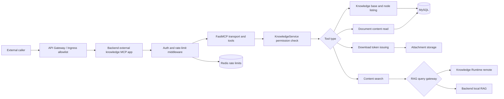
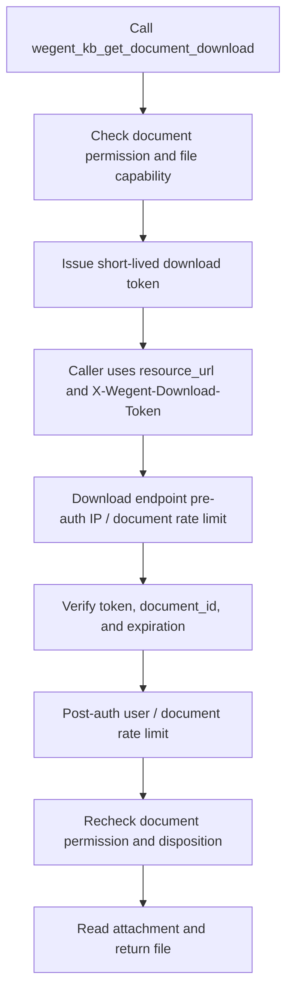
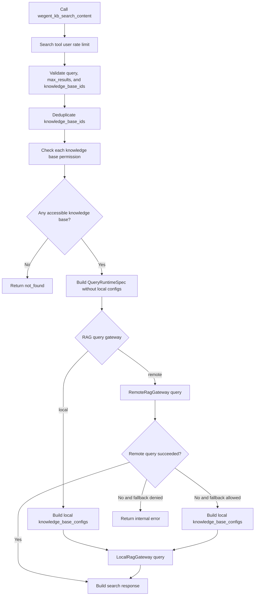

# External Knowledge MCP

English | [简体中文](../../zh/developer-guide/external-knowledge-mcp.md)

The external knowledge MCP exposes knowledge base listing, node listing, parsed document content reading, original file download credentials, and content search to trusted external integrations. It supports the business workflow where a caller first lists accessible knowledge bases, then browses nodes, reads document content, or searches selected knowledge bases.

## Endpoint

The external knowledge MCP is not exposed by default. Deployments must enable it explicitly:

```env
EXTERNAL_KNOWLEDGE_MCP_ENABLED=true
```

When enabled, it is mounted by Backend:

| Path | Purpose |
| --- | --- |
| `/mcp/knowledge-external` | Service metadata |
| `/mcp/knowledge-external/health` | Health check |
| `/mcp/knowledge-external/sse` | Streamable HTTP MCP transport |
| `/mcp/knowledge-external/documents/{document_id}/file` | Original document file download |

If `API_PREFIX=/api` is configured, Backend also registers `/api/mcp/knowledge-external`. The Backend application lifespan starts `external_knowledge_mcp_server.session_manager.run()` only when the external knowledge MCP is enabled. If the mounted app is created without entering the session manager, concurrent Streamable HTTP requests can fail because the task group is not initialized.

## Architecture Overview

The external knowledge MCP is an independently mounted Backend app. Its entrypoint, authentication, rate limiting, tool execution, and data access layers are organized as follows:



## Access Control and Rate Limiting

The external knowledge MCP is intended for trusted systems and must not be exposed directly to the public internet. Deployments should use an API Gateway, Nginx, or Ingress allowlist for `/mcp/knowledge-external` and `/api/mcp/knowledge-external`, for example allowing only internal network ranges or fixed caller egress IPs.

The code also provides Redis-backed rate limiting for the external MCP transport, using `REDIS_URL` as storage. This limiter is controlled by external MCP settings and is not affected by the global OpenAPI `RATE_LIMIT_ENABLED` switch:

| Config | Default | Description |
| --- | --- | --- |
| `EXTERNAL_KNOWLEDGE_MCP_RATE_LIMIT_ENABLED` | `true` | Enables external MCP transport rate limiting |
| `EXTERNAL_KNOWLEDGE_MCP_RATE_LIMIT_REQUESTS` | `120` | Requests allowed per window |
| `EXTERNAL_KNOWLEDGE_MCP_RATE_LIMIT_WINDOW_SECONDS` | `60` | Rate limit window in seconds |
| `EXTERNAL_KNOWLEDGE_MCP_SEARCH_RATE_LIMIT_ENABLED` | `true` | Enables search tool rate limiting |
| `EXTERNAL_KNOWLEDGE_MCP_SEARCH_RATE_LIMIT_REQUESTS` | `30` | Search requests allowed per window |
| `EXTERNAL_KNOWLEDGE_MCP_SEARCH_RATE_LIMIT_WINDOW_SECONDS` | `60` | Search rate limit window in seconds |
| `EXTERNAL_KNOWLEDGE_MCP_DOWNLOAD_RATE_LIMIT_ENABLED` | `true` | Enables document file download rate limiting |
| `EXTERNAL_KNOWLEDGE_MCP_DOWNLOAD_PREAUTH_IP_RATE_LIMIT_REQUESTS` | `300` | Download requests allowed per client IP hash window before token verification |
| `EXTERNAL_KNOWLEDGE_MCP_DOWNLOAD_PREAUTH_IP_RATE_LIMIT_WINDOW_SECONDS` | `60` | Client IP hash rate limit window before token verification, in seconds |
| `EXTERNAL_KNOWLEDGE_MCP_DOWNLOAD_PREAUTH_DOCUMENT_RATE_LIMIT_REQUESTS` | `60` | Download requests allowed per client IP hash and document ID window before token verification |
| `EXTERNAL_KNOWLEDGE_MCP_DOWNLOAD_PREAUTH_DOCUMENT_RATE_LIMIT_WINDOW_SECONDS` | `60` | Client IP hash and document ID rate limit window before token verification, in seconds |
| `EXTERNAL_KNOWLEDGE_MCP_DOWNLOAD_RATE_LIMIT_REQUESTS` | `20` | Download requests allowed per window after token verification |
| `EXTERNAL_KNOWLEDGE_MCP_DOWNLOAD_RATE_LIMIT_WINDOW_SECONDS` | `60` | Download rate limit window after token verification, in seconds |

The transport limiter checks both client IP and `Authorization` token hash dimensions. If either dimension exceeds the limit, the request returns `rate_limited`. The search tool also has a user-ID-based limit. The document file endpoint uses independent limits: before token verification, it first applies a global client IP hash limit, then a client IP hash plus document ID limit; after token verification, it limits by authenticated user ID and document ID. When rate limiting is enabled but Redis is unavailable, requests return `rate_limit_unavailable` and do not continue to expensive retrieval or file loading work. Raw tokens are never stored in Redis keys. Production deployments should still keep gateway allowlists and rate limits to stop abnormal traffic before it reaches the application.

## Authentication

All non-public MCP transport requests must resolve to an authenticated external knowledge user before they can reach the MCP server. The root metadata endpoint and health check are public. Document file downloads do not use Bearer authentication; they use a short-lived document download token returned by `wegent_kb_get_document_download`.

Default authentication accepts only user-generated API tokens:

```http
Authorization: Bearer <wg-...>
```

After authentication succeeds, the owner of the API token becomes the authenticated user. `X-User-Name` is not used by default authentication. It is kept only as an extension signal for deployments that replace the auth handler.

The default implementation does not accept `X-API-Key`. Supplying `X-API-Key` does not establish an external knowledge MCP user context.

Deployments can replace authentication with `set_external_knowledge_auth_handler()`. The replacement handler receives the optional Bearer token and the Starlette `Request`, then returns `ExternalKnowledgeUser` on success or `None` on failure. The handler may ignore the Bearer token and resolve the user from trusted gateway headers such as `X-User-Name`.

The document file endpoint requires the `X-Wegent-Download-Token` request header. The token is returned by `wegent_kb_get_document_download`, expires after 300 seconds by default, and is bound to the authenticated user, document ID, and `disposition`. After token verification, the file endpoint rechecks document permission and file availability.

```python
from app.mcp_server import ExternalKnowledgeUser, set_external_knowledge_auth_handler


def enterprise_auth_handler(token, request):
    employee_id = request.headers.get("X-User-Name")
    if not employee_id:
        return None
    user = resolve_user_from_employee_id(employee_id)
    if user is None:
        return None
    return ExternalKnowledgeUser(id=user.id, user_name=user.user_name)


set_external_knowledge_auth_handler(enterprise_auth_handler)
```

## Tools

### `wegent_kb_list_knowledge_bases`

Returns knowledge bases accessible to the authenticated user.

Parameters:

| Name | Type | Default | Description |
| --- | --- | --- | --- |
| `scope` | `string` | `all` | Visibility scope, matching the internal knowledge list, for example `all`, `personal`, or `group` |
| `group_name` | `string \| null` | `null` | Optional space or group name. Required when `scope=group`; an empty string is treated as missing |
| `query` | `string \| null` | `null` | Optional keyword filter. It matches knowledge base name and description case-insensitively |
| `limit` | `int` | `50` | Number of results to return, from `1` to `100` |
| `offset` | `int` | `0` | Offset, must be greater than or equal to `0` |

Behavior:

- Results are sorted by `created_at` descending, so callers do not need to sort again for display.
- `document_count` counts all documents in the knowledge base, including inactive documents, matching the internal knowledge list behavior.
- `document_count` is calculated only for the current page to avoid turning one request into many count queries.
- `total` is the total number of matching knowledge bases, `total_returned` is the number returned in the current page, and `has_more` indicates whether another page exists. Callers should page with `limit` and `offset`.

### `wegent_kb_list_nodes`

Returns folder and document nodes under a knowledge base.

Parameters:

| Name | Type | Default | Description |
| --- | --- | --- | --- |
| `knowledge_base_id` | `int` | required | Knowledge base ID |
| `folder_id` | `int` | `0` | Folder ID. `0` means root |
| `recursive` | `bool` | `false` | Whether to return the subtree recursively |
| `include_inactive` | `bool` | `true` | Whether to return inactive documents |
| `limit` | `int` | `100` | Non-recursive result limit, from `1` to `500` |
| `offset` | `int` | `0` | Non-recursive offset, must be greater than or equal to `0` |

Behavior:

- Within the same level, folders are returned before documents. Nodes of the same type are sorted by `created_at` descending.
- `recursive` and `include_inactive` must be strict booleans. The string `"false"` is rejected.
- `include_inactive` defaults to `true`, so inactive documents are shown to callers, matching the internal MCP behavior. Callers can use `index_status` to determine whether a document is searchable.
- Non-recursive listing returns `total_available` and `has_more`; callers should page with `limit` and `offset`.
- `total_returned` counts every node in the returned tree, including nested children.
- Root recursive listing pre-counts candidate folders and documents. If the result exceeds `MAX_RECURSIVE_NODES`, it returns `result_too_large` before loading the whole tree.
- Non-root recursive listing traverses only the target folder subtree and is not affected by unrelated root nodes in the same knowledge base.
- Root recursive listing handles orphan nodes and abnormal cyclic components, returning degradation details in `warnings`.

### `wegent_kb_get_document_content`

Reads parsed text content for an accessible document.

Parameters:

| Name | Type | Default | Description |
| --- | --- | --- | --- |
| `document_id` | `int` | required | Document ID |
| `offset` | `int` | `0` | Character offset, must be greater than or equal to `0` |
| `limit` | `int` | `MAX_DOCUMENT_READ_LIMIT` | Number of characters to return, from `1` to `MAX_DOCUMENT_READ_LIMIT` |

Behavior:

- The returned content comes from parsed attachment text, not the original binary file.
- `content_available` indicates whether the document has readable parsed text.
- `has_more` indicates whether more text is available; callers should page with `offset` and `limit`.
- The response includes `index_status` so callers can inspect the document indexing state.

### `wegent_kb_get_document_download`

Returns a short-lived original file download credential for an accessible document.

Parameters:

| Name | Type | Default | Description |
| --- | --- | --- | --- |
| `document_id` | `int` | required | Document ID |
| `disposition` | `string` | `inline` | File response disposition. Must be `inline` or `attachment` |

Behavior:

- The response returns `resource_url` and `headers`. Callers should request `resource_url` with the returned `X-Wegent-Download-Token` header.
- The token expires after 300 seconds by default and is bound to the authenticated user, document ID, and `disposition`.
- `inline` is allowed only for previewable MIME types; callers should use `attachment` for non-previewable files.
- The file endpoint rechecks permission; if access is revoked after token issuance, download returns `forbidden`.
- The file endpoint has independent rate limiting. It returns `rate_limited` when exceeded and `rate_limit_unavailable` when Redis is unavailable.

Downloads are split into credential issuing and file reading. The file endpoint applies rate limits before and after token verification, then rechecks permission before reading the file:



### `wegent_kb_search_content`

Searches content in selected knowledge bases.

Parameters:

| Name | Type | Default | Description |
| --- | --- | --- | --- |
| `query` | `string` | required | Search query, at most `2000` characters |
| `knowledge_base_ids` | `list[int]` | required | Target knowledge base IDs. At most `100` unique IDs, and must be non-empty |
| `max_results` | `int` | `10` | Number of results to return, from `1` to `50` |

Behavior:

- `knowledge_base_ids` must be provided explicitly and must not be empty. External callers should call `wegent_kb_list_knowledge_bases` first, then search selected knowledge bases.
- `knowledge_base_ids` are deduplicated before the count limit is enforced, so repeated IDs do not amplify permission checks.
- `max_results` must be a strict integer. The string `"10"` is rejected.
- Inaccessible `knowledge_base_ids` are ignored and returned in `ignored_knowledge_base_ids` with `warnings`. If no requested knowledge base is accessible, the tool returns `not_found`.
- Search results prefer top-level `document_id`; if absent, they also read `metadata.document_id`, top-level `doc_ref`, or `metadata.doc_ref`.

Search follows the configured RAG query gateway. A successful remote path sends only the basic runtime spec and does not build local `knowledge_base_configs`; local configs are built only for local mode or when a remote query falls back to local:



## Error Response

Tools return errors as JSON strings:

```json
{
  "error": "max_results must be between 1 and 50",
  "code": "bad_request"
}
```

Common `code` values:

| Code | Meaning |
| --- | --- |
| `bad_request` | Invalid parameters |
| `unauthorized` | No authenticated user context |
| `not_found` | Knowledge base not found or inaccessible |
| `forbidden` | No permission to access the target knowledge base or document |
| `file_unavailable` | Original document file is unavailable |
| `unsupported_media_type` | The file does not support inline preview |
| `rate_limited` | Transport, search, or file download request exceeds the rate limit |
| `rate_limit_unavailable` | Rate limit service is unavailable and the request is rejected |
| `result_too_large` | Recursive result exceeds the limit |
| `internal_error` | Internal exception |
