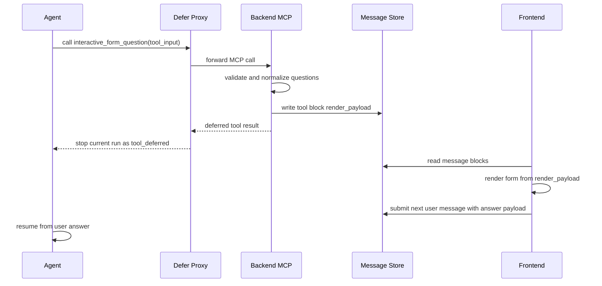

# Interactive Form Defer Flow

This document describes the standard render and resume flow for the `interactive_form_question` MCP tool. The flow lets an Agent show a structured form while running, then continue from a later user message after the user submits the form.

## Design Goals

Interactive forms must follow these constraints:

- MCP remains the only tool entry point. Argument validation, duplicate prevention, and form normalization happen in the MCP server.
- The frontend must not render forms from raw tool input. It can only render the `render_payload` written by the backend into the message block.
- After a form is displayed, the current Agent run must stop. Waiting for user input must not be represented as a fake user message.
- After the user submits the form, the task resumes through the next user message carrying an answer payload.
- A single subtask can successfully display at most one `interactive_form_question` form.

## Standard Flow



## MCP Output Contract

When `interactive_form_question` successfully displays a form, the MCP server must write `render_payload` to the tool block:

```json
{
  "type": "interactive_form_question",
  "ask_id": "ask_123",
  "task_id": 1,
  "subtask_id": 2,
  "questions": []
}
```

The tool result is only used to tell the runtime to stop the current run:

```json
{
  "__deferred_user_input__": true,
  "success": true,
  "status": "waiting_for_user_response",
  "ask_id": "ask_123"
}
```

The frontend may render only when all of these are true:

- The block is an `interactive_form_question` tool block.
- The block has a valid `render_payload`.
- `render_payload.type` is `interactive_form_question`.
- `render_payload.questions` is a non-empty array.

The frontend must not read raw tool input to render a form. Raw input can contain invalid fields produced by the model; only the MCP-normalized payload is a trusted UI schema.

## Chat Shell Behavior

After Chat Shell calls the tool, if the tool result satisfies the defer contract:

- Emit the tool done event so the message block is complete.
- Raise an internal deferred exit to stop the current ReAct run.
- Wait for the user's next message.

Do not write the deferred result as user content, and do not inject “pending user input” into the model context.

## Claude Code Behavior

Claude Code uses `deferred_mcp_proxy` only for MCP tools whose name contains `interactive_form_question`. All other MCP tools continue to use the Claude Code SDK's native path.

The proxy flow is:

1. The SDK hook catches the `interactive_form_question` tool call.
2. The proxy forwards the original arguments to Backend MCP.
3. Backend MCP validates the payload, writes `render_payload`, and returns a deferred result.
4. The response processor emits tool done and ends the turn with `stop_reason=tool_deferred`.

## User Answer Validation

Before accepting a later user message, Backend checks whether the current task has a pending interactive form:

- If no form is pending, form answers are rejected.
- If a form is pending, ordinary text messages are rejected until the user submits or cancels the form.
- The answer payload must include `type=interactive_form_question` and the matching `tool_use_id`.

This prevents ordinary chat messages from being treated as form results and keeps invalid form answers out of model context.

## Skill Publishing Authentication

Skill creation scripts use `WEGENT_SKILL_IDENTITY_TOKEN` to publish generated Skills at task runtime. This token is a Skill runtime identity, not a general login token.

Skill publishing APIs must support this token:

- `GET /api/v1/kinds/skills`: used by publish scripts to check for an existing Skill, especially with `exact_match=true`.
- `POST /api/v1/kinds/skills/upload`: create a Skill.
- `PUT /api/v1/kinds/skills/{skill_id}`: overwrite an existing Skill.

General business APIs should not accept `WEGENT_SKILL_IDENTITY_TOKEN` by default, otherwise the Skill runtime identity would become a general user credential.

## Skill Publishing Object Storage Grants

When Skill publishing scripts need to upload or read generated artifacts, they should ask Backend internal object-storage grant APIs for presigned URLs scoped to one Task and one file name. Backend builds the object key as `publish/{user_name}/{task_id}/{object_name}` from the current user, `task_id`, and a safe file name, then verifies that `WEGENT_SKILL_IDENTITY_TOKEN` matches the current user.

Presigned URL expiration is configured separately:

| Setting | Default | Purpose |
| --- | --- | --- |
| `PUBLISH_PRESIGNED_UPLOAD_EXPIRE_SECONDS` | `3600` | Upload URL lifetime |
| `PUBLISH_PRESIGNED_DOWNLOAD_EXPIRE_SECONDS` | `3122064000` | Download URL lifetime, 99 years by default |

Upload URLs should stay short-lived to limit risk if an unused grant leaks. Download URLs need to cover the time window in which later publishing steps read generated artifacts, so they use an independent setting. When the download lifetime exceeds the MinIO client default presign limit, Backend generates the URL through the long-lived signing path.
