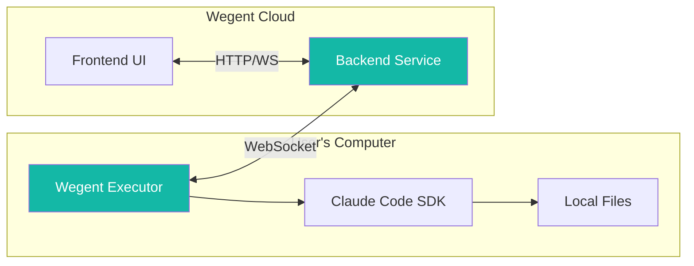
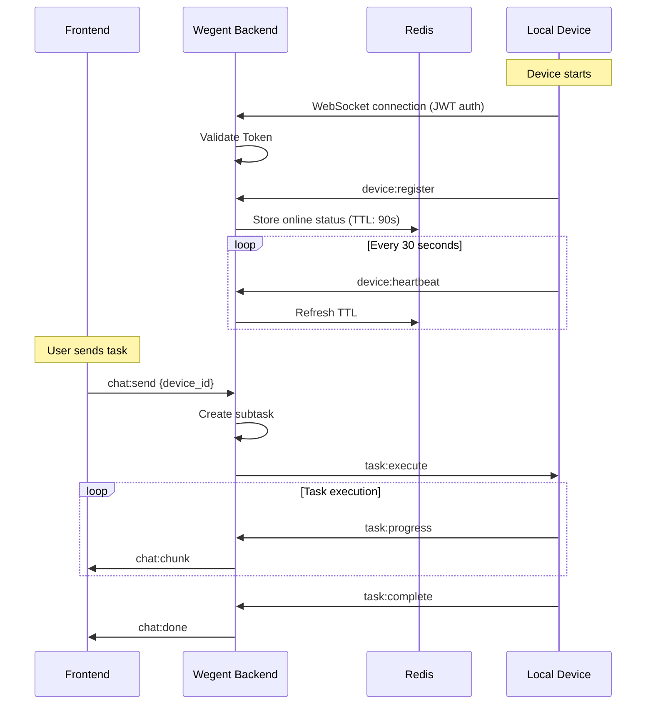
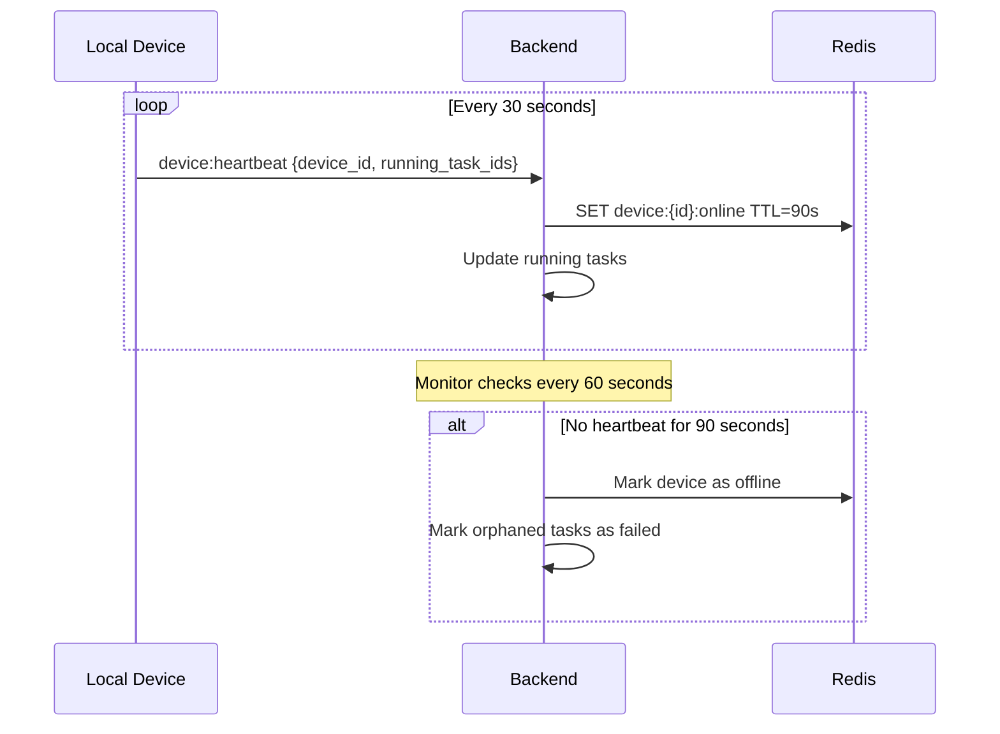
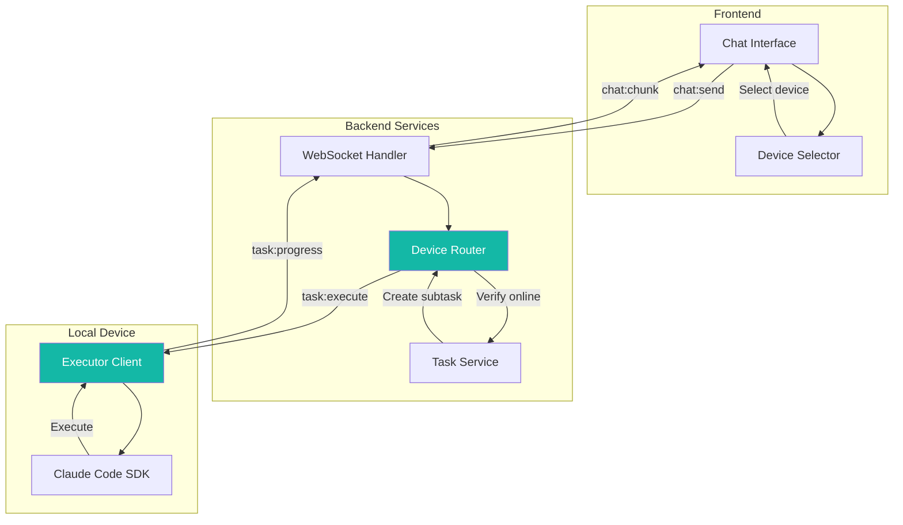
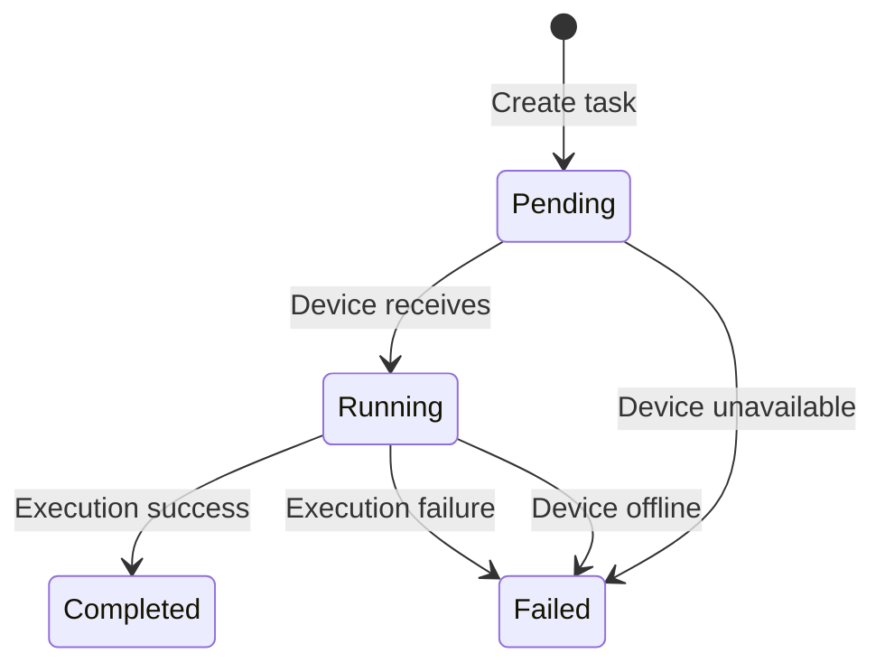
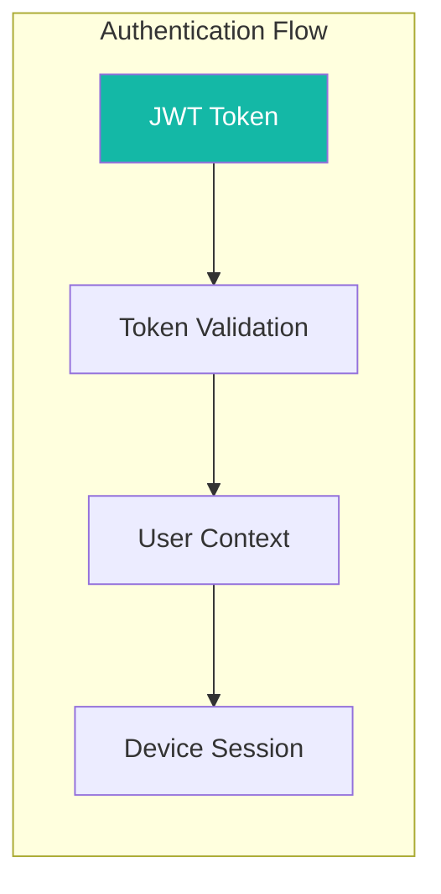
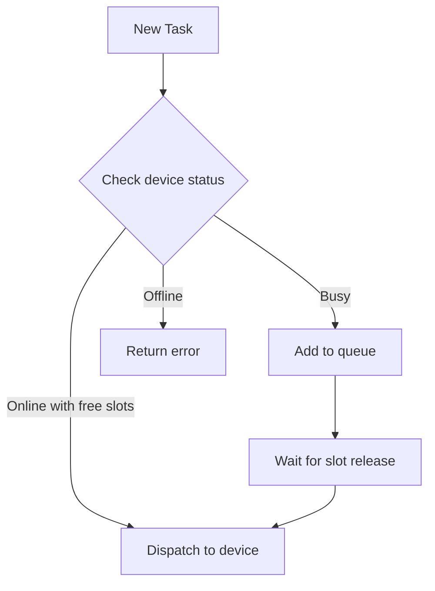

# Local Device Architecture

This document describes the technical architecture of local device support, including communication protocols, heartbeat mechanisms, and security design.

---

## 🏗 Architecture Overview

### System Components



### Communication Architecture

The following diagram shows how local devices communicate with the Wegent system:



---

## 📡 WebSocket Protocol

### Event Types

| Event | Direction | Description |
|-------|-----------|-------------|
| `device:register` | Device → Backend | Device registration |
| `device:heartbeat` | Device → Backend | Heartbeat keepalive |
| `task:execute` | Backend → Device | Task dispatch |
| `task:progress` | Device → Backend | Task progress |
| `task:complete` | Device → Backend | Task completion |

### Message Format

```json
// device:register
{
  "event": "device:register",
  "data": {
    "device_id": "uuid-xxx",
    "name": "Darwin - MacBook-Pro.local",
    "max_slots": 5
  }
}

// device:heartbeat
{
  "event": "device:heartbeat",
  "data": {
    "device_id": "uuid-xxx",
    "running_task_ids": ["task-1", "task-2"]
  }
}

// task:execute
{
  "event": "task:execute",
  "data": {
    "subtask_id": "subtask-xxx",
    "prompt": "User message",
    "context": {}
  }
}
```

---

## 💓 Heartbeat Mechanism

### Sequence Diagram



### Timing Parameters

| Parameter | Value | Description |
|-----------|-------|-------------|
| **Heartbeat Interval** | 30 seconds | Device sends heartbeat |
| **Online TTL** | 90 seconds | Redis key expiration |
| **Monitor Interval** | 60 seconds | Backend checks expired devices |
| **Offline Threshold** | 3 missed heartbeats | Device marked as offline |

### Running Task Tracking

Each heartbeat contains currently running task IDs, used for:

- Real-time slot usage tracking
- Orphaned task detection
- Automatic cleanup on disconnection

---

## 🔄 Task Execution Flow



### Task State Transitions



---

## 🔐 Security Mechanisms

### Authentication Flow



### Security Features

| Feature | Description |
|---------|-------------|
| **JWT Authentication** | WebSocket connections require valid token |
| **Token Expiration** | 7-day expiry, requires periodic refresh |
| **User Isolation** | Devices can only execute tasks from their owner |
| **Hardware Binding** | Device ID generated from hardware identifiers |

### User Isolation

Each device session is bound to a user:

- Devices can only receive tasks from their registered owner
- Prevents cross-user task execution
- Subtasks validated against user namespace

### Data Privacy

When using local devices:

- **Code stays local**: Source code is never uploaded to cloud
- **Local execution**: All processing happens on user's machine
- **Result streaming**: Only output text is transmitted
- **No persistent storage**: Cloud doesn't store local files

---

## 🔧 Device ID Generation

The Executor automatically generates a stable device ID based on the following priority:

1. **Cached ID**: Stored in `~/.wegent-executor/device_id` (if exists)
2. **Hardware UUID**:
   - macOS: System hardware UUID
   - Linux: `/etc/machine-id`
   - Windows: `MachineGuid` from registry
3. **Fallback**: MAC address or random UUID

This ensures devices maintain consistent identity across restarts.

---

## 📊 Concurrency Control

### Slot Management

Each device supports up to **5 concurrent tasks**:

- Slot usage tracked in real-time via heartbeats
- Device shows "busy" when all slots are occupied
- Tasks queue if busy device is selected

### Load Balancing



---

## 🔗 Related Documentation

- [Local Device User Guide](../user-guide/ai-devices/local-device-support.md) - User operation guide
- [System Architecture](./architecture.md) - Overall architecture design
- [WebSocket API](../reference/websocket-api.md) - API reference

---

## 💬 Get Help

Need help?

- 📖 Check the [FAQ](../faq.md)
- 🐛 Submit a [GitHub Issue](https://github.com/wecode-ai/wegent/issues)
- 💬 Join community discussions
