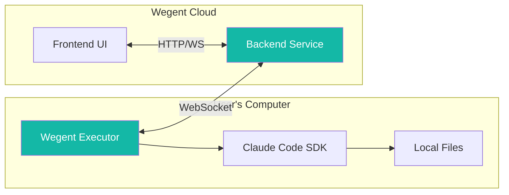
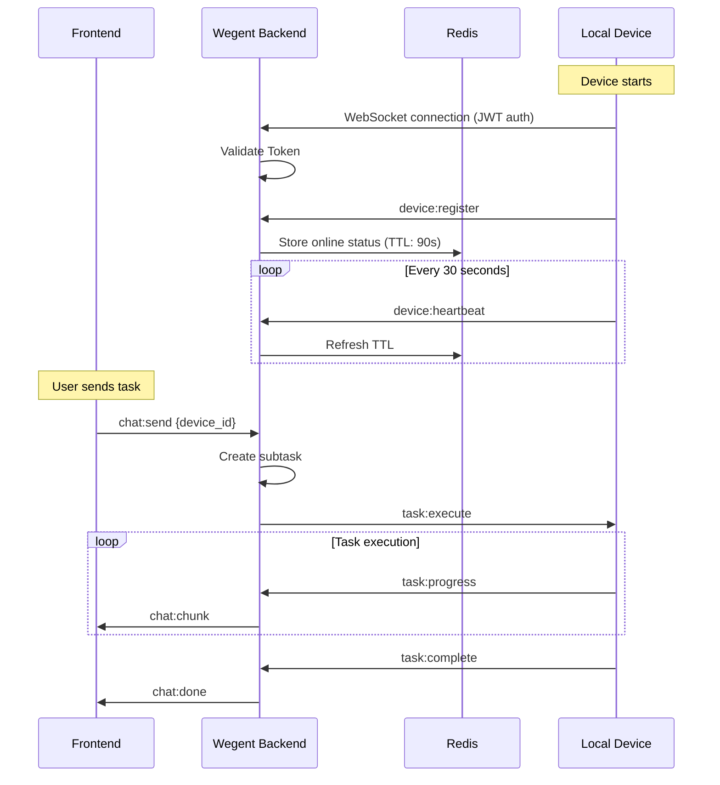
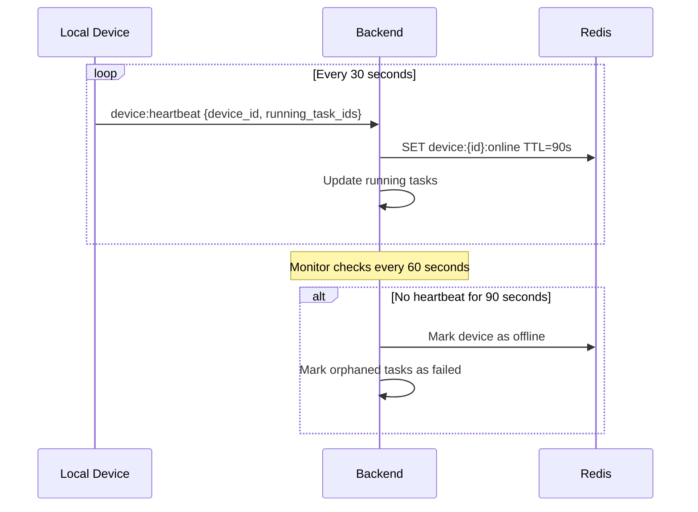
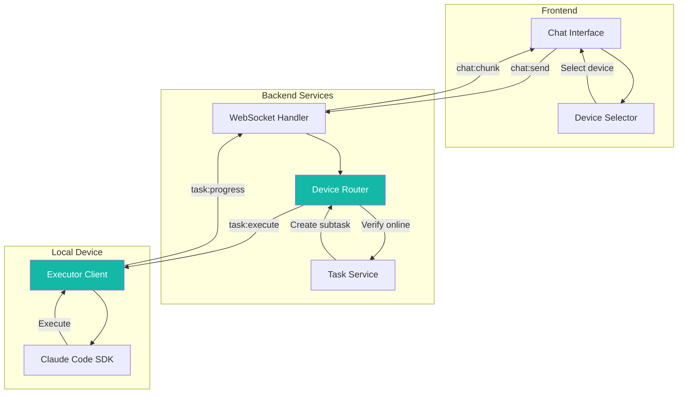
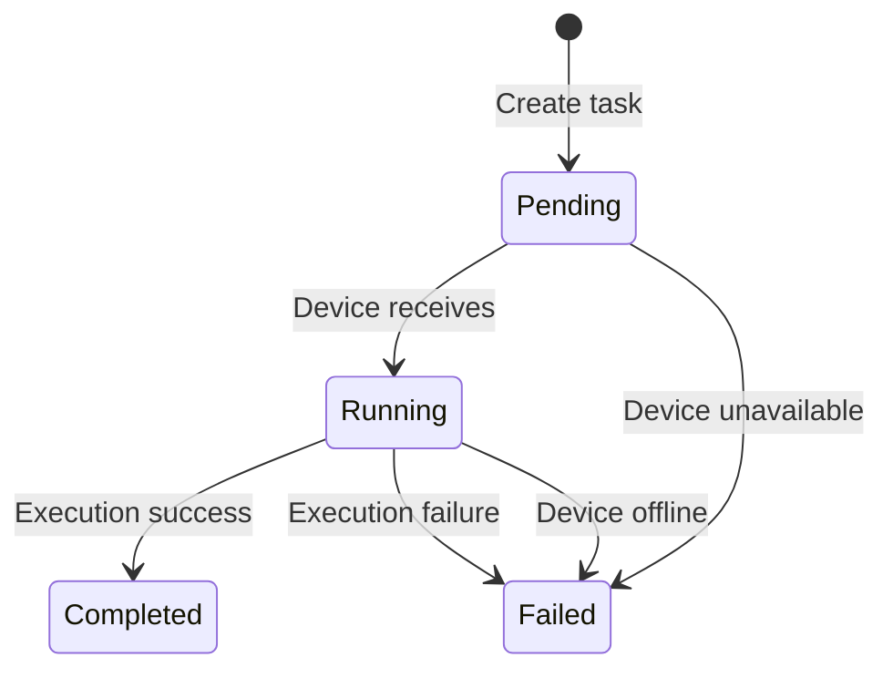
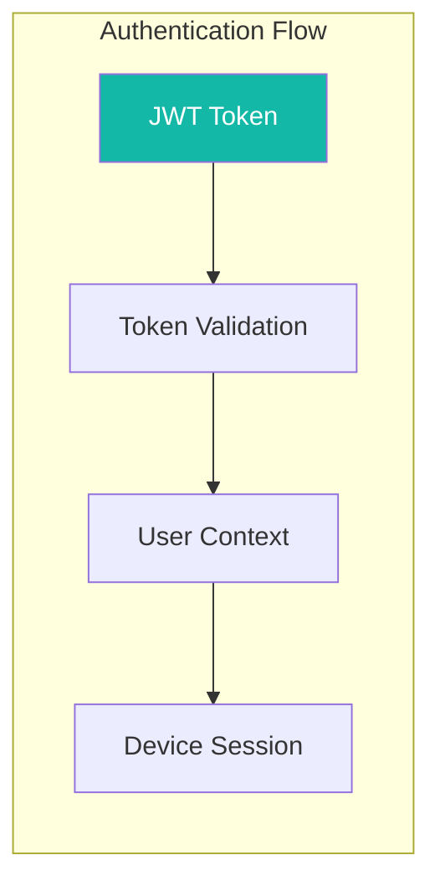
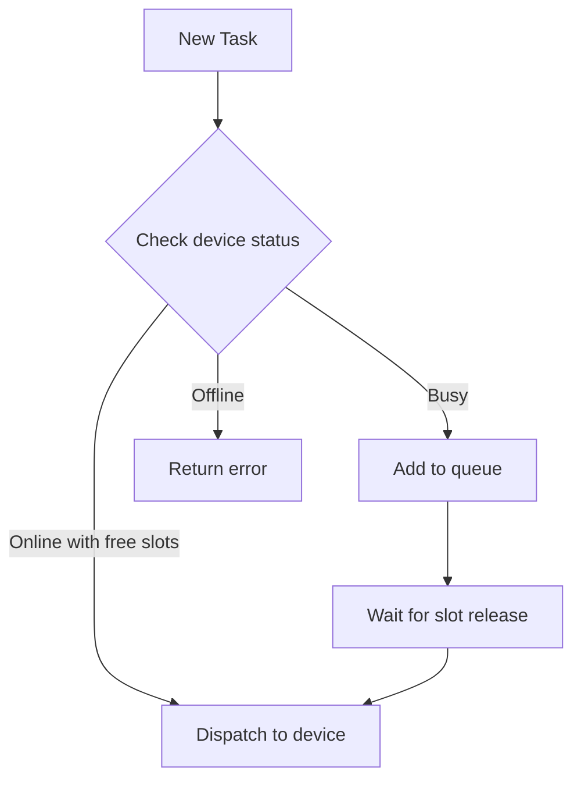

# Local Device Architecture

This document describes the technical architecture of local device support, including communication protocols, heartbeat mechanisms, and security design.

---

## 🏗 Architecture Overview

### System Components


```mermaid
flowchart LR
    subgraph "User's Computer"
        EX[Wegent Executor]
        CC[Claude Code SDK]
        FS[Local Files]
    end

    subgraph "Wegent Cloud"
        BE[Backend Service]
        FE[Frontend UI]
    end

    EX <-->|WebSocket| BE
    FE <-->|HTTP/WS| BE
    EX --> CC
    CC --> FS

    style EX fill:#14B8A6,color:#fff
    style BE fill:#14B8A6,color:#fff
```

### Communication Architecture

The following diagram shows how local devices communicate with the Wegent system:


```mermaid
sequenceDiagram
    participant FE as Frontend
    participant BE as Wegent Backend
    participant RD as Redis
    participant EX as Local Device

    Note over EX: Device starts
    EX->>BE: WebSocket connection (JWT auth)
    BE->>BE: Validate Token
    EX->>BE: device:register
    BE->>RD: Store online status (TTL: 90s)

    loop Every 30 seconds
        EX->>BE: device:heartbeat
        BE->>RD: Refresh TTL
    end

    Note over FE: User sends task
    FE->>BE: chat:send {device_id}
    BE->>BE: Create subtask
    BE->>EX: task:execute

    loop Task execution
        EX->>BE: task:progress
        BE->>FE: chat:chunk
    end

    EX->>BE: task:complete
    BE->>FE: chat:done
```

---

## 📡 WebSocket Protocol

### Event Types

| Event | Direction | Description |
|-------|-----------|-------------|
| `device:register` | Device → Backend | Device registration |
| `device:heartbeat` | Device → Backend | Heartbeat keepalive |
| `task:execute` | Backend → Device | Task dispatch |
| `task:progress` | Device → Backend | Task progress |
| `task:complete` | Device → Backend | Task completion |

### Message Format

```json
// device:register
{
  "event": "device:register",
  "data": {
    "device_id": "uuid-xxx",
    "name": "Darwin - MacBook-Pro.local",
    "max_slots": 5
  }
}

// device:heartbeat
{
  "event": "device:heartbeat",
  "data": {
    "device_id": "uuid-xxx",
    "running_task_ids": ["task-1", "task-2"]
  }
}

// task:execute
{
  "event": "task:execute",
  "data": {
    "subtask_id": "subtask-xxx",
    "prompt": "User message",
    "context": {}
  }
}
```

---

## 💓 Heartbeat Mechanism

### Sequence Diagram


```mermaid
sequenceDiagram
    participant EX as Local Device
    participant BE as Backend
    participant RD as Redis

    loop Every 30 seconds
        EX->>BE: device:heartbeat {device_id, running_task_ids}
        BE->>RD: SET device:{id}:online TTL=90s
        BE->>BE: Update running tasks
    end

    Note over BE: Monitor checks every 60 seconds
    alt No heartbeat for 90 seconds
        BE->>RD: Mark device as offline
        BE->>BE: Mark orphaned tasks as failed
    end
```

### Timing Parameters

| Parameter | Value | Description |
|-----------|-------|-------------|
| **Heartbeat Interval** | 30 seconds | Device sends heartbeat |
| **Online TTL** | 90 seconds | Redis key expiration |
| **Monitor Interval** | 60 seconds | Backend checks expired devices |
| **Offline Threshold** | 3 missed heartbeats | Device marked as offline |

### Running Task Tracking

Each heartbeat contains currently running task IDs, used for:

- Real-time slot usage tracking
- Orphaned task detection
- Automatic cleanup on disconnection

### Global Capability Reporting

Local devices also report Claude Code global capability state through heartbeats. A full report includes:

- `capabilities.revision`: local Wegent-managed manifest revision
- `capabilities.digest`: content digest for `skills`, `plugins`, and `mcps`
- `capabilities.skills`: Skills available under `~/.claude/skills`
- `capabilities.plugins`: Plugins installed in `~/.claude/plugins/installed_plugins.json`
- `capabilities.mcps`: Wegent-managed global MCP configuration

Plugin reports must include the Skills contained inside each plugin. The executor scans `SKILL.md` files under each plugin install directory and returns them in `plugins[].skills[]`:

```json
{
  "name": "context7",
  "marketplace": "claude-plugins-official",
  "version": "1057d02c5307",
  "source": "wegent",
  "installed_plugin_id": 301,
  "skills": [
    {
      "name": "context7",
      "description": "Look up version-specific documentation.",
      "path": "skills/context7"
    }
  ]
}
```

Backend persists the complete capability state only when `capabilities.full = true`. Later heartbeats with the same `digest` refresh device liveness without rewriting the full capability lists.

### Global Capability Sync

Backend can send desired global capability state to an online local device through `device:sync_capabilities`. The sync payload currently includes:

- `skills`: backend-resolved `InstalledSkill` / `Skill` entries, downloaded by the executor into `~/.claude/skills`
- `plugins`: backend-resolved `InstalledPlugin` entries, written by the executor into `~/.claude/plugins/installed_plugins.json`
- `mcps`: backend-resolved `InstalledMCP` entries, written into the Wegent-managed manifest

In `replace` mode, the executor only removes capabilities marked as `managed` in the Wegent manifest and missing from the desired state. Plugins installed directly by the user on the local machine are not removed by a Wegent sync.

When a project task runs through the local executor, its task-level `CLAUDE_CONFIG_DIR` exposes both global `skills` and `plugins` directories and inherits non-sensitive plugin settings such as `enabledPlugins` and `extraKnownMarketplaces` from the local `~/.claude/settings.json`. This lets Claude Code load global Skills and Skills provided by Plugins. Sensitive model and token configuration is still injected through runtime environment variables and is not copied from global settings into the task directory.

### Claude Custom Request Headers

When the local executor calls Claude Code, it merges `agent_config.env.ANTHROPIC_CUSTOM_HEADERS` from the Model/Bot configuration with `ANTHROPIC_CUSTOM_HEADERS` from the local executor process environment before passing the result to the Claude Code SDK. The header format is one `name: value` entry per line. If the same header appears more than once, the later value wins, so the local executor process configuration takes precedence over Model/Bot configuration.

Local mode also appends these Wegent headers to identify Claude model request provenance:

| Header | Value |
|--------|-------|
| `wecode-action` | `wegent` |
| `wecode-executor` | `claudecode` |
| `wecode-source` | `wegent-local` |

The executor also appends `wecode-user: <user_name>` from the current task identity. If earlier configuration already contains these Wegent headers, the local-mode standard values replace them so Claude model requests carry the current Wegent user identity and local execution source.

---

## 🔄 Task Execution Flow


```mermaid
flowchart TB
    subgraph "Frontend"
        UI[Chat Interface]
        DS[Device Selector]
    end

    subgraph "Backend Services"
        DR[Device Router]
        TS[Task Service]
        WS[WebSocket Handler]
    end

    subgraph "Local Device"
        EX[Executor Client]
        SDK[Claude Code SDK]
    end

    UI --> DS
    DS -->|Select device| UI
    UI -->|chat:send| WS
    WS --> DR
    DR -->|Verify online| TS
    TS -->|Create subtask| DR
    DR -->|task:execute| EX
    EX --> SDK
    SDK -->|Execute| EX
    EX -->|task:progress| WS
    WS -->|chat:chunk| UI

    style DR fill:#14B8A6,color:#fff
    style EX fill:#14B8A6,color:#fff
```

### Task State Transitions


```mermaid
stateDiagram-v2
    [*] --> Pending: Create task
    Pending --> Running: Device receives
    Running --> Completed: Execution success
    Running --> Failed: Execution failure
    Running --> Failed: Device offline
    Pending --> Failed: Device unavailable
```

---

## 🔐 Security Mechanisms

### Authentication Flow


```mermaid
flowchart LR
    subgraph "Authentication Flow"
        T[JWT Token] --> V[Token Validation]
        V --> U[User Context]
        U --> D[Device Session]
    end

    style T fill:#14B8A6,color:#fff
```

### Security Features

| Feature | Description |
|---------|-------------|
| **JWT Authentication** | WebSocket connections require valid token |
| **Token Expiration** | 7-day expiry, requires periodic refresh |
| **User Isolation** | Devices can only execute tasks from their owner |
| **Hardware Binding** | Device ID generated from hardware identifiers |

### User Isolation

Each device session is bound to a user:

- Devices can only receive tasks from their registered owner
- Prevents cross-user task execution
- Subtasks validated against user namespace

### Data Privacy

When using local devices:

- **Code stays local**: Source code is never uploaded to cloud
- **Local execution**: All processing happens on user's machine
- **Result streaming**: Only output text is transmitted
- **No persistent storage**: Cloud doesn't store local files

---

## 🔧 Device ID Generation

The Executor automatically generates a stable device ID based on the following priority:

1. **Cached ID**: Stored in `~/.wegent-executor/device_id` (if exists)
2. **Hardware UUID**:
   - macOS: System hardware UUID
   - Linux: `/etc/machine-id`
   - Windows: `MachineGuid` from registry
3. **Fallback**: MAC address or random UUID

This ensures devices maintain consistent identity across restarts.

---

## 📊 Concurrency Control

### Slot Management

Each device supports up to **5 concurrent tasks**:

- Slot usage tracked in real-time via heartbeats
- Device shows "busy" when all slots are occupied
- Tasks queue if busy device is selected

### Load Balancing


```mermaid
flowchart TB
    T[New Task] --> C{Check device status}
    C -->|Online with free slots| D[Dispatch to device]
    C -->|Busy| Q[Add to queue]
    C -->|Offline| F[Return error]
    Q --> W[Wait for slot release]
    W --> D
```

---

## 🔗 Related Documentation

- [Local Device User Guide](../user-guide/ai-devices/local-device-support.md) - User operation guide
- [System Architecture](./architecture.md) - Overall architecture design
- [OpenAPI Responses API](../reference/openapi-responses-api.md) - API reference

---

## 💬 Get Help

Need help?

- 📖 Check the [FAQ](../faq.md)
- 🐛 Submit a [GitHub Issue](https://github.com/wecode-ai/wegent/issues)
- 💬 Join community discussions
