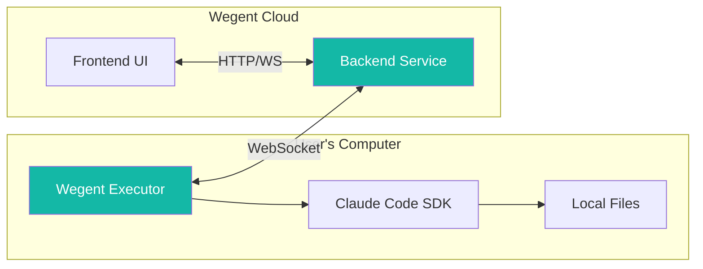
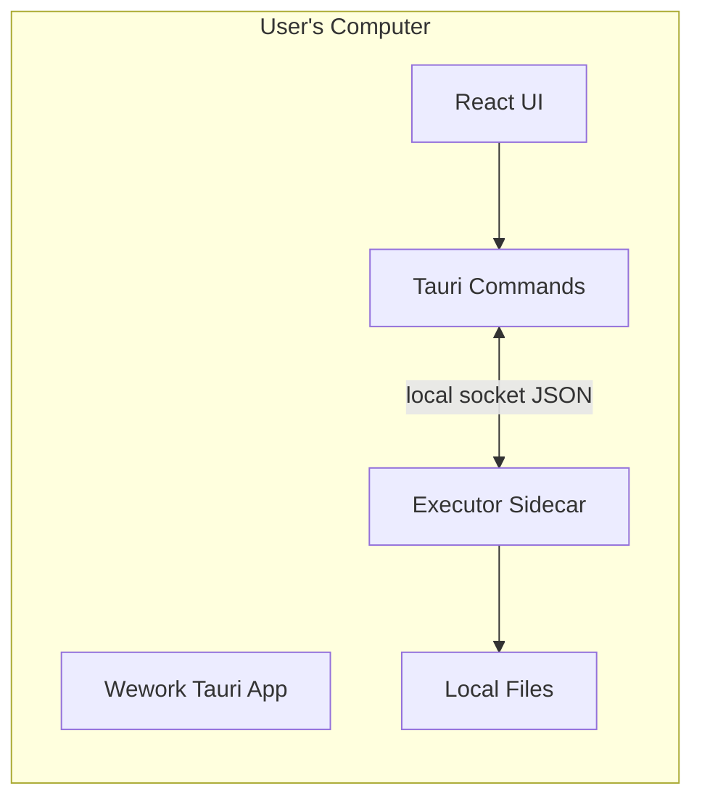
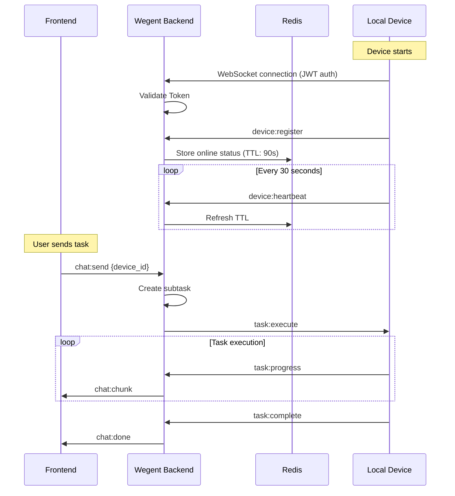
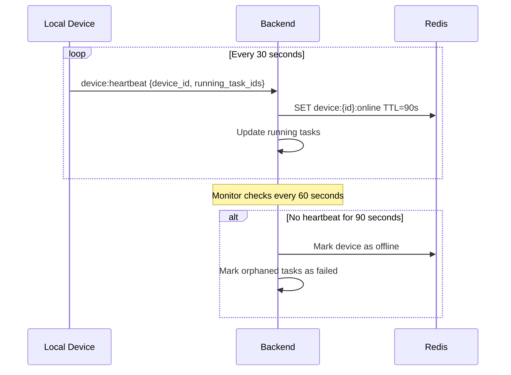
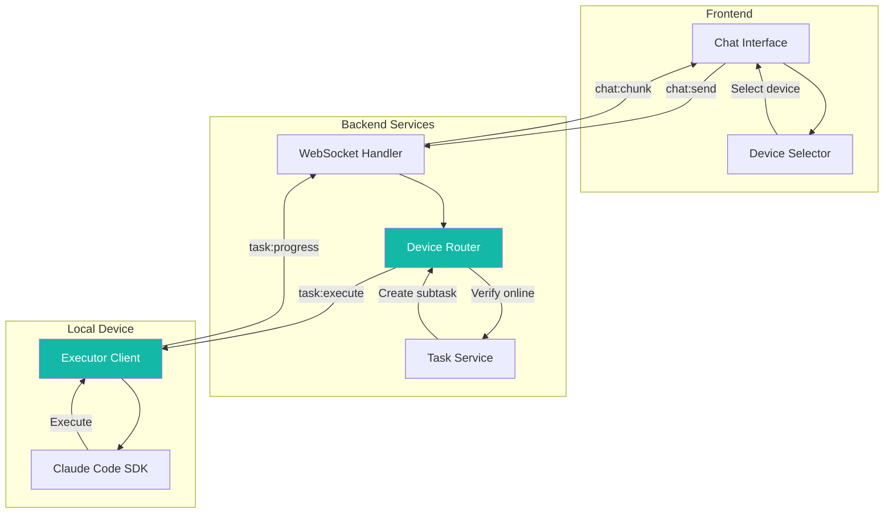
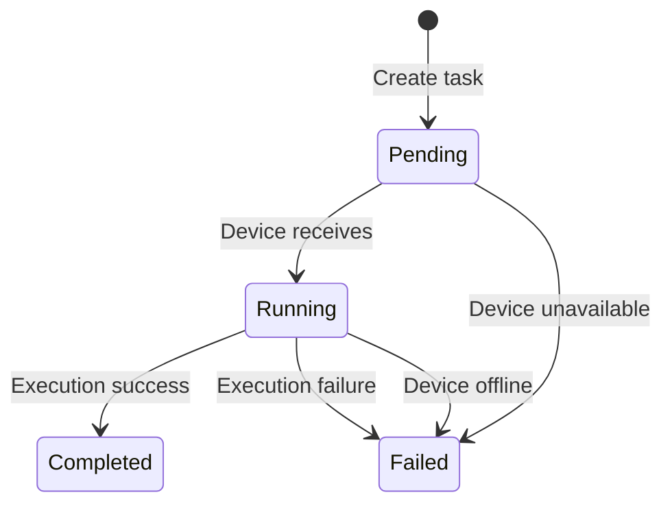
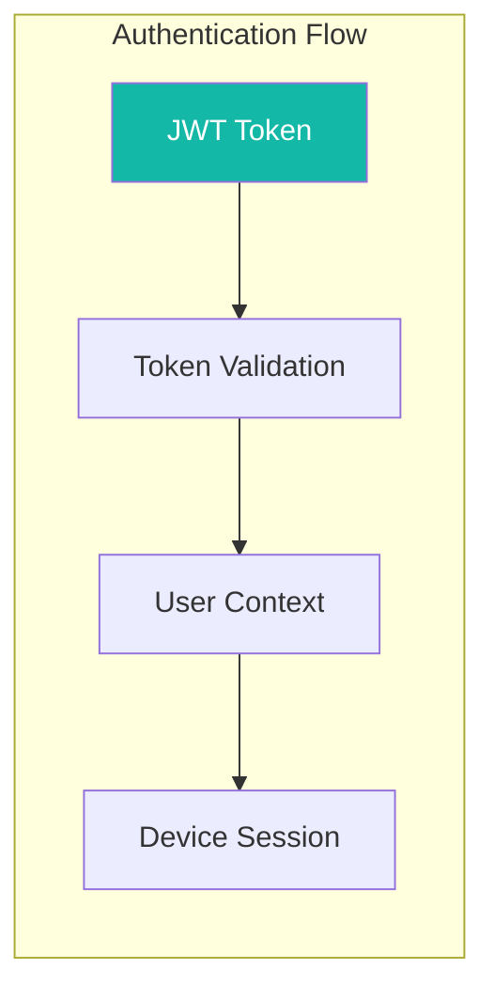
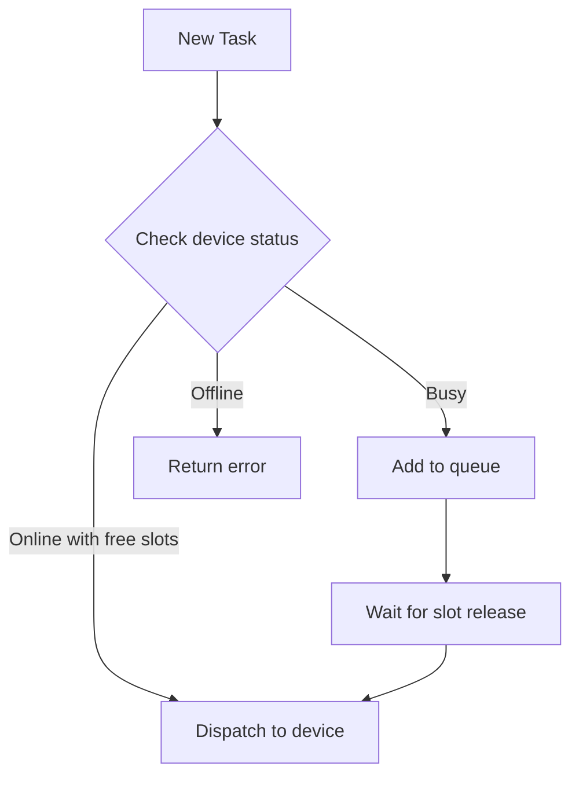

# Local Device Architecture

This document describes the technical architecture of local device support, including communication protocols, heartbeat mechanisms, and security design.

---

## 🏗 Architecture Overview

### System Components


```mermaid
flowchart LR
    subgraph "User's Computer"
        EX[Wegent Executor]
        CC[Claude Code SDK]
        FS[Local Files]
    end

    subgraph "Wegent Cloud"
        BE[Backend Service]
        FE[Frontend UI]
    end

    EX <-->|WebSocket| BE
    FE <-->|HTTP/WS| BE
    EX --> CC
    CC --> FS

    style EX fill:#14B8A6,color:#fff
    style BE fill:#14B8A6,color:#fff
```

### Wework Packaged App Local-First Channel

The packaged Wework Tauri App defaults to local-first mode. This mode does not start the frontend Node dev server and does not start an extra local HTTP Backend service. The React UI runs inside the Tauri WebView, while the Tauri Rust side is only the app's internal command layer.

Local-first mode needs only two local processes:


```mermaid
flowchart LR
    subgraph "User's Computer"
        APP["Wework Tauri App"]
        UI["React UI"]
        TAURI["Tauri Commands"]
        EX["Executor Sidecar"]
        FS["Local Files"]
    end

    UI --> TAURI
    TAURI <-->|"local socket JSON"| EX
    EX --> FS
```

Tauri first connects to `~/.wegent-executor/app-ipc.sock`. If the local executor sidecar is not running yet, the App starts the executor with no arguments and retries the socket connection. Sidecars started by the App are owned by the Tauri process: on macOS/Linux they run in an isolated process group, and App close or restart sends `SIGTERM` before using `SIGKILL` for remaining child processes. The dev-mode reload supervisor and the executor it launches are included in that cleanup scope. When no remote Backend address is configured, the executor only starts the local socket and does not connect to Backend. The App and executor only use newline-delimited JSON over the local socket. Executor logs are written to `~/.wegent-executor/logs/executor.log`, not to the protocol channel. The Wework renderer sends `runtime.*` and `device.execute_command` requests through Tauri commands and subscribes to Responses stream events emitted by the sidecar.

Backend connectivity is optional, not a required dependency for the local app. When login, model/capability sync, cloud projects, or web control of the local computer are needed, the executor can register as a local device over the Backend WebSocket channel. The same executor sidecar reuses one command handler and one runtime work handler while serving Wework App over the local socket and Backend over WebSocket. This design does not introduce a local HTTP gateway and does not require Wework App to start Backend itself.

### Communication Architecture

The following diagram shows how local devices communicate with the Wegent system:


```mermaid
sequenceDiagram
    participant FE as Frontend
    participant BE as Wegent Backend
    participant RD as Redis
    participant EX as Local Device

    Note over EX: Device starts
    EX->>BE: WebSocket connection (JWT auth)
    BE->>BE: Validate Token
    EX->>BE: device:register
    BE->>RD: Store online status (TTL: 90s)

    loop Every 30 seconds
        EX->>BE: device:heartbeat
        BE->>RD: Refresh TTL
    end

    Note over FE: User sends task
    FE->>BE: chat:send {device_id}
    BE->>BE: Create subtask
    BE->>EX: task:execute

    loop Task execution
        EX->>BE: task:progress
        BE->>FE: chat:chunk
    end

    EX->>BE: task:complete
    BE->>FE: chat:done
```

### Device Types

Device CRDs use `spec.deviceType` to separate lifecycle ownership and frontend capabilities:

| Type     | Lifecycle owner                              | Connection | Typical entrypoint                                              |
| -------- | -------------------------------------------- | ---------- | --------------------------------------------------------------- |
| `local`  | User's local executor                        | WebSocket  | Local installer or manually started executor                    |
| `cloud`  | Wegent cloud device service                  | WebSocket  | Cloud device create, restart, and release flows                 |
| `remote` | User-managed Docker container or remote host | WebSocket  | Remote Docker command generated from Wework connection settings |

`remote` devices reuse the local executor WebSocket registration, heartbeat, task execution, and command RPC channels, but `RemoteDeviceProvider` lists them separately and returns `remoteConfig`. Backend does not persist the `WEGENT_AUTH_TOKEN` contained in the generated command; the Device CRD stores only non-sensitive metadata such as provider, image, deviceId, deviceName, backendUrl, publicBaseUrl, and createdAt.

After a remote Docker device starts, it sends `device:register` with `device_type=remote`, which updates the matching Device CRD. Online state still uses the Redis device-online key, so task routing, slot accounting, and terminal/code-server session RPC use the same protocol as local devices. The frontend does not expose cloud lifecycle actions for `remote` devices; users stop, restart, or remove the container on the Docker host.

---

## 📡 WebSocket Protocol

### Event Types

| Event              | Direction        | Description         |
| ------------------ | ---------------- | ------------------- |
| `device:register`  | Device → Backend | Device registration |
| `device:heartbeat` | Device → Backend | Heartbeat keepalive |
| `task:execute`     | Backend → Device | Task dispatch       |
| `task:progress`    | Device → Backend | Task progress       |
| `task:complete`    | Device → Backend | Task completion     |

### Rust Executor Local Event Coverage

The Rust executor Backend channel must remain event-compatible with the legacy
Python local device runner. In addition to task execution and heartbeat events,
the local device currently registers and handles:

- `task:cancel`, `task:close-session`
- `chat:message`
- `device:execute_command`
- `device:sync_capabilities`
- `device:start_terminal_session`, `device:start_code_server_session`
- `terminal:input`, `terminal:resize`, `terminal:close`
- `runtime:rpc`
- `device:upgrade`
- `device:run_extension`

The migration coverage matrix is tracked in
`executor/docs/LOCAL_DEVICE_PYTHON_MIGRATION_TESTS.md`. When adding a local
device event, add coverage to
`executor/tests/local_backend_device_migration_contract.rs` first, then update
that migration matrix.

### Message Format

```json
// device:register
{
  "event": "device:register",
  "data": {
    "device_id": "uuid-xxx",
    "name": "Darwin - MacBook-Pro.local",
    "max_slots": 5
  }
}

// device:heartbeat
{
  "event": "device:heartbeat",
  "data": {
    "device_id": "uuid-xxx",
    "running_task_ids": ["task-1", "task-2"]
  }
}

// task:execute
{
  "event": "task:execute",
  "data": {
    "subtask_id": "subtask-xxx",
    "prompt": "User message",
    "context": {}
  }
}
```

---

## 💓 Heartbeat Mechanism

### Sequence Diagram


```mermaid
sequenceDiagram
    participant EX as Local Device
    participant BE as Backend
    participant RD as Redis

    loop Every 30 seconds
        EX->>BE: device:heartbeat {device_id, running_task_ids}
        BE->>RD: SET device:{id}:online TTL=90s
        BE->>BE: Update running tasks
    end

    Note over BE: Monitor checks every 60 seconds
    alt No heartbeat for 90 seconds
        BE->>RD: Mark device as offline
        BE->>BE: Mark orphaned tasks as failed
    end
```

### Timing Parameters

| Parameter              | Value               | Description                    |
| ---------------------- | ------------------- | ------------------------------ |
| **Heartbeat Interval** | 30 seconds          | Device sends heartbeat         |
| **Online TTL**         | 90 seconds          | Redis key expiration           |
| **Monitor Interval**   | 60 seconds          | Backend checks expired devices |
| **Offline Threshold**  | 3 missed heartbeats | Device marked as offline       |

### Running Task Tracking

Each heartbeat contains currently running task IDs, used for:

- Real-time slot usage tracking
- Orphaned task detection
- Automatic cleanup on disconnection

### Global Capability Reporting

Local devices also report Claude Code global capability state through heartbeats. A full report includes:

- `capabilities.revision`: local Wegent-managed manifest revision
- `capabilities.digest`: content digest for `skills`, `plugins`, and `mcps`
- `capabilities.skills`: Skills available under `~/.claude/skills`
- `capabilities.plugins`: Plugins installed in `~/.claude/plugins/installed_plugins.json`
- `capabilities.mcps`: Wegent-managed global MCP configuration

Plugin reports must include the Skills contained inside each plugin. The executor scans `SKILL.md` files under each plugin install directory and returns them in `plugins[].skills[]`:

```json
{
  "name": "context7",
  "marketplace": "claude-plugins-official",
  "version": "1057d02c5307",
  "source": "wegent",
  "installed_plugin_id": 301,
  "skills": [
    {
      "name": "context7",
      "description": "Look up version-specific documentation.",
      "path": "skills/context7"
    }
  ]
}
```

Backend persists the complete capability state only when `capabilities.full = true`. Later heartbeats with the same `digest` refresh device liveness without rewriting the full capability lists.

### Global Capability Sync

Backend can send desired global capability state to an online local device through `device:sync_capabilities`. The sync payload currently includes:

- `skills`: backend-resolved `InstalledSkill` / `Skill` entries, downloaded by the executor into `~/.claude/skills`
- `plugins`: backend-resolved `InstalledPlugin` entries, written by the executor into `~/.claude/plugins/installed_plugins.json`
- `mcps`: backend-resolved `InstalledMCP` entries, written into the Wegent-managed manifest

In `replace` mode, the executor only removes capabilities marked as `managed` in the Wegent manifest and missing from the desired state. Plugins installed directly by the user on the local machine are not removed by a Wegent sync.

Capability package downloads are constrained to the configured Backend origin. The executor resolves relative package paths against `connection.backend_url`, rejects package URLs from other origins, and only attaches the device bearer token to same-origin Backend requests. Skill download URLs are built with encoded query parameters, and package extraction uses a per-sync staging directory before replacing the managed skill directory.

When a project task runs through the local executor, its task-level `CLAUDE_CONFIG_DIR` exposes both global `skills` and `plugins` directories and inherits non-sensitive plugin settings such as `enabledPlugins` and `extraKnownMarketplaces` from the local `~/.claude/settings.json`. This lets Claude Code load global Skills and Skills provided by Plugins. Sensitive model and token configuration is still injected through runtime environment variables and is not copied from global settings into the task directory.

Claude Code, Codex, and Agno runtimes receive a task identity environment set. `WEGENT_TASK_ID` identifies the current Task, `AUTH_TOKEN` provides the per-turn bearer token for Backend API access, and `WEGENT_SKILL_IDENTITY_TOKEN` plus `WEGENT_SKILL_USER_NAME` identify task-scoped Skill operations. The executor does not inject `WEGENT_SUBTASK_ID` into these child runtimes; code that needs turn-level identity should keep using Responses events, artifact metadata, or existing task/subtask protocol fields instead of environment variables.

When project mode calls Claude or Codex model APIs, the executor adds a `wecode-project: <project_id>` request header in the directly launched runtime context and fills source identity headers: `wecode-action: wegent`, `wecode-source: wegent-local`, and `wecode-executor: <runtime>`, where Claude Code uses `claudecode` and Codex uses `codex`. Claude Code local mode first merges existing `ANTHROPIC_CUSTOM_HEADERS` from the executor startup process environment and the runtime environment, then appends the project identity and writes the resulting header set to both `ANTHROPIC_CUSTOM_HEADERS` and `DEFAULT_HEADERS`/`default_headers`. This keeps the Claude Code child process and downstream model gateways on the same header set. Codex writes the header into provider `http_headers` for Wegent-managed provider configs, and also injects it for personal Codex config runs when the execution model explicitly names the provider.

### Chat Task Device Resolution And Claude Code Launch Context

When a regular chat Task runs through the local executor, Backend resolves the actual dispatch device before creating or continuing the task. Resolution order is:

1. The `device_id` explicitly provided by the current request.
2. The current Project local execution config, such as `config.execution.targetType = local` and `config.execution.deviceId`.
3. The `deviceId` already stored in the existing Task spec.

The `appDeviceId` used by frontend App IPC is only the local process identity. Backend maps it to the executor Socket.IO `name` stored on the Device CRD before dispatching. If the resolved local device is stale or offline and the current user has exactly one online local executor, Backend switches the task to that online device so a stale id does not block local execution. Unknown device ids are not silently rewritten.

Before launching a Claude Code child process, the executor prepares the task context:

- It downloads turn attachments into the task directory. Project workspaces use `.wegent/attachments/<taskId>/<subtaskId>/`; non-Project tasks use an attachment subdirectory under the executor task directory.
- It restores plugin packages from `~/.claude/plugins/cache` when they are still enabled in `enabledPlugins` but their install directory is missing, and it repairs plugin hook permissions.
- It deploys task-selected Skills into `SKILLS_DIR`. Regular Project tasks use global `~/.claude/skills`; standalone local work with `project_id = 0` and task Skills uses task-level `.claude/skills` so the global directory is not polluted.
- If `WEGENT_FILE_EDIT_HOOK_COMMAND` is configured, it writes `Write|Edit|MultiEdit|NotebookEdit` `PreToolUse` and `PostToolUse` hooks into Claude `settings.json` so file-change records can be captured as turn artifacts.

The local executor converts Claude stdout NDJSON into Responses API events as soon as output arrives: visible text becomes `response.output_text.delta`, reasoning summaries become `response.reasoning_summary_text.delta`, and the process still sends a final `response.completed` or error event after exit. Backend and frontend code must not assume that `response.created` is followed immediately by a terminal event.

---

## 🔄 Task Execution Flow


```mermaid
flowchart TB
    subgraph "Frontend"
        UI[Chat Interface]
        DS[Device Selector]
    end

    subgraph "Backend Services"
        DR[Device Router]
        TS[Task Service]
        WS[WebSocket Handler]
    end

    subgraph "Local Device"
        EX[Executor Client]
        SDK[Claude Code SDK]
    end

    UI --> DS
    DS -->|Select device| UI
    UI -->|chat:send| WS
    WS --> DR
    DR -->|Verify online| TS
    TS -->|Create subtask| DR
    DR -->|task:execute| EX
    EX --> SDK
    SDK -->|Execute| EX
    EX -->|task:progress| WS
    WS -->|chat:chunk| UI

    style DR fill:#14B8A6,color:#fff
    style EX fill:#14B8A6,color:#fff
```

### Task State Transitions


```mermaid
stateDiagram-v2
    [*] --> Pending: Create task
    Pending --> Running: Device receives
    Running --> Completed: Execution success
    Running --> Failed: Execution failure
    Running --> Failed: Device offline
    Pending --> Failed: Device unavailable
```

---

## 🔐 Security Mechanisms

### Authentication Flow


```mermaid
flowchart LR
    subgraph "Authentication Flow"
        T[JWT Token] --> V[Token Validation]
        V --> U[User Context]
        U --> D[Device Session]
    end

    style T fill:#14B8A6,color:#fff
```

### Security Features

| Feature                | Description                                     |
| ---------------------- | ----------------------------------------------- |
| **JWT Authentication** | WebSocket connections require valid token       |
| **Token Expiration**   | 7-day expiry, requires periodic refresh         |
| **User Isolation**     | Devices can only execute tasks from their owner |
| **Hardware Binding**   | Device ID generated from hardware identifiers   |

Backend-triggered terminal and code-server sessions resolve relative paths under the configured local workspace root. Backend-triggered upgrades must stop running local tasks before restarting the executor: if `force_stop_tasks` is not set, the upgrade is rejected as busy; if forced cancellation fails for any task, the upgrade is aborted and an error status is emitted instead of proceeding to restart.

### Local Executor Connection Configuration

On startup, the local executor resolves configuration in this order: environment variables, `~/.wegent-executor/device-config.json`, then defaults. If `WEGENT_EXECUTOR_HOME` is not set, the executor uses `~/.wegent-executor`. `EXECUTOR_MODE=remote` starts the local App IPC socket and, after `connection.backend_url` or `WEGENT_BACKEND_URL` is set, also connects to Backend, using `connection.auth_token` or `WEGENT_AUTH_TOKEN` for authentication. `EXECUTOR_STARTUP_MODE=socket` remains compatible for old scripts, but new startup commands no longer need it. Wework App only manages executors it starts itself; if a user starts an executor outside the App, the App attaches to the existing socket and does not terminate that external process on exit. Do not run multiple manual executors with the same executor home or socket path, because a later process can replace the socket path and make ownership ambiguous.

`EXECUTOR_MODE` overrides `mode`. `remote` selects socket startup mode, `docker` selects HTTP mode, and other values keep the local default. `EXECUTOR_STARTUP_MODE` is kept only as a legacy script compatibility entrypoint. `WEGENT_BACKEND_URL` overrides `connection.backend_url`, and `WEGENT_AUTH_TOKEN` overrides `connection.auth_token`. This means normal startup scripts do not need to require executor home; if the device config already contains valid mode and connection settings, the executor can start directly.

### Cloud Device Bootstrap Identity Variables

Cloud devices use a user data startup script to install and run the executor automatically. The startup script injects these identity-related environment variables:

| Variable                | Source                                                           | Purpose                                                                                               |
| ----------------------- | ---------------------------------------------------------------- | ----------------------------------------------------------------------------------------------------- |
| `WEGENT_AUTH_TOKEN`     | API key generated by the backend for the cloud device            | Allows the executor to connect to the backend and register the device                                 |
| `WEGENT_USER_JWT_TOKEN` | Current user's Bearer JWT from the cloud device creation request | Allows scripts or integrations on the cloud device to access backend capabilities as the current user |
| `WEGENT_USER_NAME`      | Current login username                                           | Allows scripts or integrations on the cloud device to identify the current user                       |

`WEGENT_AUTH_TOKEN` and `WEGENT_USER_JWT_TOKEN` must not be used interchangeably: the former represents the device authentication identity, while the latter represents the user identity at cloud device creation time.

### Cloud Device Bootstrap System Configuration

When creating a cloud device, the backend generates the initial login password for the `ubuntu` user and stores it in the Device CRD `spec.cloudConfig.ubuntuInitialPassword` field. The user data startup script uses that password with `chpasswd` to initialize the `ubuntu` user's password.

The same user data startup script also creates `/etc/systemd/system/fstrim.timer.d/override.conf`, configures `fstrim.timer` to run daily, then reloads, restarts, and enables the timer.

### User Isolation

Each device session is bound to a user:

- Devices can only receive tasks from their registered owner
- Prevents cross-user task execution
- Subtasks validated against user namespace

### Data Privacy

When using local devices:

- **Code stays local**: Source code is never uploaded to cloud
- **Local execution**: All processing happens on user's machine
- **Result streaming**: Only output text is transmitted
- **No persistent storage**: Cloud doesn't store local files

---

## 🔧 Device ID Generation

The Executor automatically generates a stable device ID based on the following priority:

1. **Cached ID**: Stored in `~/.wegent-executor/device_id` (if exists)
2. **Hardware UUID**:
   - macOS: System hardware UUID
   - Linux: `/etc/machine-id`
   - Windows: `MachineGuid` from registry
3. **Fallback**: MAC address or random UUID

This ensures devices maintain consistent identity across restarts.

---

## 📊 Concurrency Control

### Slot Management

Each device supports up to **5 concurrent tasks**:

- Slot usage tracked in real-time via heartbeats
- Device shows "busy" when all slots are occupied
- Tasks queue if busy device is selected

### Load Balancing


```mermaid
flowchart TB
    T[New Task] --> C{Check device status}
    C -->|Online with free slots| D[Dispatch to device]
    C -->|Busy| Q[Add to queue]
    C -->|Offline| F[Return error]
    Q --> W[Wait for slot release]
    W --> D
```

---

## 🔗 Related Documentation

- [Local Device User Guide](../user-guide/ai-devices/local-device-support.md) - User operation guide
- [System Architecture](./architecture.md) - Overall architecture design
- [OpenAPI Responses API](../reference/openapi-responses-api.md) - API reference

---

## 💬 Get Help

Need help?

- 📖 Check the [FAQ](../faq.md)
- 🐛 Submit a [GitHub Issue](https://github.com/wecode-ai/wegent/issues)
- 💬 Join community discussions
