```mermaid
sequenceDiagram
    participant User as 👤 User
    participant Frontend as 🌐 Frontend
    participant ChatAPI as 💬 Chat API
    participant TaskService as 📝 Task Service
    participant Dispatcher as ⚡ Dispatcher

    User->>Frontend: Input message and send
    Frontend->>ChatAPI: POST /chat (StreamChatRequest)
    ChatAPI->>TaskService: Create/Get Task
    ChatAPI->>TaskService: Create Subtask (user message)
    ChatAPI->>TaskService: Create Subtask (AI placeholder)
    ChatAPI->>Dispatcher: build_execution_request() + dispatch()
```

```mermaid
sequenceDiagram
    participant User as 👤 User
    participant IM as 💬 IM Platform
    participant Handler as 📱 Channel Handler
    participant Dispatcher as ⚡ Dispatcher

    User->>IM: Send message @bot
    IM->>Handler: Webhook/Stream push
    Handler->>Handler: parse_message() parse message
    Handler->>Handler: resolve_user() resolve user
    Handler->>Handler: Create Task/Subtask
    Handler->>Dispatcher: dispatch() submit task
```

```mermaid
sequenceDiagram
    participant Scheduler as ⏰ APScheduler
    participant Trigger as 🔔 Trigger
    participant Unified as 📋 Unified Executor
    participant Dispatcher as ⚡ Dispatcher

    Scheduler->>Trigger: Scheduled trigger
    Trigger->>Unified: execute_subscription_unified()
    Unified->>Unified: build_execution_request()
    Unified->>Dispatcher: dispatch() submit task
```

# Task Submission and Dispatch Architecture

This document provides a detailed description of the complete flow from task submission to execution completion in the Wegent platform, with `dispatcher.py` as the core component, covering the happy path design.

---

## 📋 Table of Contents

- [Architecture Overview](#architecture-overview)
- [Submission Sources](#submission-sources)
- [Dispatch Layer](#dispatch-layer)
- [Executor Layer](#executor-layer)
- [Data Protocols and Conversion](#data-protocols-and-conversion)

---

## Architecture Overview

### Architecture Panorama

```mermaid
graph TB
    subgraph "Submission Sources"
        Web["🌐 Web<br/>Next.js Frontend"]
        IM["💬 IM Channels<br/>DingTalk/Telegram"]
        Scheduled["⏰ Scheduled Tasks<br/>Subscription/Scheduled"]
    end

    subgraph "Dispatch Layer"
        Dispatcher["⚡ ExecutionDispatcher<br/>backend/app/services/execution/dispatcher.py"]
        Router["🔀 ExecutionRouter<br/>backend/app/services/execution/router.py"]
        Emitter["📤 ResultEmitter<br/>WebSocket/SSE/Composite"]
    end

    subgraph "Executor Layer"
        ChatShell["💬 Chat Shell<br/>SSE Mode"]
        ClaudeCode["🧠 Claude Code<br/>HTTP+Callback"]
        Agno["💻 Agno<br/>HTTP+Callback"]
        AIDevice["📱 AI Device<br/>WebSocket Mode"]
    end

    subgraph "Data Protocols"
        ExecutionReq["ExecutionRequest<br/>Internal Unified Request"]
        ExecutionEvent["ExecutionEvent<br/>Internal Unified Event"]
        ResponseAPI["Responses API<br/>OpenAI Standard Protocol"]
    end

    %% Submission to Dispatch
    Web -->|HTTP API| Dispatcher
    IM -->|Channel Handler| Dispatcher
    Scheduled -->|Subscription Executor| Dispatcher

    %% Dispatch Internal
    Dispatcher --> Router
    Dispatcher --> Emitter

    %% Dispatch to Executor
    Dispatcher -->|SSE| ChatShell
    Dispatcher -->|HTTP+Callback| ClaudeCode
    Dispatcher -->|HTTP+Callback| Agno
    Dispatcher -->|WebSocket| AIDevice

    %% Protocol Conversion
    ExecutionReq -.->|OpenAIRequestConverter| ResponseAPI
    ResponseAPI -.->|ResponsesAPIEventParser| ExecutionEvent

    %% Styles
    classDef submit fill:#e3f2fd,stroke:#1976d2,stroke-width:2px
    classDef dispatch fill:#fff3e0,stroke:#f57c00,stroke-width:2px
    classDef executor fill:#e8f5e9,stroke:#388e3c,stroke-width:2px
    classDef protocol fill:#f3e5f5,stroke:#7b1fa2,stroke-width:2px

    class Web,IM,Scheduled submit
    class Dispatcher,Router,Emitter dispatch
    class ChatShell,ClaudeCode,Agno,AIDevice executor
    class ExecutionReq,ExecutionEvent,ResponseAPI protocol
```



### Three-Layer Architecture

| Layer | Responsibility | Core Components |
|-------|----------------|-----------------|
| **Submission Sources** | Receive user requests, construct task data | Web Frontend, IM Channels, Scheduled Tasks |
| **Dispatch Layer** | Routing decisions, protocol conversion, event distribution | `ExecutionDispatcher`, `ExecutionRouter`, `ResultEmitter` |
| **Executor Layer** | Actually execute AI tasks | Chat Shell, Claude Code, Agno, AI Device |

---

## Submission Sources

### 1. Web Submission

#### Entry Code Locations
- **API Endpoint**: `backend/app/api/endpoints/adapter/chat.py`
- **Task Creation**: `backend/app/api/endpoints/adapter/tasks.py`
- **Core Processing**: `backend/app/services/chat/trigger/unified.py::build_execution_request()`

#### Call Chain



#### Key Code Paths

**1. API Entry** (`backend/app/api/endpoints/adapter/chat.py`):
```python
class StreamChatRequest(BaseModel):
    message: str
    team_id: int
    task_id: Optional[int] = None
    model_id: Optional[str] = None
    # ... other fields
```

**2. Build ExecutionRequest** (`backend/app/services/chat/trigger/unified.py`):
```python
async def build_execution_request(
    task: TaskResource,
    assistant_subtask: Subtask,
    team: Kind,
    user: User,
    message: str,
    # ...
) -> ExecutionRequest:
    # Build unified ExecutionRequest
    request = ExecutionRequest(
        task_id=task.id,
        subtask_id=assistant_subtask.id,
        user=user_dict,
        bot=bot_configs,
        model_config=model_config,
        prompt=message,
        # ...
    )
    return request
```

**3. Submit to Dispatcher**:
```python
from app.services.execution import execution_dispatcher

await execution_dispatcher.dispatch(
    request=execution_request,
    device_id=device_id,  # Optional, specify local device
    emitter=emitter,  # Optional, custom emitter
)
```

---

### 2. IM (Instant Messaging) Submission

#### Entry Code Locations
- **DingTalk Handler**: `backend/app/services/channels/dingtalk/handler.py::DingTalkChannelHandler`
- **Telegram Handler**: `backend/app/services/channels/telegram/handler.py`
- **Abstract Base Class**: `backend/app/services/channels/handler.py::BaseChannelHandler`

#### Call Chain



#### Key Code Paths

**1. Message Parsing** (`backend/app/services/channels/handler.py`):
```python
@dataclass
class MessageContext:
    content: str           # Message text
    sender_id: str         # Sender ID
    sender_name: str       # Sender name
    conversation_id: str   # Conversation ID
    conversation_type: str # "private" or "group"
    is_mention: bool       # Whether mentioned
    raw_message: Any       # Original message object
```

**2. Handler Implementation** (`backend/app/services/channels/dingtalk/handler.py`):
```python
class DingTalkChannelHandler(BaseChannelHandler):
    def parse_message(self, raw_data: Any) -> MessageContext:
        # Parse DingTalk message format
        message: ChatbotMessage = raw_data
        content = message.text.content.strip()
        # ...
        return MessageContext(...)

    async def resolve_user(self, db: Session, context: MessageContext) -> Optional[User]:
        # Map DingTalk user to Wegent user
        resolver = DingTalkUserResolver(...)
        return await resolver.resolve_user(...)
```

**3. Task Submission**:
```python
# Channel handler internally calls dispatcher
from app.services.execution import execution_dispatcher

await execution_dispatcher.dispatch(
    request=execution_request,
    device_id=device_id,  # May be selected by user
)
```

---

### 3. Scheduled Task Submission

#### Entry Code Locations
- **Unified Executor**: `backend/app/services/subscription/unified_executor.py`
- **Execution Data**: `backend/app/services/subscription/unified_executor.py::SubscriptionExecutionData`

#### Call Chain



#### Key Code Paths

**1. Execution Data Container** (`backend/app/services/subscription/unified_executor.py`):
```python
@dataclass
class SubscriptionExecutionData:
    subscription_id: int
    execution_id: int
    task_id: int
    subtask_id: int
    prompt: str
    model_override_name: Optional[str]
    # ...
```

**2. Unified Execution Entry**:
```python
async def execute_subscription_unified(
    db: Session,
    task: TaskResource,
    assistant_subtask: Subtask,
    team: Kind,
    user: User,
    execution_data: SubscriptionExecutionData,
) -> None:
    # Build ExecutionRequest
    request = await build_execution_request(
        task=task,
        assistant_subtask=assistant_subtask,
        team=team,
        user=user,
        message=execution_data.prompt,
        is_subscription=True,  # Mark as subscription task
        # ...
    )

    # Routing decision
    router = ExecutionRouter()
    target = router.route(request, device_id=None)

    # Choose execution method based on mode
    if target.mode == CommunicationMode.SSE:
        await _execute_sse_sync(request, execution_data)
    else:
        await _execute_http_callback(request, execution_data)
```

---

## Dispatch Layer

### ExecutionDispatcher Core Design

**File Location**: `backend/app/services/execution/dispatcher.py`

#### Core Responsibilities

1. **Unified Entry**: The only entry point for all task executions
2. **Routing Decision**: Determine execution target via `ExecutionRouter`
3. **Protocol Conversion**: Internal `ExecutionRequest` ↔ OpenAI Responses API
4. **Event Distribution**: Push events to frontend via `ResultEmitter`

#### Main Entry Method

```python
class ExecutionDispatcher:
    async def dispatch(
        self,
        request: ExecutionRequest,
        device_id: Optional[str] = None,
        emitter: Optional[ResultEmitter] = None,
    ) -> None:
        """Unified task dispatch entry point.

        Args:
            request: Unified execution request
            device_id: Optional device ID (uses WebSocket mode)
            emitter: Optional custom event emitter
        """
        # 1. Routing decision
        target = self.router.route(request, device_id)

        # 2. Create default emitter (if not provided)
        if emitter is None:
            emitter = WebSocketResultEmitter(...)

        # 3. Wrap with status updating emitter
        wrapped_emitter = StatusUpdatingEmitter(wrapped=emitter, ...)

        # 4. Update subtask status to RUNNING
        await self._update_subtask_to_running(request.subtask_id)

        # 5. Dispatch based on communication mode
        if target.mode == CommunicationMode.SSE:
            await self._dispatch_sse(request, target, wrapped_emitter)
        elif target.mode == CommunicationMode.WEBSOCKET:
            await self._dispatch_websocket(request, target, wrapped_emitter)
        else:
            await self._dispatch_http_callback(request, target, wrapped_emitter)
```

### ExecutionRouter Routing Rules

**File Location**: `backend/app/services/execution/router.py`

#### Communication Modes

```python
class CommunicationMode(str, Enum):
    SSE = "sse"              # Server-Sent Events, streaming
    WEBSOCKET = "websocket"  # WebSocket, local device
    HTTP_CALLBACK = "http_callback"  # HTTP + Callback, async
```

#### Routing Configuration

```python
EXECUTION_SERVICES = {
    "Chat": {
        "mode": "sse",
        "url": settings.CHAT_SHELL_URL,  # http://127.0.0.1:8100
    },
    "ClaudeCode": {
        "mode": "http_callback",
        "url": settings.EXECUTOR_MANAGER_URL + "/executor-manager",
    },
    "Agno": {
        "mode": "http_callback",
        "url": settings.EXECUTOR_MANAGER_URL + "/executor-manager",
    },
    "Dify": {
        "mode": "http_callback",
        "url": settings.EXECUTOR_MANAGER_URL + "/executor-manager",
    },
}
```

#### Routing Priority

1. **Priority 1**: If `device_id` is specified, use **WebSocket Mode**
2. **Priority 2**: Look up configuration by `shell_type` (Chat/ClaudeCode/Agno/Dify)
3. **Priority 3**: Default to **HTTP+Callback Mode**

---

## Executor Layer

### 1. Chat Shell (SSE Mode)

**Entry**: `chat_shell/chat_shell/api/v1/response.py`

#### Characteristics
- **Communication Mode**: SSE (Server-Sent Events)
- **Protocol**: OpenAI Responses API
- **Use Case**: Direct conversation, no code execution needed

#### Call Flow
```python
# dispatcher.py::_dispatch_sse()
client = AsyncOpenAI(
    base_url=f"{target.url}/v1",
    api_key="dummy",
)

# Convert request format
openai_request = OpenAIRequestConverter.from_execution_request(request)

# Send streaming request
stream = await client.responses.create(
    model=openai_request.get("model"),
    input=openai_request.get("input"),
    instructions=openai_request.get("instructions"),
    tools=tools if tools else None,
    stream=True,
    extra_body={...},
)

# Process streaming events
async for event in stream:
    parsed_event = self.event_parser.parse(...)
    if parsed_event:
        await emitter.emit(parsed_event)
```

---

### 2. Claude Code (HTTP+Callback Mode)

**Entry**: `executor/agents/claude_code/claude_code_agent.py::ClaudeCodeAgent`

#### Characteristics
- **Communication Mode**: HTTP + Callback
- **Execution Environment**: Docker container
- **Use Case**: Code tasks, supports Git, MCP, Skills

#### Call Flow
```python
# dispatcher.py::_dispatch_http_callback()
response = await client.responses.create(
    model=openai_request.get("model"),
    input=openai_request.get("input"),
    instructions=openai_request.get("instructions"),
    tools=tools if tools else None,
    stream=False,  # Non-streaming
    extra_body={
        "background": True,  # Background execution
        "metadata": {...},
    },
)

# Subsequent events received via /internal/callback
```

---

### 3. Agno (HTTP+Callback Mode)

**Entry**: `executor/agents/agno/agno_agent.py::AgnoAgent`

#### Characteristics
- **Communication Mode**: HTTP + Callback
- **Execution Environment**: Docker container
- **Use Case**: Multi-agent collaboration (coordinate/collaborate/route modes)

---

### 4. AI Device (WebSocket Mode)

**Entry**: Local device receives tasks via WebSocket

#### Characteristics
- **Communication Mode**: WebSocket (Socket.IO)
- **Namespace**: `/local-executor`
- **Event**: `task:execute`
- **Use Case**: Local development environment, using user's local resources

#### Call Flow
```python
# dispatcher.py::_dispatch_websocket()
await sio.emit(
    "task:execute",
    request.to_dict(),
    room=f"device:{user_id}:{device_id}",
    namespace="/local-executor",
)

# Device executes and callbacks via on_task_progress/on_task_complete
```

---

## Data Protocols and Conversion

### Protocol Overview


---

### 1. ExecutionRequest (Internal Request Protocol)

**Definition**: `shared/models/execution.py::ExecutionRequest`

#### Core Fields

```python
@dataclass
class ExecutionRequest:
    # === Task Identification ===
    task_id: int = 0
    subtask_id: int = 0
    team_id: int = 0

    # === User Information ===
    user: dict = field(default_factory=dict)
    user_id: int = 0

    # === Bot Configuration ===
    bot: list = field(default_factory=list)  # Contains shell_type
    bot_name: str = ""

    # === Model Configuration ===
    model_config: dict = field(default_factory=dict)

    # === Prompts ===
    system_prompt: str = ""
    prompt: str = ""  # User message

    # === Feature Toggles ===
    enable_tools: bool = True
    enable_web_search: bool = False

    # === Skill Configuration ===
    skill_names: list = field(default_factory=list)
    mcp_servers: list = field(default_factory=list)

    # === Workspace ===
    workspace: dict = field(default_factory=dict)

    # === Git Configuration ===
    git_domain: Optional[str] = None
    git_repo: Optional[str] = None
    branch_name: Optional[str] = None

    # === Session Configuration ===
    history: list = field(default_factory=list)
    is_group_chat: bool = False

    # === Subscription Task Flag ===
    is_subscription: bool = False
```

---

### 2. ExecutionEvent (Internal Event Protocol)

**Definition**: `shared/models/execution.py::ExecutionEvent`

#### Event Types

```python
class EventType(str, Enum):
    START = "start"           # Start generating
    CHUNK = "chunk"           # Content chunk
    THINKING = "thinking"     # Thinking process
    TOOL_START = "tool_start" # Tool call start
    TOOL_RESULT = "tool_result" # Tool call result
    DONE = "done"             # Completed
    ERROR = "error"           # Error
    CANCELLED = "cancelled"   # Cancelled
```

#### Core Fields

```python
@dataclass
class ExecutionEvent:
    type: str              # EventType value
    task_id: int
    subtask_id: int
    content: str = ""      # Text content
    offset: int = 0        # Streaming offset
    result: Optional[dict] = None  # Result data
    error: Optional[str] = None
    tool_name: Optional[str] = None
    tool_use_id: Optional[str] = None
    tool_input: Optional[dict] = None
    tool_output: Optional[Any] = None
```

---

### 3. Responses API (OpenAI Standard Protocol)

**Definition**: `shared/models/responses_api.py`

#### Event Types

```python
class ResponsesAPIStreamEvents(Enum):
    # Response Lifecycle
    RESPONSE_CREATED = "response.created"
    RESPONSE_IN_PROGRESS = "response.in_progress"
    RESPONSE_COMPLETED = "response.completed"
    RESPONSE_INCOMPLETE = "response.incomplete"

    # Content Output
    OUTPUT_ITEM_ADDED = "response.output_item.added"
    OUTPUT_ITEM_DONE = "response.output_item.done"
    CONTENT_PART_ADDED = "response.content_part.added"
    CONTENT_PART_DONE = "response.content_part.done"
    OUTPUT_TEXT_DELTA = "response.output_text.delta"
    OUTPUT_TEXT_DONE = "response.output_text.done"

    # Function Calls
    FUNCTION_CALL_ARGUMENTS_DELTA = "response.function_call_arguments.delta"
    FUNCTION_CALL_ARGUMENTS_DONE = "response.function_call_arguments.done"

    # Reasoning
    RESPONSE_PART_ADDED = "response.reasoning_summary_part.added"

    # Error
    ERROR = "error"
```

---

### 4. Protocol Conversion Flow

#### Complete Sequence Diagram

```mermaid
sequenceDiagram
    participant Source as Submission Source
    participant Dispatcher as ExecutionDispatcher
    participant Converter as OpenAIRequestConverter
    participant Executor as Executor
    participant Parser as ResponsesAPIEventParser
    participant Emitter as ResultEmitter
    participant Frontend as Frontend

    %% Request Phase: Internal → OpenAI
    Source->>Dispatcher: ExecutionRequest
    Dispatcher->>Converter: from_execution_request()
    Note over Converter: Field conversion:<br/>- prompt → input<br/>- system_prompt → instructions<br/>- mcp_servers → tools<br/>- other fields → metadata
    Converter->>Dispatcher: OpenAI format request

    %% Execution Phase
    Dispatcher->>Executor: Send OpenAI request
    Executor->>Dispatcher: Return streaming events

    %% Response Phase: OpenAI → Internal
    Dispatcher->>Parser: parse(event_type, data)
    Note over Parser: Event mapping:<br/>- output_text.delta → CHUNK<br/>- response.completed → DONE<br/>- function_call_arguments.done → TOOL_RESULT<br/>- reasoning_summary_part.added → THINKING
    Parser->>Dispatcher: ExecutionEvent

    %% Distribution Phase
    Dispatcher->>Emitter: emit(ExecutionEvent)
    Emitter->>Frontend: WebSocket events
```



#### Request Conversion (ExecutionRequest → OpenAI)

**Converter**: `shared/models/openai_converter.py::OpenAIRequestConverter`

| Internal Field | OpenAI Field | Description |
|----------------|--------------|-------------|
| `prompt` | `input` | User input |
| `system_prompt` | `instructions` | System prompt |
| `mcp_servers` | `tools` | MCP tools list |
| `model_config.model_id` | `model` | Model identifier |
| Other fields | `metadata` | Custom metadata |
| `model_config` | `model_config` | Model config (extra_body) |

```python
@staticmethod
def from_execution_request(request: ExecutionRequest) -> dict[str, Any]:
    openai_request = {
        "model": request.model_config.get("model_id", ""),
        "input": request.prompt,
        "stream": True,
    }

    if request.system_prompt:
        openai_request["instructions"] = request.system_prompt

    # Convert MCP servers to tools
    tools = []
    if request.mcp_servers:
        for server in request.mcp_servers:
            tool = {
                "type": "mcp",
                "server_label": server.get("name", ""),
                "server_url": server.get("url", ""),
            }
            tools.append(tool)

    if tools:
        openai_request["tools"] = tools

    # Other fields go to metadata
    openai_request["metadata"] = {
        "task_id": request.task_id,
        "subtask_id": request.subtask_id,
        "user": request.user,
        # ...
    }

    return openai_request
```

#### Event Conversion (OpenAI → ExecutionEvent)

**Converter**: `backend/app/services/execution/dispatcher.py::ResponsesAPIEventParser`

| OpenAI Event | Internal Event | Description |
|--------------|----------------|-------------|
| `response.output_text.delta` | `CHUNK` | Text chunk |
| `response.completed` | `DONE` | Completed |
| `response.incomplete` | `CANCELLED` | Cancelled/Incomplete |
| `response.output_item.added` (function_call) | `TOOL_START` | Tool call start |
| `response.function_call_arguments.done` | `TOOL_RESULT` | Tool call result |
| `response.reasoning_summary_part.added` | `THINKING` | Thinking process |
| `error` | `ERROR` | Error |

```python
@staticmethod
def parse(task_id, subtask_id, message_id, event_type, data) -> Optional[ExecutionEvent]:
    if event_type == ResponsesAPIStreamEvents.OUTPUT_TEXT_DELTA.value:
        return ExecutionEvent(
            type=EventType.CHUNK,
            task_id=task_id,
            subtask_id=subtask_id,
            content=data.get("delta", ""),
            offset=data.get("offset", 0),
        )

    elif event_type == ResponsesAPIStreamEvents.RESPONSE_COMPLETED.value:
        return ExecutionEvent(
            type=EventType.DONE,
            task_id=task_id,
            subtask_id=subtask_id,
            result={
                "value": extracted_text,
                "usage": response_data.get("usage"),
                "sources": response_data.get("sources"),
            },
        )

    elif event_type == ResponsesAPIStreamEvents.FUNCTION_CALL_ARGUMENTS_DONE.value:
        return ExecutionEvent(
            type=EventType.TOOL_RESULT,
            task_id=task_id,
            subtask_id=subtask_id,
            tool_use_id=data.get("call_id"),
            tool_output=data.get("output"),
        )

    # ... other event types
```

---

## Complete Flow Sequence Diagram

```mermaid
sequenceDiagram
    autonumber
    participant User as 👤 User
    participant Frontend as 🌐 Frontend
    participant API as 📡 API Layer
    participant Dispatcher as ⚡ Dispatcher
    participant Router as 🔀 Router
    participant Converter as 🔄 Protocol Conversion
    participant Executor as 🚀 Executor
    participant Emitter as 📤 Emitter

    %% Phase 1: Task Submission
    User->>Frontend: Input message
    Frontend->>API: POST /chat (StreamChatRequest)
    API->>API: Create Task + Subtask
    API->>Dispatcher: dispatch(ExecutionRequest)

    %% Phase 2: Routing Decision
    Dispatcher->>Router: route(request, device_id)
    Router->>Dispatcher: ExecutionTarget(mode, url)

    %% Phase 3: Protocol Conversion (Request)
    Dispatcher->>Converter: from_execution_request()
    Note right of Converter: ExecutionRequest → OpenAI

    %% Phase 4: Task Execution
    alt SSE Mode (Chat Shell)
        Dispatcher->>Executor: POST /v1/responses (stream=True)
        Executor->>Dispatcher: Stream SSE events
    else HTTP+Callback (ClaudeCode/Agno)
        Dispatcher->>Executor: POST /v1/responses (background=True)
        Executor->>Dispatcher: Return queued immediately
        Note right of Executor: Async execution, callback updates
    else WebSocket Mode (AI Device)
        Dispatcher->>Executor: emit task:execute
        Note right of Executor: Device主动连接，长连接
    end

    %% Phase 5: Protocol Conversion (Response)
    Dispatcher->>Converter: parse(event_type, data)
    Note right of Converter: OpenAI → ExecutionEvent

    %% Phase 6: Event Distribution
    Dispatcher->>Emitter: emit(ExecutionEvent)
    Emitter->>Frontend: WebSocket push

    %% Phase 7: Frontend Display
    Frontend->>User: Real-time AI response display
```



---

## Key File Index

| Component | File Path | Description |
|-----------|-----------|-------------|
| **Dispatcher** | `backend/app/services/execution/dispatcher.py` | Unified dispatch entry |
| **Router** | `backend/app/services/execution/router.py` | Routing decision |
| **ExecutionRequest** | `shared/models/execution.py` | Internal request protocol |
| **OpenAI Converter** | `shared/models/openai_converter.py` | Protocol conversion |
| **Responses API** | `shared/models/responses_api.py` | OpenAI event definitions |
| **WebSocket Emitter** | `backend/app/services/execution/emitters/websocket.py` | Frontend event push |
| **Chat API** | `backend/app/api/endpoints/adapter/chat.py` | Web entry |
| **Task API** | `backend/app/api/endpoints/adapter/tasks.py` | Task management API |
| **Channel Handler** | `backend/app/services/channels/handler.py` | IM channel base class |
| **Subscription Executor** | `backend/app/services/subscription/unified_executor.py` | Scheduled task execution |

---

<p align="center">Understanding the task dispatch flow is key to mastering Wegent's execution mechanism! 🚀</p>
