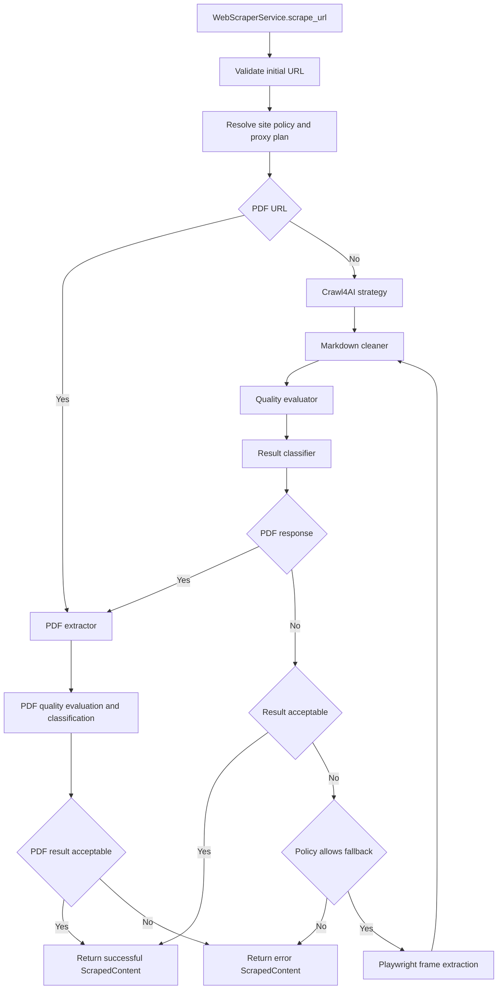
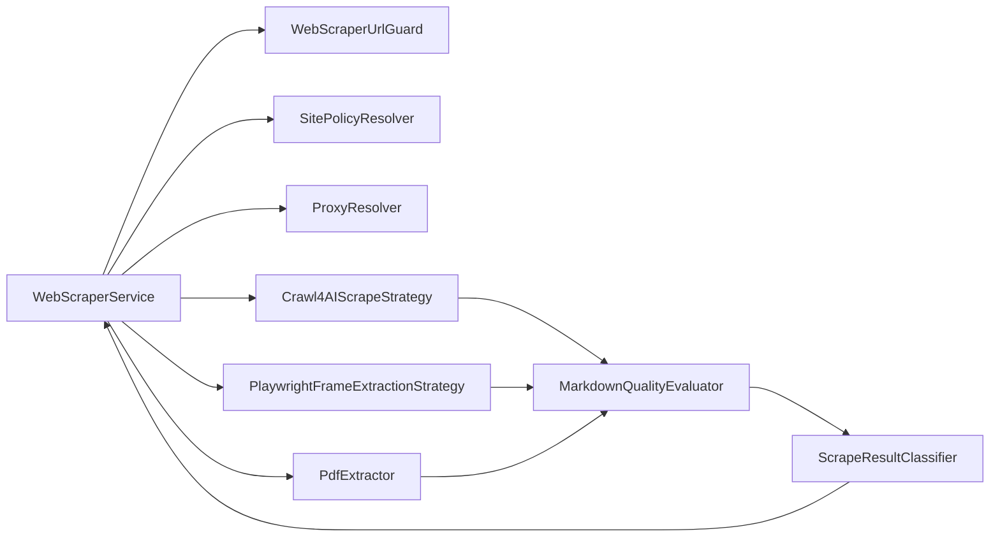

# Web Scraper Service

## Scope

The web scraper service is used by knowledge-base URL document creation, web document refresh, and backend flows that need to convert web pages into Markdown.

Callers should keep using `WebScraperService.scrape_url()` and the `ScrapedContent` result structure. Internal scraping strategies, PDF extraction, and Playwright fallback can evolve, but the public contract must remain stable:

- `ScrapedContent`
- `WebScraperService.scrape_url(url: str)`
- `get_web_scraper_service()`

## Scraping Flow

The service selects an extraction path based on content type and quality:

1. Validate the initial URL and reject non-HTTP(S), local, private-network, and unsafe redirect targets.
2. Use the PDF extractor for PDF URLs, including final response URL validation.
3. Use the Crawl4AI strategy first for regular web pages and convert the result to Markdown.
4. Enable Playwright frame extraction only when the primary result is empty or low quality and policy allows fallback.
5. Run fallback output through the Markdown cleaner, classifier, and quality evaluator.



Playwright fallback prefers frame `innerHTML` and converts it to Markdown. It only falls back to `innerText` when structured HTML is unavailable. Multi-frame output keeps frame titles and source URLs for indexing and troubleshooting.

## Module Relationships

`WebScraperService` is the only public entry point. Internally, it resolves policy, selects the extraction path, and normalizes strategy results into `ScrapedContent`.



## Markdown Output

Page content should be emitted as structured Markdown suitable for knowledge-base indexing and reading:

- Preserve headings, paragraphs, lists, links, and basic tables.
- Remove navigation, footers, buttons, forms, login pages, CAPTCHA pages, Access Denied pages, Too Many Requests pages, and repeated boilerplate.
- Keep the cleaner conservative. Do not remove body content only because class names or localized keywords look action-oriented.
- When only plain text is available, mark the result as degraded instead of pretending it is structured Markdown.

## Proxy Configuration

Proxy behavior is controlled by `WEBSCRAPER_PROXY` and `WEBSCRAPER_PROXY_MODE`.

`WEBSCRAPER_PROXY` is the proxy URL and supports HTTP, HTTPS, and SOCKS5:

```env
WEBSCRAPER_PROXY=http://proxy.example.com:8080
WEBSCRAPER_PROXY_MODE=fallback
```

`WEBSCRAPER_PROXY_MODE` supports:

| Mode | Behavior |
| --- | --- |
| `none` | Never use a proxy |
| `fallback` | Try direct connection first, then retry with proxy after network errors, timeout, 403, 429, or 5xx |
| `proxy` | Always use the proxy, and `WEBSCRAPER_PROXY` must be configured |
| `direct` | Legacy alias with the same behavior as `proxy` |

New deployments should use `proxy` for forced proxy behavior. `direct` exists only as a legacy alias for older environment variable semantics.

## Site Configuration

Site-specific behavior is configured through `WEB_SCRAPER_SITE_CONFIG`, a JSON object keyed by domain or URL pattern.

Example:

```env
WEB_SCRAPER_SITE_CONFIG={"example.com":{"wait_until":"networkidle","page_timeout_ms":30000,"delay_before_return_html":3.0}}
```

Site configuration is parsed through an allowlist. Unknown fields are logged as warnings and ignored. They are not passed through to Crawl4AI or Playwright.

Common supported fields include:

- `wait_until`
- `wait_for`
- `delay_before_return_html`
- `page_timeout_ms`
- `process_iframes`
- `locale`
- `timezone_id`
- `user_agent`
- `user_agent_mode`
- `fallback_enabled`
- `fallback_on_empty`
- `fallback_on_blocked`
- `deep_iframe_extraction`

## Fallback Policy

`fallback_enabled` is the top-level switch. When it is disabled, Playwright fallback does not run even if content is empty, quality is low, or deep iframe extraction is enabled.

When `fallback_enabled=true`:

- `fallback_on_empty=true` allows empty content to trigger fallback.
- `deep_iframe_extraction=true` allows empty or low-quality content to trigger fallback.
- Auth-required, rate-limited, SSRF-blocked, network-failed, and other states that rendering cannot fix do not automatically trigger fallback through deep iframe extraction.
- Whether blocked pages trigger fallback is controlled by `fallback_on_blocked`.

## Security Boundary

All scraping paths must follow the SSRF guard:

- Validate both initial URLs and final response URLs.
- PDF downloads must validate `response.url` after redirects, not only the request URL.
- Playwright fallback must use request interception and reject unsafe schemes, local addresses, and private-network targets.
- WebSocket URLs must pass the same class of SSRF validation.
- Browser, context, and page resources must be released on error paths.

Add focused tests before wiring a new scraping strategy or extractor into the orchestrator.
