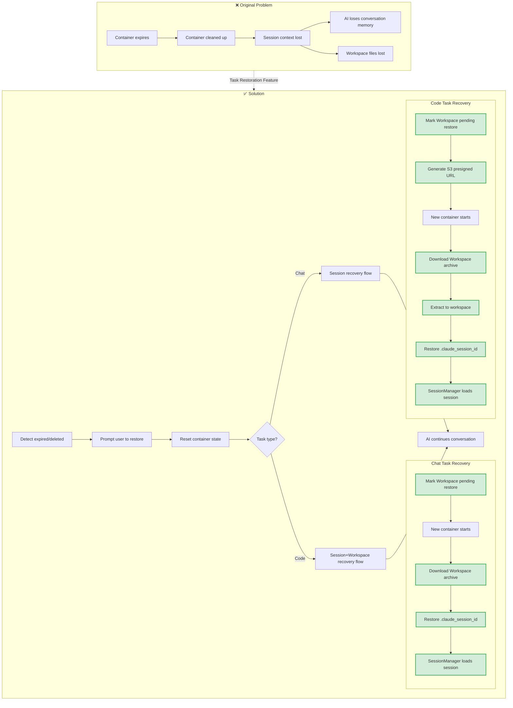
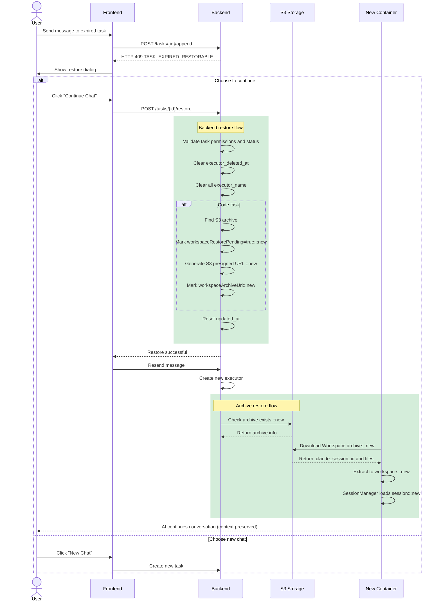
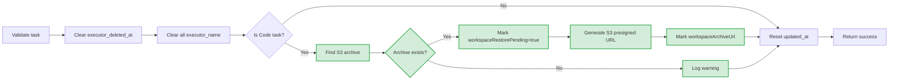
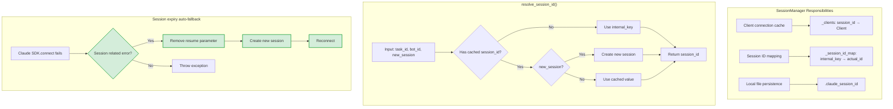
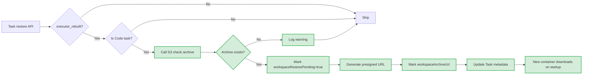
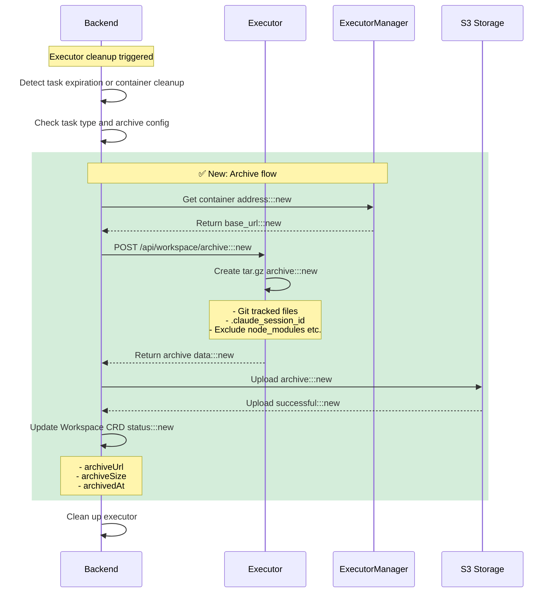
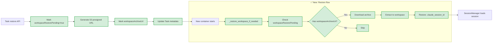
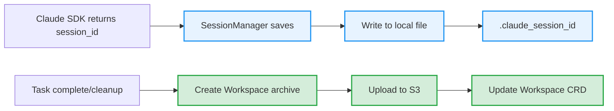
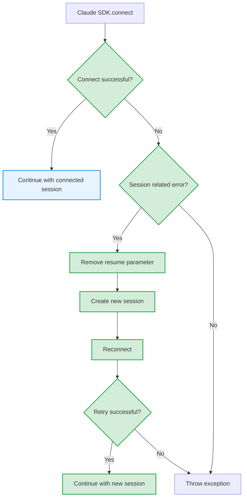

# Task Restoration Feature

## Overview

The Task Restoration feature allows users to continue conversations on expired tasks or tasks whose executor containers have been cleaned up, while preserving full conversation context.

This implementation includes two core features:
1. **Task Restoration** - Allows continuing conversations on expired tasks
2. **Workspace Archive** - Provides file backup and restore for Code tasks

## Problem Background

In Wegent, tasks use Docker containers (executors) to process AI conversations. These containers have lifecycle limits:

| Task Type | Expiration | Scenario |
|-----------|-----------|----------|
| Chat | 2 hours | Daily conversations |
| Code | 24 hours | Code development |

When containers expire and get cleaned up, users attempting to continue conversation face two problems:

1. **Container doesn't exist** - The original executor container has been deleted
2. **Session context lost** - Claude SDK's session ID and workspace files are lost with the container

## Solution Overview



> 💡 **Legend**: Green nodes are new feature implementations

## User Flow



> 💡 **Legend**: Green annotations are new Workspace archive related operations

## Core Mechanisms

### 1. Expiration Detection

When processing message append requests, backend checks the following conditions:

| Check | Condition | Result |
|-------|-----------|--------|
| executor_deleted_at | Last ASSISTANT subtask marked as true | Return 409 |
| Expiration time | Exceeds configured expiration hours | Return 409 |

**Error Response Format**:

```json
{
  "code": "TASK_EXPIRED_RESTORABLE",
  "task_id": 123,
  "task_type": "chat",
  "expire_hours": 2,
  "last_updated_at": "2024-01-01T12:00:00Z",
  "message": "chat task has expired but can be restored",
  "reason": "expired"
}
```

**Container Not Found Detection** (`executor_kinds.py`):
```python
# When receiving "container not found" error, mark executor_deleted_at
if (
    subtask_update.status == SubtaskStatus.FAILED
    and subtask_update.error_message
):
    error_msg = subtask_update.error_message.lower()
    if "container" in error_msg and "not found" in error_msg:
        logger.info(
            f"Container not found error detected, "
            f"marking executor_deleted_at=True"
        )
        subtask.executor_deleted_at = True  # ✅ New
```

### 2. Task Restore API

**Endpoint**: `POST /api/v1/tasks/{task_id}/restore`

**Request/Response Types**:

```typescript
// Request
interface RestoreTaskRequest {
  message?: string  // Message to send after restore (optional)
}

// Response
interface RestoreTaskResponse {
  success: boolean
  task_id: number
  task_type: string
  executor_rebuilt: boolean
  workspace_restore_pending: boolean  // ✅ New: Workspace pending restore flag
  message: string
}
```

The restore operation performs these steps:



| Step | Purpose |
|------|---------|
| Validate task | Check task exists, user permission, task is restorable |
| Clear executor_deleted_at | Allow task to receive new messages |
| Clear executor_name | Clear **all** ASSISTANT subtask's executor_name, force new container creation |
| Find S3 archive | ✅ Code task: Check if archive exists in S3 |
| Mark pending restore | ✅ Code task: Mark `workspaceRestorePending=true` and `workspaceArchiveUrl` in metadata |
| Generate presigned URL | ✅ Generate S3 presigned URL for Executor download |

**Restorable task states**: `COMPLETED`, `FAILED`, `CANCELLED`, `PENDING_CONFIRMATION`

### 3. Session Manager Module

Executor uses `SessionManager` for unified session management:



> 💡 **Legend**: Green nodes are new session expiry handling logic

**Session ID Resolution Priority**:

| Priority | Source | Description |
|----------|---------|-------------|
| 1 | Local file `.claude_session_id` | From Workspace archive, for cross-container restore |
| 2 | internal_key | Format: `task_id:bot_id`, identifier within same container |
| 3 | Create new session | No history available, create fresh session |

**Session Expiry Auto-Fallback** (`claude_code_agent.py`):
```python
# ✅ New: Session expiry auto-fallback handling
try:
    await self.client.connect()
except Exception as e:
    error_msg = str(e).lower()
    # Check for session-related errors
    session_error_keywords = ["session", "expired", "invalid", "resume"]
    if any(keyword in error_msg for keyword in session_error_keywords):
        logger.warning(
            f"Session error detected, creating new session. "
            f"Original error: {e}"
        )
        # Remove resume parameter, create new session
        self.options.pop("resume", None)
        if self.options:
            code_options = ClaudeAgentOptions(**self.options)
            self.client = ClaudeSDKClient(options=code_options)
        else:
            self.client = ClaudeSDKClient()
        await self.client.connect()
    else:
        raise
```

### 4. Workspace Archive Restoration

For Code tasks, restoration requires recovering workspace files:



**Implementation**: `mark_for_restore()` method in `backend/app/services/adapters/workspace_archive.py`

## Data Flow Details

### Workspace Archive Flow (Before Cleanup)



**Archive Contents**:
- Git-tracked code files (`git ls-files`)
- `.claude_session_id` session ID file

**Excluded Directories**:
- `node_modules`, `__pycache__`, `.venv`, `venv`
- `.env`, `.git`, `dist`, `build`, `.next`, `.nuxt`
- `target`, `vendor`, `.cache`, `.npm`, `.yarn`

### Workspace Restore Flow (On Task Restoration)



**Implementation locations**:
- Backend: `backend/app/services/adapters/workspace_archive.py::mark_for_restore()`
- Executor: `executor/agents/base.py::_restore_workspace_if_needed()`
- Executor: `executor/services/workspace_service.py::restore_workspace_from_archive()`

### Task Completion (Session ID Saving)



> 💡 **Legend**: Blue is existing logic, green is new archive logic

**Code Example** (SessionManager):

```python
# Save session ID to local file
SessionManager.save_session_id(self.task_id, session_id)

# Load session ID from local file
saved_session_id = SessionManager.load_saved_session_id(self.task_id)
if saved_session_id:
    self.options["resume"] = saved_session_id
```

## Session Expiry Handling

When attempting to restore a session fails, automatic fallback occurs:



**Retryable error types**: Contains keywords `session`, `expired`, `invalid`, `resume`

## Configuration

| Environment Variable | Description | Default |
|---------------------|-------------|---------|
| `APPEND_CHAT_TASK_EXPIRE_HOURS` | Hours before chat task expires | 2 |
| `APPEND_CODE_TASK_EXPIRE_HOURS` | Hours before code task expires | 24 |

### Workspace Archive Configuration ✅ New

| Environment Variable | Description | Default |
|---------------------|-------------|---------|
| `WORKSPACE_ARCHIVE_ENABLED` | Enable/disable workspace archive feature | `False` |
| `WORKSPACE_ARCHIVE_MAX_SIZE_MB` | Maximum archive size in MB, skip if exceeded | `500` |
| `WORKSPACE_ARCHIVE_S3_ENDPOINT` | S3-compatible storage endpoint | Empty |
| `WORKSPACE_ARCHIVE_S3_BUCKET` | S3 bucket name | `workspace-archives` |
| `WORKSPACE_ARCHIVE_S3_ACCESS_KEY` | S3 access key | Empty |
| `WORKSPACE_ARCHIVE_S3_SECRET_KEY` | S3 access key | Empty |
| `WORKSPACE_ARCHIVE_S3_REGION` | S3 region | `us-east-1` |
| `WORKSPACE_ARCHIVE_S3_USE_SSL` | Whether to use SSL | `True` |

## Related Files

### Backend

| File | Responsibility | Status |
|------|----------------|--------|
| `backend/app/api/endpoints/adapter/task_restore.py` | Restore API endpoint | ✅ New |
| `backend/app/services/adapters/task_restore.py` | Restore service logic, validation, state reset | ✅ New |
| `backend/app/services/adapters/workspace_archive.py` | Workspace archive and restore service | ✅ New |
| `backend/app/services/adapters/executor_kinds.py` | Executor dispatch, expiry detection, executor_name inheritance | 🔧 Modified |
| `backend/app/services/adapters/task_kinds/operations.py` | Expiry check before message append | 🔧 Modified |
| `backend/app/services/adapters/executor_job.py` | Archive call before executor cleanup | 🔧 Modified |

### Executor

| File | Responsibility | Status |
|------|----------------|--------|
| `executor/services/workspace_service.py` | Workspace archive creation, S3 download, extraction | ✅ New |
| `executor/app.py` | POST /api/workspace/archive endpoint | 🔧 Modified |
| `executor/agents/base.py` | `_restore_workspace_if_needed()` method | 🔧 Modified |
| `executor/agents/claude_code/claude_code_agent.py` | Session expiry auto-fallback | 🔧 Modified |

### Frontend

| File | Responsibility | Status |
|------|----------------|--------|
| `frontend/src/features/tasks/components/chat/TaskRestoreDialog.tsx` | Restore dialog UI | ✅ New |
| `frontend/src/features/tasks/components/chat/useChatStreamHandlers.tsx` | Restore flow handling | 🔧 Modified |
| `frontend/src/utils/errorParser.ts` | Parse TASK_EXPIRED_RESTORABLE error | 🔧 Modified |
| `frontend/src/apis/tasks.ts` | restoreTask API client | 🔧 Modified |
| `frontend/src/i18n/locales/en/chat.json` | English translations | 🔧 Modified |
| `frontend/src/i18n/locales/zh-CN/chat.json` | Chinese translations | 🔧 Modified |

### Shared

| File | Responsibility | Status |
|------|----------------|--------|
| `shared/utils/s3_client.py` | S3-compatible storage client | ✅ New |
| `shared/models/db/subtask.py` | Subtask model | 🗑️ Delete claude_session_id column |

### Executor Manager

| File | Responsibility | Status |
|------|----------------|--------|
| `executor_manager/routers/routers.py` | POST /executor/address endpoint | 🔧 Modified |
## Tests

### Unit Tests

| Test File | Coverage |
|-----------|----------|
| `shared/tests/utils/test_s3_client.py` | S3 client upload, download, delete operations |
| `executor/tests/services/test_workspace_service.py` | Workspace archive creation, Git file retrieval, exclusion logic |

### Integration Test Scenarios

1. **Complete Task Lifecycle**
   - Create task → Send message → Expire → Restore → Continue conversation

2. **Workspace Archive Restore**
   - Code task → Archive → Cleanup → Restore → Verify files

3. **Session ID Restore**
   - Chat task → Save session → Expire → Restore → Verify context

4. **Session Expiry Fallback**
   - Session restore fails → Auto-create new session → Continue conversation
