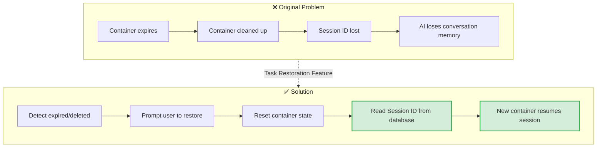
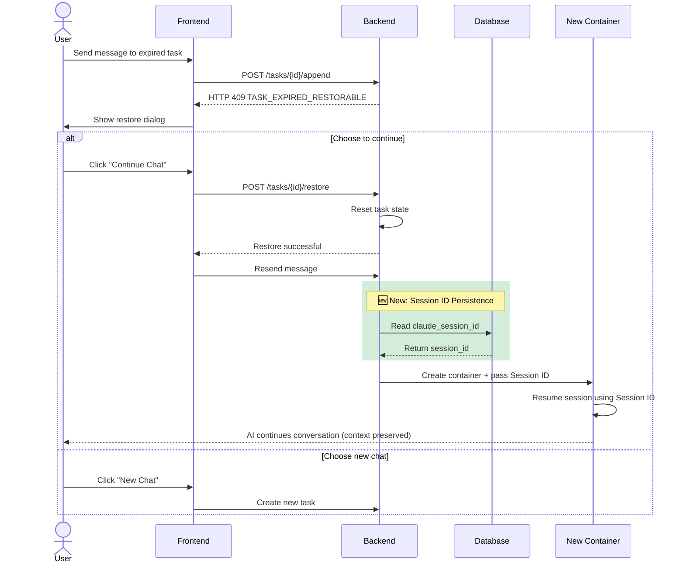
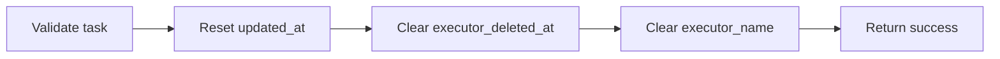
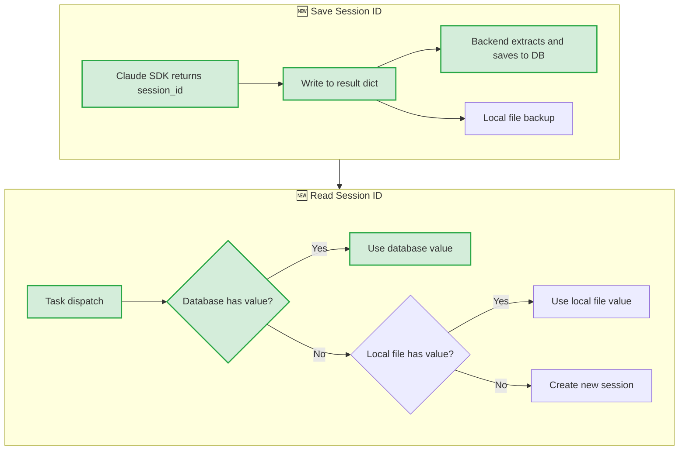
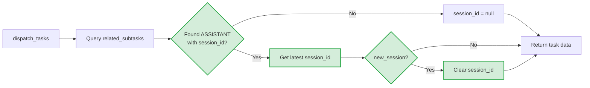
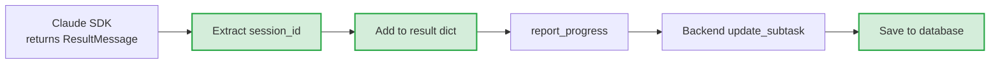
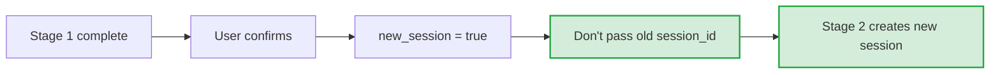
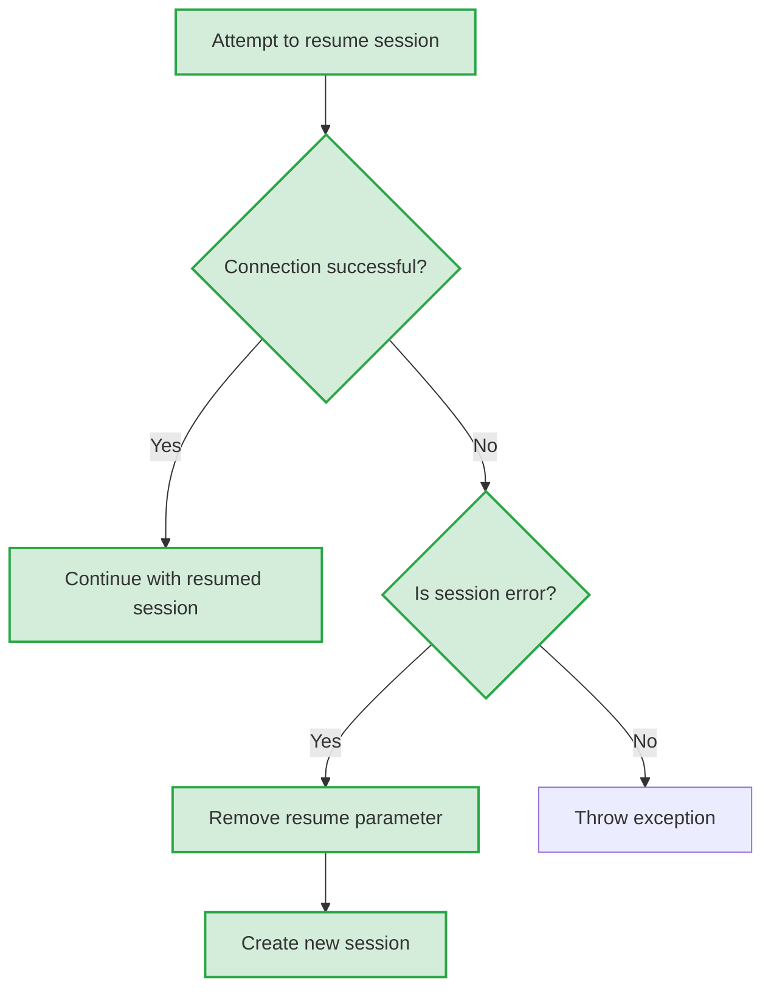

# Task Restoration Feature

## Overview

The Task Restoration feature allows users to continue conversations on expired tasks or tasks whose executor containers have been cleaned up, while preserving the full conversation context.

## Problem Background

In Wegent, tasks use Docker containers (executors) to process AI conversations. These containers have lifecycle limits:

| Task Type | Expiration | Scenario |
|-----------|-----------|----------|
| Chat | 2 hours | Daily conversations |
| Code | 24 hours | Code development |

When containers expire and get cleaned up, users attempting to continue the conversation face two problems:

1. **Container doesn't exist** - The original executor container has been deleted
2. **Session context lost** - Claude SDK's session ID was stored in the container and lost with it

## Solution Overview

> 💡 **Legend**: Green nodes are new functionality (Session ID Persistence)

## User Flow

## Core Mechanisms

### 1. Expiration Detection

When processing message append requests, the backend checks the following conditions:

| Check | Condition | Result |
|-------|-----------|--------|
| executor_deleted_at | Last ASSISTANT subtask marked as true | Return 409 |
| Expiration time | Exceeds configured expiration hours | Return 409 |

### 2. Task Restore API

**Endpoint**: `POST /api/v1/tasks/{task_id}/restore`

The restore operation performs these steps:

| Step | Purpose |
|------|---------|
| Clear executor_deleted_at | Allow task to receive new messages |
| Clear executor_name | Force new container creation (don't reuse old container name) |

### 3. Claude Session ID Persistence 🆕

> ⚠️ **New Feature**: This section describes the newly added Session ID persistence mechanism

To enable new containers to restore previous conversation context, Session IDs are persisted to the database:

> 💡 **Legend**: Green nodes are new logic, white nodes are existing logic (local file backup)

**Storage Strategy**:

| Storage Location | Purpose | Priority | Status |
|-----------------|---------|----------|--------|
| Database `subtasks.claude_session_id` | Primary storage, supports cross-container restore | High | 🆕 New |
| Local file `.claude_session_id` | Backup, fast read within same container | Low | Existing |

## Data Flow Details

### Task Dispatch (Backend → Executor)

> 💡 **Legend**: Green nodes are the new Session ID lookup and processing logic

### Task Completion (Executor → Backend)

> 💡 **Legend**: Green nodes are the new Session ID passing and saving logic

## Pipeline Mode Handling 🆕

> ⚠️ **New Feature**: Session ID isolation handling in Pipeline mode

In Pipeline mode, when user confirms to proceed to the next stage:

**Reason**: Each Pipeline stage may use different Bots, requiring independent session contexts.

## Session Expiry Handling 🆕

> ⚠️ **New Feature**: Automatic fallback handling when session expires

When Claude SDK returns session-related errors, automatic fallback occurs:

**Detection Keywords**: `session`, `expired`, `invalid`, `resume`

## Configuration

| Environment Variable | Description | Default |
|---------------------|-------------|---------|
| `APPEND_CHAT_TASK_EXPIRE_HOURS` | Hours before chat task expires | 2 |
| `APPEND_CODE_TASK_EXPIRE_HOURS` | Hours before code task expires | 24 |

## Related Files

### Backend

| File | Responsibility | Status |
|------|----------------|--------|
| `backend/app/api/endpoints/adapter/task_restore.py` | Restore API endpoint | Existing |
| `backend/app/services/adapters/task_restore.py` | Restore service logic | Existing |
| `backend/app/services/adapters/executor_kinds.py` | Session ID read/save, executor_deleted_at marking | 🆕 Modified |
| `backend/app/services/adapters/task_kinds/operations.py` | Pre-append expiration check | Existing |
| `backend/alembic/versions/x4y5z6a7b8c9_*.py` | Database migration (add claude_session_id) | 🆕 New |

### Executor

| File | Responsibility | Status |
|------|----------------|--------|
| `executor/agents/claude_code/claude_code_agent.py` | Session ID reading, expiry handling | 🆕 Modified |
| `executor/agents/claude_code/response_processor.py` | Add Session ID to result | 🆕 Modified |

### Frontend

| File | Responsibility | Status |
|------|----------------|--------|
| `frontend/src/features/tasks/components/chat/TaskRestoreDialog.tsx` | Restore dialog | Existing |
| `frontend/src/features/tasks/components/chat/useChatStreamHandlers.tsx` | Restore flow handling | Existing |
| `frontend/src/utils/errorParser.ts` | Parse TASK_EXPIRED_RESTORABLE error | Existing |

### Shared

| File | Responsibility | Status |
|------|----------------|--------|
| `shared/models/db/subtask.py` | Subtask model (includes claude_session_id field) | 🆕 Modified |
