# Task Restoration Feature

## Overview

The Task Restoration feature allows users to continue conversations on expired tasks or tasks whose executor containers have been cleaned up, while preserving full conversation context.

## Problem Background

In Wegent, tasks use Docker containers (executors) to process AI conversations. These containers have lifecycle limits:

| Task Type | Expiration | Scenario |
|-----------|-----------|----------|
| Chat | 2 hours | Daily conversations |
| Code | 24 hours | Code development |

When containers expire and get cleaned up, users attempting to continue conversation face two problems:

1. **Container doesn't exist** - The original executor container has been deleted
2. **Session context lost** - Claude SDK's session ID was stored in container and lost with it

## Solution Overview


## User Flow


## Core Mechanisms

### 1. Expiration Detection

When processing message append requests, backend checks the following conditions:

| Check | Condition | Result |
|-------|-----------|--------|
| executor_deleted_at | Last ASSISTANT subtask marked as true | Return 409 |
| Expiration time | Exceeds configured expiration hours | Return 409 |

**Error Response Format**:

```json
{
  "code": "TASK_EXPIRED_RESTORABLE",
  "task_id": 123,
  "task_type": "chat",
  "expire_hours": 2,
  "last_updated_at": "2024-01-01T12:00:00Z",
  "message": "chat task has expired but can be restored",
  "reason": "expired"
}
```

### 2. Task Restore API

**Endpoint**: `POST /api/v1/tasks/{task_id}/restore`

**Request/Response Types**:

```typescript
// Request
interface RestoreTaskRequest {
  message?: string  // Message to send after restore (optional)
}

// Response
interface RestoreTaskResponse {
  success: boolean
  task_id: number
  task_type: string
  executor_rebuilt: boolean
  message: string
}
```

The restore operation performs these steps:


| Step | Purpose |
|------|---------|
| Validate task | Check task exists, user permission, task is restorable |
| Clear executor_deleted_at | Allow task to receive new messages |
| Clear executor_name | Clear **all** ASSISTANT subtask's executor_name, force new container creation |
| Mark Workspace pending restore | Code task: mark S3 archive URL in metadata |

**Restorable task states**: `COMPLETED`, `FAILED`, `CANCELLED`, `PENDING_CONFIRMATION`

### 3. Session Manager Module

Executor uses `SessionManager` for unified session management:

```mermaid
flowchart TB
    subgraph SessionManager["SessionManager Responsibilities"]
        A[Client connection cache] --> B["_clients: session_id → Client"]
        C[Session ID mapping] --> D["_session_id_map: internal_key → actual_id"]
        E[Local file persistence] --> F[".claude_session_id"]
    end

    subgraph ResolveLogic["resolve_session_id()"]
        G[Input: task_id, bot_id, new_session] --> H{Has cached session_id?}
        H -->|Yes| I{new_session?}
        H -->|No| J[Use internal_key]
        I -->|Yes| K[Create new session]
        I -->|No| L[Use cached value]
        J --> M[Return session_id]
        K --> M
        L --> M
    end
```



**Session ID Resolution Priority**:

| Priority | Source | Description |
|----------|---------|-------------|
| 1 | Local file `.claude_session_id` | From Workspace archive, for cross-container restore |
| 2 | internal_key | Format: `task_id:bot_id`, identifier within same container |
| 3 | Create new session | No history available, create fresh session |

### 4. Workspace Archive Restoration

For Code tasks, restoration requires recovering workspace files:


**Implementation**: `mark_for_restore()` method in `backend/app/services/adapters/workspace_archive.py`

**Workspace Archive Contains**:
- Git-tracked code files
- `.claude_session_id` session ID file

## Data Flow Details

### Task Restoration (Workspace Archive → Executor)


### Task Completion (Session ID Saving)


**Code Example** (SessionManager):

```python
# Save session ID to local file
SessionManager.save_session_id(self.task_id, session_id)

# Load session ID from local file
saved_session_id = SessionManager.load_saved_session_id(self.task_id)
if saved_session_id:
    self.options["resume"] = saved_session_id
```

## Session Expiry Handling

When attempting to restore a session fails, automatic fallback occurs:


**Retryable error types**: Determined by `is_retryable_error_subtype()` function

**Retry limit**: `MAX_ERROR_SUBTYPE_RETRIES` times

## Configuration

| Environment Variable | Description | Default |
|---------------------|-------------|---------|
| `APPEND_CHAT_TASK_EXPIRE_HOURS` | Hours before chat task expires | 2 |
| `APPEND_CODE_TASK_EXPIRE_HOURS` | Hours before code task expires | 24 |

## Related Files

### Backend

| File | Responsibility |
|------|----------------|
| `backend/app/api/endpoints/adapter/task_restore.py` | Restore API endpoint |
| `backend/app/services/adapters/task_restore.py` | Restore service logic, validation, state reset |
| `backend/app/services/adapters/workspace_archive.py` | Workspace archive restore marking |

### Executor

| File | Responsibility |
|------|----------------|
| `executor/agents/claude_code/session_manager.py` | Session management, caching, local file persistence |
| `executor/agents/claude_code/claude_code_agent.py` | Session ID initialization, load from local file |
| `executor/services/workspace_service.py` | Workspace archive creation, restoration |

### Frontend

| File | Responsibility |
|------|----------------|
| `frontend/src/features/tasks/components/chat/TaskRestoreDialog.tsx` | Restore dialog UI |
| `frontend/src/features/tasks/components/chat/useChatStreamHandlers.tsx` | Restore flow handling |
| `frontend/src/utils/errorParser.ts` | Parse TASK_EXPIRED_RESTORABLE error |
| `frontend/src/apis/tasks.ts` | restoreTask API client |

### Shared

| File | Responsibility |
|------|----------------|
| (None) | No shared model modifications |
