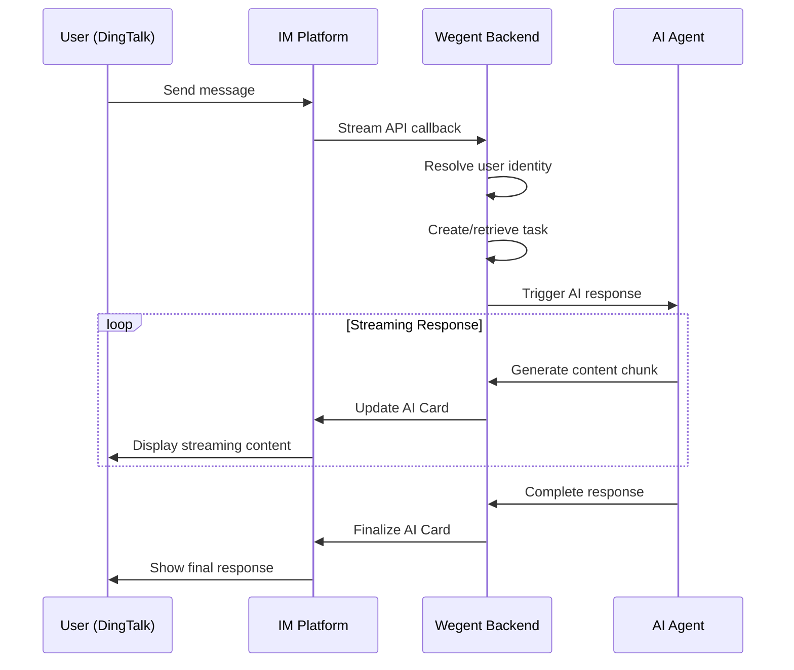
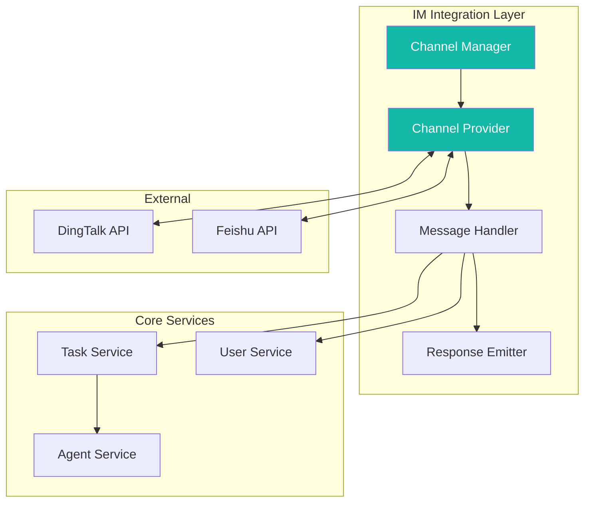
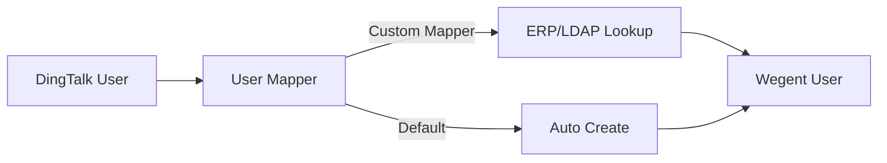

# 📱 IM Channel Integration Guide

IM Channel Integration allows you to connect Wegent agents to instant messaging platforms like DingTalk, enabling users to interact with AI agents directly within their familiar chat tools.

---

## 📋 Table of Contents

- [Overview](#-overview)
- [Architecture](#-architecture)
- [DingTalk Integration Setup](#-dingtalk-integration-setup)
- [Using IM Channels](#-using-im-channels)
- [Management Features](#-management-features)
- [User Mapping Mechanism](#-user-mapping-mechanism)
- [Troubleshooting](#-troubleshooting)
- [Related Resources](#-related-resources)

---

## 🎯 Overview

### What is IM Channel Integration?

IM Channel Integration connects Wegent agents to instant messaging platforms, allowing users to chat with AI agents directly in their preferred messaging apps without accessing the Wegent web interface.

### Core Benefits

| Benefit | Description |
|---------|-------------|
| **Familiar Environment** | Use AI agents in the chat tools you already use daily |
| **Real-time Responses** | Get streaming AI responses with AI Card technology |
| **Multi-turn Conversations** | Maintain context across multiple messages |
| **Team Collaboration** | Share AI capabilities with your entire organization |

### Supported Platforms

| Platform | Status | Features |
|----------|--------|----------|
| **DingTalk** | ✅ Available | Stream mode, AI Card streaming, multi-turn conversations |
| **Feishu/Lark** | 🔜 Planned | Coming soon |
| **WeChat Work** | 🔜 Planned | Coming soon |

---

## 🏗 Architecture

### Message Flow

The following diagram illustrates how messages flow through the IM integration system:



### Key Components



| Component | Purpose |
|-----------|---------|
| **Channel Manager** | Manages lifecycle of all IM channel connections |
| **Channel Provider** | Platform-specific connection handler (DingTalk, Feishu, etc.) |
| **Message Handler** | Processes incoming messages and routes to agents |
| **Response Emitter** | Sends AI responses back to IM platform (sync or streaming) |

---

## 🔧 DingTalk Integration Setup

### Prerequisites

Before setting up DingTalk integration, ensure you have:

- [ ] DingTalk Enterprise account with admin access
- [ ] Access to [DingTalk Open Platform](https://open.dingtalk.com)
- [ ] Wegent instance with admin privileges
- [ ] At least one configured Agent (Team) in Wegent

### Step 1: Create DingTalk Application

1. Log in to [DingTalk Open Platform](https://open.dingtalk.com)
2. Navigate to **Application Development** → **Enterprise Internal Application**
3. Click **Create Application**
4. Fill in application details:
   - **Application Name**: Your bot name (e.g., "Wegent AI Assistant")
   - **Application Description**: Brief description of the bot's purpose
   - **Application Icon**: Upload an appropriate icon

### Step 2: Configure Application Permissions

Enable the following permissions for your application:

**Robot Permissions:**
- `qyapi_robot_sendmsg` - Send robot messages
- `qyapi_chat_manage` - Manage group chats

**User Information Permissions:**
- `Contact.User.Read` - Read user information
- `Contact.User.mobile` - Access user mobile (optional)

### Step 3: Get Application Credentials

1. In your application settings, navigate to **Credentials and Basic Info**
2. Copy the following values:
   - **Client ID** (AppKey)
   - **Client Secret** (AppSecret)

> ⚠️ **Security Note**: Keep your Client Secret secure. Never share it or commit it to version control.

### Step 4: Enable Message Stream Mode

1. In application settings, go to **Robot Configuration**
2. Enable **Message Receiving Mode**: Stream Mode
3. This allows Wegent to receive messages via WebSocket without configuring callback URLs

### Step 5: Configure IM Channel in Wegent

1. Log in to Wegent as an administrator
2. Navigate to **Admin Panel** → **IM Channels**
3. Click **Add Channel**
4. Fill in the configuration:

| Field | Description | Example |
|-------|-------------|---------|
| **Channel Name** | Display name for this channel | "DingTalk Bot" |
| **Channel Type** | Select platform | DingTalk |
| **Client ID** | From Step 3 | `dingxxxxxxxx` |
| **Client Secret** | From Step 3 | `xxxxxxxxxxxxxxxx` |
| **Default Agent** | Agent to handle messages | Select from list |
| **Default Model** | Override model (optional) | Leave empty to use agent's default |
| **Enable AI Card** | Use streaming AI Card | ✅ Recommended |

5. Click **Save** to create the channel
6. Toggle **Enable** to activate the channel

### Step 6: Verify Connection

1. Check the channel status in the IM Channels list
2. Status should show **Connected** (green indicator)
3. View uptime and last error information if available

### Step 7: Test the Integration

1. Open DingTalk and find your bot
2. Send a test message: "Hello"
3. Verify you receive an AI response

---

## 💬 Using IM Channels

### Basic Conversation

Simply send messages to the bot in DingTalk as you would in any chat:

```
User: What can you help me with?
Bot: I'm an AI assistant powered by Wegent. I can help you with...
```

### Multi-turn Conversations

The bot maintains conversation context within the same chat session:

```
User: I'm working on a React project
Bot: Great! I'd be happy to help with your React project...

User: How do I optimize performance?
Bot: For your React project, here are some performance optimization tips...
```

### Starting a New Conversation

To clear context and start fresh, use the `/new` command:

```
User: /new
Bot: Started a new conversation. How can I help you?
```

### AI Card Streaming

When AI Card streaming is enabled, you'll see responses appear in real-time:

1. Bot shows "Thinking..." indicator
2. Response text streams in progressively
3. Final response is displayed with formatting

---

## ⚙️ Management Features

### Channel Status Monitoring

View channel health in the admin panel:

| Status | Indicator | Description |
|--------|-----------|-------------|
| **Connected** | 🟢 Green | Channel is active and receiving messages |
| **Disconnected** | 🔴 Red | Channel is offline or experiencing errors |
| **Disabled** | ⚪ Gray | Channel is manually disabled |

### Channel Operations

| Operation | Description |
|-----------|-------------|
| **Enable/Disable** | Toggle channel without deleting configuration |
| **Restart** | Reconnect to IM platform (useful after network issues) |
| **Edit** | Modify channel settings (leave secret empty to keep existing) |
| **Delete** | Remove channel configuration |

### Updating Configuration

When editing a channel:

- **Sensitive fields** (Client Secret) are masked with `***`
- Leave sensitive fields **empty** to keep existing values
- Enter new values to update credentials

### Monitoring Metrics

Available metrics for each channel:

- **Uptime**: How long the channel has been connected
- **Last Error**: Most recent error message (if any)
- **Connection Time**: When the channel was last connected

---

## 👥 User Mapping Mechanism

### Automatic User Creation

When a DingTalk user interacts with the bot for the first time:

1. System attempts to find existing Wegent user
2. If not found, automatically creates a new user account
3. User is linked to their DingTalk identity

**Default user creation:**
- **Username**: DingTalk Staff ID
- **Email**: `{staff_id}@dingtalk.com`
- **Auth Source**: `dingtalk`

### Enterprise User Mapping

For organizations with existing user directories (ERP, LDAP), custom user mappers can be configured:



Contact your system administrator to configure enterprise user mapping.

---

## ❓ Troubleshooting

### Connection Issues

#### Channel shows "Disconnected"

**Possible causes:**
1. Invalid Client ID or Client Secret
2. Network connectivity issues
3. DingTalk API service disruption

**Solutions:**
1. Verify credentials in DingTalk Open Platform
2. Check network connectivity from Wegent server
3. Try restarting the channel
4. Check DingTalk service status

#### Messages not being received

**Possible causes:**
1. Stream mode not enabled in DingTalk
2. Robot permissions not configured
3. Channel not enabled in Wegent

**Solutions:**
1. Verify Stream Mode is enabled in DingTalk app settings
2. Check all required permissions are granted
3. Ensure channel is enabled (toggle is on)

### Response Issues

#### Bot not responding

**Possible causes:**
1. Default Agent not configured
2. Agent has no model assigned
3. Rate limiting

**Solutions:**
1. Verify a default Agent is selected for the channel
2. Ensure the Agent has a working model configuration
3. Check for rate limit errors in channel status

#### Slow or incomplete responses

**Possible causes:**
1. AI Card streaming issues
2. Network latency
3. Large response content

**Solutions:**
1. Try disabling AI Card streaming temporarily
2. Check network connectivity
3. The system will fall back to sync mode if streaming fails

### User Issues

#### User not recognized

**Possible causes:**
1. User mapping configuration issues
2. DingTalk user info not accessible

**Solutions:**
1. Check user permissions in DingTalk app
2. Verify user mapping configuration
3. Contact administrator for enterprise user mapping

---

## 🔗 Related Resources

### Documentation
- [Core Concepts](../../concepts/core-concepts.md) - Understand Wegent's architecture
- [Creating Teams](./creating-teams.md) - Configure agents for IM channels
- [Configuring Models](./configuring-models.md) - Set up AI models

### External Resources
- [DingTalk Open Platform Documentation](https://open.dingtalk.com/document/)
- [DingTalk Stream Mode Guide](https://open.dingtalk.com/document/orgapp/receive-message)

---

## 💬 Get Help

Need assistance?

- 📖 Check [FAQ](../../faq.md)
- 🐛 Submit [GitHub Issue](https://github.com/wecode-ai/wegent/issues)
- 💬 Join community discussions

---

<p align="center">Connect your AI agents to DingTalk and empower your team! 🚀</p>
