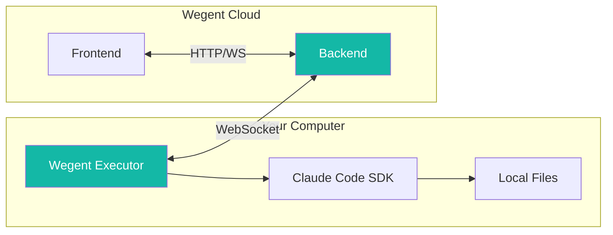
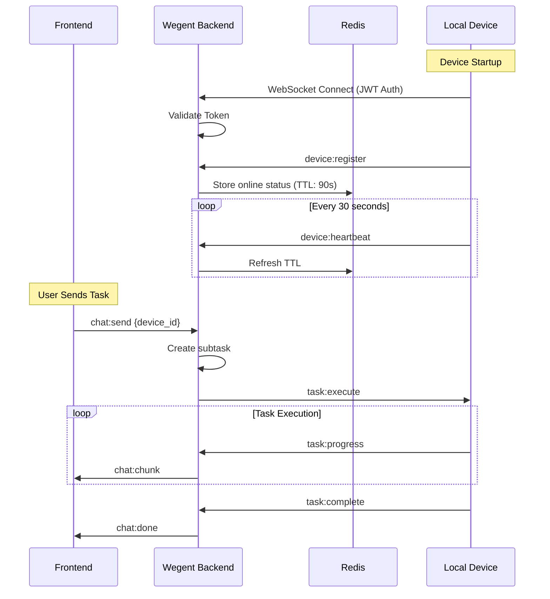
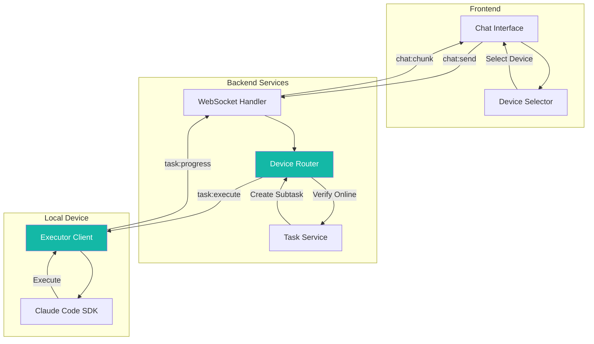
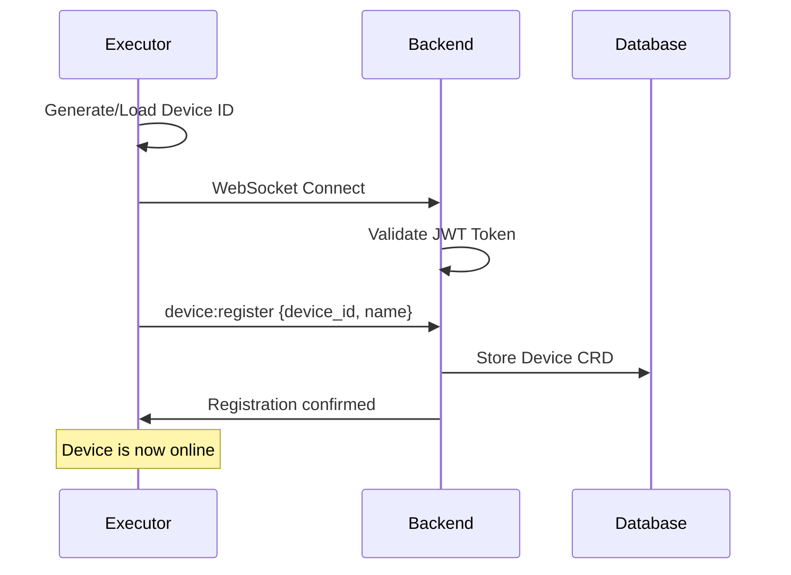
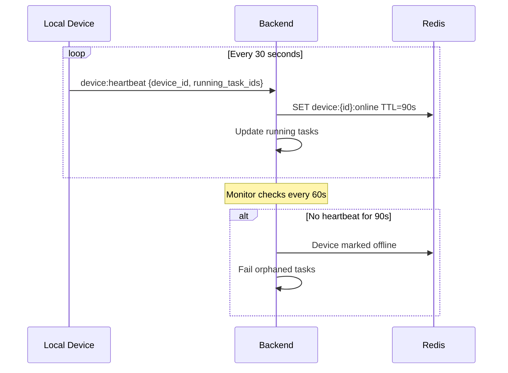
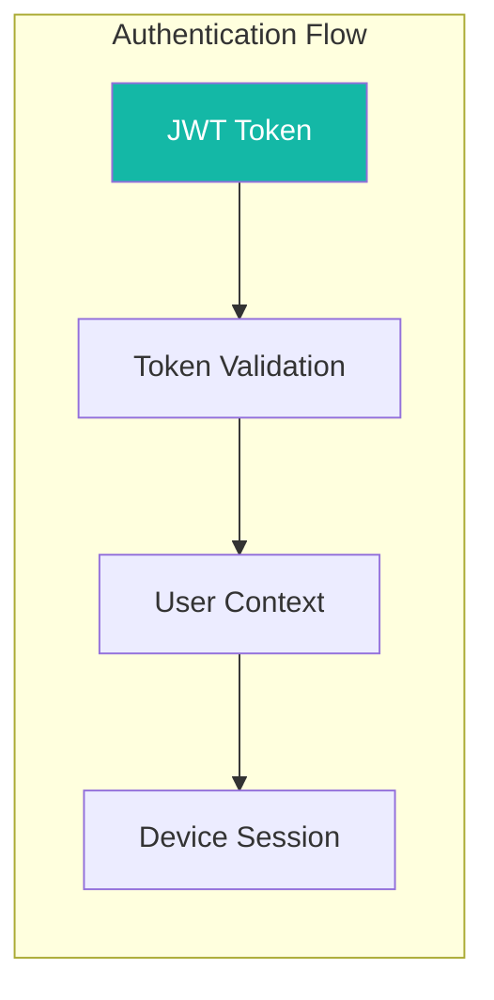

# 💻 Local Device Support Guide

Local Device Support enables you to use your personal computer (Mac, Linux, or Windows) as a task executor, allowing AI tasks to run directly on your local machine instead of cloud infrastructure.

---

## 📋 Table of Contents

- [Overview](#-overview)
- [Architecture](#-architecture)
- [Device Registration](#-device-registration)
- [Using Local Devices](#-using-local-devices)
- [Device Management](#-device-management)
- [Heartbeat and Monitoring](#-heartbeat-and-monitoring)
- [Security](#-security)
- [Troubleshooting](#-troubleshooting)
- [Related Resources](#-related-resources)

---

## 🎯 Overview

### What is Local Device Support?

Local Device Support allows your personal computer to act as a task executor for Wegent. Instead of running AI tasks on cloud infrastructure, tasks are executed directly on your machine with real-time streaming feedback.

### Core Benefits

| Benefit | Description |
|---------|-------------|
| **Lower Latency** | Direct local execution without network transmission delays |
| **Data Privacy** | Your code and data never leave your local machine |
| **Environment Control** | Use your locally installed tools, dependencies, and configurations |
| **Cost Savings** | Reduce cloud execution resource consumption |
| **Custom Setup** | Access to local credentials, custom tools, and specialized software |

### How It Works



---

## 🏗 Architecture

### Communication Architecture

The following diagram shows how local devices communicate with the Wegent system:



### Task Execution Flow



---

## 📲 Device Registration

### Prerequisites

Before registering a local device, ensure you have:

- [ ] Wegent account with valid credentials
- [ ] Wegent Executor installed on your machine
- [ ] Network connectivity to Wegent backend
- [ ] Claude Code SDK configured (for ClaudeCode shell type)

### Installing Wegent Executor

1. Clone or download the Wegent Executor package
2. Install dependencies:

```bash
cd executor
pip install -e .
```

### Starting the Executor

Run the executor in local device mode:

```bash
# Start with default settings
wegent-executor --mode local --token YOUR_JWT_TOKEN

# Or with environment variables
export WEGENT_TOKEN=your_jwt_token
export WEGENT_BACKEND_URL=https://your-wegent-instance.com
wegent-executor --mode local
```

### Device ID Generation

The executor automatically generates a stable device ID based on:

1. **Cached ID**: Stored in `~/.wegent-executor/device_id` (if exists)
2. **Hardware UUID**:
   - macOS: System hardware UUID
   - Linux: `/etc/machine-id`
   - Windows: `MachineGuid` from registry
3. **Fallback**: MAC address or random UUID

This ensures your device maintains a consistent identity across restarts.

### Registration Process

When the executor starts:



---

## 🖥 Using Local Devices

### Selecting a Device

In the chat interface, you'll see a device selector dropdown:

1. Click the **device selector** icon near the chat input
2. View available devices with their status:
   - 🟢 **Online**: Device is connected and ready
   - 🔴 **Offline**: Device is not connected
   - 🟡 **Busy**: Device is running at capacity
3. Select your preferred device
4. Send your message as usual

### Device Status Indicators

| Status | Icon | Description |
|--------|------|-------------|
| **Online** | 🟢 | Device connected, slots available |
| **Offline** | 🔴 | Device not connected |
| **Busy** | 🟡 | All 5 concurrent slots in use |
| **Default** | ⭐ | Your default device for new tasks |

### Concurrent Task Slots

Each device supports up to **5 concurrent tasks**:

- View slot usage: "2/5 slots in use"
- Device shows "Busy" when all slots are occupied
- Tasks queue if you select a busy device

### Switching Between Cloud and Local

You can dynamically choose execution location:

| Selection | Behavior |
|-----------|----------|
| **Cloud** (default) | Task executes on Wegent cloud infrastructure |
| **Local Device** | Task executes on your selected local machine |

Simply change the device selection before sending each message.

### Setting Default Device

1. Open device list in the selector
2. Click the **star icon** next to your preferred device
3. This device will be pre-selected for new conversations

---

## ⚙️ Device Management

### Viewing Registered Devices

Access your devices through:

1. **Device Selector**: Quick access in chat interface
2. **API**: `GET /devices` for programmatic access

### Device Information

Each device shows:

| Field | Description |
|-------|-------------|
| **Name** | Device hostname (e.g., "Darwin - MacBook-Pro.local") |
| **Status** | Online/Offline indicator |
| **Slots** | Concurrent task capacity (X/5) |
| **Default** | Star indicator if set as default |

### Managing Devices

| Action | How To |
|--------|--------|
| **Set Default** | Click star icon or `PUT /devices/{id}/default` |
| **Remove Default** | Click star again on current default |
| **Delete Device** | Click delete icon or `DELETE /devices/{id}` |

> **Note**: Deleting a device only removes the registration. If the device reconnects, it will automatically re-register.

### Offline Device Handling

When a device goes offline:

1. Running tasks are automatically marked as **FAILED**
2. Error message indicates device disconnection
3. Task slots are freed immediately
4. Device appears grayed out in selector

---

## 💓 Heartbeat and Monitoring

### Heartbeat Mechanism

Local devices maintain connection through heartbeats:



### Timing Parameters

| Parameter | Value | Description |
|-----------|-------|-------------|
| **Heartbeat Interval** | 30 seconds | Device sends heartbeat |
| **Online TTL** | 90 seconds | Redis key expiration |
| **Monitor Interval** | 60 seconds | Backend checks for stale devices |
| **Offline Threshold** | 3 missed heartbeats | Device marked offline |

### Running Task Tracking

Each heartbeat includes currently running task IDs, enabling:

- Real-time slot usage tracking
- Orphan task detection
- Automatic cleanup on disconnect

---

## 🔒 Security

### Authentication

Local devices authenticate using JWT tokens:



| Security Feature | Description |
|-----------------|-------------|
| **JWT Authentication** | Token required for WebSocket connection |
| **Token Validity** | 7-day expiration |
| **User Isolation** | Devices can only execute their owner's tasks |
| **Hardware Binding** | Device ID based on hardware identifiers |

### User Isolation

Each device session is bound to a user:

- Devices can only receive tasks from their registered owner
- Cross-user task execution is prevented
- Subtasks are verified against user namespace

### Data Privacy

When using local devices:

- **Code stays local**: Source code is not uploaded to cloud
- **Execution is local**: All processing happens on your machine
- **Results are streamed**: Only output text is transmitted
- **No persistent storage**: Cloud doesn't store your local files

### Token Management

```bash
# Generate a new token (valid for 7 days)
# Through Wegent UI: Settings → API Tokens → Generate

# Use token with executor
export WEGENT_TOKEN=your_jwt_token
wegent-executor --mode local
```

---

## ❓ Troubleshooting

### Connection Issues

#### Device won't connect

**Possible causes:**
1. Invalid or expired JWT token
2. Network connectivity issues
3. Backend URL misconfigured

**Solutions:**
1. Generate a new JWT token from Wegent UI
2. Check network connectivity to Wegent backend
3. Verify `WEGENT_BACKEND_URL` environment variable

#### Device shows offline immediately after connecting

**Possible causes:**
1. Token validation failure
2. Firewall blocking WebSocket
3. Backend service issues

**Solutions:**
1. Check token validity and permissions
2. Ensure WebSocket connections are allowed
3. Check Wegent backend logs for errors

### Task Execution Issues

#### Tasks fail immediately

**Possible causes:**
1. Claude Code SDK not installed
2. Missing dependencies on local machine
3. Insufficient permissions

**Solutions:**
1. Install and configure Claude Code SDK
2. Install required dependencies
3. Check file system permissions

#### Tasks hang without progress

**Possible causes:**
1. Claude Code SDK stuck
2. Network interruption during execution
3. Resource exhaustion on local machine

**Solutions:**
1. Restart the executor
2. Check network connectivity
3. Monitor local resource usage (CPU, memory)

### Device Management Issues

#### Multiple devices with same name

This is normal if you have multiple machines with similar hostnames. Each device has a unique ID based on hardware.

#### Cannot delete device

If a device keeps re-appearing after deletion, the executor is still running and re-registering. Stop the executor first, then delete.

### Performance Issues

#### High latency despite local execution

**Possible causes:**
1. Large response streaming
2. Backend processing overhead
3. Network issues for result transmission

**Solutions:**
1. This is expected for very large outputs
2. Check backend performance
3. Ensure stable network connection

---

## 💡 Best Practices

### When to Use Local Devices

| Use Case | Recommendation |
|----------|----------------|
| **Sensitive codebases** | ✅ Local device |
| **Quick iterations** | ✅ Local device |
| **Custom tool requirements** | ✅ Local device |
| **Batch processing** | Cloud (more capacity) |
| **Team collaboration** | Cloud (shared access) |
| **Mobile/remote access** | Cloud (no local setup) |

### Multi-Device Setup

If you have multiple machines:

1. Register each device separately
2. Use descriptive hostnames for easy identification
3. Set your primary workstation as default
4. Use cloud fallback when devices are offline

### Resource Management

- Monitor local resource usage during task execution
- Close unnecessary applications for better performance
- Consider SSD storage for faster file operations
- Ensure adequate RAM for Claude Code SDK

---

## 🔗 Related Resources

### Documentation
- [Core Concepts](../../concepts/core-concepts.md) - Understand Wegent's architecture
- [Managing Tasks](./managing-tasks.md) - Learn about task execution
- [Configuring Shells](./configuring-shells.md) - Shell configuration options

### Technical References
- [YAML Specification](../../reference/yaml-specification.md) - CRD definitions

---

## 💬 Get Help

Need assistance?

- 📖 Check [FAQ](../../faq.md)
- 🐛 Submit [GitHub Issue](https://github.com/wecode-ai/wegent/issues)
- 💬 Join community discussions

---

<p align="center">Execute AI tasks on your local machine with full control! 🚀</p>
