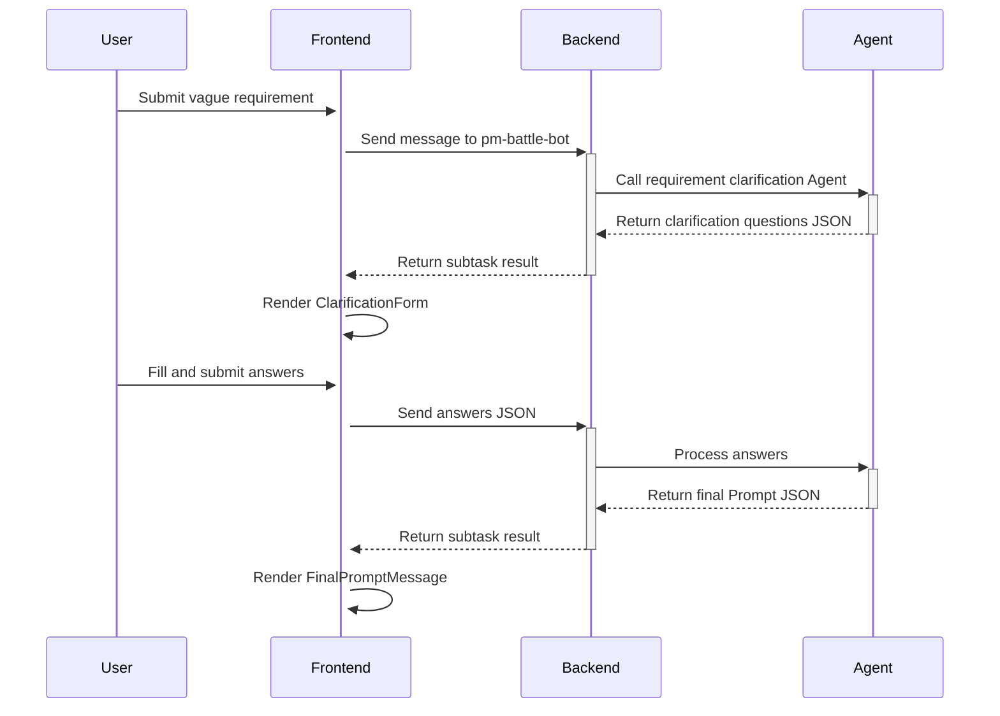

# PM Battle Mode User Guide

## Overview

"PM Battle" is Wegent's interactive requirement clarification mode that helps users refine vague requirements into clear development tasks through structured Q&A.

## Quick Start

### 1. Database Initialization

For new installations, running `backend/init.sql` automatically creates the following entities:

- **pm-battle-ghost**: Requirement clarification system prompt
- **pm-battle-bot**: Requirement clarification Bot
- **pm-battle-team**: Requirement clarification Team

### 2. Select Team in Frontend

1. Navigate to the Code page
2. Select **pm-battle-team** in the Team selector
3. Enter a vague requirement, e.g., "I want to add a user login feature"

### 3. Interaction Flow

#### Step 1: Submit Initial Requirement
```
User input: "I want to add a login feature"
```

#### Step 2: Answer Clarification Questions
The system will display 3-5 clarification questions, such as:
- Which login methods should be supported? (multiple choice)
- Do you need a "Remember Me" feature? (single choice)
- How should login failures be handled? (single choice)

Each question supports:
- **Preset Options**: Click radio/checkbox buttons
- **Custom Input**: Click "Custom Input" button to switch to text input mode

#### Step 3: Submit Answers
After filling in all questions, click the "Submit Answers" button.

#### Step 4: Get Final Prompt
The system generates a refined requirement description based on your answers. You can:
- **Copy Prompt**: Click the "Copy Prompt" button
- **Create New Task**: Click "Create New Task with This Prompt" to directly create a Code task

## Technical Architecture

### Frontend Components

```
MessagesArea.tsx
├── ClarificationForm.tsx        # Clarification form container
│   └── ClarificationQuestion.tsx # Individual question renderer
└── FinalPromptMessage.tsx       # Final prompt display
```

### Data Flow



### Data Structures

**Important Update**: Since 2025, the system has migrated from JSON format to Markdown format to improve readability and fault tolerance. Even if parsing fails, users can still see readable Markdown content.

#### Clarification Questions Format (Agent → Frontend)

Agent outputs clarification questions in Markdown format:

```markdown
## 🤔 需求澄清问题 (Clarification Questions)

### Q1: Which login methods should be supported?
**Type**: multiple_choice
**Options**:
- [✓] `email` - Email/Password (recommended)
- [ ] `oauth` - OAuth (Google, GitHub, etc.)
- [ ] `phone` - Phone number + SMS verification

### Q2: Do you need a "Remember Me" feature?
**Type**: single_choice
**Options**:
- [✓] `yes` - Yes (recommended)
- [ ] `no` - No

### Q3: Any other special requirements?
**Type**: text_input
```

**Question Types**:
- `single_choice`: Single choice (Radio)
- `multiple_choice`: Multiple choice (Checkbox)
- `text_input`: Text input (TextArea)

**Option Format**:
- `[✓]` indicates recommended/default option, will be auto-selected
- `[ ]` indicates regular option
- Backticks `` `value` `` wrap technical values
- ` - ` followed by human-readable label text

#### User Answer Format (Frontend → Agent)

Users submit answers in Markdown format:

```markdown
## 📝 我的回答 (My Answers)

### Q1: Which login methods should be supported?
**Answer**:
- `email` - Email/Password
- `oauth` - OAuth (Google, GitHub, etc.)

### Q2: Do you need a "Remember Me" feature?
**Answer**: `yes` - Yes

### Q3: Any other special requirements?
**Answer**: Login page needs to support dark mode
```

#### Final Prompt Format (Agent → Frontend)

Agent outputs the final requirement prompt in Markdown format:

```markdown
## ✅ 最终需求提示词 (Final Requirement Prompt)

Implement user login functionality with the following requirements:

**Authentication Methods**:
- Email/Password authentication (primary method)
- OAuth integration (support Google and GitHub)

**User Experience**:
- Include "Remember Me" checkbox to maintain login state
- Login page supports dark mode

**Security Requirements**:
- Use bcrypt or similar algorithm for password encryption
- Secure storage of OAuth tokens
- Implement rate limiting to prevent brute force attacks
```

#### Backward Compatibility

The frontend supports parsing both Markdown format and legacy JSON format, ensuring backward compatibility. If the Agent still outputs JSON, the system will automatically recognize and handle it correctly.

## Customizing Bots

### Modifying system_prompt

To adjust the style or logic of clarification questions, modify the `systemPrompt` of `pm-battle-ghost`:

1. Find "pm-battle-ghost" in the settings page
2. Edit the system_prompt
3. Save changes

### Creating New Requirement Clarification Bots

1. Create a new Ghost, referencing the system_prompt structure of `pm-battle-ghost`
2. Create a new Bot, referencing the new Ghost
3. Create a new Team, referencing the new Bot
4. Select the new Team in the frontend

## Best Practices

### Agent Side (Writing system_prompt)

1. **Question Design**:
   - 3-5 questions per round, avoid too many
   - Use `[✓]` to mark recommended options and guide users
   - Prioritize multiple choice questions to reduce user input cost

2. **Output Specification**:
   - Strictly output Markdown using specified heading formats
   - Use `## 🤔 需求澄清问题` heading for questions
   - Use `## ✅ 最终需求提示词` heading for final prompt
   - Don't add extra explanatory text outside Markdown structure
   - Use simple identifiers for `question_id` (e.g., q1, q2)

3. **Follow-up Strategy**:
   - Determine if further clarification is needed based on answers
   - Don't ask infinitely, generate final Prompt after 3-5 rounds
   - Final Prompt should be detailed and actionable

### Frontend Usage

1. **Choose Appropriate Team**:
   - Requirement clarification phase: Select `pm-battle-team`
   - Code generation phase: Switch to `dev-team`

2. **Answering Tips**:
   - Prioritize recommended options unless you have special needs
   - Use "Custom Input" to supplement details
   - Ensure all questions are answered before submitting

3. **Using Final Prompt**:
   - Copy Prompt for use in other tools
   - Create new task directly for seamless transition to development workflow

## Troubleshooting

### Issue 1: Clarification Questions Not Displaying

**Possible Causes**:
- Agent didn't output properly formatted Markdown
- Markdown heading is not `## 🤔 需求澄清问题` or `## 🤔 Clarification Questions`

**Solutions**:
- Check Agent's system_prompt to ensure correct Markdown headings are used
- Check browser console for parsing errors
- Even if parsing fails, Markdown content should still be readable

### Issue 2: No Response After Submitting Answers

**Possible Causes**:
- Network issues
- Agent error while processing answers

**Solutions**:
- Refresh page and try again
- Check backend logs

### Issue 3: Final Prompt Has No Special Styling

**Possible Causes**:
- Agent's Markdown heading is not `## ✅ 最终需求提示词` or `## ✅ Final Requirement Prompt`

**Solutions**:
- Confirm Agent system_prompt has correct final output format
- Check if emoji icons are correct (🤔 and ✅)

## Future Enhancements

- [ ] Support dependencies between questions (e.g., show q2 based on q1 answer)
- [ ] Support more question types (date picker, number input, file upload, etc.)
- [ ] Add clarification history for viewing and reusing previous results
- [ ] Support exporting clarification process as documentation

## References

- [Wegent Architecture](../../concepts/architecture.md)
- [Core Concepts](../../concepts/core-concepts.md)
- [YAML Specification](../../reference/yaml-specification.md)