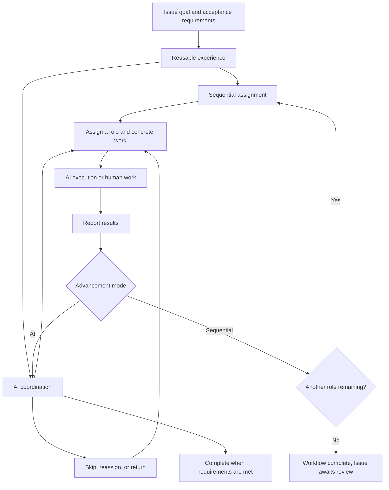
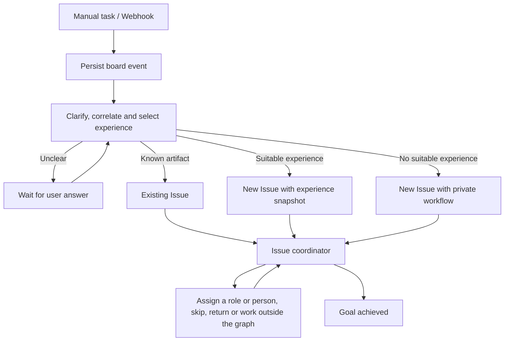

# Board automation: experience and work assignment

An automation captures experience in getting work done. AI acts as a lead: it assigns an Issue to the appropriate role, starts the work, skips unnecessary roles or returns work for revision, and finishes when the Issue's requirements are met.

## Domain model

- The board is an Issue tracking system. An Issue holds a problem, goal, and acceptance requirements; it is distinct from a runtime execution task.
- An automation defines roles, their responsibilities, execution configuration, and a recommended collaboration order.
- A node represents a working role, such as product, design, development, or release. It is more than a stage label and does not require a Bot resource. A role may execute through AI or a project member.
- Assignment includes a concrete instruction and starts work; moving the highlighted node alone is not assignment.
- The AI coordinator uses the graph as experience. The Issue's requirements determine completion.

## Advancement modes

**Workflow advancement** assigns work in a strict sequence, starting the next role after the current role completes.

**AI advancement** selects roles freely, skips unnecessary work, returns work for revision, or hands the Issue to a person. The reference graph is optional; work may also happen outside it.

## Configure advancement on the canvas

The top-right canvas toolbar places Sequential / AI coordination beside save status. Advancement belongs to the entire automation and remains accessible when node details are closed.

Selecting AI coordination opens the first node with coordinator instructions before execution settings. Sequential mode shows trigger settings without a coordinator prompt. Roles may use AI or project members in either mode. Switching modes within the same draft preserves coordinator settings.

## State and history

An Issue records a stable intent and optional initial role separately from its current primary role, assignment, and owner. Individual execution tasks retain their own role association. Work outside the graph clears the current role instead of displaying a stale one.

Human handoff transfers the same Issue and waits for a submitted result before advancement resumes: sequential mode starts the next role, while AI mode returns control to the coordinator. Skipping is not completion. Returning preserves previous results. Assignment history records reasons, instructions, roles, and results; stale execution events cannot overwrite a newer assignment.

A software Issue may use product, design, development, and release roles, or only design, development, and release. A release defect can return to development without replacing the Issue or editing the reference graph.

## Conversations and storage

Keep the same work in its original comment thread: requirements, answers, revisions, and results belong in that discussion, including revisions after a task ends. Start a new activity and runtime task only for a new independently deliverable goal. New tasks remain available after Issue completion without reopening its automation.

When AI asks a person a question, cards and notifications locate that thread's reply composer. Reply only posts a comment; the assignee explicitly chooses Reply and continue to submit the assignment result and return control to AI. A posted reply can be submitted without typing it again. Later AI questions stay in the same thread and the coordinator continues its original task: a custom Runtime reuses the original task ID, while Wegent reuses the original Task and opens another Subtask turn inside it. If that coordinator task no longer exists, continuation fails explicitly instead of silently creating a task. Replies to ordinary activities with a runtime task continue their existing task conversation.

Reuse existing Issue, automation, execution, and activity storage. Store advancement and assignment state in existing metadata; do not add business tables. Migrate old definitions explicitly rather than guessing a serial order or inventing historical intent.

## Adopting historical workflows

Upgrades pause historical Issue automation and disable old rules while retaining their definitions, child Issues, and activity. Historical child results no longer advance the parent Issue.

Save an explicit sequential or AI advancement mode and role configuration in Automations. Parallel workflows require an explicit serial order or AI advancement; nested legacy AI nodes must be reconfigured. Then select the reviewed experience on the original Issue, confirm its current goal, and continue. The first assigned graph role becomes the stable initial role.

Each assignment has an identity and expected version. The Issue lock, assignment, and audit are persisted before dispatch. Duplicate requests do not start duplicate work; stale results cannot overwrite a later assignment. Results remain durable while paused, and recovery scanning can resume the coordinator after interrupted dispatch.

## Event center and Issue-specific workflows

The board event center accepts manual tasks and webhooks. Its router first correlates external artifacts with existing Issues, asks for clarification when needed, and selects an existing experience for clear new work. When no experience fits, it generates a workflow **only for the current Issue**. Generated workflows are never published to the automation catalog or reused by other Issues. The Issue retains its goal, role graph, assignments and results for continued work.

The router uses the configured Runtime and a standalone workspace. Private workflows inherit the configured Runtime and workspace; existing Issues retain their execution configuration. Board storage, source workspace, execution device and conversation lifecycle remain separate.

After creating an external artifact, execution agents register its provider and canonical URL or stable identifier with `register_external_reference`. Delivery IDs deduplicate events; artifact identities correlate Issues. Later feedback returns to the originating Issue, including completed Issues. Events arriving during active work retain their context and invalidate stale coordinator decisions.

Unconfigured events remain visible as waiting for configuration. Dispatch failures retain input and error details. Retrying a failed handoff continues the same Issue. Reporters can read events; Developers can submit and reply; Maintainers configure the router. Existing polymorphic `loop_items` records hold this state; no new business tables are added.
