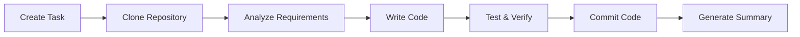

# Managing Code Tasks

This guide explains how to create, execute, and manage code-type tasks in Wegent.

---

## Table of Contents

- [What is a Code Task](#what-is-a-code-task)
- [Creating a Code Task](#creating-a-code-task)
- [Task Execution Flow](#task-execution-flow)
- [Task Status Management](#task-status-management)
- [Advanced Features](#advanced-features)
- [Common Issues](#common-issues)

---

## What is a Code Task

A code task is a task type in Wegent specifically designed for software development. Unlike regular chat tasks, code tasks connect to Git repositories, allowing AI agents to make code changes directly in the repository.

**Core Concept**:
```
Code Task = User Prompt + Code Agent + Git Repository + Branch
```

### Code Tasks vs Chat Tasks

| Feature | Code Task | Chat Task |
|---------|-----------|-----------|
| **Git Repository** | Required | Optional |
| **Code Execution** | Runs in Docker container | No code execution |
| **Workbench** | Shows file changes, commit history | Not displayed |
| **Branch Management** | Auto-creates feature branches | None |
| **Use Cases** | Development, refactoring, bug fixes | Q&A, analysis, documentation |

---

## Creating a Code Task

### Step 1: Navigate to Code Page

1. Click **"Code"** in the left navigation bar
2. The system displays the code task list and input area

### Step 2: Select a Code Agent

Above the input area, click the agent selector:

1. **Click the agent dropdown** - Shows available agents
2. **Select a code-type agent** - Choose an agent configured with ClaudeCode or Agno Shell

> ⚠️ Only agents configured with a code-type Shell can execute code tasks

### Step 3: Select Code Repository

1. **Click the repository selector** - Shows repositories you have access to
2. **Select target repository** - Choose the repository for code changes
3. **Select branch** - Choose the base branch (AI will create a new branch from this)

### Step 4: Configure Task Options (Optional)

#### Model Selection

Click the model selector to override the agent's default model:

- **Select model**: Choose from the dropdown list
- **Force override**: When enabled, uses your selected model even if the agent has a configured model

#### Knowledge Base Context

Click the context button to add knowledge bases:

1. **Click the "#" button** - Opens the context selector
2. **Select knowledge bases** - Check the ones to add
3. **Confirm selection** - Knowledge bases appear as tags

#### Skill Selection

If the agent supports skills:

1. **Click the skill button** - Opens skill selector
2. **Select skills** - Check the needed skills
3. **Or use "/" command** - Type `/` in the input box to trigger skill selection

### Step 5: Enter Task Description and Send

1. **Type your task description in the input box** - Clearly describe your requirements
2. **Press Enter to send** - Or click the send button
3. **Wait for response** - Agent starts processing and streams results

---

## Task Execution Flow

### Execution Stages



### 1. Task Initialization

- System creates task record
- Allocates execution container
- Clones target repository into container

### 2. Code Analysis

- AI analyzes repository structure
- Understands existing code patterns
- Plans implementation approach

### 3. Code Implementation

- AI uses tools to read, edit, create files
- Executes necessary commands (e.g., install dependencies, run tests)
- Shows progress in real-time in the Workbench

### 4. Code Commit

- AI creates feature branch
- Commits code changes
- Generates commit messages

### 5. Task Completion

- Generates task summary
- Shows file change statistics
- Provides option to create PR

---

## Task Status Management

### Task States

| Status | Description | Actions |
|--------|-------------|---------|
| **PENDING** | Waiting to execute | Can cancel |
| **RUNNING** | Currently executing | Can stop |
| **COMPLETED** | Execution finished | Can view results, create PR |
| **FAILED** | Execution failed | Can retry |
| **CANCELLED** | Was cancelled | Can recreate |

### Stopping a Task

If you need to stop a running task:

1. **Click the stop button** - In the input area or task details
2. **Confirm stop** - Task will be marked as cancelled
3. **View partial results** - Completed code changes are preserved

### Retrying a Task

If a task fails:

1. **View error message** - Understand the failure reason
2. **Click retry button** - Re-execute the task
3. **Or modify and retry** - Adjust task description and resend

---

## Advanced Features

### Continue Conversation

After task completion, you can continue chatting with the agent:

1. **Send new message in the same task** - Agent continues working with previous context
2. **Request modifications** - e.g., "Please rename the function to createUser"
3. **Request additions** - e.g., "Please add unit tests"

### View Execution Details

View detailed execution information in the Workbench:

- **Execution Timeline**: See tools used by AI and execution order
- **Commit History**: View all code commits
- **File Changes**: See specific modifications for each file

### Create Pull Request

After task completion, you can directly create a PR:

1. **Click "Create PR" button** - In the Workbench or task menu
2. **Fill in PR information** - Title, description, etc.
3. **Submit PR** - System creates PR in GitHub/GitLab

### Export Task

Export task conversation history and code changes:

1. **Click export button** - In the task menu
2. **Choose format** - Markdown or JSON
3. **Download file** - Save to local

---

## Common Issues

### Q1: Task stuck in PENDING status?

**Possible causes**:
1. No available execution containers
2. Repository access permission issues
3. Git token expired

**Solutions**:
- Check if system resources are sufficient
- Verify Git token is valid
- Check repository access permissions

### Q2: Code commit failed?

**Possible causes**:
1. Branch protection rules
2. Insufficient permissions
3. Network issues

**Solutions**:
- Check target branch protection rules
- Confirm Git token has write permissions
- Retry the task

### Q3: AI modified the wrong files?

**Solutions**:
1. Explicitly specify file paths to modify in the task
2. Provide more detailed context information
3. Use knowledge base to provide project structure documentation

### Q4: How to make AI follow project coding standards?

**Solutions**:
1. Add `.cursorrules` or `.windsurfrules` file in repository root
2. Explicitly state coding standards in task description
3. Use knowledge base to provide coding standards documentation

### Q5: Task execution taking too long?

**Possible causes**:
1. Task scope too large
2. Need to install many dependencies
3. Network latency

**Solutions**:
- Split large tasks into smaller ones
- Use pre-configured base images
- Check network connection

---

## Related Resources

- [Overview](./README.md) - AI Coding feature overview
- [Spec Clarification](./spec-clarification-guide.md) - Requirement clarification feature
- [Agent Settings](../settings/agent-settings.md) - Configure code agents

---

<p align="center">Efficiently manage your code tasks and let AI be your programming assistant! 🚀</p>
