# Knowledge Base Guide

Knowledge Base enables you to store, organize, and retrieve documents for RAG (Retrieval-Augmented Generation), allowing AI agents to answer questions based on your specific documents rather than relying solely on general knowledge.

---

## 📋 Table of Contents

- [Overview](#-overview)
- [Architecture](#-architecture)
- [Creating Knowledge Bases](#-creating-knowledge-bases)
- [Document Management](#-document-management)
- [Smart Chunking](#-smart-chunking)
- [Integration with Agents](#-integration-with-agents)
- [Citations and References](#-citations-and-references)
- [Summary Features](#-summary-features)
- [Usage Limits](#-usage-limits)
- [Troubleshooting](#-troubleshooting)
- [Related Resources](#-related-resources)

---

## 🎯 Overview

### What is Knowledge Base?

Knowledge Base is a document storage and retrieval system that enables RAG (Retrieval-Augmented Generation). It allows AI agents to search through your documents and provide answers grounded in your specific content.

### Core Benefits

| Benefit | Description |
|---------|-------------|
| **Grounded Responses** | AI answers based on your documents, not just general knowledge |
| **Source Citations** | Every answer includes references to source documents |
| **Smart Chunking** | Automatic document splitting optimized for retrieval |
| **Flexible Retrieval** | Vector, keyword, or hybrid search modes |

### Knowledge Base Types

| Type | Description | Document Limit | Best For |
|------|-------------|----------------|----------|
| **Notebook** | Three-column layout with chat + document management | 50 documents | Interactive research, Q&A sessions |
| **Classic** | Document list view only | Unlimited | Large document collections, archives |

---

## 🏗 Architecture

### RAG Flow

The following diagram shows how RAG (Retrieval-Augmented Generation) works:


### Document Processing Pipeline


### Key Components

| Component | Purpose |
|-----------|---------|
| **Knowledge Base** | Container for documents with retrieval configuration |
| **Documents** | Individual files or content items |
| **Chunks** | Document segments optimized for retrieval |
| **Retriever** | Backend service (Elasticsearch/Qdrant) for search |
| **Embedding Model** | Converts text to vectors for similarity search |

---

## 🆕 Creating Knowledge Bases

### Step 1: Navigate to Knowledge Base

1. Log in to Wegent
2. Navigate to **Knowledge Base** section in the sidebar
3. Click **Create Knowledge Base**

### Step 2: Configure Basic Settings

| Field | Description | Example |
|-------|-------------|---------|
| **Name** | Display name (1-100 chars) | "Product Documentation" |
| **Description** | Optional description (max 500 chars) | "Internal product docs and guides" |
| **Type** | Notebook or Classic | Notebook |

### Step 3: Configure Retrieval Settings

#### Retriever Selection

Select a configured Retriever (backend search service):

| Retriever Type | Description |
|----------------|-------------|
| **Elasticsearch** | Full-text search with vector support |
| **Qdrant** | Dedicated vector database |

#### Embedding Model

Select an embedding model for vector conversion:

| Model | Dimensions | Best For |
|-------|------------|----------|
| `text-embedding-3-small` | 1536 | General purpose, cost-effective |
| `text-embedding-3-large` | 3072 | Higher accuracy |

#### Retrieval Mode

| Mode | Description | When to Use |
|------|-------------|-------------|
| **Vector** | Semantic similarity search | Natural language queries |
| **Keyword** | Traditional BM25 text search | Exact term matching |
| **Hybrid** | Combined vector + keyword | Best of both worlds |

#### Retrieval Parameters

| Parameter | Range | Default | Description |
|-----------|-------|---------|-------------|
| **top_k** | 1-10 | 5 | Number of results to return |
| **score_threshold** | 0.0-1.0 | 0.7 | Minimum relevance score |
| **vector_weight** | 0.0-1.0 | 0.7 | Weight for vector search (hybrid only) |
| **keyword_weight** | 0.0-1.0 | 0.3 | Weight for keyword search (hybrid only) |

### Example Configuration

```yaml
apiVersion: agent.wecode.io/v1
kind: KnowledgeBase
metadata:
  name: product-docs
  namespace: default
spec:
  name: Product Documentation
  description: Internal product documentation and user guides
  kbType: notebook
  retrievalConfig:
    retriever_name: elasticsearch-retriever
    retriever_namespace: default
    embedding_config:
      model_name: text-embedding-model
      namespace: default
    retrieval_mode: hybrid
    top_k: 5
    score_threshold: 0.7
    hybrid_weights:
      vector_weight: 0.7
      keyword_weight: 0.3
  summaryEnabled: true
  summaryModelRef:
    name: gpt-4-model
    namespace: default
  maxCallsPerConversation: 10
```

---

## 📄 Document Management

### Supported Document Sources

```mermaid
flowchart TB
    subgraph "Document Sources"
        FILE[📁 File Upload]
        TEXT[📝 Text Paste]
        TABLE[📊 External Table]
        WEB[🌐 Web Scraping]
    end

    subgraph "Supported Formats"
        TXT[.txt]
        MD[.md]
        PDF[.pdf]
        DOC[.doc/.docx]
    end

    FILE --> TXT
    FILE --> MD
    FILE --> PDF
    FILE --> DOC

    style FILE fill:#14B8A6,color:#fff
    style TEXT fill:#14B8A6,color:#fff
```



### Adding Documents

#### File Upload

1. Click **Add Document** → **Upload File**
2. Select file(s) from your computer
3. Configure chunking settings (optional)
4. Click **Upload**

Supported formats:
- `.txt` - Plain text files
- `.md` - Markdown files
- `.pdf` - PDF documents
- `.doc`, `.docx` - Word documents

#### Text Paste

1. Click **Add Document** → **Paste Text**
2. Enter document title
3. Paste or type content
4. Click **Save**

#### External Table

1. Click **Add Document** → **External Table**
2. Enter table URL (DingTalk/Feishu)
3. Configure sync settings
4. Click **Import**

#### Web Scraping

1. Click **Add Document** → **Web URL**
2. Enter the webpage URL
3. System scrapes and processes content
4. Click **Import**

### Document Status

| Status | Description |
|--------|-------------|
| **Enabled** | Document is indexed and searchable |
| **Disabled** | Document exists but excluded from search |
| **Processing** | Document is being indexed |
| **Error** | Indexing failed |

### Managing Documents

| Action | Description |
|--------|-------------|
| **Enable/Disable** | Toggle document inclusion in search |
| **Re-index** | Reprocess document with new settings |
| **Delete** | Remove document permanently |
| **View Chunks** | Inspect how document was split |

---

## 🔪 Smart Chunking

### What is Smart Chunking?

Smart Chunking automatically splits documents into optimal segments for retrieval. Different file types use different strategies to preserve context and meaning.

### Chunking Strategies


| File Type | Strategy | Description |
|-----------|----------|-------------|
| `.md` | Markdown + Sentence | Split by headers first, then by sentences |
| `.txt` | Sentence-based | Split by sentence boundaries |
| `.pdf`, `.doc`, `.docx` | Recursive Character | Hierarchical character-based splitting |

### Chunking Parameters

| Parameter | Range | Default | Description |
|-----------|-------|---------|-------------|
| **chunk_size** | 128-8192 | 1024 | Maximum characters per chunk |
| **chunk_overlap** | 0-2048 | 50 | Overlapping characters between chunks |

### Choosing Chunk Size

| Content Type | Recommended Size | Reason |
|--------------|------------------|--------|
| Technical docs | 512-1024 | Precise retrieval |
| Long articles | 1024-2048 | Preserve context |
| Q&A content | 256-512 | Focused answers |
| Legal/contracts | 512-1024 | Precise clauses |

### Viewing Chunks

1. Open a document in Knowledge Base
2. Click **View Chunks** tab
3. Browse chunks with:
   - Index number
   - Content preview
   - Token count
   - Position in original document

---

## 🤖 Integration with Agents

### Selecting Knowledge Base in Chat

When chatting with an agent:

1. Click the **context selector** near the chat input
2. Select **Knowledge Base** from options
3. Choose your desired Knowledge Base
4. Send your question

The agent will search the Knowledge Base and provide grounded answers.

### Knowledge Base Prompt Modes

#### Strict Mode

When you explicitly select a Knowledge Base:

- AI **MUST** answer only from Knowledge Base content
- Cannot use general knowledge
- Will indicate if information is not found

```
User: What is our refund policy?
AI: According to your documentation [1], the refund policy states...
```

#### Relaxed Mode

When Knowledge Base is inherited from task context:

- AI uses Knowledge Base as **optional resource**
- Can fall back to general knowledge if KB is empty
- Clearly indicates knowledge source

```
User: What is our refund policy?
AI: I found relevant information in your knowledge base [1].
    Additionally, based on general best practices...
```

### Configuring Agent Integration

In your Ghost or Bot configuration, reference knowledge bases:

```yaml
# Ghost with knowledge base tool
apiVersion: agent.wecode.io/v1
kind: Ghost
metadata:
  name: support-agent-ghost
spec:
  systemPrompt: |
    You are a customer support agent.
    Always search the knowledge base before answering questions.
    Cite your sources using [1], [2] format.
```

---

## 📑 Citations and References

### Citation Format

AI responses include numbered citations linking to source documents:

```
Based on your product documentation [1], the feature works by...
Additionally, the troubleshooting guide [2] suggests...

Sources:
[1] product-overview.pdf (Section 3)
[2] troubleshooting-guide.md (Chunk 15)
```

### Citation Information

Each citation includes:

| Field | Description |
|-------|-------------|
| **Index** | Citation number [1], [2], etc. |
| **Document Name** | Source document filename |
| **Chunk Index** | Position in document |

### Viewing Source Content

1. Click on a citation number in the response
2. View the original chunk content
3. See surrounding context
4. Navigate to full document if needed

### Citation Flow

```mermaid
flowchart LR
    Q[User Question] --> S[Search KB]
    S --> R[Retrieve Chunks]
    R --> C[Assign Citation Index]
    C --> G[Generate Response]
    G --> A[Answer with [1], [2]...]

    style S fill:#14B8A6,color:#fff
    style C fill:#14B8A6,color:#fff
```

---

## 📝 Summary Features

### Document Summaries

When enabled, the system automatically generates summaries for each document:

1. Document is uploaded and indexed
2. Summary model processes content
3. Summary stored with document metadata
4. Available for quick reference

### Knowledge Base Summary

Aggregate summary of entire Knowledge Base:

1. Navigate to Knowledge Base settings
2. Click **Generate Summary**
3. View combined summary of all documents

### Configuring Summary

```yaml
spec:
  summaryEnabled: true
  summaryModelRef:
    name: gpt-4-model
    namespace: default
```

| Setting | Description |
|---------|-------------|
| **summaryEnabled** | Enable/disable auto-summary |
| **summaryModelRef** | Model to use for summarization |

---

## 📊 Usage Limits

### Call Limiting

To prevent excessive API usage, Knowledge Base implements call limits:

| Parameter | Range | Default | Description |
|-----------|-------|---------|-------------|
| **maxCallsPerConversation** | 2-50 | 10 | Max KB searches per conversation |
| **exemptCallsBeforeCheck** | 0-49 | 2 | Free calls before limit applies |

### How Limiting Works


### Token Tracking

- System estimates ~4 characters per token (ASCII)
- ~1-2 characters per token (CJK characters)
- **Warning threshold**: 70% of limit
- **Reject threshold**: 90% of limit

---

## ❓ Troubleshooting

### Upload Issues

#### File upload fails

**Possible causes:**
1. File exceeds size limit
2. Unsupported file format
3. File is corrupted

**Solutions:**
1. Check file size limits (typically 50MB)
2. Convert to supported format
3. Try re-exporting the document

#### Document stuck in "Processing"

**Possible causes:**
1. Embedding service unavailable
2. Large document taking time
3. Backend processing error

**Solutions:**
1. Check retriever service status
2. Wait for large documents (may take several minutes)
3. Try re-uploading the document

### Retrieval Issues

#### No results returned

**Possible causes:**
1. Query doesn't match document content
2. Score threshold too high
3. Document not enabled

**Solutions:**
1. Try different query phrasing
2. Lower score_threshold (e.g., 0.5)
3. Verify document status is "Enabled"

#### Irrelevant results

**Possible causes:**
1. Chunk size too large
2. Wrong retrieval mode
3. Score threshold too low

**Solutions:**
1. Reduce chunk_size for more precise retrieval
2. Try hybrid mode instead of vector-only
3. Increase score_threshold

### Citation Issues

#### Citations don't match content

**Possible causes:**
1. Document was updated but not re-indexed
2. Chunking changed after indexing

**Solutions:**
1. Re-index the document
2. Clear cache and try again

---

## 💡 Best Practices

### Document Organization

| Practice | Description |
|----------|-------------|
| **Meaningful names** | Use descriptive document names |
| **Consistent format** | Standardize document formatting |
| **Regular updates** | Re-index when documents change |
| **Clean content** | Remove irrelevant headers/footers |

### Chunking Optimization

| Content Type | Chunk Size | Overlap |
|--------------|------------|---------|
| FAQs | 256-512 | 50 |
| Technical docs | 512-1024 | 100 |
| Long articles | 1024-2048 | 200 |
| Code documentation | 512-768 | 50 |

### Retrieval Tuning

| Scenario | Mode | top_k | threshold |
|----------|------|-------|-----------|
| Precise answers | Vector | 3-5 | 0.8 |
| Broad search | Hybrid | 8-10 | 0.6 |
| Exact matching | Keyword | 5 | 0.7 |

---

## 🔗 Related Resources

### Documentation
- [Core Concepts](../../concepts/core-concepts.md) - Understand Wegent's architecture
- [Configuring Retrievers](./configuring-retrievers.md) - Set up vector databases
- [Agent Settings](./agent-settings.md) - Configure agents with KB access

### Technical References
- [YAML Specification](../../reference/yaml-specification.md) - CRD definitions

---

## 💬 Get Help

Need assistance?

- 📖 Check [FAQ](../../faq.md)
- 🐛 Submit [GitHub Issue](https://github.com/wecode-ai/wegent/issues)
- 💬 Join community discussions

---

<p align="center">Empower your AI agents with your own knowledge! 📚</p>
