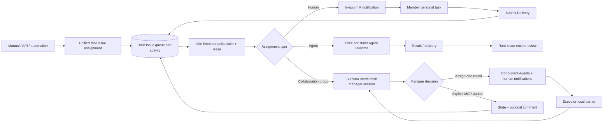
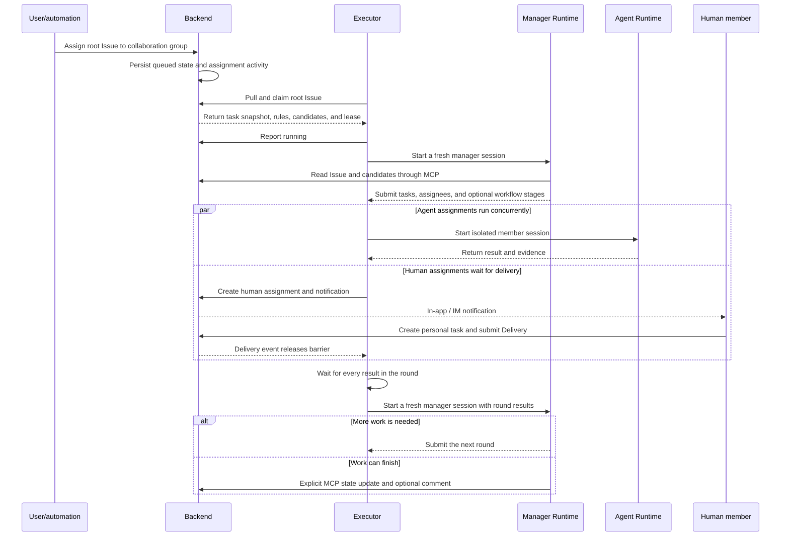
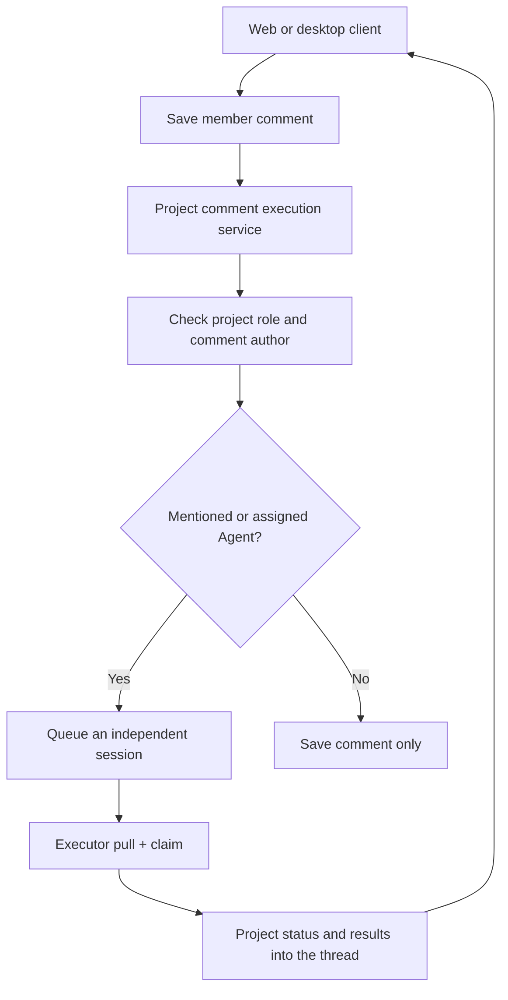
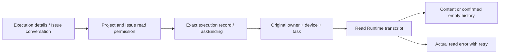

# Cloud project collaboration architecture

> The current V4 UI source of truth is `/Users/hongyu9/Downloads/wework-delivery-v4-TODO.pen`. Implement the interaction from that design instead of deriving page layout from this document.

## Goal

A cloud project is the shared collaboration and storage boundary for a team. Members may select the same cloud project as the default destination of their own local projects, execute work in Wework, and submit selected conversations, files, and Markdown as immutable delivery snapshots.

A cloud project is not the existing `Project` model:

- `Project` is a user-owned local execution workspace containing device, path, Git, and runtime configuration.
- `CloudProject` is a shared aggregate containing membership, TODOs, shared files, and a MinIO namespace.
- Local projects owned by different members may independently select the same cloud project; the cloud project stores no reverse link.
- One TODO may link to many Wework Tasks, while one Task may process at most one active TODO at a time.

## Client reuse boundary

### Execution configuration and waiting states

Project settings keep collaboration organization separate from runtime resources:

- **Collaboration members** presents project participants in the order **Agents → Project members → Collaboration groups**. A collaboration group is a reusable organization whose members and leader may be humans or Agents. Workflow stages belong to the collaboration group.
- **Automatic processing** defines trigger rules only. Issue creation, Tag changes, external events, or schedules route work to a project member, Agent, or collaboration group. A rule never binds a device.
- **Execution environments** manages the project's authorized device pool. Agent creation does not select a device. An idle Executor pulls Runs that match its project, Agent, and collaboration-group permissions.

A Mention never changes the assignee; explicitly mentioning an available agent can trigger comment execution. Assignment, Mention, Subscription, and Run have independent semantics. Explicit assignment changes ownership and creates a Run when the target is an Agent or collaboration group.

Model identity and provider options remain opaque dictionaries and are not subject to API field case conversion. Device presence comes from connection heartbeats. If model or workspace configuration is missing, the execution remains in `waiting_runtime` and uses the unified runtime-configuration entrypoint; a device is bound only after an Executor successfully claims the Run.

Successful planning and assignment by the manager does not mean the Issue is complete. Parent steps and child details display the child's execution state. Missing model or workspace configuration keeps an execution in `waiting_runtime`; **Configure and continue** completes that existing execution's profile. If no authorized Executor can claim it, the Run remains queued. Backend does not push work according to capacity and does not pre-bind a device to an Agent. Completing runtime configuration does not change project or Agent defaults and preserves manual approval requirements. Workflow progress counts steps only after acceptance.

Wegent Web replaces the former **Inbox** entry with **Collaboration** and directly reuses the Backend APIs for cloud projects, board Issues, comments, attachments, shared files, members, and execution records. Web and Wework do not maintain a second domain model or API surface.

Cross-client types, API clients, copy, test contracts, and host-independent React components live in `packages/collaboration`. `CollaborationApp` is the sole primary interface for cloud projects in both Web and Wework. It owns the project home, board, Issue details, comments, attachments, files, members, runs, and project settings; the clients must not maintain parallel cloud-collaboration pages.

Web supplies Next.js routing, notifications, and external-link behavior through a host adapter. Wework uses the same adapter to inject local project storage and a **Desktop tools** entry. Only local projects, terminals, device execution, AI orchestration, and other behavior that depends on Electron, the local filesystem, or the local executor may enter the desktop-specific workspace. New portable behavior must land in the shared package first instead of being copied into both hosts and synchronized later.

The shared package owns business state, field structure, and interaction contracts, but it must not duplicate a host's existing design system. Dialogs, tabs, selects, inputs, and primary actions should be injected through an explicit host adapter; the shared package keeps only a neutral default for host-independent use. Hosts pass brand colors through semantic CSS variables instead of hard-coding Web or Wework colors in shared components. The shared board sizing chain must preserve `min-width: 0`, `min-height: 0`, and vertical flex constraints so horizontal overflow remains inside the board scroll container instead of placing a page-level scrollbar above the remaining content.

The **Collaboration members** settings page uses a wide content container because Agents, project members, and collaboration-group forms need multi-column space; ordinary settings pages retain the default narrow container. Member and responsibility columns in collaboration-group details must use shrinkable `minmax(0, ...)` tracks, with `min-width: 0` and truncation on text nodes. Fixed minimum track widths must not push form controls outside the panel, and heading actions remain on one line.

When chat messages enter a collaboration space, the Backend creates immutable message snapshots from a source Task the current user is authorized to access. The target may be a new Issue or a comment on an existing Issue. Clients must not write chat text directly as if it were a trusted snapshot.

## Domain relationships

```text
CloudProject
├── ResourceMember(resource_type=CloudProject)
├── ShareLink(resource_type=CloudProject)
└── LoopItem
    ├── LoopItemTaskBinding
    │   └── TaskResource
    │       └── Project (local execution workspace)
    └── Delivery
        └── DeliveryAsset
```

## Data ownership

| Data                                                                                    | Source of truth                  |
| --------------------------------------------------------------------------------------- | -------------------------------- |
| Cloud projects, members, TODOs, task links, delivery metadata                           | Backend MySQL                    |
| Local paths, devices, Git, execution configuration, and default project-space reference | Device-local Codex project state |
| Shared files, Markdown, conversations, and delivery snapshots                           | MinIO/S3                         |
| AI access to cloud data                                                                 | MCP authorized by the Backend    |

Objects are isolated by the cloud project's public ID:

```text
projects/{cloud-project-public-id}/
  shared/
  loop-items/{loop-item-id}/
    deliveries/{delivery-id}/
      markdown.md
      chat.json
      manifest.json
      files/
```

Finalized delivery prefixes are immutable. Later tasks may only read or copy them.

## Data model

### CloudProject

`cloud_projects` stores the shared project and never stores local runtime configuration.

```text
id, public_id, project_key, name, description
created_by_user_id, storage_prefix, next_item_number
status, version, created_at, updated_at
```

### Local-project default space

A local Codex project may store one `{ projectStore, projectId }` default project-space reference. The reference belongs to device-local project state, never enters the Backend, and creates no reverse index on the project space. A new conversation may override or clear the default before its first message is sent.

### LoopItem

The existing `loop_items` table stores cloud TODOs. `cloud_project_id` references `cloud_projects`, and `sequence_number` produces display identifiers such as `WEG-18`.

The initial fixed workflow is:

```text
inbox → pending → in_progress → in_review → completed
```

Completed TODOs may be reopened into `in_progress`. Updates carry a `version` value and use optimistic locking.

### Issue dispatch and Executor ownership

A board Issue can be assigned to a project member, an Agent, or a collaboration group. Manual UI, API, automation, and AI-manager entry points create the same root-Issue dispatch intent. They do not start a Runtime or manage device capacity.

Backend owns only durable root-Issue state and presentation: assignee, queue, claim, lease, status, activity, comments, attachments, and deliveries. It validates project, Agent, collaboration-group, and device permissions, exposes task-scoped board MCP tools, and accepts explicit status, comment, and delivery updates from an Executor or human. Backend does not choose an idle device, push work to devices, track Executor capacity, or run a collaboration group's manager loop, member fan-out, concurrent batch, or barrier.

Local and cloud Executors use the same claim protocol and board data model. When an Executor has a free execution slot, it pulls a root Issue that the current device is authorized to run, claims it atomically, starts the Runtime, and renews the lease. Multiple authorized devices compete for different Runs; one Run has exactly one owner while its lease is valid. Another Executor may recover an expired lease, and an Executor that lost its lease can no longer write results.

#### Three assignment loops

For a human assignment, Backend sends an in-app notification and notifications to connected IM channels. The member creates a personal task from the notification and submits a Delivery, which updates the root Issue. When the human task belongs to a collaboration-group round, the Delivery also releases that round's barrier and wakes the manager.

For a direct Agent assignment, an Executor claims the root Issue and starts a Runtime session for the assigned Agent. Results are persisted as activity and delivery evidence; success moves the root Issue to `in_review` for user confirmation. Backend never creates or owns the internal Runtime session.

For a collaboration-group assignment, the Executor still claims only one root Issue. All later coordination stays inside that Executor:

1. The Executor starts a fresh manager session. Project collaboration rules and the optional workflow are visible in that turn, and the manager reads the Issue and eligible members through board MCP tools.
2. The manager can update the root Issue state with an optional comment through MCP, or submit one round of assignments. Every assignment contains a task title, an assignee, and a workflow stage when the project defines a workflow.
3. The Executor starts isolated Runtime sessions for all Agent assignments in the round and runs them concurrently. Human assignments send notifications and wait for Delivery.
4. The Executor owns the round barrier locally. Only after every Agent result and human Delivery arrives does it start a fresh manager session with the complete round results.
5. The manager either submits another round or explicitly updates the root Issue to `in_review`, `completed`, or another target state through MCP, optionally with a comment. Member completion never advances the root Issue by itself.

Every manager turn is a fresh Runtime session, and member sessions are isolated. A later round receives only structured assignments, results, and deliveries. It never reuses a member conversation, and Backend never guesses the manager's next action.



#### Collaboration-group execution sequence



Implementation and review must preserve these invariants:

1. Backend owns only the root Issue queue, claim, lease, status, and presentation projections. There is no Backend manager loop, member fan-out, barrier, or automatic continuation after completion.
2. Local and cloud execution use the same claim protocol. A device is selected by a successful Executor pull, never by Backend push or reported-capacity scheduling.
3. The Executor that claims the root Issue creates every collaboration-group manager and member session. Backend provides only MCP domain operations and persistence.
4. Agent assignments in one round may run concurrently and use separate Runtime sessions. The next manager turn waits for every Agent result and human Delivery.
5. A manager assigns only one round at a time. Member completion produces a result but never mutates root-Issue state automatically; only an explicit manager MCP call changes it, with an optional comment.
6. Human Delivery is a first-class round result. A collaboration-group human delivery wakes the manager without asking Backend to start or maintain a manager loop.
7. Activity records show real events: who assigned which task to which Agent or member, execution results, Deliveries, and manager state changes. UI copy must not replace a child-task title with the root Issue title.
8. Backend board MCP and Wework's local Space MCP share domain semantics but keep separate authentication and transport boundaries. Remote MCP never accepts a Runtime-local file path.

### LoopItemTaskBinding

`loop_item_task_bindings` stores the historical many-to-many relationship between a TODO and concrete Wework Tasks. A runtime Task is identified by `task_user_id + device_id + task_id`, because a locally executed Task may not exist in the Backend `tasks` table; `backend_task_id` is only an optional index. Unlinking sets `unlinked_at` so execution provenance remains auditable.

The Wework local runtime classifies bindings as `system` or `user`. Every runtime task must retain one `system` binding to `default-work-items`. The current UI maintains at most one additional `user` binding, while the storage model can be extended to multiple user bindings later. Task-to-issue lookup prefers a user binding and falls back to the system binding. Runtime status, title, and archive synchronization update only the system binding; unlinking a user-selected board can soft-delete only the user binding and must not remove the system binding. The **My tasks** board reads only system issues for currently unarchived runtime tasks. It neither aggregates issues from other project spaces nor shows historical system issues whose runtime tasks have left the Task inventory.

### Delivery

`deliveries` and `delivery_assets` store immutable snapshot metadata. The nullable `Delivery.source_task_binding_id` points to a verified TODO/Task binding for local delivery and is null when a TODO is completed directly in the cloud UI.

## Authorization

Reuse `resource_members` and `share_links` with a new `CloudProject` resource type.

| Role       | Read | Edit TODOs/files | Manage members | Archive project |
| ---------- | ---- | ---------------- | -------------- | --------------- |
| Reporter   | Yes  | No               | No             | No              |
| Developer  | Yes  | Yes              | No             | No              |
| Maintainer | Yes  | Yes              | Yes            | No              |
| Owner      | Yes  | Yes              | Yes            | Yes             |

Every TODO, delivery, file, and MCP request resolves the caller's cloud-project role first. Inaccessible resources return 404 to avoid disclosing their existence.

## Service boundaries

```text
cloud_projects/  projects and members
loop_items/      TODOs, state transitions, and Task bindings
delivery/        immutable delivery snapshots
cloud_files/     mutable shared files
mcp_server/tools/delivery.py  authorized AI access to cloud references
```

Delivery services do not own TODO CRUD. LoopItem services do not access MinIO directly. MCP never holds or returns S3 credentials.

## Delivery transaction

1. Create a draft Delivery and write its Markdown and optional conversation object.
2. Upload assets in bounded chunks and record size and SHA-256 metadata.
3. `finalize` locks the Delivery and LoopItem and validates that the source Task is still linked to the TODO.
4. Write `manifest.json`.
5. In one database transaction, mark the Delivery delivered, complete the TODO, and update `current_delivery_id`.
6. If the database commit fails, remove the new manifest while keeping the draft retryable.

## API

```text
/v1/cloud-projects
/v1/cloud-projects/{id}/members
/v1/cloud-projects/{id}/members/{user_id}
/v1/cloud-projects/{id}/files
/v1/cloud-projects/{id}/folders
/v1/cloud-projects/files/{file_id}
/v1/cloud-projects/{id}/loop-items
/v1/loop-items/{id}
/v1/loop-items/{id}/tasks
/v1/loop-items/{id}/start-task
/v1/loop-items/{id}/deliveries
/v1/deliveries/{id}
/v1/cloud-work-items/my-work
/v1/runtime-tasks/loop-item
```

### Create boards and tasks with a personal API key

Users can call the two creation endpoints with a personal API key while preserving the existing authorization and board-state rules. Both `X-API-Key: wg-...` and `Authorization: Bearer wg-...` are supported, and browser JWT authentication remains valid. Service keys cannot create boards or tasks as a user.

Create a board:

```bash
curl -X POST 'https://<host>/api/v1/cloud-projects' \
  -H 'Content-Type: application/json' \
  -H 'X-API-Key: wg-<personal-api-key>' \
  -d '{
    "project_key": "OPS",
    "name": "Operations board",
    "description": "Created through the API"
  }'
```

Create a task with the board `id` returned by the previous request:

```bash
curl -X POST 'https://<host>/api/v1/cloud-projects/<project-id>/loop-items' \
  -H 'Content-Type: application/json' \
  -H 'Authorization: Bearer wg-<personal-api-key>' \
  -d '{
    "title": "Check cloud execution state",
    "description": "Keep the board as the source of truth",
    "priority": "high",
    "tags": ["api"]
  }'
```

Task creation still passes through board membership authorization, status-definition validation, provider routing, and automation rules. If `status` is omitted, the task enters the board's `inbox` state. An unknown status returns `422`, while an inaccessible private board returns `404` under the resource-hiding policy. These are create operations, not PUT upserts; callers should determine the outcome of an earlier POST before retrying to avoid duplicates.

Creation and updates use separate endpoints rather than PUT upsert. Shared files support folder creation, upload, rename/move, short-lived access, and recursive deletion. A move copies MinIO objects first, commits metadata, and only then removes the old objects; failed moves clean up newly copied objects.

When Wework adds a new runtime task to a cloud project space, it composes the existing primitives: create a `LoopItem`, then bind the runtime task; when execution status changes, read the task context and update the linked TODO. The Backend intentionally has no aggregate tracking endpoint dedicated to that orchestration. This allows the desktop app and Backend to be released independently while the stable TODO-creation, task-binding, and optimistic-locking APIs preserve the same behavior. The desktop app deduplicates concurrent association requests for the same runtime task and reuses a created TODO after a temporary binding failure to avoid duplicate cards.

The Wework Composer encodes cloud projects, directories, files, TODOs, and deliveries as atomic `cloud://` references. Tasks carrying cloud-project context receive the Delivery MCP, and `resolve_cloud_reference` authorizes and resolves every reference in Backend so neither clients nor AI receive S3 credentials. The TODO board refreshes periodically while visible, while writes continue to use `version` optimistic locking for concurrent collaborators.

## Delivery sequence

1. Add CloudProject, membership authorization, and local-project bindings.
2. Move LoopItem ownership to CloudProject and add the state machine and optimistic locking.
3. Add Task bindings and start-a-task-from-TODO.
4. Migrate delivery authorization, source Task references, and MinIO paths.
5. Add shared files and the cloud workspace MCP.

## Project members and comment execution

Agent configuration visibility controls whether members can select an Agent. Collaboration on an already authorized Issue uses project permissions. A Developer can reply without gaining access to an Executor's personal devices, models, or credentials.

- A reply to an AI thread saves a reference to the original activity but does not require Backend to continue the old Runtime session. When execution is requested, it creates a new root-Issue Run for an Executor to claim.
- A new top-level comment uses an explicitly mentioned available Agent, or the Issue's assigned Agent. The root-Issue queue creates an independent Run and preserves approval and configuration-waiting states.
- Without an assigned or mentioned agent, the comment is saved without execution. Retrying that request after reassignment does not start AI unexpectedly.
- Mentioning another agent still requires picker visibility. Comments do not change the Issue assignee.



Clients send project, Issue, saved comment, and attachment IDs through `wework:project_chat:comment:execute`; they do not send device configuration. Comment locks and existing response records prevent duplicate Runs. Execution failures are surfaced without resending saved comments. Backend persists only a claimable execution intent, and the claiming Executor creates the Runtime session.

Focused checks cover hidden admin Agents, independent root Runs, reassignment, duplicate requests, comment-only behavior, and cross-project, read-only, and other-author rejection. Desktop regression coverage belongs to the existing `collaboration-shared-core` scenario; E2E runs require an explicit request.

### Reading project execution sessions

Execution details and Issue conversations declare `projectSession: { projectId, issueId }` as their read context. HTTP and Socket.IO transcript requests share one authorization path: project Reporter access or higher, an existing Issue, an exact device/task match in an execution record or active TaskBinding, and a single original execution owner. Client workspace paths and Runtime Handles cannot expand this authority. Personal transcripts retain device ownership checks; project reads do not grant access to the owner's device catalog, model credentials, or other sessions.



Historical execution outcomes and transcript availability are independent. A read failure must not appear as empty history or confirmed executor idleness. Initial loading uses a skeleton. An offline executor remains an explicit error with retry; clients must not switch to a member's similarly named device. The existing automation regression includes member reads of admin-owned history. Focused unit tests run by default; E2E requires an explicit request.

HTTP transcript responses preserve the Runtime's `turns`, `running`, `origin`, `historyUnavailable`, and `turnNavigation`, matching the Socket.IO contract. Missing `turns` is a protocol error, not an empty-history fallback.
