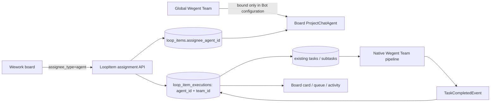
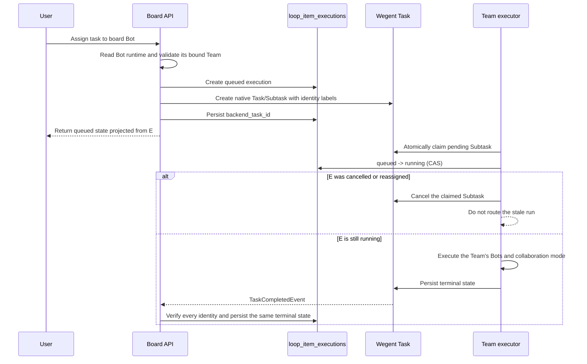

# Cloud project collaboration architecture

> The current V4 UI source of truth is `/Users/hongyu9/Downloads/wework-delivery-v4-TODO.pen`. Implement the interaction from that design instead of deriving page layout from this document.

## Goal

A cloud project is the shared collaboration and storage boundary for a team. Members may select the same cloud project as the default destination of their own local projects, execute work in Wework, and submit selected conversations, files, and Markdown as immutable delivery snapshots.

A cloud project is not the existing `Project` model:

- `Project` is a user-owned local execution workspace containing device, path, Git, and runtime configuration.
- `CloudProject` is a shared aggregate containing membership, TODOs, shared files, and a MinIO namespace.
- Local projects owned by different members may independently select the same cloud project; the cloud project stores no reverse link.
- One TODO may link to many Wework Tasks, while one Task may process at most one active TODO at a time.

## Domain relationships

```text
CloudProject
├── ResourceMember(resource_type=CloudProject)
├── ShareLink(resource_type=CloudProject)
└── LoopItem
    ├── LoopItemTaskBinding
    │   └── TaskResource
    │       └── Project (local execution workspace)
    └── Delivery
        └── DeliveryAsset
```

## Data ownership

| Data                                                                                    | Source of truth                  |
| --------------------------------------------------------------------------------------- | -------------------------------- |
| Cloud projects, members, TODOs, task links, delivery metadata                           | Backend MySQL                    |
| Local paths, devices, Git, execution configuration, and default project-space reference | Device-local Codex project state |
| Shared files, Markdown, conversations, and delivery snapshots                           | MinIO/S3                         |
| AI access to cloud data                                                                 | MCP authorized by the Backend    |

Objects are isolated by the cloud project's public ID:

```text
projects/{cloud-project-public-id}/
  shared/
  loop-items/{loop-item-id}/
    deliveries/{delivery-id}/
      markdown.md
      chat.json
      manifest.json
      files/
```

Finalized delivery prefixes are immutable. Later tasks may only read or copy them.

## Data model

### CloudProject

`cloud_projects` stores the shared project and never stores local runtime configuration.

```text
id, public_id, project_key, name, description
created_by_user_id, storage_prefix, next_item_number
status, version, created_at, updated_at
```

### Local-project default space

A local Codex project may store one `{ projectStore, projectId }` default project-space reference. The reference belongs to device-local project state, never enters the Backend, and creates no reverse index on the project space. A new conversation may override or clear the default before its first message is sent.

### LoopItem

The existing `loop_items` table stores cloud TODOs. `cloud_project_id` references `cloud_projects`, and `sequence_number` produces display identifiers such as `WEG-18`.

The initial fixed workflow is:

```text
inbox → pending → in_progress → in_review → completed
```

Completed TODOs may be reopened into `in_progress`. Updates carry a `version` value and use optimistic locking.

### Board execution by Bots and Agents

A board assignee is either a project member or a project Bot (`ProjectChatAgent`). A Wegent Agent (`Kind(kind=Team)`) is runtime configuration for that Bot, not an assignee: the user creates a Bot in the board, selects Wegent as its execution environment, and binds one runnable Team. The binding lives in the Bot's existing `metadata_json`; no table is created.



`loop_item_executions` is the sole source of truth for board execution state, while native `tasks/subtasks` own Team-internal execution. `backend_task_id` and labels containing the execution, Subtask, and Team identities fence the two records together. Messages and activity rows are presentation projections and never override execution truth.



Reassignment and stop first move board truth to `cancel_requested` when a process may exist, or `cancelled` when execution provably has not started, then route cancellation to the device Runtime or native Team Task. A delayed worker must recheck board execution truth after claiming and cannot start a cancelled run.

Execution scope remains owned by the board Bot. `agent_id` determines queue columns, assignment history, and concurrency identity; `team_id` records only the actual Wegent runtime target. Different board tasks may still enter the native Team pipeline concurrently, where Team collaboration configuration controls internal parallelism.

### LoopItemTaskBinding

`loop_item_task_bindings` stores the historical many-to-many relationship between a TODO and concrete Wework Tasks. A runtime Task is identified by `task_user_id + device_id + task_id`, because a locally executed Task may not exist in the Backend `tasks` table; `backend_task_id` is only an optional index. Unlinking sets `unlinked_at` so execution provenance remains auditable.

### Delivery

`deliveries` and `delivery_assets` store immutable snapshot metadata. The nullable `Delivery.source_task_binding_id` points to a verified TODO/Task binding for local delivery and is null when a TODO is completed directly in the cloud UI.

## Authorization

Reuse `resource_members` and `share_links` with a new `CloudProject` resource type.

| Role       | Read | Edit TODOs/files | Manage members | Archive project |
| ---------- | ---- | ---------------- | -------------- | --------------- |
| Reporter   | Yes  | No               | No             | No              |
| Developer  | Yes  | Yes              | No             | No              |
| Maintainer | Yes  | Yes              | Yes            | No              |
| Owner      | Yes  | Yes              | Yes            | Yes             |

Every TODO, delivery, file, and MCP request resolves the caller's cloud-project role first. Inaccessible resources return 404 to avoid disclosing their existence.

## Service boundaries

```text
cloud_projects/  projects and members
loop_items/      TODOs, state transitions, and Task bindings
delivery/        immutable delivery snapshots
cloud_files/     mutable shared files
mcp_server/tools/delivery.py  authorized AI access to cloud references
```

Delivery services do not own TODO CRUD. LoopItem services do not access MinIO directly. MCP never holds or returns S3 credentials.

## Delivery transaction

1. Create a draft Delivery and write its Markdown and optional conversation object.
2. Upload assets in bounded chunks and record size and SHA-256 metadata.
3. `finalize` locks the Delivery and LoopItem and validates that the source Task is still linked to the TODO.
4. Write `manifest.json`.
5. In one database transaction, mark the Delivery delivered, complete the TODO, and update `current_delivery_id`.
6. If the database commit fails, remove the new manifest while keeping the draft retryable.

## API

```text
/v1/cloud-projects
/v1/cloud-projects/{id}/members
/v1/cloud-projects/{id}/members/{user_id}
/v1/cloud-projects/{id}/files
/v1/cloud-projects/{id}/folders
/v1/cloud-projects/files/{file_id}
/v1/cloud-projects/{id}/loop-items
/v1/loop-items/{id}
/v1/loop-items/{id}/tasks
/v1/loop-items/{id}/start-task
/v1/loop-items/{id}/deliveries
/v1/deliveries/{id}
/v1/cloud-work-items/my-work
/v1/runtime-tasks/loop-item
```

### Create boards and tasks with a personal API key

Users can call the two creation endpoints with a personal API key while preserving the existing authorization and board-state rules. Both `X-API-Key: wg-...` and `Authorization: Bearer wg-...` are supported, and browser JWT authentication remains valid. Service keys cannot create boards or tasks as a user.

Create a board:

```bash
curl -X POST 'https://<host>/api/v1/cloud-projects' \
  -H 'Content-Type: application/json' \
  -H 'X-API-Key: wg-<personal-api-key>' \
  -d '{
    "project_key": "OPS",
    "name": "Operations board",
    "description": "Created through the API"
  }'
```

Create a task with the board `id` returned by the previous request:

```bash
curl -X POST 'https://<host>/api/v1/cloud-projects/<project-id>/loop-items' \
  -H 'Content-Type: application/json' \
  -H 'Authorization: Bearer wg-<personal-api-key>' \
  -d '{
    "title": "Check cloud execution state",
    "description": "Keep the board as the source of truth",
    "priority": "high",
    "tags": ["api"]
  }'
```

Task creation still passes through board membership authorization, status-definition validation, provider routing, and automation rules. If `status` is omitted, the task enters the board's `inbox` state. An unknown status returns `422`, while an inaccessible private board returns `404` under the resource-hiding policy. These are create operations, not PUT upserts; callers should determine the outcome of an earlier POST before retrying to avoid duplicates.

Creation and updates use separate endpoints rather than PUT upsert. Shared files support folder creation, upload, rename/move, short-lived access, and recursive deletion. A move copies MinIO objects first, commits metadata, and only then removes the old objects; failed moves clean up newly copied objects.

When Wework adds a new runtime task to a cloud project space, it composes the existing primitives: create a `LoopItem`, then bind the runtime task; when execution status changes, read the task context and update the linked TODO. The Backend intentionally has no aggregate tracking endpoint dedicated to that orchestration. This allows the desktop app and Backend to be released independently while the stable TODO-creation, task-binding, and optimistic-locking APIs preserve the same behavior. The desktop app deduplicates concurrent association requests for the same runtime task and reuses a created TODO after a temporary binding failure to avoid duplicate cards.

The Wework Composer encodes cloud projects, directories, files, TODOs, and deliveries as atomic `cloud://` references. Tasks carrying cloud-project context receive the Delivery MCP, and `resolve_cloud_reference` authorizes and resolves every reference in Backend so neither clients nor AI receive S3 credentials. The TODO board refreshes periodically while visible, while writes continue to use `version` optimistic locking for concurrent collaborators.

## Delivery sequence

1. Add CloudProject, membership authorization, and local-project bindings.
2. Move LoopItem ownership to CloudProject and add the state machine and optimistic locking.
3. Add Task bindings and start-a-task-from-TODO.
4. Migrate delivery authorization, source Task references, and MinIO paths.
5. Add shared files and the cloud workspace MCP.
