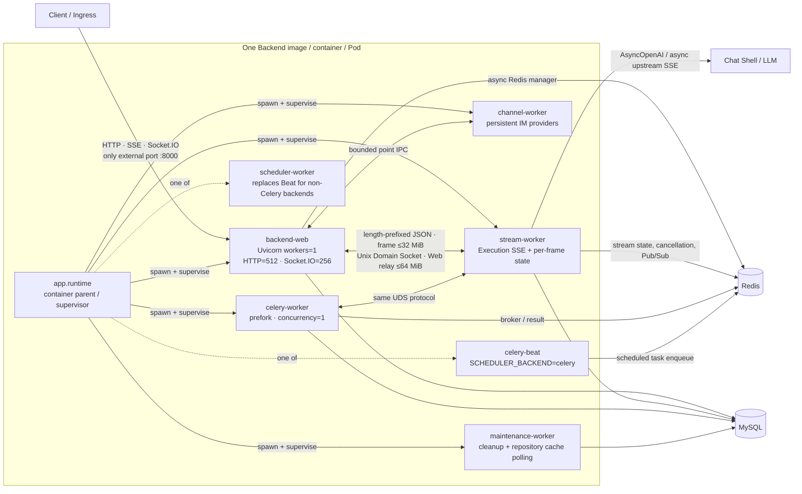

# Backend Single-Worker Isolation Architecture and Risk Assessment

## Core result

Backend remains one image, one container, one Pod, and one distributed node. It still
exposes only port `8000`. The change is internal to the container: `app.runtime` uses
Python `multiprocessing` with the `spawn` start method to supervise child processes
with different responsibilities. The sole Uvicorn worker no longer consumes upstream
SSE, persists per-frame state, or runs maintenance polling. Synchronous SDK and database
calls on the hot paths audited in this change use named bounded executors. FastAPI
automatic JSON decoding, request/response model validation, form parsing, synchronous
dependencies/endpoints, synchronous background tasks, and synchronous response
iterators are also isolated by strictly version-locked bounded executors. The remaining
risks called out below are Pod-wide per-frame events/s admission, unknown blocking code
written directly inside user `async def` functions, and lost batches after a
non-terminal delayed state flush fails.

The acceptance criterion is not merely “there is a Stream process.” It is this
invariant:

> The sole Uvicorn event loop performs only routing, protocol orchestration, and
> asynchronous forwarding whose cost has a hard bound. Potentially slow synchronous
> database, Redis, third-party SDK, file/repository I/O, JSON projection, and streaming
> state work must run in another process, a named bounded executor, or a genuinely
> asynchronous I/O boundary.

“Non-blocking” does not mean “every request is fast.” A request can still wait, time
out, or fail when a downstream database or SDK is stuck. It must not occupy the
Uvicorn event loop or enter an unbounded `ThreadPoolExecutor` queue.

## Scope and invariants

- HTTP, SSE, and Socket.IO/WebSocket ports, URLs, and client protocols do not change.
- Redis, MySQL, the Celery broker/result backend, and existing cancellation/state
  semantics do not change. Stream blocks add an expiring usage-counter key. A bounded
  legacy measurement keeps active streams from the previous release readable, and
  the first new write creates counters atomically; Redis needs no offline migration.
- No Deployment, Service, gateway, Redis Stream, event replay, or second task model is
  introduced.
- A Stream worker serves only its own Pod. The UDS never crosses Pods, and the cluster
  still scales in Backend Pod units.
- `SSE`, `HTTP_CALLBACK`, `POLLING`, and `INPROCESS` execution, cancellation,
  recovery, and projection use the local Stream worker. Only explicit local-device
  `WEBSOCKET` control is forwarded by Web; device stream events immediately cross
  into the Stream worker.
- The original emitter contract remains intact. When the caller supplies no emitter,
  Stream performs the default Socket.IO projection. An explicit SSE or subscription
  emitter receives only its relay and does not trigger an additional Socket.IO broadcast.
- Ordinary HTTP streaming proxies can remain in Web when they forward raw bytes with
  asynchronous `httpx`. Execution SSE, which parses upstream events and owns per-frame
  and terminal state, crosses the Stream process boundary.

## One-image process topology



With the default `SCHEDULER_BACKEND=celery`, the supervisor creates six named roles:
Web, Stream, Channel, Maintenance, Celery Worker, and Celery Beat. The Celery Worker itself uses
`prefork` with `concurrency=1`, so the process table can also contain its pool child.
“Six roles” does not mean exactly six OS child processes. A non-Celery scheduler
replaces Beat only; the ordinary Celery Worker remains.

| Role | Owns | Explicitly does not own |
| --- | --- | --- |
| `backend-web` | Authentication, routing, global request-body admission, listed codec-backed parsing, UDS relay, client SSE/Socket.IO, Web-local terminal domain events, and named executors | Upstream Execution SSE, per-frame Redis state, or Stream-owned terminal database persistence; the Uvicorn loop does not directly execute synchronous SDK/DB/I/O |
| `stream-worker` | Upstream SSE and image-on-SSE paths, event parsing, cancellation checks, per-frame Redis, terminal database status, and UDS events | External ports, client connections, or Web-local subscribers |
| `channel-worker` | Persistent DingTalk, Telegram, Discord, and Weibo provider lifecycles and callbacks | Uvicorn lifespan or external HTTP ports |
| `maintenance-worker` | Cleanup and repository maintenance loops from `start_background_jobs()` | Polling inside Uvicorn lifespan |
| `celery-worker` | Existing Celery queues, prefetch 1, and soft/hard time limits | Embedded Uvicorn threads |
| `celery-beat` / `scheduler-worker` | Existing periodic triggers | Embedded Uvicorn threads |
| `app.runtime` | Startup, failure coupling, signals, and layered shutdown | Business requests |

## Per-frame Execution SSE flow

```mermaid
sequenceDiagram
    autonumber
    participant C as Client
    participant W as Caller process<br/>Uvicorn / Celery
    participant DB as Bounded DB executor<br/>20 workers / 40 in-flight
    participant Q as UDS relay<br/>64 events/stream · 64 MiB/Web process
    participant S as stream-worker<br/>at most 256 connections
    participant U as Chat Shell / LLM
    participant R as Redis / MySQL
    participant X as Explicit emitter or default projection<br/>SSE queue ≤256 / Socket.IO queue ≤8

    C->>W: Start task over HTTP/Socket.IO
    W->>DB: Build/validate/mark RUNNING (fresh Session)
    DB-->>W: Scalars or detached DTOs only
    W->>S: ExecutionRequest (UDS, frame ≤ 32 MiB)
    S->>U: Open asynchronous upstream SSE

    loop Every non-terminal event
        U-->>S: text/event-stream bytes (≤ 1 MiB before blank delimiter)
        S->>S: Parse ExecutionEvent
        S->>R: Async Redis state / required persistence
        S-->>Q: 4-byte header (Q reads it first; frame ≤ 32 MiB)
        Q->>Q: Acquire frame-size lease from process-wide 64 MiB budget
        S-->>Q: Q reads payload only after lease; offload decode/build at ≥64 KiB
        Q-->>W: Ordered drain; per-stream capacity 64 backpressures reader
        alt Caller supplied an explicit emitter
            W->>X: Await the original emitter
            X-->>C: SSE / internal consumption
        else Caller supplied no emitter
            S->>X: Default Socket.IO projection in Stream
            X-->>C: Socket.IO event
        end
        X-->>Q: Release byte lease after emitter returns
    end

    U-->>S: DONE / ERROR / CANCELLED
    S->>R: Flush stream state and persist terminal status
    alt Required terminal persistence succeeds
        R-->>S: Status committed
        S-->>Q: One atomic terminal frame (same header/byte/codec admission)
        Q-->>W: Deliver terminal in order
        W->>X: Forward terminal to client first
        X-->>C: terminal event
        W->>DB: With a valid owner, run local completion subscribers' sync phases
        W-->>Q: Release byte lease after the whole emitter returns
    else Required terminal persistence raises
        R--xS: Persistence exception
        S->>R: Attempt to persist a classified ERROR
        S-->>Q: ERROR terminal or IPC control error
        Q-->>W: Never deliver the original success terminal
    end
```

`StatusUpdatingEmitter` first flushes stream state and persists the required terminal
status. Only after those calls succeed can the terminal enter Stream's holding emitter;
one `terminal` frame reaches Web after upstream dispatch and the close path return. This
both removes the protocol race between a normal terminal frame and a later complete
frame and makes required terminal persistence fail closed. If persistence of the
original `DONE`, `ERROR`, or `CANCELLED` raises, that original terminal is not forwarded.
The dispatcher attempts to generate and persist a classified `ERROR`; if that also
fails, it returns only an IPC control error, never a fabricated success terminal. The
atomic frame is still not a universal durability acknowledgement for every surrounding
side effect. Explicitly best-effort writes such as context metrics, and close failures
after a terminal has already been captured, retain their own logging policy. In Web,
terminal ordering is the original emitter first. With a valid owner, Web then attempts
one local `TaskCompletedEvent`, so domain completion callbacks cannot precede client
delivery.

Cancellation has three paths. Web shutdown admission rejects new streams; Stream
combines a one-second Redis cancellation poll with a process-local `asyncio.Event`;
and closing the UDS cancels the corresponding execution task immediately. The
existing cancellation-key TTL remains 300 seconds. The UDS-disconnect branch first
enters the status-owning dispatcher on `CancelledError`, which waits for
`emit_cancelled()` to flush stream state and persist database `CANCELLED` before the
upstream task can unwind and the socket closes. Normal disconnects therefore have
explicit state convergence. If the database or Redis itself is unavailable, or
SIGKILL stops the process, persistence can still fail and must be handled by alerts
and the existing reconciliation mechanism; the code cannot promise durability through
an external-storage failure.

Process isolation does not mean the caller process stops seeing every frame. On an
explicit-emitter path, each event still incurs IPC frame decode, `ExecutionEvent`
construction, the 64-item-per-stream relay drain, and the original emitter in Web or
Celery. The default Socket.IO path is projected directly by Stream without a duplicate
broadcast. The distinction is that per-frame state Redis
and database work moved to Stream, while the remaining Web codecs, queues, and network
waits have hard bounds and execute no known synchronous DB/SDK operation. There is no
Pod-wide events-per-second admission. Many small frames have a small individual cost
and bounded memory, but aggregate scheduling, inline small-payload codec, and client
fan-out can still saturate the sole Web loop's CPU.
Web-to-Stream transport is UDS, so it adds no Redis queue or Pub/Sub operation per
frame. Existing Stream state writes and cross-Pod Socket.IO publishes still occur.
The split therefore preserves Redis keys and business semantics, but does not erase the
existing Redis operations per second. Redis capacity must include those state writes,
publishes, and the separate client pools created by child processes.

## Bounded capacity and backpressure

### Stream and protocol boundaries

| Boundary | Current hard bound | Behavior at capacity |
| --- | ---: | --- |
| Web HTTP/SSE concurrency check | `WEB_MAX_CONCURRENCY=512` / Pod | Uvicorn returns `503` on the ordinary HTTP path at capacity; current WebSocket upgrade happens before that check and is not hard-limited by it |
| Socket.IO sessions | `WEB_MAX_WEBSOCKET_CONNECTIONS=256` / Pod | Engine.IO returns `503` with `Retry-After: 1` before creating another session, retaining headroom for HTTP |
| Stream connections | 256 / Pod | Return `stream_worker_overloaded`; never fall back to Web execution |
| Stream listener backlog | 256 | Queue in the Unix socket, then apply connection admission |
| Unterminated upstream SSE event | At most 1 MiB (1,048,576 bytes) before the blank delimiter, counted across transport chunks | Raise `SSEEventTooLargeError` before OpenAI SDK parsing and IPC; the execution enters its error-terminal path |
| IPC frame | 32 MiB with a 4-byte length header | Reject invalid or oversized frames |
| IPC Web relay count | 64 events / stream | `await queue.put()`, backpressuring that stream's socket reader and Stream writer |
| IPC Web relay bytes | 64 MiB / Web process, reserved from the encoded frame size declared in the header | Read the 4-byte header first and acquire a byte lease before reading/decoding payload; all streams share the budget and release occurs only after emitter completion |
| General `QueueBasedEmitter` | 256 events / emitter | Producer waits; events are neither dropped nor buffered without a bound |
| IPC codec | 4 workers / 8 in-flight / 256 waiters | Wait asynchronously before submission; always offload encode and offload decode/`ExecutionEvent` construction at `>=64 KiB` |
| Client SSE codec | 4 workers / 16 in-flight | SSE serialization waits asynchronously for named-pool capacity |
| Stream text-state buffer | 262,144 characters or one second per stream; activity touch at most once per second | Slow Redis backpressures that stream; boundaries, tools, and terminals force a flush instead of writing every token |
| Aggregate per-frame client-delivery rate | Currently no Pod-wide events/s admission | Per-stream relay 64, emitter 256, and connection ceilings bound memory and apply staged backpressure, but cannot guarantee Web latency at an arbitrary event rate |
| Socket.IO inbound message/decode | 1,000,000 bytes / message; 64 KiB payload-codec threshold | Decode large Socket.IO packet JSON in the codec pool and inline only strictly small packets; Engine.IO transport framing remains inside the per-message bound |
| Socket.IO inbound handler | `async_handlers=False`; ordered per connection | The receive path awaits the handler instead of creating one background task per event; cross-connection work comes from at most 256 admitted sessions |
| Engine.IO participant outbound queue | 8 packets / client; one-second put timeout | Disconnect and drain a persistently slow client when its queue remains full |
| Socket.IO outbound packet / Redis envelope | 1,000,000 bytes / 2 MiB | Reject an encoded oversize before it enters a client queue or Redis channel |
| Stream heartbeat | Every 5 seconds; 20-second client timeout | Fail the current stream when neither a frame nor heartbeat arrives |
| IPC connect / first frame / write | 3 s / 10 s / 20 s (worker first frame 5 s) | Return classified unavailable/timeout errors |

The 256 connections are a Stream-process total shared by Web, Celery, and readiness
pings. If active streams consume every slot, `/api/ready` also receives overload and
returns `503`, stopping new traffic to that Pod. This is a capacity signal, not a
liveness restart signal.

The IPC path bounds per-stream item count, total encoded bytes retained by the Web
process, and individual frame size, so it has no logically unbounded relay queue. The
general `QueueBasedEmitter` bounds only item count; its item size still depends on the
upstream protocol boundary. The old `32 MiB × 64 × 256` product is no longer a bound on
encoded payload retained by Web. Web reads the 4-byte header, reserves the declared
frame size from one process-wide 64 MiB budget, and only then reads and decodes payload.
The lease spans queueing and `await emitter.emit()` and is released only when the
client emitter returns or failure cleanup runs. Slow clients and large events therefore
backpressure every stream sharing this budget instead of retaining encoded relay
payload without a bound. The 64 MiB ledger excludes Python-object expansion after JSON
decode, `asyncio`/kernel socket transport buffers, and client-protocol queues. A 32 MiB
frame also remains a compatibility ceiling rather than a normal event budget. Rollout
must measure event sizes, lease waits, and Pod RSS rather than treating “finite” as
“small.” The 32 MiB IPC limit governs internal event frames after OpenAI SDK parsing.
Earlier, `BoundedSSEByteStream` counts the current event across chunks in the
`text/event-stream` byte stream and rejects it when data before its blank delimiter
exceeds 1 MiB. An unterminated upstream event therefore cannot grow without a bound
before IPC, but `1 MiB × 256 streams`, SDK object expansion, and socket buffers still
belong in measured Pod RSS capacity.

The Socket.IO theoretical product, `256 sessions × 8 packets × 1,000,000 bytes`, is
also close to 2 GiB before Python/Engine.IO object expansion and transport buffers. The
one-second slow-client policy bounds sustained buildup time, but does not make the
transient worst case negligible. Size Pod memory from measured packet distributions,
not from the fact that the queues are finite.

### Named bounded executors inside each process

`BoundedExecutor` acquires capacity before submitting work to Python's
`ThreadPoolExecutor`. At capacity, the coroutine waits asynchronously. The default
waiter limit is `max_in_flight × 4`; once both execution capacity and the waiter queue
are full, `BoundedExecutorOverloaded` is raised instead of extending the queue. If a
caller is cancelled while the synchronous function continues, the slot remains
occupied until that function actually returns. Cancellation therefore cannot
oversubscribe the pool. These executors are process-local instances, not container-wide
shared pools. Any Web, Stream, or Celery child that imports the module gets its own
capacity ledger and lazily started threads. The table therefore lists capacity per
executor instance, not a total per Pod. The IPC codec is the explicit exception to the
default waiter formula: it configures 256 waiters to match the 256-connection Stream
hard limit instead of using the default 32.

| Responsibility pool | workers / max in-flight | Representative work |
| --- | ---: | --- |
| DB | 20 / 40 | SQLAlchemy, terminal domain state, fresh-Session transactions |
| Shared payload codec | 2 / 8 | JSON and recursive payload projection; offload at `>=64 KiB` or for custom objects |
| FastAPI sync dependencies/endpoints | 32 / 32 (128 waiters) | Ordinary sync dependencies, yield enter, and sync endpoints; yield cleanup has a reserved pool |
| FastAPI form | 4 / 4 (8 waiters) | Multipart/urlencoded parsers, `UploadFile` I/O, and Form DTO validation; cleanup 4 / 4 |
| Sync response background | 32 / 32 (0 waiters) | Synchronous callables in Starlette `BackgroundTask(s)` |
| Sync response iterator | 32 / 32 (0 waiters) | Synchronous `StreamingResponse` iterables; cleanup 4 / 32 |
| Repository | 4 / 8 | Synchronous GitHub/GitLab/Gitee/Gitea/Gerrit HTTP |
| Knowledge | 4 / 8 | Local RAG, storage, and synchronous upstream validation |
| MCP tool | 4 / 8 | FastMCP synchronous tools and explicit synchronous preparation phases |
| Execution I/O | 4 / 8 | Image/video persistence, broker calls, and execution side effects |
| Device I/O | 2 / 4 | Synchronous device-control network calls |
| Rate-limit I/O | 2 / 8 | Synchronous rate-limit storage |
| URL metadata I/O | 4 / 8 | DNS, synchronous cache work, and HTML parsing |
| DingTalk SDK | 4 / 16 | Synchronous SDK calls, ordered by a per-card/owner lock |
| Callback Redis event codec | 2 / 16 | Callback event JSON encoding |
| Attachment upload / blocking I/O | 2 / 4 and 4 / 8 | Upload, parse, storage, and database phases |
| Archive storage | 4 / 8 | Workspace archive storage |
| Schedule recovery / dispatch | 5 / 10 and 5 / 20 | Scheduled recovery and synchronous dispatch entry points |

Responsibility pools isolate failure domains: a slow repository provider cannot consume
DB slots, and a stuck DingTalk SDK cannot consume payload-codec slots. Python cannot
force-kill a synchronous thread. A timeout stops awaiting the result, but the call
keeps its slot until it returns; this is necessary for honest capacity accounting.

## Current Web hot-path isolation

### Request bodies and JSON

`RequestBodyLimitMiddleware` covers every HTTP request with a body before
FastAPI/Pydantic automatic decoding. It checks both `Content-Length` and chunked bodies
and returns `413` at the limit. An ordinary non-multipart request is at most 16 MiB and
is collapsed in the shared payload codec. Multipart bodies use
`max(DELIVERY_MAX_ASSET_SIZE_MB, MAX_UPLOAD_FILE_SIZE_MB) + 16 MiB`, are relayed chunk
by chunk rather than pre-buffered by this middleware, and currently default to a
2064 MiB general per-request limit. The two attachment-upload routes use a smaller
exact limit shown below.

The Web process also shares one request-body admission layer: at most 128 admitted
requests and at most 64 MiB of reserved non-multipart bytes. A request without
`Content-Length` reserves its route's full limit. Multipart consumes a request slot but
not that 64 MiB byte ledger, and a separate process-level admission allows at most four
streaming multipart requests. Exhaustion of either admission returns `503` with
`Retry-After: 1`. Every FastAPI API route is covered by the explicit
`IsolatedAPIRoute` adapter. Automatic JSON decoding, path/query/header/cookie and
request/response model validation/encoding run in the payload codec; synchronous
dependencies, yield enter/exit, and synchronous endpoints run in the named Web
executor. Adapter installation is idempotent and fails fast against FastAPI 0.124.0,
Starlette 0.50.0, and exact source hashes; it is not a global monkeypatch.

```mermaid
flowchart LR
    Client[HTTP client] --> Raw[ASGI raw body limit]
    Raw -->|Content-Length/chunked over limit| Reject413[413]
    Raw --> General[Request admission<br/>at most 128 · non-multipart 64 MiB]

    General --> Json[Bounded non-multipart aggregation]
    Json --> Payload[Payload codec<br/>JSON + request DTO]

    General --> Multipart[Multipart admission<br/>at most 4]
    Multipart --> Receive[Uvicorn loop<br/>chunk receive only]
    Receive --> Form[Form executor 4 / 4<br/>parser.write/finalize]
    Form --> Spool[IsolatedUploadFile spool<br/>write/seek/read/close]
    Spool --> FormDTO[Form DTO validation<br/>same bounded form executor]

    Payload --> Business[Async business orchestration<br/>or named sync endpoint executor]
    FormDTO --> Business
    Business -->|Knowledge/RAG/Web scraper| AuthDB[wegent-db<br/>auth + DB prepare · owned Session]
    AuthDB --> AsyncIO[Async network I/O<br/>no live Session]
    AsyncIO --> KnowledgeIO[wegent-knowledge-io<br/>RAG/document/sync SDK]
    KnowledgeIO --> PersistDB[wegent-db<br/>result persistence · new Session]
    PersistDB --> ResultCodec[Payload codec<br/>response DTO]
    ResultCodec --> Response
    Business --> Response[Response send]
    Response --> Background[Sync background<br/>32-slot pre-admission]
    Response --> SyncIterator[Sync stream iterator<br/>32-slot pre-admission]

    Multipart -->|full: before body read| Reject503[503 · Retry-After 1]
    Form -->|executor/lease full| Reject503
```



| API | Per-request raw body limit |
| --- | ---: |
| `/api/internal/callback` | 1 MiB |
| `/api/internal/callback/batch` | 4 MiB |
| `/api/tasks/{id}/prompt-drafts/generate/stream` | 512 KiB |
| `/api/v1/deep-research` and its status/stream routes | 512 KiB |
| `/api/wizard/test-prompt/stream` | 1 MiB |
| `/api/model-runtime/responses` | 16 MiB |
| `/api/runtime-work/llm-responses-proxy/responses` | 16 MiB |
| `/api/v1/responses` | 16 MiB |
| `/api/attachments/upload`, `/api/v1/attachments/upload` | `MAX_UPLOAD_FILE_SIZE_MB + 1 MiB` multipart envelope; default 101 MiB, streamed |
| Other non-multipart HTTP bodies | 16 MiB |
| Other multipart HTTP bodies | Dynamic; currently 2064 MiB, streamed |

The global raw-body and aggregate-admission bounds prevent unbounded request count and
pre-buffered bytes; ordinary automatic JSON/Pydantic routes no longer decode or validate
on the Web loop. Multipart is not pre-buffered by the middleware: network receive still
advances chunk by chunk on the loop, while python-multipart `write/finalize`, spool-file
`write/seek/read/close`, and Form DTO validation all use the dedicated four-slot
executor. It is aligned with four-slot streaming-multipart admission and reserves
separate cleanup capacity for errors and cancellation. Aggregate temporary storage for
up to four in-flight multipart bodies is still outside the 64 MiB non-multipart ledger,
so Pod memory and disk remain separately budgeted.

The attachment network boundary now precedes parsing. Raw multipart on
`/api/attachments/upload` and `/api/v1/attachments/upload` is limited to the configured
100 MiB business file ceiling plus a fixed 1 MiB form envelope. A known oversized
`Content-Length` receives `413` before body read or Starlette. For a missing or forged
length, the wrapped `receive` counts each chunk and raises
`RequestBodyTooLargeError(413)` at the same limit. Only requests holding one of four
multipart leases enter the Starlette parser and `UploadFile` spool, and the lease is
released after the whole downstream request returns. The bounded business worker still
checks 100 MiB of actual file content, separating the raw multipart-body boundary from
the file boundary.

### Socket.IO

- Engine.IO inbound messages have a hard `1,000,000`-byte limit. The custom
  `_BoundedAsyncServer._handle_eio_message()` constructs Socket.IO packets and attaches
  binary payloads through the shared payload codec: payloads at the 64 KiB threshold or
  with custom objects are offloaded, while small packets run inline under a strict size
  budget. The dependency's outer Engine.IO transport framing remains on the Web loop
  but cannot exceed the message limit.
- Application-controlled outbound JSON, Redis Pub/Sub decoding, cross-Pod binary
  deconstruction/reconstruction, and Engine.IO packet pre-encoding also use the shared
  payload codec. One outbound packet is at most 1,000,000 bytes and one Redis-manager
  message at most 2 MiB. Packet ordering remains stable for each local participant.
- Inbound Pydantic validation in the chat namespace is force-offloaded to the payload
  codec. Wework project-chat camelCase normalization and validation use the same
  bounded boundary.
- `socketio.AsyncServer` explicitly uses `async_handlers=False`. The receive coroutine
  awaits the application handler, preserves event order within one connection, and
  does not turn a flood into one background task per event. Different connections can
  still run concurrently, but Engine.IO `_handle_connect()` applies independent
  admission before creating a session. `WEB_MAX_WEBSOCKET_CONNECTIONS` admits at most
  256 Socket.IO sessions by default and returns `503` with `Retry-After: 1` at capacity.
  This closes the gap created because Uvicorn upgrades WebSockets before its
  `limit_concurrency` check and retains headroom relative to the default HTTP value of
  512. The bounded Backend server implements outbound `call()` ACK waiting without
  changing this inbound dispatch policy, so Runtime RPC does not depend on background
  handlers.
- One local fan-out creates at most 32 concurrent participant send tasks, waits for
  progress, and only then creates more. Every participant Engine.IO queue contains at
  most eight packets. If enqueue remains blocked for more than one second, the server
  closes that client with a transport error and drains the queue. The application queue
  therefore has a hard bound; the tradeoff is disconnection and possible loss of a
  real-time push, with recovery still depending on existing persisted state.
- The Redis manager uses genuinely asynchronous Redis and waits at most five seconds
  for publish. A timeout marks the connection stale and preserves the manager's
  best-effort semantics without synchronously blocking the Web loop.
- Cross-Pod Socket.IO still uses the existing Redis channel. It adds no streaming
  Redis queue.

### Executor callbacks and IM callbacks

`/api/internal/callback` has a second, business-level admission layer:

- A batch contains at most 100 events, and the process admits at most 128 events at a
  time. Overload returns `503` with `Retry-After: 1`.
- Sixty-four task-order lock stripes preserve the whole processing order for a task
  without retaining one lock per historical task.
- Parsing uses four shards. Each shard has one worker and at most eight in-flight
  calls. Full parser capacity returns `503` instead of creating an unbounded queue.
- Non-terminal callbacks do not open a database Session. A terminal owner lookup runs
  in a fresh Session in the DB executor, and that Session closes before any async
  emit.
- A channel callback descriptor is at most 256 KiB. Positive and negative lookup
  caches contain at most 4096 entries; a negative entry lives for 30 seconds.
- Each channel caches at most 4096 active emitters behind 64 lock stripes. Emitter TTL
  is 30 minutes, and cleanup checks at most 32 expired items every 30 seconds instead
  of scanning the full cache on every frame.

Synchronous DingTalk downloads, replies, and AI Card operations run in a dedicated
4/16 pool and are serialized per owner/card; their common await budget is 15 seconds.
Telegram uses its SDK's native asynchronous network interfaces with explicit
connect/read/write/pool timeouts, while database phases still use the DB executor. The
generic IM handler creates Sessions only inside synchronous workers and returns IDs or
detached DTOs before resuming asynchronous reply, Redis, or dispatch work. ORM objects
and Sessions must never cross an `await`.

### MCP, database, and other synchronous I/O

The FastMCP wrapper sends synchronous tools to the 4/8 MCP pool. Synchronous database
or Redis preparation inside async tools must explicitly enter the MCP, DB, or Execution
I/O pool. Results are serialized through the payload codec. Web-reachable repository,
local RAG, image/video attachment, device version, URL metadata, and archive paths use
the responsibility-specific pools listed above.

A database worker creates, commits or rolls back, and closes its own Session, returning
only scalars, dataclasses, or plain dictionaries to the event loop. Synchronous event
bus subscribers also use the bounded DB executor. A synchronous publisher can retain
at most 100 pending publications to the main loop; further submissions raise
`EventBusOverloaded` explicitly.

A static architecture test scans every `async def` under `backend/app/**/*.py`. Its
current syntax rules reject direct `SessionLocal` and `redis.Redis/from_url`
construction plus listed `requests`, DNS, subprocess, `time.sleep`,
`asyncio.to_thread`, default-executor, and framework implicit-threadpool calls.
Pre-bind Uvicorn lifespan initialization is the only explicit allowlist. This is a
call-name AST guard; it cannot see methods on injected synchronous objects, dynamic
calls, or hidden blocking work inside an arbitrary third-party function. Fault
injection and review therefore remain required.

## Lifecycle

1. `app.runtime` creates every role with `spawn`. It starts the Stream process before
   Web, Maintenance, and Celery, but `Process.start()` order is not a readiness barrier.
2. Stream listens on `STREAM_WORKER_SOCKET_PATH`, removes a valid stale socket, and
   sets mode `0600`.
3. The Web child does not merely check that the file exists. It must complete a real
   `ping/pong` IPC round trip within a 30-second startup budget before Uvicorn binds
   port `8000`.
4. The Celery child also runs the same real `ping/pong` barrier within a 30-second
   startup budget and calls `worker_main()` only after success. Even when the broker
   already contains an SSE-routed task before cold start, this child cannot consume it
   before Stream IPC is ready; process creation order no longer carries that invariant.
5. `/api/ready` is an async route. It runs database `SELECT 1` in the bounded DB
   executor, then performs a real asynchronous UDS ping with a one-second budget. It
   returns `503` when Stream does not answer. `/api/health` is a liveness check and is
   not database or Stream readiness.
6. If any required role exits, the supervisor returns nonzero and terminates every
   other role. Kubernetes restarts the Pod under its existing policy. There is no
   Web-only degraded mode and no fallback that executes SSE inside Web.
7. On SIGTERM, Web closes new-stream admission and waits up to
   `GRACEFUL_SHUTDOWN_TIMEOUT` for registered streams. At timeout it propagates
   cancellation through the existing Redis semantics.
8. The supervisor terminates and waits for Web/Celery/Maintenance/Scheduler consumers
   before terminating the Stream provider. The group shares one shutdown deadline;
   surviving processes are force-killed after it expires.
9. Public `/shutdown/initiate|wait|reset` routes are removed. Only process lifecycle
   can mutate shutdown state.

A Pod restart still disconnects Pod-local active streams. This change does not add
cross-Pod migration or replay.

## Rollout impact

### Required changes

- Deploy the same new Backend image to all four Backend groups: preview, internal
  testing, production, and external-facing.
- The image default is now `python -m app.runtime`. If a Deployment explicitly
  overrides `command` or `args` with `uvicorn app.main:app`, remove that override or
  change it to the runtime; otherwise it bypasses the entire isolation architecture.
- The repository root `start.sh`, `backend/start.sh`, standalone scripts, E2E, and CI
  entry points all use `app.runtime`. Root local development no longer starts Uvicorn
  with `--reload`.

### No changes required

- Frontend, Chat Shell, Executor, or Knowledge Runtime images and protocols.
- Ingress, Service, external ports, or HTTP/SSE/WebSocket URLs.
- Database schema, existing Redis value formats, or the Celery broker/result backend.
  The new `chat:streaming:blocks_usage:*` key is an internal one-hour-TTL counter and
  requires no provisioning or migration.

### Configuration and probes

- The new optional `STREAM_WORKER_SOCKET_PATH` defaults to
  `/tmp/wegent-stream-worker.sock`. It normally needs no override. The path must be
  writable inside the container and must not be shared between Pods.
- Optional `CHANNEL_WORKER_SOCKET_PATH` defaults to
  `/tmp/wegent-channel-worker.sock` and follows the same UDS constraints.
- `EMBEDDED_CELERY_ENABLED` is removed; Uvicorn lifespan no longer owns Celery.
- New `WEB_MAX_CONCURRENCY` defaults to `512` and is Uvicorn's concurrency check on the
  ordinary HTTP/SSE request path. Scale Pods or change this explicit value when capacity
  is insufficient; do not remove the bound to conceal overload. Current Uvicorn
  WebSocket upgrade precedes that check, so new `WEB_MAX_WEBSOCKET_CONNECTIONS`
  separately hard-limits Socket.IO sessions to `256` by default. Settings validation
  enforces `0 < WEB_MAX_WEBSOCKET_CONNECTIONS < WEB_MAX_CONCURRENCY` and fails startup
  for an invalid relation. Deployment must still choose the difference between the two
  values to provide its intended HTTP headroom.
- Existing `HOST`, `PORT`, `SCHEDULER_BACKEND`, and
  `GRACEFUL_SHUTDOWN_TIMEOUT` remain. Kubernetes
  `terminationGracePeriodSeconds` should exceed the application timeout with margin
  for supervisor cleanup.
- Readiness should call `/api/ready` to cover real Stream IPC. Probing only `/health`
  cannot detect a post-startup Stream hang. Readiness failure removes traffic but does
  not by itself restart a live Pod.

### Resource changes

- Multiple Python interpreters, the Celery prefork child, and responsibility-specific
  thread pools add resident memory. Executor capacity in the table is counted
  separately in every process that imports that module.
- Web, Stream, Maintenance, and Celery lazily create their own database, Redis, and
  HTTP clients because connections cannot be shared across processes. Recalculate
  database and Redis connection budgets per Pod and across every deployment group.
- Process isolation removes same-event-loop and same-GIL hot-path interference, but
  every role still shares the Pod cgroup. A small CPU limit or memory pressure can
  still throttle or OOM the whole Pod.
- One Stream process serves every SSE in its Pod. Unknown synchronous blocking inside
  Stream pauses all streams in that Pod, while Web probes and ordinary requests remain
  schedulable. This moves the failure domain away from Web; it is not an unlimited
  Stream-throughput guarantee.

The default configuration starts one Beat in every Backend Pod. The current code uses
Celery `PersistentScheduler`; this change does not create a global Beat singleton.
Multi-Pod periodic enqueue behavior and existing application locks/idempotency are a
separate distributed-scheduling concern, not a fallback for Web-loop isolation, and
the documentation must not assume every scheduled task is intrinsically deduplicated.

## Failure modes and risk checklist

| Scenario | Current behavior | Operational implication |
| --- | --- | --- |
| Stream startup failure or invalid UDS path | Web never binds; role exit fails the whole Pod | Restart explicitly instead of serving a false Web-only state |
| Broker already contains an SSE Celery task at startup | Celery completes a real Stream `ping/pong` before calling `worker_main()`; if Stream is not ready within 30 seconds, the child fails startup and triggers whole-Pod failure | It cannot consume before UDS readiness; retain the “ping before consume” ordering test and never regress to checking only the socket file or relying on import timing |
| Invalid Web/Socket.IO admission configuration | Settings fails startup for a non-positive value or a WebSocket ceiling not below the Web ceiling | Restore `0 < WEB_MAX_WEBSOCKET_CONNECTIONS < WEB_MAX_CONCURRENCY`; never serve with a false capacity relationship |
| Stream process exits | Supervisor terminates the group and exits nonzero | Kubernetes restarts this Pod; other Pods are unaffected |
| Redis still contains an active stream created by the previous release | The new Stream worker measures it within the 128-block and per-block/total byte limits; the first write creates usage counters in the same WATCH transaction | Redis does not need clearing; legacy state beyond the new hard limits fails explicitly instead of being read without a bound |
| Stream remains alive but its event loop hangs | Active streams fail after heartbeat timeout; `/api/ready` returns 503; Web remains schedulable | Readiness only removes traffic; the existing platform policy must restart it if automatic recovery is required |
| More than 256 local streams | Explicit overload error with no Web fallback | Scale Pods or constrain upstream concurrency; never move pressure back into Uvicorn |
| Many admitted streams sustain small frames | Web still decodes, drains, and emits every frame; queues backpressure but there is no aggregate events/s admission | No unbounded backlog forms, but CPU saturation can raise ordinary HTTP latency; scale Pods or constrain event frequency from measured FPS |
| A few large events or slow emitters consume the 64 MiB relay-byte budget | A frame lease remains held until the whole emitter returns; other streams wait on the same global budget after reading their 4-byte headers | Memory remains bounded but backpressure crosses streams; monitor lease waits, client-send latency, and fairness rather than observing only each 64-item queue |
| A background Stream-state Redis flush fails | The delayed flush removes its current batch before writing, logs an exception, and does not restore that batch; live client frames can continue | Page-refresh recovery can have a content gap; alert and verify existing reconciliation/rebuild behavior instead of equating live delivery with persistence |
| Slow or disconnected Socket.IO participant | Fan-out window is 32; each client queue has eight packets and is disconnected and drained after a one-second blocked enqueue | The application packet queue cannot grow without a bound; the client loses its real-time connection and must recover from persisted state |
| Concurrent large Socket.IO inbound packets | Each packet is at most 1,000,000 bytes; large Socket.IO packet decode enters the codec while Engine.IO transport framing stays on-loop under the hard bound | Protocol-level load tests must establish the worst loop latency within the bound; handler-level Pydantic tests are insufficient |
| Socket.IO inbound event flood | `async_handlers=False` preserves per-connection order and backpressures reads; at most 256 sessions remain concurrently active | There is no longer one unbounded task per event, but many clients can still exhaust downstream bounded pools; monitor handler latency and overload |
| Socket.IO connection surge | Engine.IO returns `503` with `Retry-After: 1` before session 257, independently of Uvicorn's upgrade check | Connections, FDs, and application queues have a hard ceiling and the default configuration retains 256 slots of relative HTTP headroom; callers must back off or use another Pod |
| Concurrent valid large frames or bodies | Each item is bounded, non-multipart bodies share 128-request/64-MiB admission, and codec work follows its offload policy | Continue monitoring size distributions, RSS, OOM, and ingress concurrency |
| Upstream SSE never sends an event delimiter | `BoundedSSEByteStream` counts across chunks and raises before SDK parsing and IPC when the current event exceeds 1 MiB | The flow enters error handling instead of accumulating without a bound; still load-test RSS across concurrent streams, SDK object expansion, and the shared cgroup |
| Ordinary JSON route | Raw body defaults to at most 16 MiB and shares aggregate admission; automatic JSON and request/response Pydantic stages are forced through the payload codec | Codec saturation fails fast with `503`; monitor DTO object expansion and CPU instead of allowing work to fall back to the loop |
| Multipart surge | Each request receives chunk by chunk; at most four streaming multipart bodies share a four-slot parser/UploadFile/Form DTO pool with finite waiters and reserved cleanup | A fifth parallel multipart or exhausted form capacity returns `503`; budget temporary storage, memory, disk, and connections for four in-flight bodies |
| Sync background or sync response-iterator surge | A 32-slot lease is acquired before response send for each class; sync callables and `next()` use only named pools, and cancellation waits for submitted steps and closes iterators | Capacity exhaustion can return `503` before response start instead of discovering default-pool overload after a partial response |
| Attachment upload exceeds the configured file limit plus 1 MiB envelope | `/api/attachments/upload` and `/api/v1/attachments/upload` reject an oversized `Content-Length` with `413` before downstream work; the receive wrapper rejects an oversized chunked body at the same boundary | The raw body cannot fully enter the Starlette spool; the later 100 MiB file check still distinguishes multipart envelope from actual file content |
| Permanently stuck DB or synchronous SDK | Slot remains occupied; new calls wait asynchronously or time out without blocking the loop | Pools can be exhausted but not oversubscribed; downstream timeout and alerts must recover the dependency |
| Required terminal database/Redis persistence fails | The original terminal never enters the IPC emitter; the dispatcher attempts to persist a classified `ERROR`, and a second failure yields only an IPC control error | The client never receives a fabricated success terminal; alert and reconcile tasks whose external storage could not be written |
| Web/UDS disconnects before a terminal | Stream cancels upstream work and waits for the stream-state flush plus database `CANCELLED` persistence before task unwind and socket close | Normal disconnect converges state; external-storage failure or SIGKILL still requires alerts and reconciliation and must not be hidden by protocol ordering |
| Socket.IO Redis publish exceeds five seconds | Local emit already ran; cross-Pod publish fails best-effort and reconnects | A remote client can miss one push; recovery still depends on existing persisted state |
| Callback parser/admission is full | `503` with `Retry-After: 1` | The caller must retry; the process never builds an unbounded backlog |
| UDS or HTTP payload exceeds its limit | Explicit IPC error or HTTP `413` | Correct the caller payload; protocol events are not silently truncated |
| SIGKILL or insufficient termination grace | Layered drain cannot finish | Kubernetes grace must exceed the application timeout |
| Beat runs in multiple Pods | Periodic scan messages can be produced more than once | Keep explicit scheduling deployment constraints and task-level locks; do not attribute this to Stream extraction. This secondary scheduling risk does not reduce Web/Stream isolation. |

## Verification checklist

The following are delivery gates. A narrow unit test cannot replace the full set:

- [x] The static AST guard passes for all Backend async code, with no default executor
  or `asyncio.to_thread` path reintroduced.
- [x] UDS ping, request/event round trip, frame limit, overload, first-frame/heartbeat/
  write timeout, client disconnect, atomic terminal, and cancellation-race tests pass.
- [x] With an SSE event over 1 MiB whose delimiter crosses chunks or never arrives,
  verify that the transport raises `SSEEventTooLargeError` before SDK parsing and IPC,
  while an event inside the bound passes through unchanged.
- [x] A real spawned Stream process preserves the count, order, and offsets of 30
  events.
- [x] A real one-worker Uvicorn process keeps a synthetic `/probe` p99 below 100 ms
  while serving 100 streams at 30 events per second each. This is a real process/network
  test, not a full production Backend load test.
- [ ] Increase stream count and small-frame events/s beyond the baseline to locate the
  sole Web loop's saturation point, prove relay/emitter/Socket.IO queues backpressure
  without unbounded growth, and turn the result into a per-Pod FPS capacity model.
- [ ] With multiple large frames and a slow or failing emitter, prove that encoded
  leases across all Web streams total at most 64 MiB: capacity reads only the next
  header, not payload; release waits for the whole emitter; cancellation or failure
  releases both current and queued leases.
- [x] With an intentional `time.sleep(1)` inside Stream, the one-worker Uvicorn
  `/probe` maximum remains below 100 ms.
- [x] Capacity-exhaustion and blocking fault injection for DB, payload, Socket.IO,
  callback, IM/MCP, and Redis session codecs proves the loop remains schedulable.
- [ ] With a real WebSocket peer that stops reading, verify that every client Engine.IO
  queue remains at eight packets, a blocked enqueue disconnects and drains after one
  second, and RSS does not grow with the number of pushes.
- [ ] Load the sole Web loop with concurrent 1 MB Socket.IO JSON/binary inbound packets
  and verify Socket.IO packet codec offload plus the worst latency of Engine.IO transport
  framing; testing only handler-level Pydantic is insufficient.
- [ ] Flood one and many connections to prove `async_handlers=False` preserves
  per-connection order without per-event background tasks and establish
  cross-connection handler capacity.
- [ ] Surge real WebSocket and long-polling connections to verify that Socket.IO session
  257 receives `503` with `Retry-After: 1`, the existing 256 sessions remain intact,
  and HTTP probes plus FD/RSS curves demonstrate the intended headroom.
- [ ] Configuration tests prove Settings fails startup when either Web admission value
  is non-positive or the WebSocket ceiling is greater than or equal to the Web ceiling,
  and accepts a valid relationship.
- [x] Verify that every HTTP body is governed by a default, route-specific, or multipart
  limit plus 128-request/64-MiB non-multipart admission and four-slot multipart
  admission; every FastAPI route's automatic JSON, form, request/response DTO, sync
  dependency/endpoint/background/response iterator has a named bounded executor and
  version/source-contract fault injection.
- [ ] Send over-limit multipart bodies to `/api/attachments/upload` and
  `/api/v1/attachments/upload` from the socket, including chunked and forged/missing
  `Content-Length`; prove the raw limit is `MAX_UPLOAD_FILE_SIZE_MB + 1 MiB` and returns
  `413` before the full body enters FastAPI/Starlette spool. A fifth parallel multipart
  must receive `503` with `Retry-After: 1` before body read.
- [ ] Inject required persistence failures for `DONE`, `ERROR`, and `CANCELLED`; verify
  that the original terminal is not forwarded, that a persistable classified `ERROR`
  is the only terminal sent, and that a second failure yields only an IPC control error,
  never a fabricated success terminal.
- [ ] Inject a non-terminal Stream-state Redis flush failure and verify the lost batch's
  alert, page-refresh semantics, and recovery path without treating live client delivery
  as persisted refresh state.
- [ ] Force Web/UDS disconnect before a terminal and verify that upstream work stops,
  and that the `emit_cancelled()` flush plus database `CANCELLED` commit precede task
  unwind/socket close. Separately inject storage failure to verify alerts and
  reconciliation.
- [ ] `/api/ready` performs a real Stream ping and returns `503` when Stream does not
  respond. Public shutdown mutation routes return `404`.
- [ ] Preload the broker with an SSE Celery task before cold start and prove Celery does
  not consume until a real Stream ping succeeds; ordinary Celery import latency is not
  a readiness barrier.
- [ ] Supervisor abnormal exit, normal signals, consumers-before-Stream shutdown, and
  force-kill deadline behavior pass.
- [ ] Full Backend and shared tests, startup-script syntax, Compose validation, and a
  single-image Docker build pass.

```bash
cd backend
uv run pytest -q \
  tests/architecture/test_web_event_loop_isolation.py \
  tests/test_runtime.py \
  tests/test_runtime_entrypoints.py \
  tests/integration/test_stream_runtime_local.py \
  tests/services/execution/test_stream_client.py \
  tests/services/execution/test_sse_transport.py \
  tests/services/execution/test_status_updating_emitter.py \
  tests/core/test_blocking_work.py \
  tests/core/test_payload_codec.py \
  tests/core/test_request_body_limit.py \
  tests/core/test_request_json.py \
  tests/core/test_socketio.py \
  tests/api/endpoints/internal/test_internal_callback.py \
  tests/services/channels/test_callback_cache.py \
  tests/services/chat/storage/test_db_executor_capacity.py \
  tests/services/chat/storage/test_session_codec_boundaries.py \
  tests/mcp_server/test_mcp_tool_nonblocking.py

uv run pytest -q -rs
cd ../shared && uv run pytest -q
cd ..
bash -n start.sh backend/start.sh docker/standalone/start.sh
docker compose -f docker-compose.yml -f docker-compose.build.yml config --quiet
docker build -f docker/backend/Dockerfile \
  -t wegent-backend-stream-runtime:test .
```
