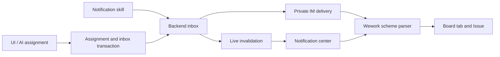

# Wework notifications and navigation

The bell beside Feedback displays your inbox and unread count. Opening a notification marks it read and opens its board Issue. Notifications are stored in Backend and remain available across devices and reconnects.

Human assignments offer Notify or Do not notify before saving, including assignment through board lanes and Issue creation. Assigning the same person again does not duplicate the notification. Ordinary self-assignment stays quiet; AI handing an Issue back to its user sends a notification.

Delivery also attempts the recipient's connected private IM sessions. IM failures do not remove the inbox entry or change the active IM task.

The first integration covers Backend boards. The built-in `wework-notifications` skill calls `wework_space.send_notification`. Omitting the recipient notifies the authenticated user; another recipient must belong to the same project. For example: “If acceptance fails, notify me in Wework.” AI assignments notify by default and must not send a duplicate alert; explicit opt-out uses `notify_assignee: false`.

## Scheme addresses

| Address                                       | Destination                 |
| --------------------------------------------- | --------------------------- |
| `wework://boards/{projectId}`                 | Backend board               |
| `wework://boards/{projectId}/issues/{itemId}` | Board Issue                 |
| `wework://tasks/{deviceId}/{taskId}`          | Task on a particular device |

URL-encode each address segment. In-app Markdown links, inbox actions and Electron external launches use the same destination parser. Installers register `wework`; cold-start URLs wait until authentication and the workbench are ready. Normal resource permissions apply. Links cannot execute commands, switch servers or grant access.

Native addresses remain queued in the Electron process until navigation is acknowledged. Renderer remounts and authentication restoration do not consume them prematurely.

## Architecture

Inbox reads and read-state changes are scoped to the recipient. Version conflicts roll back both the assignment and its notification. WebSocket and IM delivery happen after commit; opening the inbox, reconnecting and periodic refreshes reload its persisted state.
