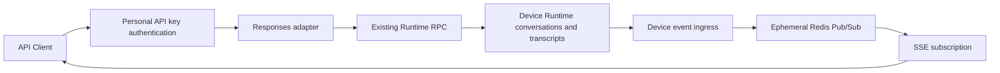

# Wework API Client

Operate independent Wework conversations over HTTP. This API uses the same device Runtime conversations, transcripts, and execution state as the mobile client. It adds no database tables or duplicate conversation storage.

## Authentication and base URL

Create a **personal API key** in Wegent and send:

```http
Authorization: Bearer wg-...
```

The base path is `/v1/api/wework`, mounted directly on Backend without an additional `/api` prefix. Reverse proxies must forward this prefix to Backend and disable SSE buffering. Expired/revoked keys and inactive users receive 401 on subsequent requests. Login JWTs and service keys are not accepted.

## Endpoints

| Method and path (relative to the base path) | Purpose |
| --- | --- |
| `GET /conversations?limit=20&after=...` | Independent conversations on online devices |
| `GET /conversations/{id}?limit=20&before=...` | Paginated transcript and `latest_response` |
| `POST /responses` | Create or continue a conversation |
| `GET /responses/{id}` | Read one turn's current status and output from Runtime |
| `GET /responses/{id}?stream=true` | Subscribe to new output for that turn |
| `POST /responses/{id}/cancel` | Request cancellation of that turn |
| `GET /models` | Models available to the caller for Codex conversations |

Each user message defines a response turn. A response ID encodes its Runtime address and native user-message identity; no Backend lookup table is required. IDs grant no permissions. Every read, continuation, and cancellation checks the caller's accessible devices and conversations.

PC/mobile conversations are accessible too. Use `latest_response.id` from conversation details to inspect, subscribe to, or cancel their latest turn. `is_latest` identifies the last user turn; `status` describes that turn's execution state.

## Create a task

Get a model `id` from `/models`. A new conversation also requires a device ID, available from an existing conversation's `device_id` or Wework device information.

```bash
curl -N 'https://example.com/v1/api/wework/responses' \
  -H "Authorization: Bearer $WEGENT_API_KEY" \
  -H 'Content-Type: application/json' \
  -d '{
    "model": "public:default:0:my-model",
    "input": "Inspect the workspace and explain the project",
    "stream": true,
    "wework_options": {
      "device_id": "your-device-id",
      "title": "API conversation"
    }
  }'
```

- `stream: true`: Responses SSE events, including `response.created`, `response.output_text.delta`, and a terminal event.
- `background: true, stream: false`: return a response ID after Runtime accepts the submission; retrieve the result with GET.
- Both false: wait for the turn to finish and return its response object.
- `input` accepts text or an array of user text messages with `input_text` content blocks.
- Creation and continuation currently use Codex Runtime. Runtime owns tool configuration. Client-defined function tools, tool-output submission, and injected assistant history are not supported.
- `wework_options.model_type` can disambiguate model sources; prefer the full ID from `/models`. `model_options` passes existing Runtime model options. Resource identity always comes from the authorized server catalog.

Continue with `conversation`, omitting device and title:

```json
{
  "model": "public:default:0:my-model",
  "conversation": "conv_...",
  "input": "Now check test coverage",
  "background": true
}
```

Alternatively, supply `previous_response_id`. It must identify the latest finished turn; historical branching is unsupported. A running conversation returns 409; wait for it or request cancellation first.

## Status, streaming, and cancellation

Statuses include `queued`, `in_progress`, `completed`, `failed`, `cancelled`, and `incomplete`. GET builds a snapshot from native history; model information reflects the Runtime's current conversation configuration.

Subscribing to a running response starts with new events from the time of subscription. Its `response.created.output` is empty; use ordinary GET for existing content. Streaming a completed response returns its snapshot and terminal event. `sequence_number` is connection-local; `starting_after` and historical event replay are unsupported.

Disconnecting SSE does not cancel execution. `cancellation_requested: true` means Runtime accepted the cancellation request; use GET for the eventual execution state. Cancelling a finished older turn cannot stop a newer task. If native turn identity is insufficient for safe cancellation, the API returns 409.

The owning device must be online and allow remote control. Offline device conversations cannot be read or executed. An RPC submission timeout does not prove that execution did not start: use the error's `response_id` and `conversation_id` to inspect the result before resubmitting.

## Architecture



Redis only forwards live events; it stores no keys, event journal, or response state. Runtime owns asynchronous execution; Backend does not introduce a separate task executor.
