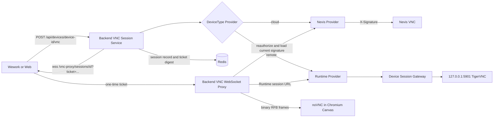

# Wework Cloud Device VNC Desktop

## Implementation boundary

Wework and the Web frontend both use `@novnc/novnc`. RFB decoding and rendering stay in a Chromium Canvas. Electron Main does not run a VNC client, decoder, renderer, or native VNC service; it only exposes system clipboard operations bound to the focused window and an active lease.

The same client and Backend session contract support:

- internal Nevis cloud devices;
- self-hosted Remote Docker devices.

The client receives only a short-lived Backend WebSocket URL. It must never receive a Nevis URL, sandbox ID, `NEVIS_MANAGER_ID`, `NEVIS_SIGNATURE`, Runtime token, or long-lived user JWT.

## Final architecture



The fixed constraints are:

1. `VncViewer` accepts only `websocketUrl`; it is unaware of device type and upstream authentication.
2. A provider is registered only for `DeviceType.CLOUD`. Remote, local, and other device types fail closed without falling back to the Runtime or a legacy path.
3. The actor and target owner are fixed during the authenticated HTTP request. WebSocket query parameters cannot override the owner.
4. Redis stores session authorization metadata and a one-time ticket digest, never a Nevis signature.
5. Before opening the upstream WebSocket, Backend rechecks the user, delegated admin access, device ownership, device type, sandbox mapping, and live state.
6. Active connections recheck the session and authorization every five seconds. Revocation, expiry, device stop/deletion, or an access change closes the connection.

## Session API

Create a session:

```http
POST /api/devices/{device_id}/vnc
Authorization: Bearer <access-token>
Content-Type: application/json

{
  "owner_user_id": 42
}
```

`owner_user_id` is only for admin delegation. A regular user omits it or can specify only their own ID.

Response:

```json
{
  "session_id": "vnc-random",
  "device_id": "device-id",
  "type": "vnc",
  "path": "",
  "url": "wss://backend.example.com/vnc-proxy/sessions/vnc-random?ticket=single-use",
  "transport": "websocket",
  "expires_at": "2026-09-14T12:00:00Z"
}
```

Revoke a session:

```http
DELETE /api/devices/vnc-sessions/{session_id}
Authorization: Bearer <access-token>
```

Security limits:

| Item                  | Value                                              |
| --------------------- | -------------------------------------------------- |
| Connect ticket        | 32 random URL-safe bytes, single use               |
| Ticket Redis key      | SHA-256 digest, never the bearer value             |
| Ticket TTL            | 60 seconds                                         |
| Session TTL           | At most one hour                                   |
| Client frame limit    | 1 MiB                                              |
| Upstream frame limit  | 64 MiB                                             |
| WebSocket compression | Disabled to avoid recompressing encoded image data |
| Origin                | Strict production allowlist                        |

## Backend deployment

Public configuration:

```env
WEGENT_BACKEND_PUBLIC_URL=https://backend.example.com
VNC_ALLOWED_ORIGINS=["https://web.example.com","http://127.0.0.1:*"]
```

- Configure the Web frontend with an exact origin.
- Wework Core DSH uses a random loopback port, so production explicitly allows `http://127.0.0.1:*`.
- Wildcards are recognized only for `http(s)://127.0.0.1:*` and `http(s)://localhost:*`, never for ordinary domains.
- Development allows loopback origins with an explicit port. Production fails closed without configuration.

Internal Nevis settings remain Backend-only:

```env
NEVIS_BASE_URL=https://nevis.example.com
NEVIS_MANAGER_ID=manager-id
NEVIS_SIGNATURE=secret
```

Backend reads `NEVIS_SIGNATURE` immediately before connecting and sends it only as the upstream `X-Signature` header. It is excluded from REST responses, Redis session records, browser logs, and metric labels.

## Cloud device capability

The desktop entry is visible only while an online device advertises:

```json
{
  "schemaVersion": 4,
  "desktop": {
    "version": 1,
    "available": true,
    "protocol": "rfb",
    "transport": "websocket",
    "clipboard": "text"
  }
}
```

Backend projects this capability for a Nevis device from configuration, sandbox identity, and live state. A Remote Docker Runtime advertises it only after completing a real RFB handshake probe; an environment flag alone is insufficient.

The current contract advertises only base `text` clipboard support. Change it to `extended-text` only after a real Nevis or TigerVNC server passes bidirectional UTF-8 extension tests.

## Chromium image-quality and stutter tuning

noVNC continues to render inside Chromium and exposes controlled profiles:

| Profile            | qualityLevel | compressionLevel | Remote DPR cap | H.264 |
| ------------------ | -----------: | ---------------: | -------------: | ----- |
| Clarity            |            9 |                1 |            1.5 | Off   |
| Balanced (default) |            8 |                2 |           1.25 | Off   |
| Smooth             |            6 |                4 |            1.0 | Off   |

Implementation details:

- The default raises noVNC quality from 6 to 8 to reduce JPEG blur around text and icons.
- Remote resize uses a 250 ms debounce so window dragging does not repeatedly rebuild the framebuffer.
- Each profile caps DPR so a Retina display does not automatically request twice the pixels.
- noVNC's existing pointer coalescing of roughly 17 ms remains in place; no high-frequency Electron IPC was added.
- A viewer outside the visible surface disconnects after 30 seconds and requests a new session when visible again.
- The Backend proxy awaits writes for backpressure and rejects text WebSocket frames.
- H.264 requires an explicit opt-in. It remains off until the Nevis encoder and Chromium WebCodecs combination is validated.

The Viewer emits `wework:vnc-metric` events without URLs, tickets, or clipboard text:

- `connected`: RFB connection time;
- `first-frame`: time to the first complete framebuffer update;
- `encoding`: actual server-selected RFB encoding;
- `frame-gap`: five-second-window P95, maximum gap, and sample count.

Compare profiles with first-frame time, frame-gap P95, CPU, GPU, RSS, and network throughput. Visual impressions alone are not sufficient.

## Remote Docker desktop

The managed device image installs TigerVNC, XFCE, and xclip and uses:

```env
DEVICE_SESSION_GATEWAY_ENABLED=true
DEVICE_VNC_DESKTOP_ENABLED=true
DEVICE_VNC_RFB_ADDR=127.0.0.1:5901
DEVICE_VNC_CLIPBOARD_MODE=text
DEVICE_VNC_GEOMETRY=1440x900
```

Security requirements:

- The managed image fixes `DEVICE_VNC_RFB_ADDR` to `127.0.0.1:5901`.
- TigerVNC starts with `-localhost yes`; the container does not publish port 5901.
- External clients can use only the token-gated Device Session Gateway.
- Executor completes RFB version, security-type, and ServerInit negotiation before advertising the capability.

## Clipboard

Electron Main exposes only:

- `vncClipboard.activate`
- `vncClipboard.deactivate`
- `vncClipboard.readText`
- `vncClipboard.writeText`

Every call is bound to the focused window and a random lease. The Viewer obtains a lease only while the page is visible, the window is focused, and the desktop surface is active. Blur, hiding, unmount, and background suspension deactivate it.

Base RFB clipboard does not guarantee arbitrary Unicode extensions. The release contract remains the validated `text` capability. Chinese, emoji, multiline text, and tabs become byte-exact release gates only after the real server passes the UTF-8 or Extended Clipboard path.

## Error semantics

| Condition                                   | HTTP / WebSocket behavior |
| ------------------------------------------- | ------------------------- |
| Missing device or access                    | HTTP 404                  |
| Regular user delegates another owner        | HTTP 403                  |
| Unsupported/offline/misconfigured desktop   | HTTP 409                  |
| Disallowed origin or revoked authorization  | WS 4003                   |
| Missing, invalid, expired, or used ticket   | WS 4001                   |
| Non-binary frame                            | WS 1003                   |
| Redis or upstream authorization unavailable | WS 1011                   |

Errors must not contain tokens, tickets, signatures, upstream URLs, or clipboard text.

## Acceptance matrix

Automation must cover:

1. Regular users access only their devices; admin owner override is authorized during HTTP creation.
2. A one-time ticket cannot be replayed; long-lived JWT URLs and the old device-ID proxy path are rejected.
3. Redis session records do not contain the Nevis signature.
4. The WebSocket handshake rechecks the user, device, and sandbox.
5. Wework and Web consume the same session URL contract.
6. noVNC completes an RFB handshake and framebuffer update in real Chromium/Electron.
7. Balanced defaults are quality 8, compression 2, DPR capped at 1.25, and H.264 off.
8. Resize debounce, background suspension, reconnect, and session revocation work.
9. Remote Docker RFB is reachable only through the Session Gateway.
10. Clipboard leases do not cross devices or tabs.

For performance acceptance, use the same device, resolution, and interaction script. Record the previous release as a baseline, then run Clarity, Balanced, and Smooth:

- Balanced text clarity must be no worse than the previous release.
- First-frame time and frame-gap P95 must not regress.
- A 30-minute interaction has no sustained RSS growth.
- RFB decode traffic stops after the Viewer has been in the background for 30 seconds.
- REST responses, browser logs, and Backend logs contain neither a signature nor a long-lived JWT.

## Removed legacy paths

The migration removes:

- `/vnc-config`;
- `/vnc-proxy/{device_id}?token=<jwt>`;
- the Frontend Node VNC proxy;
- the copied `vnc.html` and `rfb.min.js`;
- Electron `vnc.prepareSession`, `vnc.externalBridgeUrl`, and its VNC session manager;
- system-browser and embedded-browser launch paths for the legacy noVNC page.

Roll back the whole release when deployment fails. Do not restore a legacy authentication fallback at runtime.
