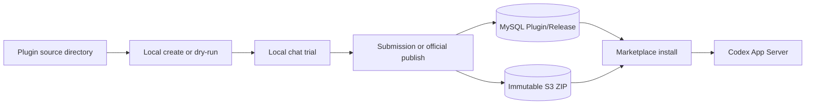

# Wework Plugin Marketplace Developer Guide

For developers who need to build, migrate, or publish Wework plugins. See [Plugin Marketplace V2](./plugin-marketplace-v2.md) for architecture and operations, and [Codex Plugin Runtime](./wework-codex-plugins.md) for local runtime details.

## 1. Mental model

Wework has two related but separate layers:

| Layer | Responsibility | Source of truth |
| --- | --- | --- |
| Local Codex runtime | Actual install, enablement, and skill / MCP / command use in chat | Local Executor + Codex App Server |
| Wegent cloud marketplace V2 | Catalog, versions, visibility, review, and desired device state | MySQL metadata + private immutable S3 ZIPs |

Keep these rules in mind:

1. **The install unit is always a Codex Plugin.** A Skill is a listing type; a single-skill package is still one Plugin ZIP.
2. **A Git directory is not a production distribution source.** Source can live in a repo or local folder; production distribution goes only through cloud `PluginRelease` objects.
3. **Never ship secrets in the package.** Tokens, MCP credentials, `.env` files, and private keys must stay out of the ZIP.



## 2. Package layout

Minimum useful layout:

```text
my-plugin/
├── .codex-plugin/
│   └── plugin.json          # required
├── skills/
│   └── review/
│       └── SKILL.md         # optional, but usually valuable
├── commands/                # optional
├── agents/                  # optional
├── hooks/                   # optional
└── bins/                    # optional; executables must be reviewable
```

`.claude-plugin/plugin.json` is accepted for compatibility, but new plugins should prefer `.codex-plugin/plugin.json`.

### Example `plugin.json`

```json
{
  "name": "gitlab-engineering",
  "version": "1.0.0",
  "description": "Review merge requests and diagnose pipelines",
  "interface": {
    "displayName": "GitLab Engineering",
    "shortDescription": "GitLab review and CI workflows",
    "developerName": "Wegent",
    "category": "Productivity",
    "defaultPrompt": [
      {
        "title": "Review MR",
        "prompt": "Please review this merge request in the current repository:"
      }
    ]
  }
}
```

Conventions:

- `name` must be a slug: lowercase letters, digits, `.`, `_`, `-`, up to about 100 characters.
- `version` must be SemVer such as `1.2.0`. Official publishing rejects versions older than the current latest.
- `interface.displayName` / `shortDescription` appear on marketplace cards; describe user value, not implementation detail.
- A single-skill plugin may be listed as `listing_type=skill`.

### Example `SKILL.md`

```markdown
---
name: review
description: Review a merge request and summarize risks
---

# Review

1. Read the MR description and changed files.
2. Call out risks, missing tests, and suggested edits.
```

## 3. Local development loop

### Option A: Create inside Wework

1. Open the desktop **Plugins** page.
2. Use the create flow to generate a plugin under `wegent-personal`.
3. After install, try it from the detail page or marketplace row; the composer inserts a `plugin://...` mention.
4. Edit the local directory, refresh the marketplace/management views, and re-test in chat.

Local creations **do not** upload automatically. Only an explicit “Publish to marketplace” action starts scanning and review.

### Option B: Develop official plugins in a repo directory

Recommended layout:

```text
official-plugins/<slug>/
```

You can also use a separate plugin repository. That directory is for development, review, and CI only. Backend and Wework **do not** scan it at startup.

Build and scan locally:

```bash
cd backend
uv run python scripts/publish_official_plugin.py \
  ../official-plugins/gitlab-engineering --dry-run
```

Success prints `name`, `version`, and `sha256`. Fix scan failures before publishing.

### Local cloud-market integration

You need MySQL, Redis, MinIO, and the current Backend source tree. Do not rely on a stale Compose Backend image.

```bash
# Migrate
cd backend
uv run alembic upgrade head

# Start Backend (./start.sh is fine)
./start.sh --host 127.0.0.1 --port 8000

# Start Wework
cd ..
VITE_WEGENT_BACKEND_URL=http://127.0.0.1:8000 \
WEGENT_DISABLE_SCCACHE=1 \
pnpm --filter wework dev:mac -- --executor-isolation
```

## 4. Publishing paths

### Community submission

Best for personal or team-owned plugins.

1. Finish local verification in Wework.
2. Confirm publish permission via `PLUGIN_PUBLISH_ENABLED`, allowlist, or admin role.
3. Use “Publish to marketplace” in the UI. The client packages the plugin, computes SHA256, and runs:
   - `POST /plugins/submissions/init`
   - Presigned PUT to `plugins/staging/...`
   - `POST /plugins/submissions/{id}/complete`
4. After scanning passes, the release waits for human review before it becomes searchable.

### Wegent official plugins

Best for company-maintained built-in capabilities. Identity fields:

- `source_type=native`
- `source_provider=wegent`
- `owner_user_id=NULL`

```bash
cd backend
uv run python scripts/publish_official_plugin.py \
  ../official-plugins/gitlab-engineering \
  --visibility public \
  --commit-sha "$CI_COMMIT_SHA" \
  --build-url "$CI_JOB_URL" \
  --publisher release-bot
```

Rules:

- Same `slug + version + SHA256` is idempotent.
- Same version with different content is rejected; overwrite is forbidden.
- Rollback means a higher SemVer or a catalog-pointer change; never mutate a published ZIP.

### Selected Codex / open-source upstream mirrors

Best when an upstream plugin is already official or license-cleared and only needs enterprise distribution. Admins register:

- `marketplace_name`
- `remote_plugin_id`
- `upstream_url` (HTTPS)
- `license_info`

Scheduled sync downloads, scans, stores the ZIP, and monotonically advances `latest_release_id`. Upstream downgrades do not move latest backwards.

## 5. Migrating an open-source plugin

Use this checklist when moving a GitHub, Codex, or Claude-ecosystem plugin into the Wework marketplace.

### 5.1 Product and compliance

- [ ] Confirm product value and whether it duplicates an existing official plugin.
- [ ] Confirm the license allows internal redistribution and repackaging.
- [ ] Assign an owner or owning team; do not ship unowned plugins.
- [ ] Document authentication: OAuth, PAT, local CLI, or MCP secrets.
- [ ] Review sensitive capabilities such as shell execution, browser control, and enterprise data access.

### 5.2 Package adaptation

- [ ] Ensure `.codex-plugin/plugin.json` exists (or compatible `.claude-plugin/plugin.json`).
- [ ] Make `name` a stable slug; avoid spaces and non-ASCII identifiers.
- [ ] Add a SemVer `version`.
- [ ] Fill `interface.displayName` / `shortDescription` for marketplace cards.
- [ ] Remove `.env`, secrets, sessions, private keys, and symlinks.
- [ ] Drop unrelated repo files: `.git`, `node_modules`, caches, huge sample datasets.
- [ ] For multi-plugin upstream ZIPs, keep only the selected plugin root.

### 5.3 Capability mapping

| Upstream capability | Wework landing | Notes |
| --- | --- | --- |
| Skill | `skills/*/SKILL.md` | Frontmatter needs `name` / `description` |
| Slash command | `commands/` | Markdown command files |
| MCP | Plugin MCP declarations | Store secrets locally; never hardcode them |
| Hook / bin | `hooks/` / `bins/` | Executables appear in scan reports and need review |
| App / Connector | Codex app mechanism | Remote Apps toggle is separate from local auth |

### 5.4 Verify and ship

```bash
# 1. Dry-run build and scan
uv run python scripts/publish_official_plugin.py /path/to/plugin --dry-run

# 2. Local install and trial
# Install in the Wework Plugins page, then send a trial template in a new chat

# 3. Choose a publish path
# - Official ownership: publish_official_plugin.py
# - Community ownership: Wework publish-to-marketplace
# - Track upstream: admin upstreams + sync
```

Acceptance criteria:

- Scan passes: no path traversal, duplicate paths, symlinks, encrypted members, sensitive files, or oversized expansion.
- Device state becomes `installed` with `actual_release_id` equal to the desired release.
- Chat mentions activate the expected capability; failures are explicit rather than silent fallbacks.

## 6. Curated GitHub plugin

The GitHub plugin reuses `plugins/github` from OpenAI's `openai/plugins`
repository. Wegent maintains only a reviewed adapter:

- snapshot: `curated-plugins/openai/github`
- upstream pin: `upstream.lock.json`
- sync check: `uv run python scripts/sync_openai_github_plugin.py --check`
- release identity: `source_type=mirror`, `source_provider=codex`, developer OpenAI
- adapter version: upstream `0.1.6` becomes `0.1.6+wegent.1`

The package contains no OAuth token, OpenAI connector ID, or package-local
`.mcp.json`. Its manifest only declares:

```json
"connectors": [{"slug": "github", "authPolicy": "on_install"}]
```

Backend setup and release:

```bash
cd backend
export GITHUB_OAUTH_CLIENT_ID=...
export GITHUB_OAUTH_CLIENT_SECRET=...
export GITHUB_OAUTH_REDIRECT_URI=https://backend.example.com/api/connector-apps/oauth/callback
export CONNECTOR_OAUTH_STATE_SECRET=...

uv run python scripts/configure_github_connector.py --admin-user-id 1
uv run python scripts/sync_openai_github_plugin.py --check
uv run python scripts/publish_official_plugin.py \
  ../curated-plugins/openai/github \
  --source-type mirror \
  --source-provider codex \
  --visibility public \
  --upstream-repository https://github.com/openai/plugins \
  --upstream-commit 11c74d6ba24d3a6d48f54a194cd00ef3beea18f9 \
  --upstream-version 0.1.6 \
  --adapter-version 1
```

Wework opens GitHub OAuth before installation. Backend encrypts the user token
and Connector Runtime proxies `https://api.githubcopilot.com/mcp/`. Executor
receives only a short-lived Connector JWT. Users disconnect the account under
Settings → Cloud connection → Third-party apps.

## 7. Safety limits

Package limits: archive ≤ 50 MB, expanded size ≤ 200 MB, entries ≤ 10,000.

Rejected content includes:

- `..` or absolute paths
- Symlinks
- Encrypted ZIP members
- Sensitive files such as `.env`, `credentials.json`, `id_rsa`, `.pem`
- Duplicate archive paths

Publishing rules:

- Final S3 keys are immutable; staging needs lifecycle cleanup.
- Community submissions require review; official publishes must retain provenance.
- Truly offline-critical capabilities belong in Executor / built-in hooks, not as marketplace plugins baked into the client installer.

## 8. FAQ

**I changed a repo directory, but the marketplace did not change.**  
Runtime does not read the repo directory. Dry-run or publish a new version, or edit a local creation under `wegent-personal`.

**What is the difference between Skill and Plugin?**  
Skills are lighter for users; the install unit remains a Plugin. Single-skill plugins use `listing_type=skill`.

**Can we expose a raw GitHub URL to normal users?**  
No. Regular users only see the cloud catalog. Open-source content must go through official publish, community review, or admin-selected upstream mirrors.

**What happens when an update fails?**  
Desired account state may advance, but a failed device keeps the previous actual release and records the error. Updates are never silent.

**Is the old `/plugins/upload` path still available?**  
It returns `410` by default. Use submissions or the official publish CLI.

## 8. Related docs and code

| Purpose | Location |
| --- | --- |
| Marketplace architecture and runbooks | [plugin-marketplace-v2.md](./plugin-marketplace-v2.md) |
| Local Codex plugin runtime | [wework-codex-plugins.md](./wework-codex-plugins.md) |
| End-user plugin guide | [../plugins-and-skills.md](../plugins-and-skills.md) |
| Official publish CLI | `backend/scripts/publish_official_plugin.py` |
| Shared package scanner | `backend/app/services/plugin_package_scanner.py` |
| Marketplace control plane | `backend/app/services/plugin_marketplace_service.py` |
| Wework marketplace UI | `wework/src/components/plugins/` |
