# Project Execution State-of-Truth Refactoring

> Implementation status: code, automated regression, and isolated real-desktop verification are complete; code review and manual acceptance remain.
>
> Hard constraint: no new database tables. This change only extends the existing MySQL/SQLite `loop_item_executions` tables and continues using existing LoopItem, chat-message, and Automation Run storage.

## 1. Goal and scope

This is not an enum cleanup. It makes every user-visible execution state provable. It covers project-robot and automation-manager queueing, startup, events, cancellation, recovery, retry, and UI projection across cloud and local Runtime.

`TaskResource`/`Subtask` execution keeps its own existing `tasks`/`subtasks` authority. It is not copied into `loop_item_executions`, and this document does not claim that the two execution models were merged.

The implementation guarantees:

- Claim proves control-plane ownership, not that Runtime is running.
- Once Start may have arrived, timeout cannot requeue the same attempt.
- Heartbeat renews a control lease; it does not prove process liveness.
- Unprovable state is `unknown`, not guessed failure, success, or retryability.
- Runtime terminal events use attempt identity, monotonic event sequence, and CAS.
- Cancellation intent is distinct from proof that Runtime stopped.
- A Runtime failure retry creates a new row in the existing table and preserves the old attempt.
- GET is read-only; message and cached state cannot overwrite execution truth.

## 2. Authority and projection connections

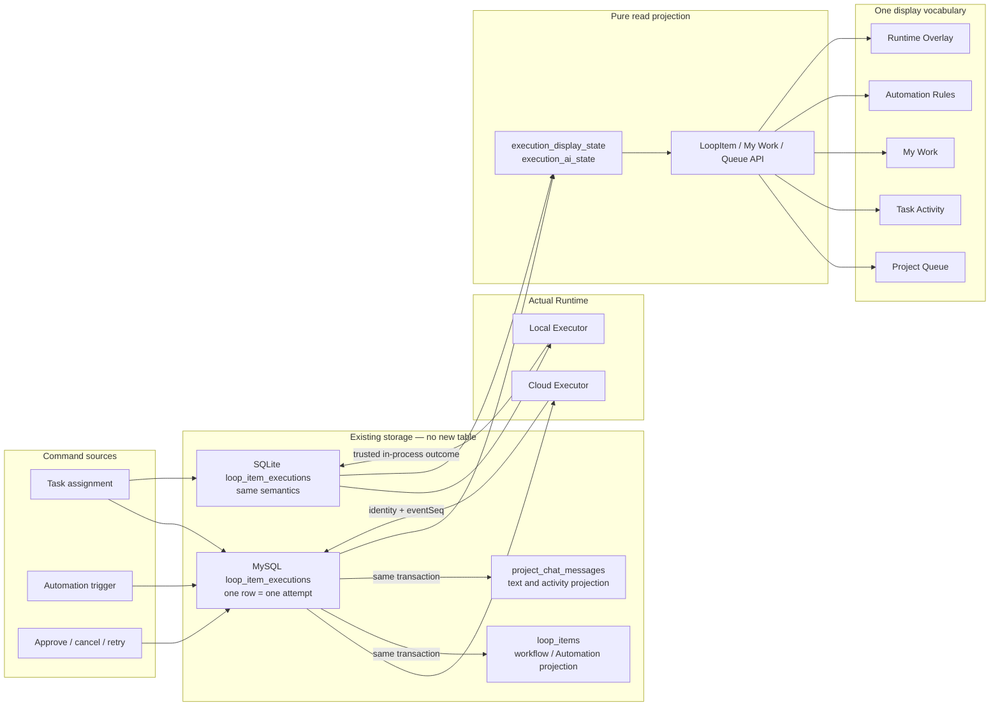

The direction is one-way: Execution → Message/Automation/Workflow projections. A message, `metadata.ai_state`, board lane, or UI cannot decide Execution state.

## 3. Zero-new-table model

One existing `loop_item_executions` row is one attempt. The migration only adds columns and the non-unique `idx_exec_scope_status` index; it contains no `CREATE TABLE`. Local SQLite applies `ALTER TABLE` to its existing table and moves to schema version 6.

| Dimension | Columns | Meaning |
| --- | --- | --- |
| Control | `status` | `pending_approval`, `queued`, `claimed`, `running`, `cancel_requested`, `completed`, `failed`, `cancelled` |
| Runtime observation | `observed_state`, `observed_at` | Latest verified Runtime state and evidence time |
| Sync health | `sync_state` | `pending`, `in_sync`, `stale`, `diverged` |
| Attempt causality | `attempt_no`, `previous_execution_id` | Attempt number and previous-attempt link |
| Concurrency domain | `execution_scope` | Project robot by task; manager by Automation Run |
| Start fence | `claimed_at`, `start_requested_at` | Separates a releasable claim from a Start that may have arrived |
| Runtime identity | `runtime_device_id`, `runtime_task_id` | Task ID is deterministically `codex-queue-{execution.id}` and validated at every write |
| Event fence | `last_event_seq` | Only a greater Runtime sequence is accepted |
| Cancellation/terminal | `cancel_requested_at`, `termination_reason` | Cancellation intent time and confirmed terminal reason |
| Control lease | `heartbeat_at`, `lease_expires_at` | Dispatcher/claim liveness, never standalone process proof |

There is deliberately no unique `runtime_task_id` index: a row is inserted before its ID exists, and historical empty defaults would conflict. Deterministic identity validation plus `execution_scope`, agent occupancy, owner/device locks, and CAS enforce the invariant.

## 4. Independent dimensions and display state

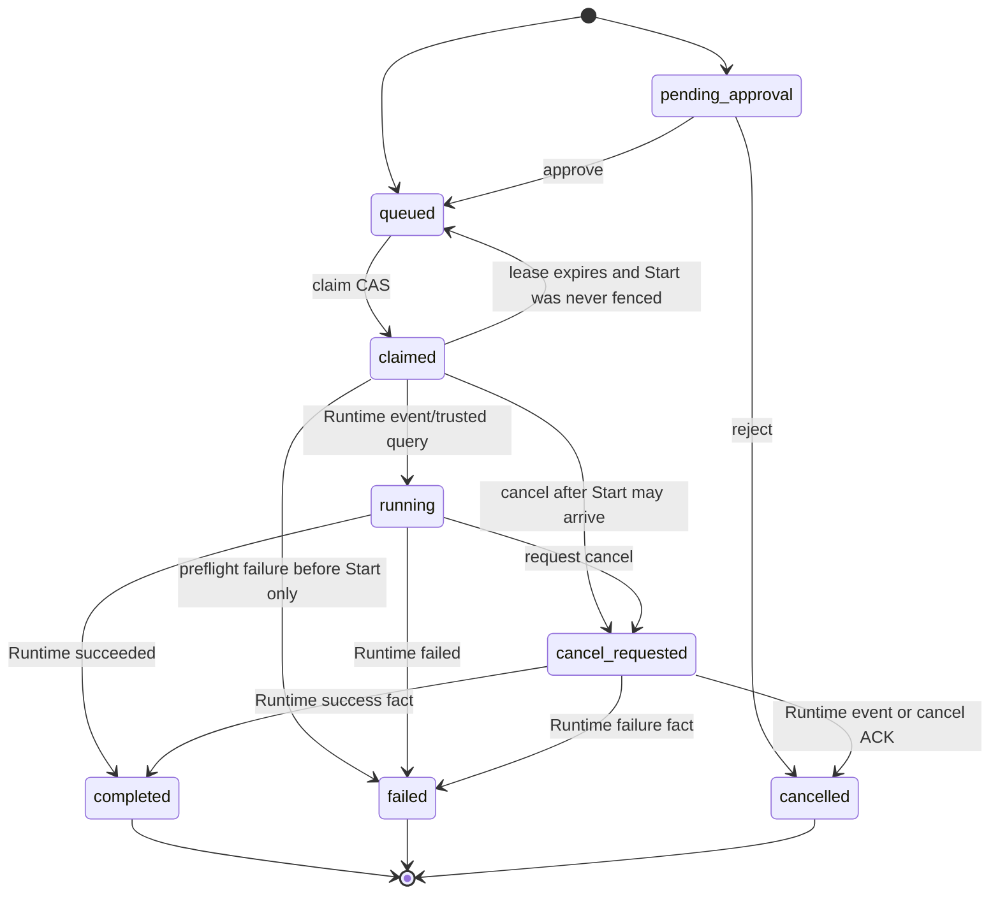

Display state is derived at request time with fixed precedence:

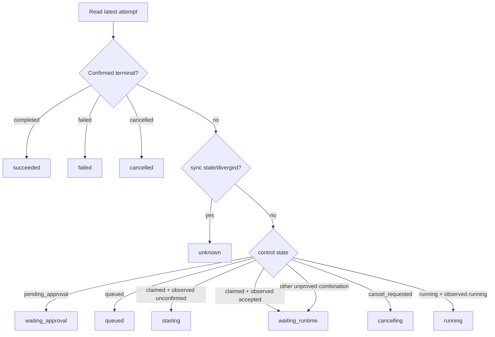

Updating `heartbeat_at` therefore cannot turn `starting/unknown` into `running`, and stale sync health cannot hide a confirmed terminal outcome.

## 5. Cloud startup sequence

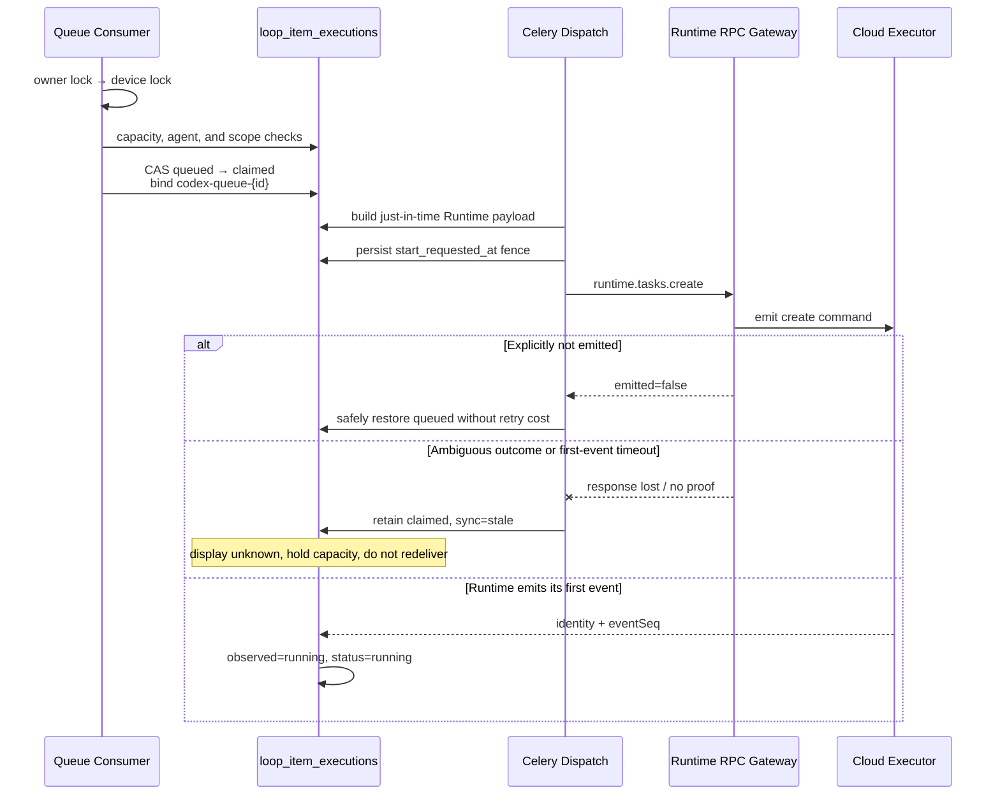

An RPC transport failure is distinct from an explicit `emitted=false`. After the Start fence, ambiguity can only become unknown.

## 6. Local/App startup sequence

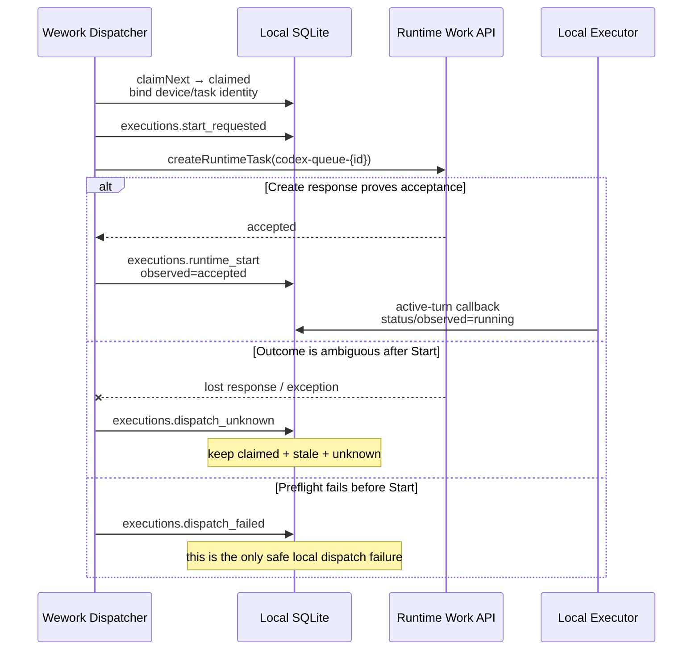

App IPC no longer exposes dispatcher-callable `executions.complete` or `executions.fail`. Local Executor turn outcomes write terminal state.

## 7. Event ordering and atomic terminal state

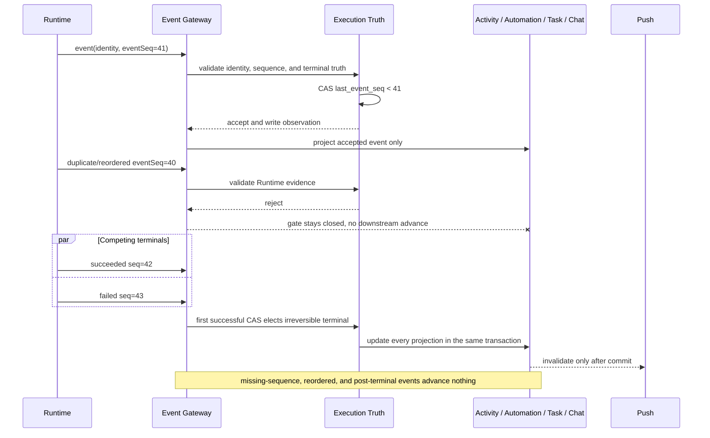

Manual rejection uses the same transaction boundary: Execution, Activity, Automation projection, and task-version CAS commit together. Internal helpers cannot commit early.

## 8. Cancellation sequence

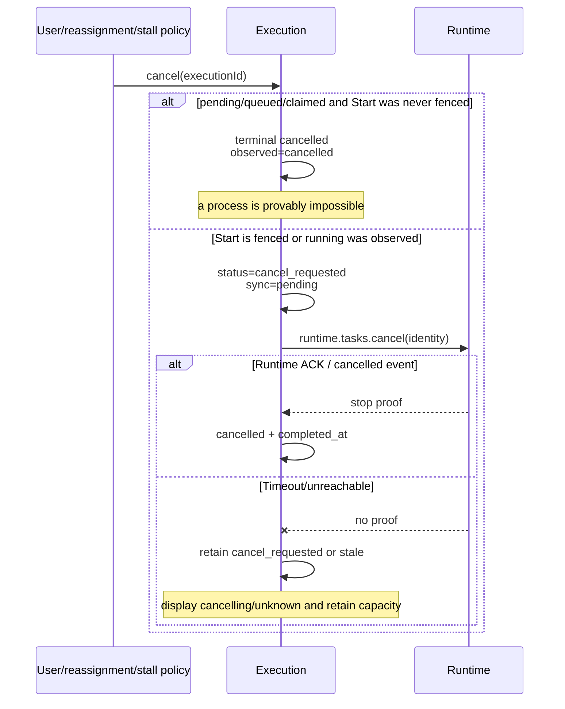

The local Queue stop action first calls local `executions.cancel`, then calls `cancelRuntimeTask` with the identity stored on that row. It no longer calls the cloud stop API.

## 9. Retry and late-event isolation

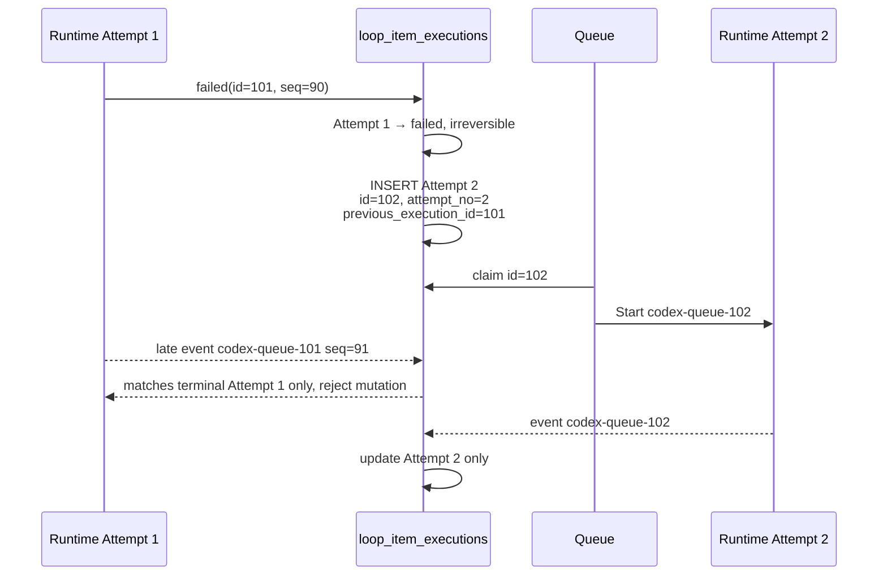

Only a proven Runtime failure may consume retry budget and create a retry attempt. A definitively pre-Start infrastructure failure may restore the same row to queued because no process can exist.

## 10. Lease expiry, unknown, and reconciliation

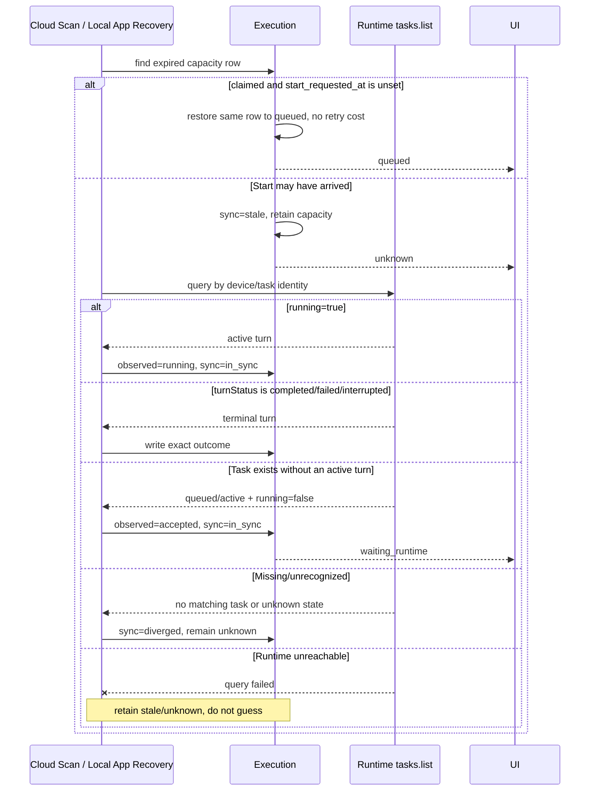

Both Cloud Scan and Local App reconcile by the persisted device/task identity. Local App uses `executions.list_stale` and `executions.reconcile` to recover events lost while it was offline. `task.status=active` alone is not running proof; reconciliation must combine `running` and `turnStatus`.

A long-running attempt with no text only triggers `cancel_requested` plus Runtime cancellation; it is not manufactured into `failed`.

## 11. Concurrency and capacity

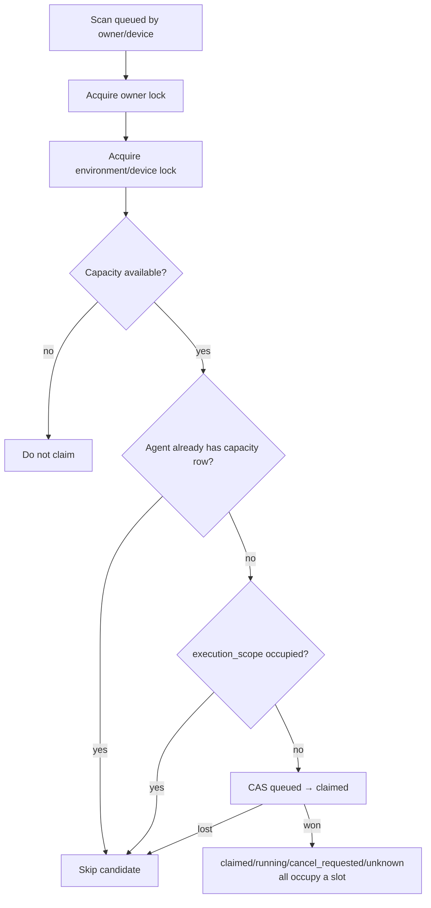

Lock order is owner → device → database CAS. Unknown retains its slot; releasing it could run a new attempt beside a still-running process.

## 12. Pure reads and UI consistency

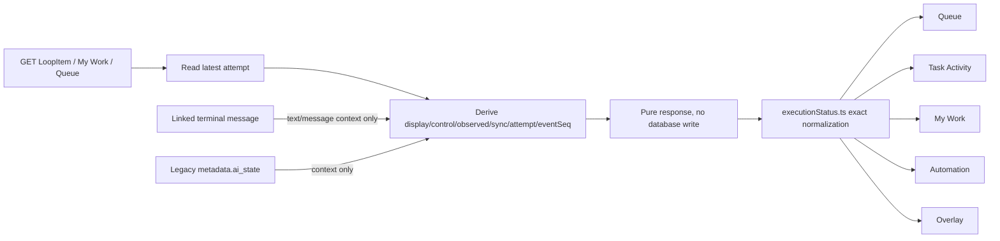

Precedence is latest Execution → linked terminal-message context → legacy cache. Expired cache becomes `unknown` in the response only. `failed`, `cancelled`, `skipped`, and `succeeded` remain distinct in the UI.

## 13. Implemented and removed entry points

Cloud/App startup protocol:

- `start-requested` persists the Start fence.
- `runtime-start` records Runtime acceptance without claiming running.
- `dispatch-unknown` holds capacity when Start outcome is ambiguous.
- `dispatch-failed` is valid only for a proven pre-Start failure.
- Runtime events and trusted status queries are the only running and execution-terminal authorities.

Direct App dispatcher `complete`/`fail` entry points were removed. Heartbeat requires the exact execution/device/task identity and only extends the lease.

## 14. Acceptance matrix

| Scenario | Required result | Forbidden result |
| --- | --- | --- |
| Claimed, Start not sent | `starting` | `running` |
| Runtime accepted, no active turn yet | `waiting_runtime` | `starting` or `running` |
| Start response lost | `unknown`, capacity held | Same-row redelivery or duplicate run |
| First Runtime event | `running` with `observed_at/eventSeq` | Heartbeat-as-proof |
| Missing-sequence, duplicate, reordered, or post-terminal event | Execution and every downstream projection ignore it | Message/activity bypasses the truth gate |
| Cancel before Start | Immediate `cancelled` | Pointless Runtime cancel |
| Cancel after Start | `cancelling` until ACK/event | Immediate fake cancelled |
| Lease expires before Start | Same row queued, retry unchanged | Duplicate attempt |
| Lease expires after possible Start | Unknown, reconcile, hold capacity | Automatic failure/redelivery |
| Runtime failure and retry | Old row failed, new row queued | Old row changed back to queued |
| GET/page refresh | State unchanged | Read-time mutation |
| My Work/Queue/Detail/Automation | Same exact display state | Pending/claimed shown as running |
| Migration | ALTER existing table and create index only | Any new table |

## 15. Automated and manual verification

Automation must cover: no `create_table` migration, claim/identity/Start fence, event sequence, competing terminals, pre/post-Start cancellation, ambiguous dispatch, cloud/local recovery and reconciliation (including `running` plus `turnStatus`), new-attempt retry, same-transaction projections, pure GET, local IPC/store, UI mapping, and TypeScript/Rust compilation.

Manual acceptance sequence:

1. Run one cloud and one local task through `queued → starting → (optional waiting_runtime) → running → succeeded`.
2. Disconnect after Start and verify unknown appears without a second launch.
3. Cancel once while queued and once while running; verify immediate terminal versus cancelling-first behavior.
4. Produce a Runtime failure and verify retry preserves the old attempt and uses a new task ID.
5. Open Queue, Task Activity, My Work, Automation, and Overlay together and compare states.
6. Refresh and repeat GET requests; verify reads do not change state.
