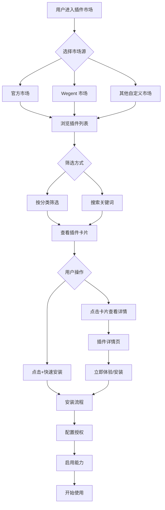
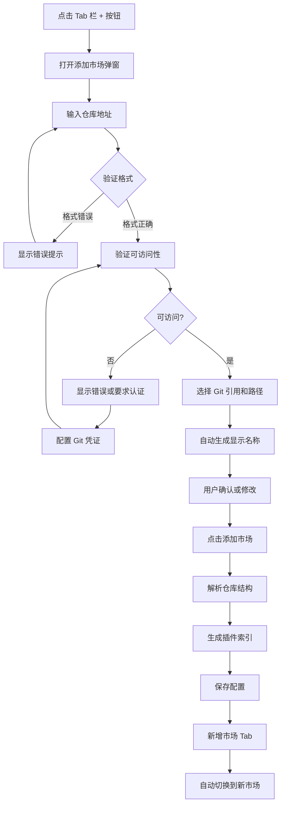
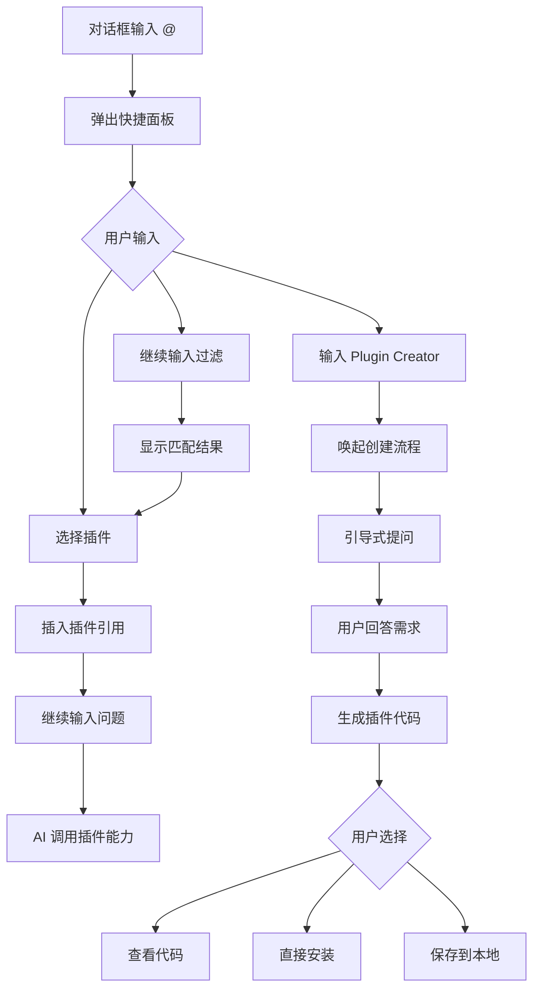

# WeWork 插件市场 - 完整交互规范文档

## 文档说明

本文档为 WeWork 插件市场优化项目的完整交互规范，包含页面设计、交互流程、技术实现等全部内容。

**项目背景**：基于现有 WeWork 插件功能，参考 Codex 的交互模式，实现面向中国用户的插件市场优化方案。

**核心目标**：
1. 完全汉化界面，符合中国用户习惯
2. 统一插件概念，底层区分类型（Connector、MCP、Skill、CLI）
3. 支持多开源市场，智能命名和管理
4. 提供 @ 快捷创建和引用插件的交互
5. 保持与原型设计的高度还原

---

## 文档结构

本规范文档由以下部分组成：

### 1. 组件库和样式规范
**文件**：`01-组件库和样式规范.md`

包含内容：
- 设计原则和视觉风格
- 色彩、间距、圆角规范
- 通用组件库（插件卡片、Tab、按钮、表单等）
- 图标系统
- 响应式布局
- 动画效果
- 可访问性规范

### 2. 插件市场页面详细设计
**文件**：`02-插件市场页面详细设计.md`

包含内容：
- 插件市场主页（市场源 Tab、分类标签、插件列表）
- 插件管理页（类型筛选、已安装列表）
- 插件详情页（应用授权、包含能力、使用示例）
- 响应式适配
- 加载状态和错误处理

### 3. 多仓库市场管理规范
**文件**：`03-多仓库市场管理规范.md`

包含内容：
- 添加插件市场弹窗设计
- 市场 Tab 管理（命名规则、交互、排序）
- 仓库结构解析（插件清单格式、目录结构）
- 缓存策略
- 权限和安全检查
- 数据模型和 API 接口

### 4. @ 创建插件交互规范
**文件**：`04-@创建插件交互规范.md`

包含内容：
- @ 快捷面板设计（触发方式、面板布局、交互行为）
- 创建插件入口（引导式创建流程）
- 插件引用语法（基本引用、多插件、参数）
- 高级功能（插件组合、别名、智能推荐）
- 技术实现和性能优化

---

## 核心设计决策

### 1. 统一插件概念

**问题**：WeWork 现有多种类型（插件、应用、MCP、技能、市场）分散展示，用户认知成本高

**解决方案**：
- 前端统一称为"插件"，在市场和管理页都只显示"插件"入口
- 底层仍然区分类型（Connector、MCP、Skill、CLI），在设置页和详情页展示
- 一个插件可以包含多种能力类型

**示例**：
```
插件：GitHub
包含能力：
  - Connector: GitHub App（连接账号）
  - CLI: gh（命令行工具）
  - Skill: PR 审查（技能）
  - MCP: 仓库资源访问（MCP）
```

---

### 2. 多市场源管理

**问题**：如何让用户添加多个开源插件市场，并且命名清晰

**解决方案**：
- 市场源通过 Tab 切换，支持添加多个
- 第一个 Tab 固定为"官方"（云端市场）
- 后续 Tab 根据仓库地址智能生成名称，用户可自定义
- Tab 支持拖拽排序、长按重命名/删除

**命名规则**：
```
github.com/openai/plugins       → "OpenAI"
github.com/modelscope/mcp-servers → "ModelScope"
github.com/wegent/awesome-plugins → "Wegent"
本地路径 /local/plugins          → "本地市场"（可编辑）
```

---

### 3. @ 快捷交互

**问题**：如何让用户快速访问和使用插件

**解决方案**：
- 在对话框输入 `@` 唤起插件快捷面板
- 面板显示最近使用的插件，支持实时搜索过滤
- 点击插件将引用插入到对话中（如 `@GitHub 查看最新 PR`）
- 支持快速安装未安装的插件

**参考**：Codex 的 @ 交互模式

---

### 4. 创建插件流程

**问题**：创建插件的入口不够明显

**解决方案**：
- 方式 1：在对话中输入 `@Plugin Creator` 唤起创建流程
- 方式 2：管理页右上角"创建"下拉菜单中选择"创建插件"
- 系统通过对话引导用户完成插件创建

**创建下拉菜单**：
```
创建 ▼
  ├─ 创建插件
  ├─ 添加插件市场
  └─ 录制技能
```

---

## 页面流程图

### 插件市场使用流程



---

### 添加开源市场流程



---

### @ 创建插件流程



---

## 交互细节规范

### 1. 插件卡片交互

#### 悬停效果
- 边框颜色：#e5e5e5 → #d0d0d0
- 背景颜色：#ffffff → #fafafa
- 添加阴影：0 4px 12px rgba(0,0,0,0.08)
- 右侧按钮高亮

#### 点击行为
| 点击区域 | 行为 | 说明 |
|---------|------|------|
| 卡片主体 | 跳转详情页 | 查看完整信息 |
| 右侧 ▷ 按钮 | 跳转详情页 | 同上 |
| 右侧 + 按钮 | 快速安装 | 已安装显示 ✓ |

#### 右键菜单
```
┌──────────────┐
│ 在新标签打开   │
│ 复制插件链接   │
│ 分享插件       │
└──────────────┘
```

---

### 2. 市场源 Tab 交互

#### 切换逻辑
```javascript
function switchMarketTab(tabId) {
  // 1. 保存当前滚动位置
  saveScrollPosition(currentTabId);
  
  // 2. 切换 Tab
  setActiveTab(tabId);
  
  // 3. 加载对应市场插件
  loadPlugins(tabId);
  
  // 4. 恢复滚动位置
  restoreScrollPosition(tabId);
}
```

#### 长按菜单
- **触发**：长按 Tab 1 秒
- **菜单内容**：
  - 重命名
  - 刷新市场
  - 复制仓库地址
  - 删除市场

#### 拖拽排序
- **触发**：长按后移动
- **视觉反馈**：
  - 拖拽中的 Tab：scale(1.1)，添加阴影
  - 目标位置：显示 2px 蓝色插入线
- **约束**：官方 Tab 不可拖拽

---

### 3. 搜索和筛选

#### 搜索逻辑
```javascript
function searchPlugins(query) {
  const keywords = query.toLowerCase().split(/\s+/);
  
  return plugins.filter(plugin => {
    // 名称匹配
    if (plugin.name.toLowerCase().includes(query)) return true;
    
    // 描述匹配
    if (plugin.description.toLowerCase().includes(query)) return true;
    
    // 标签匹配
    if (plugin.tags.some(tag => tag.includes(query))) return true;
    
    // 拼音匹配（中文）
    if (matchPinyin(plugin.name, query)) return true;
    
    return false;
  });
}
```

#### 防抖处理
```javascript
const debouncedSearch = debounce(searchPlugins, 300);
```

#### 分类筛选
- 分类和搜索可叠加
- 显示筛选结果数量
- 无结果时显示空状态

---

### 4. 加载状态

#### 骨架屏
```
┌─────────────────────────────┐
│ ████████████                │ ← 图标
│ ████████████████████        │ ← 标题
│ ████████                    │ ← 描述
│ ████                        │ ← 元信息
└─────────────────────────────┘
```

**使用场景**：
- 页面初次加载
- 切换市场 Tab
- 分类筛选

#### 加载指示器
```
⟳ 正在加载插件...
```

**使用场景**：
- 搜索中
- 安装中
- 更新中

---

## 技术实现要点

### 1. 前端技术栈

**推荐方案**：
```
框架：React 18+
状态管理：Zustand / Jotai
样式方案：Tailwind CSS + CSS Modules
路由：React Router v6
HTTP 客户端：Axios
UI 组件：Radix UI（无样式基础组件）
图标库：Lucide Icons
虚拟滚动：react-window
拖拽：@dnd-kit
```

---

### 2. 核心数据模型

#### 市场配置
```typescript
interface MarketConfig {
  id: string;                    // 唯一标识
  name: string;                  // 显示名称
  source: string;                // 仓库 URL
  sourceType: 'github' | 'gitlab' | 'git' | 'local';
  gitRef?: string;               // Git 分支/标签
  path?: string;                 // 仓库内路径
  order: number;                 // 排序
  enabled: boolean;              // 是否启用
  createdAt: Date;
  updatedAt: Date;
}
```

#### 插件信息
```typescript
interface Plugin {
  uid: string;                   // marketId:pluginId
  marketId: string;              // 所属市场
  pluginId: string;              // 插件 ID
  name: string;                  // 名称
  description: string;           // 描述
  version: string;               // 版本
  author: string;                // 作者
  category: string;              // 分类
  icon: string;                  // 图标
  capabilities: {                // 包含能力
    connector?: string[];
    cli?: string[];
    skill?: string[];
    mcp?: string[];
  };
  installed: boolean;            // 是否已安装
  enabled: boolean;              // 是否启用
  installedAt?: Date;
  lastUsed?: Date;
}
```

---

### 3. API 接口设计

#### 市场管理
```typescript
// 添加市场
POST /api/markets
Request: {
  source: string;
  gitRef?: string;
  path?: string;
  name?: string;
}
Response: {
  success: boolean;
  market: MarketConfig;
}

// 获取市场列表
GET /api/markets
Response: {
  markets: MarketConfig[];
}

// 更新市场
PUT /api/markets/:id
Request: {
  name?: string;
  order?: number;
  enabled?: boolean;
}

// 删除市场
DELETE /api/markets/:id

// 刷新市场
POST /api/markets/:id/refresh
```

#### 插件管理
```typescript
// 获取插件列表
GET /api/plugins?marketId=&category=&search=
Response: {
  plugins: Plugin[];
  total: number;
}

// 获取插件详情
GET /api/plugins/:uid

// 安装插件
POST /api/plugins/:uid/install

// 卸载插件
POST /api/plugins/:uid/uninstall

// 启用/禁用插件
POST /api/plugins/:uid/toggle
Request: {
  enabled: boolean;
}

// 更新插件
POST /api/plugins/:uid/update
```

---

### 4. 性能优化

#### 列表虚拟化
```typescript
import { FixedSizeList } from 'react-window';

const VirtualPluginList = ({ plugins }) => (
  <FixedSizeList
    height={600}
    itemCount={plugins.length}
    itemSize={120}
    width="100%"
  >
    {({ index, style }) => (
      <PluginCard 
        plugin={plugins[index]} 
        style={style} 
      />
    )}
  </FixedSizeList>
);
```

#### 图片懒加载
```typescript
const PluginIcon = ({ src, alt }) => (
  
);
```

#### 路由懒加载
```typescript
const MarketplacePage = lazy(() => import('./pages/Marketplace'));
const ManagePage = lazy(() => import('./pages/Manage'));
const DetailPage = lazy(() => import('./pages/Detail'));
```

#### 缓存策略
```typescript
// React Query 缓存
const { data } = useQuery({
  queryKey: ['plugins', marketId],
  queryFn: () => fetchPlugins(marketId),
  staleTime: 5 * 60 * 1000, // 5 分钟
  cacheTime: 30 * 60 * 1000, // 30 分钟
});
```

---

### 5. 安全措施

#### XSS 防护
```typescript
// 转义用户输入
import DOMPurify from 'dompurify';

const SafeHTML = ({ content }) => (
  <div dangerouslySetInnerHTML={{ 
    __html: DOMPurify.sanitize(content) 
  }} />
);
```

#### CSP 策略
```http
Content-Security-Policy: 
  default-src 'self';
  script-src 'self' 'unsafe-inline';
  style-src 'self' 'unsafe-inline';
  img-src 'self' data: https:;
  connect-src 'self' https://api.wework.com;
```

#### 仓库安全扫描
```typescript
async function scanRepository(url: string) {
  // 检查恶意代码特征
  const patterns = [
    /eval\(/,
    /Function\(/,
    /document\.write\(/,
    // 更多规则...
  ];
  
  const files = await cloneAndReadFiles(url);
  
  for (const file of files) {
    for (const pattern of patterns) {
      if (pattern.test(file.content)) {
        return { 
          safe: false, 
          reason: '检测到可疑代码' 
        };
      }
    }
  }
  
  return { safe: true };
}
```

---

## 测试策略

### 1. 单元测试

**工具**：Jest + React Testing Library

**测试覆盖**：
- 组件渲染
- 用户交互
- 状态管理
- 工具函数

**示例**：
```typescript
describe('PluginCard', () => {
  it('renders plugin information', () => {
    render(<PluginCard plugin={mockPlugin} />);
    expect(screen.getByText('GitHub')).toBeInTheDocument();
  });
  
  it('calls onInstall when + button clicked', () => {
    const onInstall = jest.fn();
    render(<PluginCard plugin={mockPlugin} onInstall={onInstall} />);
    fireEvent.click(screen.getByRole('button', { name: '添加' }));
    expect(onInstall).toHaveBeenCalled();
  });
});
```

---

### 2. 集成测试

**工具**：Cypress / Playwright

**测试场景**：
- 浏览插件市场
- 搜索和筛选插件
- 添加开源市场
- 安装和卸载插件
- @ 快捷面板交互

**示例**：
```typescript
describe('Plugin Marketplace', () => {
  it('should filter plugins by category', () => {
    cy.visit('/plugins/marketplace');
    cy.get('[data-testid="category-tab-开发工具"]').click();
    cy.get('[data-testid="plugin-card"]')
      .should('have.length.greaterThan', 0)
      .each($card => {
        cy.wrap($card)
          .find('[data-testid="plugin-category"]')
          .should('contain', '开发工具');
      });
  });
});
```

---

### 3. 性能测试

**指标**：
- 首屏加载时间 < 2s
- 插件列表渲染 < 500ms
- 搜索响应时间 < 200ms
- 页面切换 < 300ms

**工具**：Lighthouse / WebPageTest

---

### 4. 可访问性测试

**工具**：axe-core / Pa11y

**检查项**：
- 键盘导航
- 屏幕阅读器兼容
- 对比度
- ARIA 属性

---

## 发布计划

### Phase 1：核心功能（2 周）
- [x] 组件库搭建
- [x] 插件市场主页
- [x] 插件详情页
- [x] 基础搜索和筛选

### Phase 2：多市场支持（2 周）
- [ ] 添加市场弹窗
- [ ] 市场 Tab 管理
- [ ] 仓库解析和索引
- [ ] 缓存机制

### Phase 3：@ 快捷交互（1 周）
- [ ] @ 快捷面板
- [ ] 插件引用语法
- [ ] 快速安装
- [ ] 智能推荐

### Phase 4：优化和测试（1 周）
- [ ] 性能优化
- [ ] 单元测试
- [ ] 集成测试
- [ ] 可访问性优化

### Phase 5：上线和迭代（持续）
- [ ] 灰度发布
- [ ] 用户反馈收集
- [ ] 功能迭代
- [ ] 插件生态建设

---

## 附录

### A. 汉化对照表

| 英文 | 中文 |
|------|------|
| Plugins | 插件 |
| Marketplace | 插件市场 |
| Manage | 管理 |
| Create | 创建 |
| Install | 安装 / 立即体验 |
| Uninstall | 卸载 |
| Enable | 启用 |
| Disable | 禁用 |
| Connectors | 连接器 |
| MCP | MCP |
| Skills | 技能 |
| CLI | 命令行工具 |
| Developer Tools | 开发工具 |
| Enterprise Platform | 企业平台 |
| Productivity | 生产力 |
| Data Analysis | 数据分析 |
| Design Tools | 设计工具 |
| Featured | 常用插件 |
| All Plugins | 全部插件 |
| Search | 搜索 |
| Filter | 筛选 |
| Sort | 排序 |
| Official | 官方 |
| Community | 社区 |
| Version | 版本 |
| Author | 作者 |
| Category | 分类 |
| Description | 描述 |
| Capabilities | 包含能力 |
| Get Started | 开始使用 |
| Recently Used | 最近使用 |
| Add Market | 添加市场 |
| Refresh | 刷新 |
| Delete | 删除 |
| Rename | 重命名 |
| Copy | 复制 |

---

### B. 快捷键列表

| 快捷键 | 功能 | 页面 |
|-------|------|------|
| `Cmd/Ctrl + K` | 打开 @ 面板 | 对话页 |
| `Cmd/Ctrl + P` | 打开插件市场 | 全局 |
| `Cmd/Ctrl + ,` | 打开设置 | 全局 |
| `/` | 聚焦搜索框 | 市场页 |
| `Esc` | 关闭面板/弹窗 | 全局 |
| `↑/↓` | 列表导航 | @ 面板 |
| `Enter` | 选中/确认 | @ 面板 |
| `Tab` | 下一项 | 表单 |

---

### C. 相关资源

- **设计稿**：Figma 链接（待补充）
- **原型**：Prototype 链接（待补充）
- **API 文档**：Swagger 链接（待补充）
- **Git 仓库**：GitHub/GitLab 链接（待补充）

---

**文档版本**：v1.0  
**创建日期**：2026-07-27  
**最后更新**：2026-07-27  
**维护者**：WeWork 产品团队  
**审核状态**：待审核
