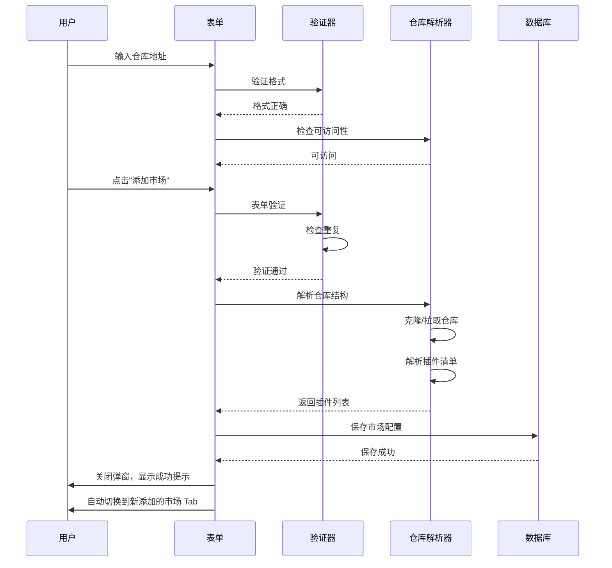

# WeWork 插件市场 - 多仓库市场管理规范

## 1. 概述

### 1.1 功能定位
多仓库市场功能允许用户添加自定义的开源插件仓库，实现插件的多源管理。用户可以从 GitHub、GitLab 或本地路径添加插件市场源，并在统一的界面中浏览和管理所有来源的插件。

### 1.2 核心特性
- 支持添加多个开源仓库
- 自动解析仓库结构和插件清单
- 智能命名和自定义显示名称
- 独立的插件索引和缓存
- 支持私有仓库（需要认证）

---

## 2. 添加插件市场弹窗

### 2.1 触发方式

**入口 1**：插件市场主页 - Tab 栏右侧 [+] 按钮
```
[官方] [Wegent] [ModelScope] [+] ← 点击此处
```

**入口 2**：插件管理页 - 创建下拉菜单
```
创建 ▼
  ├─ 创建插件
  ├─ 添加插件市场  ← 点击此处
  └─ 录制技能
```

---

### 2.2 弹窗设计

```
┌─────────────────────────────────────────────────────┐
│ 添加插件市场                                      ✕ │
│                                                     │
│ 从 GitHub 仓库、Git URL 或本地文件夹添加。了解更多  │
│                                                     │
│ 来源 *                                              │
│ ┌─────────────────────────────────────────────────┐ │
│ │ openai/plugins 或 git@github.com:org/repo.git   │ │
│ └─────────────────────────────────────────────────┘ │
│                                                     │
│ Git 引用（可选）                                    │
│ ┌─────────────────────────────────────────────────┐ │
│ │ main                                            │ │
│ └─────────────────────────────────────────────────┘ │
│                                                     │
│ 输入路径（可选）                                    │
│ ┌─────────────────────────────────────────────────┐ │
│ │ plugins/                                        │ │
│ └─────────────────────────────────────────────────┘ │
│ 仓库内插件目录的相对路径                             │
│                                                     │
│ 市场显示名称（可选）                                │
│ ┌─────────────────────────────────────────────────┐ │
│ │ OpenAI 插件                                     │ │
│ └─────────────────────────────────────────────────┘ │
│ 将显示在市场 Tab 中，留空则自动生成                  │
│                                                     │
│                                    [取消] [添加市场] │
└─────────────────────────────────────────────────────┘
```

---

### 2.3 表单字段说明

#### 2.3.1 来源（必填）

**支持格式**：

| 格式 | 示例 | 说明 |
|------|------|------|
| 简写格式 | `openai/plugins` | GitHub 仓库简写 |
| HTTPS URL | `https://github.com/openai/plugins.git` | 完整 HTTPS Git URL |
| SSH URL | `git@github.com:openai/plugins.git` | SSH Git URL |
| GitLab | `gitlab.com:group/repo` | GitLab 仓库 |
| 本地路径 | `/Users/username/plugins` | 本地文件夹绝对路径 |

**验证规则**：
```javascript
function validateSource(input) {
  // GitHub 简写
  if (/^[\w-]+\/[\w-]+$/.test(input)) {
    return { type: 'github-short', url: `https://github.com/${input}.git` };
  }
  
  // HTTPS URL
  if (input.startsWith('https://')) {
    return { type: 'https', url: input };
  }
  
  // SSH URL
  if (input.startsWith('git@')) {
    return { type: 'ssh', url: input };
  }
  
  // 本地路径
  if (input.startsWith('/') || input.startsWith('~')) {
    return { type: 'local', path: input };
  }
  
  throw new Error('不支持的来源格式');
}
```

**输入提示**：
- 占位符：`openai/plugins 或 git@github.com:org/repo.git`
- 实时验证：输入时显示格式是否正确
- 错误提示：格式错误时显示红色边框和错误信息

---

#### 2.3.2 Git 引用（可选）

**用途**：指定要使用的分支、标签或提交

**示例**：
```
main          ← 默认值（主分支）
develop       ← 其他分支
v1.2.0        ← 特定标签
abc123        ← 特定提交 hash
```

**验证**：
- 非空时验证分支/标签是否存在（异步）
- 留空则使用仓库默认分支

**输入提示**：
- 占位符：`main`
- 帮助文本：`留空使用默认分支`

---

#### 2.3.3 输入路径（可选）

**用途**：指定仓库内插件目录的相对路径

**场景**：
- 插件不在仓库根目录
- 一个仓库包含多个插件集合

**示例**：
```
plugins/             ← 插件在 /plugins 目录
packages/codex/      ← 嵌套目录
.                    ← 根目录（默认）
```

**验证**：
- 路径必须是相对路径（不能以 `/` 开头）
- 验证路径在仓库中是否存在

**输入提示**：
- 占位符：`plugins/`
- 帮助文本：`仓库内插件目录的相对路径`

---

#### 2.3.4 市场显示名称（可选）

**用途**：自定义在 Tab 中显示的市场名称

**自动生成规则**：
```javascript
function generateMarketName(source) {
  const url = parseGitUrl(source);
  
  // 提取 org/user 名称
  let org = url.owner;
  let repo = url.repo;
  
  // 特殊处理通用 org 名
  const genericOrgs = ['github', 'gitlab', 'git', 'awesome'];
  if (genericOrgs.includes(org.toLowerCase())) {
    // 使用 repo 名称
    return formatName(repo);
  }
  
  // 使用 org 名称
  return formatName(org);
}

function formatName(name) {
  // 去掉后缀
  name = name.replace(/-(plugins|mcp|servers?)$/i, '');
  
  // 首字母大写
  return name.charAt(0).toUpperCase() + name.slice(1);
}
```

**命名示例**：

| 仓库地址 | 自动生成 | 说明 |
|---------|---------|------|
| `openai/plugins` | OpenAI | 提取 org 名 |
| `modelscope/mcp-servers` | ModelScope | 提取 org 名，去掉后缀 |
| `github/awesome-plugins` | Awesome Plugins | org 是通用名，使用 repo |
| `/local/my-plugins` | My Plugins | 本地路径，使用文件夹名 |

**用户自定义**：
- 用户可以覆盖自动生成的名称
- 支持中文、英文、数字、空格
- 最大长度：20 字符

**输入提示**：
- 占位符：显示自动生成的名称（灰色）
- 帮助文本：`将显示在市场 Tab 中，留空则自动生成`

---

### 2.4 表单验证

#### 2.4.1 实时验证

**来源字段**：
```javascript
async function validateSourceField(input) {
  // 1. 格式验证（同步）
  if (!isValidFormat(input)) {
    return { valid: false, error: '格式不正确' };
  }
  
  // 2. 可访问性验证（异步）
  try {
    const result = await checkRepositoryAccess(input);
    if (!result.accessible) {
      return { valid: false, error: '无法访问仓库，请检查 URL 或权限' };
    }
    return { valid: true };
  } catch (error) {
    return { valid: false, error: error.message };
  }
}
```

**Git 引用字段**：
```javascript
async function validateGitRef(source, ref) {
  if (!ref) return { valid: true }; // 可选字段
  
  try {
    const branches = await fetchBranches(source);
    const tags = await fetchTags(source);
    
    if ([...branches, ...tags].includes(ref)) {
      return { valid: true };
    } else {
      return { valid: false, error: '分支或标签不存在' };
    }
  } catch (error) {
    return { valid: false, error: '无法验证引用' };
  }
}
```

#### 2.4.2 提交前验证

**必填字段检查**：
- 来源不能为空
- 来源格式必须正确

**重复性检查**：
```javascript
function checkDuplicate(source, existingMarkets) {
  const normalizedSource = normalizeGitUrl(source);
  
  for (const market of existingMarkets) {
    if (normalizeGitUrl(market.source) === normalizedSource) {
      return { duplicate: true, existingName: market.name };
    }
  }
  
  return { duplicate: false };
}
```

**错误提示**：
```
⚠️ 该市场已添加（显示名称："OpenAI"）
   [查看] [取消]
```

---

### 2.5 添加流程



---

### 2.6 加载状态

#### 添加中
```
┌─────────────────────────────────────┐
│ 添加插件市场                      ✕ │
│                                     │
│       ⟳                             │
│    正在添加市场...                   │
│    解析仓库结构中                    │
│                                     │
│    [取消]                           │
└─────────────────────────────────────┘
```

#### 进度步骤
1. 验证仓库可访问性
2. 克隆/拉取仓库
3. 解析插件清单
4. 保存配置

每个步骤显示对应的加载文本。

---

### 2.7 错误处理

#### 仓库不可访问
```
❌ 无法访问仓库
   URL 不存在或需要身份验证
   
   [配置 Git 凭证] [取消]
```

#### 私有仓库需要认证
```
🔒 该仓库需要身份验证
   请配置 Git 凭证后重试
   
   [打开设置] [取消]
```

#### 仓库格式不正确
```
⚠️ 仓库中未找到有效的插件清单
   请确认路径是否正确
   
   [修改路径] [取消]
```

---

## 3. 市场 Tab 管理

### 3.1 Tab 栏布局

```
┌──────────────────────────────────────────────────┐
│ [官方] [Wegent] [ModelScope] [OpenAI] [+]       │
└──────────────────────────────────────────────────┘
```

**布局规则**：
- 官方 Tab 固定在第一位
- 自定义市场按添加顺序排列
- [+] 按钮固定在右侧
- 超出宽度时横向滚动

---

### 3.2 Tab 交互

#### 3.2.1 点击切换
- 点击 Tab 切换到对应市场
- 激活状态：背景 #f0f0f0，文字加粗
- 保存当前滚动位置

#### 3.2.2 长按菜单
```
┌──────────────┐
│ 重命名        │
│ 刷新市场       │
│ 复制仓库地址   │
│ 删除市场       │
└──────────────┘
```

**功能说明**：

1. **重命名**：打开输入框，修改显示名称
   ```
   ┌─────────────────────────────┐
   │ 市场名称                     │
   │ ┌─────────────────────────┐ │
   │ │ Wegent                  │ │
   │ └─────────────────────────┘ │
   │                             │
   │          [取消] [保存]      │
   └─────────────────────────────┘
   ```

2. **刷新市场**：重新拉取仓库，更新插件列表
   ```
   ⟳ 正在刷新"Wegent"市场...
   ```

3. **复制仓库地址**：复制原始仓库 URL 到剪贴板
   ```
   ✓ 已复制到剪贴板
   ```

4. **删除市场**：二次确认后删除
   ```
   ⚠️ 确认删除市场"Wegent"？
      删除后，已安装的插件将保留，但无法从该市场更新
      
      [取消] [删除]
   ```

#### 3.2.3 拖拽排序
- 长按 Tab 1 秒后进入拖拽模式
- 拖拽到目标位置松开即可排序
- 官方 Tab 不可拖拽
- 实时保存排序到本地配置

**视觉反馈**：
- 拖拽中的 Tab：放大 1.1 倍，添加阴影
- 目标位置：显示插入线

---

### 3.3 Tab 状态

#### 正常状态
```
[Wegent]
```

#### 加载中
```
[Wegent ⟳]
```

#### 错误状态
```
[Wegent ⚠️]
```

**错误提示**：
```
⚠️ "Wegent"市场加载失败
   无法连接到仓库
   
   [重试] [查看详情]
```

---

## 4. 仓库结构解析

### 4.1 插件清单格式

**标准格式**（JSON）：
```json
{
  "version": "1.0",
  "marketplace": {
    "name": "Wegent 插件市场",
    "description": "Wegent 官方和社区插件"
  },
  "plugins": [
    {
      "id": "github",
      "name": "GitHub",
      "description": "查看仓库、Issue、Pull Request 和 Actions",
      "version": "2.3.0",
      "author": "Wegent",
      "category": "开发工具",
      "icon": "./icons/github.png",
      "entry": "./plugins/github/",
      "capabilities": {
        "connector": ["github-app"],
        "cli": ["gh"],
        "skill": ["pr-review"],
        "mcp": ["repo-access"]
      }
    }
  ]
}
```

**文件位置**：
- 根目录：`/plugins.json`
- 自定义路径：用户指定的路径 + `/plugins.json`

---

### 4.2 插件目录结构

```
仓库根目录/
├── plugins.json          # 插件清单（必需）
├── README.md             # 市场说明
├── icons/                # 图标资源
│   ├── github.png
│   └── gitlab.png
└── plugins/              # 插件目录
    ├── github/
    │   ├── plugin.json   # 插件配置
    │   ├── connector.js  # Connector 实现
    │   ├── cli.js        # CLI 实现
    │   └── skill.md      # Skill 定义
    └── gitlab/
        └── ...
```

---

### 4.3 解析流程

```javascript
async function parseRepository(config) {
  // 1. 克隆/拉取仓库
  const repoPath = await cloneRepository({
    url: config.source,
    ref: config.gitRef || 'main',
    localPath: `/tmp/markets/${generateId()}`
  });
  
  // 2. 读取插件清单
  const manifestPath = path.join(repoPath, config.path || '', 'plugins.json');
  const manifest = await readJSON(manifestPath);
  
  // 3. 验证清单格式
  validateManifest(manifest);
  
  // 4. 解析插件列表
  const plugins = manifest.plugins.map(plugin => ({
    ...plugin,
    source: config.name,
    sourceType: 'custom',
    localPath: path.join(repoPath, config.path || '', plugin.entry)
  }));
  
  // 5. 构建索引
  return {
    marketInfo: manifest.marketplace,
    plugins: plugins,
    lastUpdated: new Date()
  };
}
```

---

### 4.4 缓存策略

#### 本地缓存
```javascript
const cacheStructure = {
  markets: {
    'wegent': {
      config: { /* 用户配置 */ },
      repoPath: '/cache/markets/wegent',
      manifest: { /* 解析后的清单 */ },
      plugins: [ /* 插件列表 */ ],
      lastUpdated: '2026-07-27T10:00:00Z',
      lastFetched: '2026-07-27T10:00:00Z'
    }
  }
};
```

#### 更新策略
- **自动更新**：每 24 小时检查一次更新
- **手动更新**：用户点击"刷新市场"
- **增量更新**：只拉取变更的文件

#### 清除缓存
```javascript
function clearMarketCache(marketId) {
  // 删除本地仓库副本
  fs.removeSync(`/cache/markets/${marketId}`);
  
  // 清除数据库记录
  db.markets.delete(marketId);
  
  // 触发重新加载
  reloadMarket(marketId);
}
```

---

## 5. 插件来源标识

### 5.1 来源标签

**显示位置**：
- 插件卡片底部
- 插件详情页元信息

**样式**：
```
官方 · v2.3.0 · 开发工具
Wegent · v1.2.0 · 企业平台
ModelScope · v0.9.0 · 数据分析
```

**颜色编码**：
- 官方：蓝色 #2196f3
- 自定义市场：灰色 #666666

---

### 5.2 插件唯一标识

```javascript
const pluginUID = `${source}:${pluginId}`;
// 示例：
// "official:github"
// "wegent:gitlab-enterprise"
// "modelscope:llm-connector"
```

**用途**：
- 区分不同市场的同名插件
- 存储用户安装记录
- 管理插件更新

---

## 6. 权限和安全

### 6.1 私有仓库认证

#### GitHub Personal Access Token
```
┌─────────────────────────────────────┐
│ GitHub 身份验证                     │
│                                     │
│ Personal Access Token (PAT)        │
│ ┌─────────────────────────────────┐ │
│ │ ghp_xxxxxxxxxxxxxxxxxxxx        │ │
│ └─────────────────────────────────┘ │
│                                     │
│ 所需权限：repo (只读)                │
│                                     │
│          [取消] [验证并保存]        │
└─────────────────────────────────────┘
```

#### SSH 密钥
```
┌─────────────────────────────────────┐
│ SSH 密钥配置                        │
│                                     │
│ 使用本地 SSH 密钥                   │
│ ☑ 使用 ~/.ssh/id_rsa               │
│                                     │
│ 或上传自定义密钥                    │
│ [选择文件]                          │
│                                     │
│          [取消] [保存]              │
└─────────────────────────────────────┘
```

---

### 6.2 安全检查

#### 仓库验证
```javascript
async function verifyRepository(url) {
  // 1. 检查 URL 合法性
  if (!isValidGitUrl(url)) {
    throw new Error('URL 格式不正确');
  }
  
  // 2. 检查仓库可访问性
  const accessible = await checkAccess(url);
  if (!accessible) {
    throw new Error('仓库不可访问或需要认证');
  }
  
  // 3. 扫描恶意内容
  const scanResult = await scanRepository(url);
  if (scanResult.hasVulnerability) {
    throw new Error(`发现安全风险：${scanResult.details}`);
  }
  
  return { verified: true };
}
```

#### 插件安全扫描
```javascript
async function scanPlugin(pluginPath) {
  // 1. 检查文件权限
  const hasExcessivePermissions = checkPermissions(pluginPath);
  
  // 2. 扫描可疑代码
  const suspiciousCode = scanForMaliciousPatterns(pluginPath);
  
  // 3. 检查依赖项
  const vulnerableDeps = await scanDependencies(pluginPath);
  
  return {
    safe: !hasExcessivePermissions && !suspiciousCode && !vulnerableDeps,
    warnings: [...] // 警告列表
  };
}
```

#### 安装前警告
```
⚠️ 安全提示
   该插件来自第三方市场"Wegent"
   请确认您信任该来源
   
   插件权限：
   • 读取文件系统
   • 执行 Shell 命令
   • 访问网络
   
   [取消] [信任并安装]
```

---

## 7. 数据模型

### 7.1 市场配置

```typescript
interface MarketConfig {
  id: string;                    // 唯一标识
  name: string;                  // 显示名称
  source: string;                // 仓库 URL 或路径
  sourceType: 'github' | 'gitlab' | 'git' | 'local';
  gitRef?: string;               // Git 分支/标签
  path?: string;                 // 仓库内路径
  createdAt: Date;               // 添加时间
  updatedAt: Date;               // 最后更新时间
  order: number;                 // 排序顺序
  enabled: boolean;              // 是否启用
  auth?: {                       // 认证信息
    type: 'token' | 'ssh';
    credentials: string;
  };
}
```

### 7.2 插件索引

```typescript
interface PluginIndex {
  uid: string;                   // 唯一标识：marketId:pluginId
  marketId: string;              // 所属市场
  pluginId: string;              // 插件 ID
  name: string;                  // 插件名称
  description: string;           // 插件描述
  version: string;               // 版本号
  author: string;                // 作者
  category: string;              // 分类
  icon: string;                  // 图标 URL
  capabilities: {                // 包含能力
    connector?: string[];
    cli?: string[];
    skill?: string[];
    mcp?: string[];
  };
  localPath: string;             // 本地路径
  installed: boolean;            // 是否已安装
  enabled: boolean;              // 是否启用
}
```

---

## 8. API 接口

### 8.1 添加市场

```typescript
POST /api/markets

Request:
{
  source: string;
  gitRef?: string;
  path?: string;
  name?: string;
  auth?: {
    type: 'token' | 'ssh';
    credentials: string;
  };
}

Response:
{
  success: boolean;
  market: MarketConfig;
  pluginCount: number;
}
```

### 8.2 列出市场

```typescript
GET /api/markets

Response:
{
  markets: MarketConfig[];
}
```

### 8.3 更新市场

```typescript
PUT /api/markets/:id

Request:
{
  name?: string;
  enabled?: boolean;
  order?: number;
}

Response:
{
  success: boolean;
  market: MarketConfig;
}
```

### 8.4 删除市场

```typescript
DELETE /api/markets/:id

Response:
{
  success: boolean;
}
```

### 8.5 刷新市场

```typescript
POST /api/markets/:id/refresh

Response:
{
  success: boolean;
  pluginCount: number;
  lastUpdated: Date;
}
```

### 8.6 查询插件

```typescript
GET /api/plugins?marketId=:id&category=:category&search=:query

Response:
{
  plugins: PluginIndex[];
  total: number;
}
```

---

## 9. 错误码

| 错误码 | 说明 | 处理方式 |
|-------|------|---------|
| MARKET_001 | 仓库 URL 格式错误 | 提示用户修正格式 |
| MARKET_002 | 仓库不可访问 | 检查网络或权限 |
| MARKET_003 | 仓库需要认证 | 提示配置凭证 |
| MARKET_004 | 未找到插件清单 | 检查路径配置 |
| MARKET_005 | 清单格式错误 | 联系市场维护者 |
| MARKET_006 | 市场已存在 | 提示重复添加 |
| MARKET_007 | 网络超时 | 重试或检查网络 |
| MARKET_008 | 存储空间不足 | 清理缓存或扩容 |

---

**版本**：v1.0  
**最后更新**：2026-07-27
