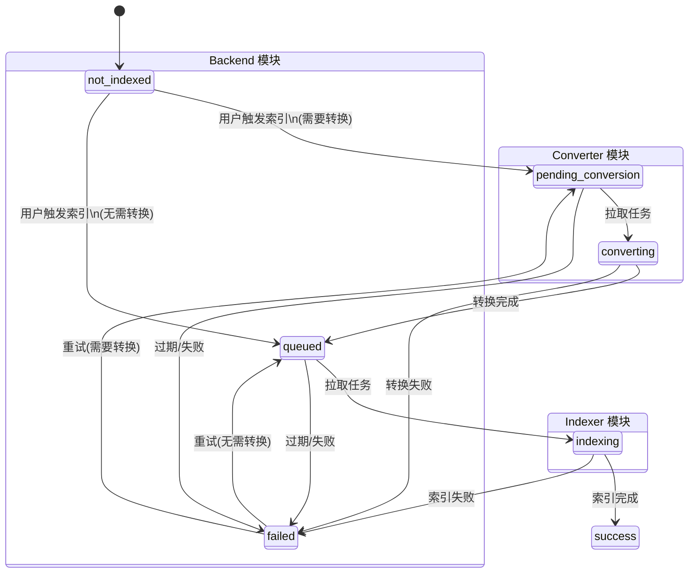

# 文档转换服务设计文档

## 背景

知识库系统原先仅支持纯文本、Markdown 等可直接索引的文档格式。对于 PDF、PPTX、DOCX 等需要 OCR 处理的文档类型，系统无法进行 RAG 索引。

为扩展知识库支持的文档类型，需要引入文档转换能力：将 PDF/Office 文档通过 OCR 转换为 Markdown 格式，然后进行正常的 RAG 索引流程。

## 目标

- 支持 PDF、DOCX、PPTX、XLSX 等文档格式转换为 Markdown
- 转换后的 Markdown 可正常进行 RAG 索引
- 转换服务独立部署，不与 Backend 强耦合
- 支持图片提取并上传到 S3，保持文档完整性
- 具备完善的监控、重试和过期检测机制

## 架构设计

### 整体架构

```
┌─────────────────────────────────────────────────────────────────────┐
│                          Backend (Orchestrator)                      │
│  ┌─────────────────────────────────────────────────────────────┐    │
│  │  1. 检测文件类型，判断是否需要转换                              │    │
│  │  2. 设置文档状态为 PENDING_CONVERSION                         │    │
│  │  3. 通过 Celery 发送任务到 knowledge_conversion 队列          │    │
│  └─────────────────────────────────────────────────────────────┘    │
└───────────────────────────┬─────────────────────────────────────────┘
                            │ Celery Task
                            ▼
┌─────────────────────────────────────────────────────────────────────┐
│                  Knowledge Doc Converter (微服务)                    │
│  ┌─────────────────────────────────────────────────────────────┐    │
│  │  1. 获取 Redis 分布式锁                                       │    │
│  │  2. 回调 Backend: conversion_started                         │    │
│  │  3. 从 Backend 下载附件二进制内容                              │    │
│  │  4. 调用 MinerU 进行 OCR 转换                                 │    │
│  │  5. 提取 Markdown + 图片                                      │    │
│  │  6. 上传图片到 S3（可选）                                      │    │
│  │  7. 回调 Backend: conversion_completed                       │    │
│  └─────────────────────────────────────────────────────────────┘    │
└───────────────────────────┬─────────────────────────────────────────┘
                            │ HTTP Callback
                            ▼
┌─────────────────────────────────────────────────────────────────────┐
│                          Backend (State Machine)                     │
│  ┌─────────────────────────────────────────────────────────────┐    │
│  │  1. 状态转换: CONVERTING → QUEUED                            │    │
│  │  2. 原子性更新文档元数据                                       │    │
│  │  3. 覆盖附件内容为 Markdown                                   │    │
│  │  4. 触发索引任务                                              │    │
│  └─────────────────────────────────────────────────────────────┘    │
└─────────────────────────────────────────────────────────────────────┘
```

### 状态流转



**模块颜色说明：**

| 颜色 | 模块 | 负责状态 | 职责 |
|------|------|----------|------|
| 🔵 浅蓝 | Backend | `not_indexed`, `queued`, `failed` | 判断转换需求、任务调度、失败管理 |
| 🟡 浅黄 | Converter | `pending_conversion`, `converting` | PDF/Office 文档转 Markdown |
| 🟢 浅绿 | Indexer | `indexing` | RAG 索引处理 |
| ⚪ 灰色 | 终态 | `success` | 索引完成 |

任意阶段失败 → `failed`

## 模块设计

### 1. Backend 改动

#### 1.1 新增状态

在 `DocumentIndexStatus` 中新增两个状态：

| 状态 | 说明 |
|------|------|
| `PENDING_CONVERSION` | 文档等待转换 worker 拉取 |
| `CONVERTING` | 文档正在被转换 |

#### 1.2 新增配置项

```python
# backend/app/core/config.py

# 文档转换总开关，关闭时所有文件直接索引
KNOWLEDGE_CONVERSION_ENABLED: bool = False

# 需要转换的文件类型，逗号分隔，如 ".pdf,.docx,.pptx"
KNOWLEDGE_CONVERSION_FILE_TYPES: str = ""

# 转换任务队列名称
KNOWLEDGE_CONVERSION_QUEUE: str = "knowledge_conversion"

# CONVERTING 状态过期阈值（秒）
# 必须大于 converter 的 CONVERSION_TASK_TIME_LIMIT
KNOWLEDGE_INDEX_STALE_CONVERTING_SECONDS: int = 12000
```

#### 1.3 新增 API 端点

**内部服务端点**，需要 `INTERNAL_SERVICE_TOKEN` 认证：

| 端点 | 方法 | 说明 |
|------|------|------|
| `/api/internal/attachments/{id}/download` | GET | 下载附件二进制内容 |
| `/api/internal/conversion/callback/status` | POST | 转换状态回调（started/failed） |
| `/api/internal/conversion/callback/completed` | POST | 转换完成回调 |

**状态回调请求体：**

```python
class ConversionStatusRequest(BaseModel):
    action: str  # "conversion_started" | "conversion_failed"
    document_id: int
    generation: int
    error_message: Optional[str] = None
```

**完成回调请求体：**

```python
class ConversionCompletedRequest(BaseModel):
    document_id: int
    generation: int
    converted_name: str  # 转换后的文件名，如 "report.md"
    converted_extension: str  # 转换后的扩展名，如 "md"
    file_size: int  # Markdown 文件大小
    markdown_bytes: str  # Base64 编码的 Markdown 内容
    index_dispatch_payload: dict  # 索引任务透传参数
```

#### 1.4 状态机扩展

新增两个状态转换函数：

```python
# backend/app/services/knowledge/index_state_machine.py

def mark_document_conversion_started(
    db: Session,
    document_id: int,
    generation: int,
) -> IndexExecutionDecision:
    """QUEUED/PENDING_CONVERSION → CONVERTING"""
    ...

def mark_document_conversion_succeeded(
    db: Session,
    document_id: int,
    generation: int,
    converted_extension: Optional[str] = None,
    converted_name: Optional[str] = None,
    converted_file_size: Optional[int] = None,
) -> bool:
    """CONVERTING → QUEUED，同时更新文档元数据"""
    ...
```

#### 1.5 编排器改动

```python
# backend/app/services/knowledge/orchestrator.py

async def _enqueue_document_index(...):
    normalized_extension = _normalize_file_extension(document.file_extension)

    if settings.needs_conversion(normalized_extension):
        # 设置状态为 PENDING_CONVERSION
        document.index_status = DocumentIndexStatus.PENDING_CONVERSION
        db.commit()

        # 发送任务到转换队列
        celery_app.send_task(
            "knowledge_doc_converter.convert_document",
            kwargs={...},
            queue=settings.KNOWLEDGE_CONVERSION_QUEUE,
        )
    else:
        # 直接索引
        index_document_task.delay(...)
```

#### 1.6 过期检测

新增过期原因：

| 原因 | 阈值 | 说明 |
|------|------|------|
| `stale_pending_conversion` | 20 分钟 | PENDING_CONVERSION 状态超时 |
| `stale_converting` | 200 分钟 | CONVERTING 状态超时 |

#### 1.7 定时扫描任务

新增 Celery Beat 定时任务，扫描并标记过期的转换/索引任务：

```python
# backend/app/tasks/knowledge_tasks.py

@celery_app.task(name="app.tasks.knowledge_tasks.scan_stale_index_tasks")
def scan_stale_index_tasks():
    """扫描所有活跃状态，标记过期任务为 FAILED"""
    ...
```

### 2. Knowledge Doc Converter 服务

独立的 Celery worker 微服务，负责文档格式转换。

#### 2.1 目录结构

```
knowledge_doc_converter/
├── knowledge_doc_converter/
│   ├── __init__.py
│   ├── config.py           # 配置管理
│   ├── celery_app.py       # Celery 应用配置
│   ├── core/
│   │   ├── __init__.py
│   │   ├── logging.py      # 日志配置
│   │   └── metrics.py      # Prometheus 指标
│   ├── services/
│   │   ├── __init__.py
│   │   ├── callback_client.py    # Backend 回调客户端
│   │   ├── content_fetcher.py    # 附件下载器
│   │   └── lock_service.py       # Redis 分布式锁
│   └── tasks/
│       ├── __init__.py
│       └── conversion_task.py    # 转换任务主逻辑
├── tests/
│   ├── test_callback_client.py
│   ├── test_content_fetcher.py
│   ├── test_conversion_task.py
│   ├── test_lock_service.py
│   └── test_metrics.py
├── pyproject.toml
├── uv.lock
├── README.md
└── .env.example
```

#### 2.2 配置项

```python
# knowledge_doc_converter/knowledge_doc_converter/config.py

class ConverterSettings(BaseSettings):
    # ---- Backend 回调 ----
    BACKEND_BASE_URL: str = "http://backend:8000"
    BACKEND_INTERNAL_TOKEN: str = ""

    # ---- Redis 认证 ----
    REDIS_PASSWORD: str = ""  # 自动注入到所有 Redis URL

    # ---- Celery ----
    CELERY_BROKER_URL: str = "redis://redis:6379/0"
    CELERY_RESULT_BACKEND: str = "redis://redis:6379/1"
    KNOWLEDGE_CONVERSION_QUEUE: str = "knowledge_conversion"

    # ---- 分布式锁 ----
    REDIS_URL: str = "redis://redis:6379/0"
    KNOWLEDGE_CONVERSION_LOCK_TIMEOUT_SECONDS: int = 12000
    KNOWLEDGE_CONVERSION_LOCK_EXTEND_INTERVAL_SECONDS: int = 60
    KNOWLEDGE_CONVERSION_LOCK_MAX_RETRIES: int = 2
    KNOWLEDGE_CONVERSION_LOCK_RETRY_DELAY_SECONDS: int = 30

    # ---- MinerU OCR ----
    MINERU_API_BASE_URL: str = ""
    MINERU_BACKEND: str = "pipeline"
    MINERU_PARSE_METHOD: str = "ocr"
    MINERU_LANG_LIST: str = "ch"
    MINERU_FORMULA_ENABLE: bool = True
    MINERU_TABLE_ENABLE: bool = True
    MINERU_POLL_INTERVAL_SECONDS: int = 3
    MINERU_MAX_WAIT_SECONDS: int = 600

    # ---- S3 图片上传 ----
    WORKER_CONVERSION_S3_ENABLED: bool = False
    WORKER_CONVERSION_S3_ENDPOINT: str = ""
    WORKER_CONVERSION_S3_ACCESS_KEY: str = ""
    WORKER_CONVERSION_S3_SECRET_KEY: str = ""
    WORKER_CONVERSION_S3_BUCKET_NAME: str = ""
    WORKER_CONVERSION_S3_REGION_NAME: str = "us-east-1"

    # ---- 任务超时 ----
    CONVERSION_TASK_SOFT_TIME_LIMIT: int = 9000   # 软超时（可捕获）
    CONVERSION_TASK_TIME_LIMIT: int = 10000       # 硬超时（SIGKILL）

    # ---- Prometheus 指标 ----
    PROMETHEUS_ENABLED: bool = False
    PROMETHEUS_PORT: int = 9090
    PROMETHEUS_PATH: str = "/metrics"
```

#### 2.3 转换任务流程

```python
# knowledge_doc_converter/knowledge_doc_converter/tasks/conversion_task.py

@celery_app.task(
    name="knowledge_doc_converter.convert_document",
    queue="knowledge_conversion",
    soft_time_limit=9000,
    time_limit=10000,
)
def convert_document_task(
    document_id: int,
    attachment_id: int,
    file_extension: str,
    original_filename: str,
    knowledge_base_name: str,
    index_generation: int,
    content_download_path: str,
    callback_status_path: str,
    callback_completed_path: str,
    index_dispatch_payload: dict,
):
    """
    转换流程：
    1. 获取分布式锁
    2. 回调 conversion_started
    3. 从 Backend 下载附件
    4. 调用 knowledge_engine 进行转换
    5. 回调 conversion_completed
    """
```

#### 2.4 分布式锁

使用 Redis 实现带 watchdog 的分布式锁：

- 锁 TTL：12000 秒（约 3.3 小时）
- 续期间隔：60 秒
- 重试次数：2 次
- 重试间隔：30 秒

锁的目的：防止同一文档被多个 worker 并发转换。

#### 2.5 回调客户端

HTTP 回调客户端，支持指数退避重试：

```python
# knowledge_doc_converter/knowledge_doc_converter/services/callback_client.py

class CallbackClient:
    def call(self, path: str, payload: dict, max_retries: int = 3):
        """
        指数退避重试：2s, 4s, 8s
        """

    def notify_started(self, document_id: int, generation: int):
        """通知转换开始"""

    def notify_completed(self, document_id: int, generation: int, ...):
        """通知转换完成"""

    def notify_failed(self, document_id: int, generation: int, error_message: str):
        """通知转换失败"""
```

#### 2.6 Prometheus 指标

支持多进程模式的 Prometheus 指标：

| 指标 | 类型 | 说明 |
|------|------|------|
| `converter_conversion_requests_total` | Counter | 按状态统计的转换请求数 |
| `converter_conversion_duration_seconds` | Histogram | 转换处理时长 |
| `converter_conversion_input_size_bytes` | Histogram | 输入文档大小 |
| `converter_conversion_output_size_bytes` | Histogram | 输出 Markdown 大小 |
| `converter_conversion_active` | Gauge | 当前活跃转换数 |
| `converter_lock_results_total` | Counter | 锁获取结果统计 |
| `converter_callback_results_total` | Counter | 回调结果统计 |

### 3. Knowledge Engine 转换模块

`knowledge_engine` 新增 `conversion` 模块，提供底层转换能力。

#### 3.1 目录结构

```
knowledge_engine/knowledge_engine/conversion/
├── __init__.py
├── converter.py        # 统一转换入口
├── mineru_client.py    # MinerU API 客户端
├── s3_uploader.py      # S3 图片上传器
└── zip_extractor.py    # ZIP 结果解析器
```

#### 3.2 MinerU 客户端

```python
# knowledge_engine/knowledge_engine/conversion/mineru_client.py

SUPPORTED_MIME_TYPES = {
    "pdf": "application/pdf",
    "docx": "application/vnd.openxmlformats-officedocument.wordprocessingml.document",
    "doc": "application/msword",
    "pptx": "application/vnd.openxmlformats-officedocument.presentationml.presentation",
    "ppt": "application/vnd.ms-powerpoint",
    "xlsx": "application/vnd.openxmlformats-officedocument.spreadsheetml.sheet",
    "xls": "application/vnd.ms-excel",
}

@dataclass
class MinerUConfig:
    api_base_url: str
    backend: str = "pipeline"
    parse_method: str = "ocr"
    lang_list: str = "ch"
    formula_enable: bool = True
    table_enable: bool = True
    poll_interval_seconds: int = 3
    max_wait_seconds: int = 600

async def submit_and_wait(binary_data: bytes, file_extension: str, config: MinerUConfig) -> bytes:
    """提交文档到 MinerU，等待完成，返回 ZIP 内容"""
```

#### 3.3 ZIP 解析器

```python
# knowledge_engine/knowledge_engine/conversion/zip_extractor.py

def extract_markdown_from_zip(
    zip_content: bytes,
    s3_uploader: Optional[S3Uploader] = None,
    s3_base_path: Optional[str] = None,
) -> ExtractionResult:
    """
    从 MinerU 返回的 ZIP 中提取 Markdown

    如果启用 S3 上传：
    1. 提取 ZIP 中的图片
    2. 上传到 S3
    3. 替换 Markdown 中的图片引用为 S3 URL
    """
```

#### 3.4 S3 上传器

```python
# knowledge_engine/knowledge_engine/conversion/s3_uploader.py

class S3Uploader:
    def upload_image(self, image_data: bytes, object_name: str, content_type: str) -> Optional[str]:
        """
        上传图片到 S3，返回公开 URL

        支持 UTF-8 路径（中文文件名）
        """
```

#### 3.5 统一入口

```python
# knowledge_engine/knowledge_engine/conversion/converter.py

@dataclass
class ConversionResult:
    markdown_bytes: bytes
    uploaded_images: List[Tuple[str, str]]

def convert_document(
    binary_data: bytes,
    file_extension: str,
    mineru_config: MinerUConfig,
    s3_config: Optional[S3Config] = None,
    s3_base_path: Optional[str] = None,
) -> ConversionResult:
    """
    统一转换入口

    流程：
    1. 提交文档到 MinerU
    2. 等待转换完成
    3. 下载 ZIP 结果
    4. 提取 Markdown 和图片
    5. 上传图片到 S3（可选）
    """
```

### 4. 前端改动

#### 4.1 类型定义

```typescript
// frontend/src/types/knowledge.ts

export type DocumentIndexStatus =
  | 'not_indexed'
  | 'queued'
  | 'pending_conversion'
  | 'converting'
  | 'indexing'
  | 'success'
  | 'failed'
```

#### 4.2 国际化

```json
// frontend/src/i18n/locales/zh-CN/knowledge.json

{
  "status": {
    "converting": "转换中",
    "convertingHint": "文档正在转换为可检索的格式，可能需要几分钟。",
    "pendingConversion": "待转换",
    "pendingConversionHint": "文档正在等待转换为可检索的格式。"
  }
}
```

## 部署配置

### Docker Compose

```yaml
# docker-compose.yml

services:
  knowledge_doc_converter:
    build:
      context: .
      dockerfile: docker/knowledge_doc_converter/Dockerfile
    container_name: wegent-knowledge-doc-converter
    restart: always
    depends_on:
      redis:
        condition: service_healthy
    environment:
      BACKEND_BASE_URL: ${BACKEND_BASE_URL:-http://backend:8000}
      BACKEND_INTERNAL_TOKEN: ${INTERNAL_SERVICE_TOKEN:-}
      REDIS_PASSWORD: ${REDIS_PASSWORD:-}
      CELERY_BROKER_URL: ${REDIS_URL:-redis://redis:6379/0}
      MINERU_API_BASE_URL: ${MINERU_API_BASE_URL:-}
      WORKER_CONVERSION_S3_ENABLED: ${WORKER_CONVERSION_S3_ENABLED:-false}
      PROMETHEUS_ENABLED: ${PROMETHEUS_ENABLED:-false}
      PROMETHEUS_PORT: ${PROMETHEUS_PORT:-9090}
    ports:
      - "${PROMETHEUS_PORT:-9090}:${PROMETHEUS_PORT:-9090}"
    volumes:
      - ./logs/knowledge_doc_converter:/app/logs
    networks:
      - wegent-network
```

### 环境变量

```bash
# Backend 配置
KNOWLEDGE_CONVERSION_ENABLED=true
KNOWLEDGE_CONVERSION_FILE_TYPES=.pdf,.docx,.pptx,.xlsx
INTERNAL_SERVICE_TOKEN=your-secure-token

# Converter 配置
BACKEND_BASE_URL=http://backend:8000
BACKEND_INTERNAL_TOKEN=your-secure-token
MINERU_API_BASE_URL=http://mineru:8888

# S3 配置（可选）
WORKER_CONVERSION_S3_ENABLED=true
WORKER_CONVERSION_S3_ENDPOINT=https://s3.example.com
WORKER_CONVERSION_S3_ACCESS_KEY=your-access-key
WORKER_CONVERSION_S3_SECRET_KEY=your-secret-key
WORKER_CONVERSION_S3_BUCKET_NAME=knowledge-images
```

## 跨服务配置约束

为避免竞态条件和误判，以下配置必须满足约束链：

```
soft_time_limit < time_limit < lock_timeout <= stale_threshold
     9000s          10000s        12000s          12000s
```

| 参数 | 服务 | 值 | 说明 |
|------|------|-----|------|
| `CONVERSION_TASK_SOFT_TIME_LIMIT` | converter | 9000s | 软超时，可捕获 |
| `CONVERSION_TASK_TIME_LIMIT` | converter | 10000s | 硬超时，SIGKILL |
| `KNOWLEDGE_CONVERSION_LOCK_TIMEOUT_SECONDS` | converter | 12000s | 分布式锁 TTL |
| `KNOWLEDGE_INDEX_STALE_CONVERTING_SECONDS` | backend | 12000s | 过期判定阈值 |

**为什么需要这个约束：**

1. `soft_time_limit < time_limit`：软超时触发后，worker 有时间执行清理逻辑（回调通知失败）
2. `time_limit < lock_timeout`：硬超时发生时锁仍然有效，防止其他 worker 接管正在处理的任务
3. `lock_timeout <= stale_threshold`：锁过期后，backend 的过期扫描才会介入，避免误判

## 安全设计

### 1. 内部服务认证

所有内部 API 端点使用 `INTERNAL_SERVICE_TOKEN` 进行认证：

```python
# backend/app/services/auth/internal_service_token.py

def verify_internal_service_token(token: str = Header(...)):
    if token != settings.INTERNAL_SERVICE_TOKEN:
        raise HTTPException(status_code=401, detail="Invalid internal token")
```

### 2. 分布式锁

防止同一文档被多个 worker 并发处理：

- 锁粒度：文档级别（`knowledge:convert_document:{document_id}`）
- 锁续期：watchdog 机制，每 60 秒续期
- 异常处理：进程退出后锁自动过期

### 3. 路径安全

S3 上传时对路径组件进行清洗：

```python
safe_kb_name = knowledge_base_name.replace("..", "").replace("\\", "/").strip("/")
safe_filename = filename_without_ext.replace("..", "").replace("\\", "/").strip("/")
```

### 4. 原子性保证

状态转换使用数据库行锁：

```python
document = db.query(KnowledgeDocument).filter(...).with_for_update().first()
```

完成回调的原子操作：

1. 状态转换（CONVERTING → QUEUED）
2. 更新文档元数据（文件名、大小）
3. 覆盖附件内容
4. 触发索引任务

## 监控与可观测性

### Prometheus 指标

启用 `PROMETHEUS_ENABLED=true` 后，converter 服务在 `:9090/metrics` 暴露指标。

关键告警规则：

```yaml
# 转换失败率过高
- alert: ConversionFailureRateHigh
  expr: rate(converter_conversion_requests_total{status="failed"}[5m]) > 0.1

# 转换耗时过长
- alert: ConversionDurationHigh
  expr: histogram_quantile(0.95, converter_conversion_duration_seconds) > 600

# 锁等待过多
- alert: LockContentionHigh
  expr: rate(converter_lock_results_total{result="retry"}[5m]) > 1
```

### 日志

结构化日志，包含关键字段：

```
[Conversion] Task started: task_id=xxx, document_id=123, file_ext=pdf
[Conversion] Completed: document_id=123, index_task_id=yyy
[Conversion] Error: document_id=123, error=...
```

## 测试

### 单元测试

每个模块都有对应的测试文件：

- `test_conversion_task.py` - 转换任务逻辑测试
- `test_callback_client.py` - 回调客户端测试
- `test_lock_service.py` - 分布式锁测试
- `test_metrics.py` - Prometheus 指标测试

### 集成测试

通过 Mock Backend API 测试完整流程：

```python
def test_full_conversion_flow():
    # 1. Mock attachment download
    # 2. Mock MinerU response
    # 3. Execute conversion task
    # 4. Verify callback payloads
```

## 故障处理

### 场景 1：Converter 崩溃

- 分布式锁自动过期（12000 秒后）
- Backend 过期扫描将状态标记为 FAILED
- 用户可手动重试

### 场景 2：MinerU 不可用

- 转换任务捕获异常
- 回调通知 Backend 失败
- 文档状态变为 FAILED

### 场景 3：Backend 不可用

- 回调客户端指数退避重试
- 重试耗尽后任务失败
- 文档状态保持 CONVERTING
- 过期扫描最终标记为 FAILED

### 场景 4：重复入队

- 分布式锁阻止并发执行
- generation 机制保证旧任务被跳过

## 后续优化

1. **批量转换**：支持多文档批量提交转换
2. **进度回调**：增加转换进度通知
3. **优先级队列**：高优先级文档优先处理
4. **资源限流**：基于文件大小动态调整并发数