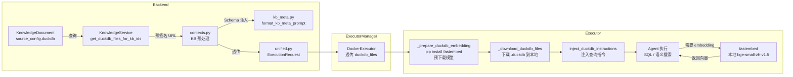
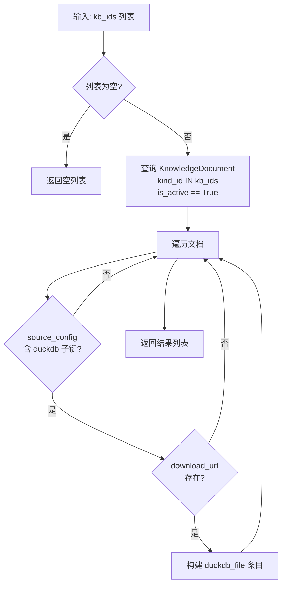
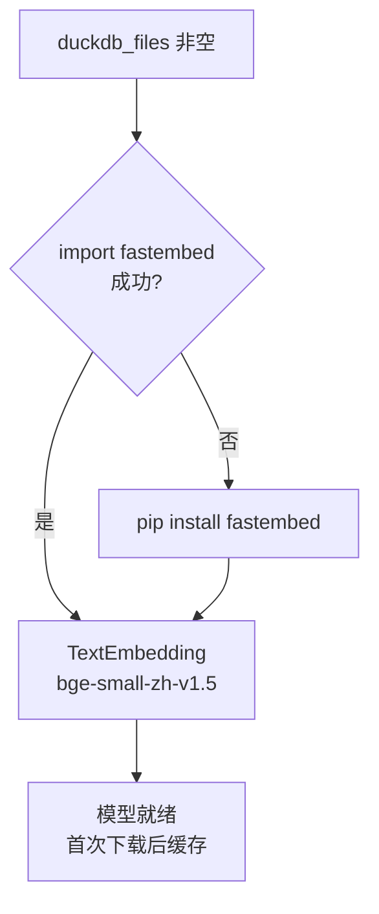
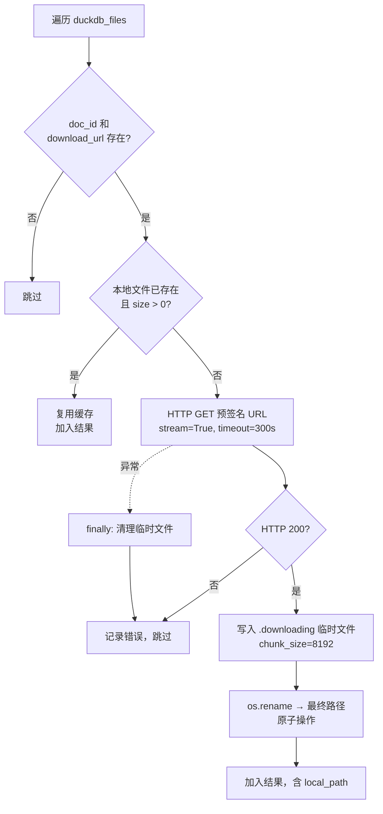
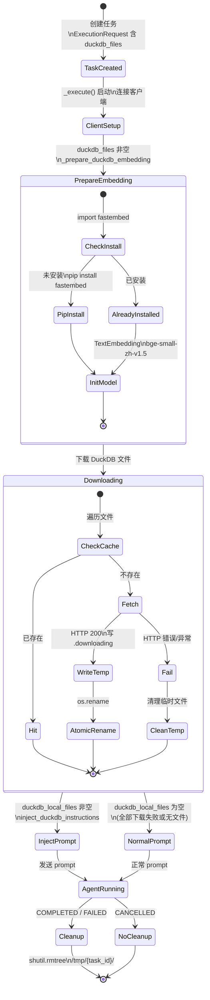

# DuckDB 文件下载与本地查询集成设计

## 概述

本分支为 ClaudeCode Shell 类型的任务新增了 DuckDB 文件本地查询能力。当知识库中包含 DuckDB 文档时，系统会自动将 `.duckdb` 文件下载到 Executor 容器本地，并在 Agent prompt 中注入查询指令，使 Agent 可以直接使用 Python `duckdb` 库执行 SQL 查询和向量语义搜索。

语义搜索的 embedding 向量通过本地集成的 `fastembed` + `BAAI/bge-small-zh-v1.5` 模型生成，无需远程调用 knowledge_runtime 服务。

---

## 改动范围

| 文件 | 模块 | 改动类型 |
|------|------|----------|
| `shared/models/execution.py` | Shared | 新增字段 |
| `shared/models/knowledge.py` | Shared | 新增字段 |
| `backend/app/services/knowledge/knowledge_service.py` | Backend | 新增方法 |
| `backend/app/services/chat/preprocessing/contexts.py` | Backend | 修改 |
| `backend/app/services/chat/preprocessing/kb_meta.py` | Backend | 新增函数 + 修改签名 |
| `backend/app/services/chat/trigger/unified.py` | Backend | 修改 |
| `executor_manager/executors/docker/executor.py` | Executor Manager | 修改（修复 docstring 断裂 bug） |
| `executor/agents/claude_code/claude_code_agent.py` | Executor | 新增方法 + 修改 |
| `executor/agents/claude_code/prompt_enrichment.py` | Executor | 新增函数 |
| `executor/pyproject.toml` | Executor | 新增依赖 |
| `docker/executor/Dockerfile` | Docker | 新增包 |

共 11 个文件。

---

## 架构

### 整体分层

```
┌───────────────────────────────────────────────────────────────────────────┐
│  Backend                                                                  │
│                                                                           │
│  ┌─────────────────┐  ┌──────────────────┐  ┌────────────────────────┐  │
│  │ KnowledgeService│  │ Preprocessing     │  │ Trigger               │  │
│  │                 │  │                  │  │                        │  │
│  │ 查询 DB 中      │  │ contexts.py      │  │ unified.py            │  │
│  │ DuckDB 文档元数据│  │ kb_meta.py       │  │ duckdb_files 透传     │  │
│  │ 生成预签名 URL  │  │ Schema 注入 prompt│  │ 到 ExecutionRequest   │  │
│  └────────┬────────┘  └────────┬─────────┘  └───────────┬────────────┘  │
│           │                    │                        │               │
└───────────┼────────────────────┼────────────────────────┼───────────────┘
            │                    │                        │
            ▼                    ▼                        ▼
┌───────────────────────────────────────────────────────────────────────────┐
│  Executor Manager                                                         │
│                                                                           │
│  ┌─────────────────────────────────────────────────────────────────────┐  │
│  │ DockerExecutor                                                      │  │
│  │  透传 ExecutionRequest (含 duckdb_files)                            │  │
│  └─────────────────────────────────────────────────────────────────────┘  │
└───────────────────────────────────────────────────────────────────────────┘
            │
            ▼
┌───────────────────────────────────────────────────────────────────────────┐
│  Executor 容器 (ClaudeCode Agent)                                         │
│                                                                           │
│  ┌─ 启动 ──────────────────────────────────────────────────────────────┐ │
│  │                                                                     │ │
│  │  1. _prepare_duckdb_embedding()                                     │ │
│  │     pip install fastembed (按需)                                     │ │
│  │     预下载 bge-small-zh-v1.5 模型                                   │ │
│  │                                                                     │ │
│  │  2. _download_duckdb_files()                                        │ │
│  │     S3 预签名 URL → /tmp/{task_id}/kb_doc_*.duckdb                  │ │
│  │                                                                     │ │
│  │  3. inject_duckdb_instructions()                                    │ │
│  │     prompt 追加查询指令 (含本地 fastembed 用法)                      │ │
│  └─────────────────────────────────────────────────────────────────────┘ │
│                                                                           │
│  ┌─ 运行 ──────────────────────────────────────────────────────────────┐ │
│  │                                                                     │ │
│  │  ┌───────────┐    ┌──────────────────┐    ┌──────────────────┐     │ │
│  │  │ duckdb    │    │ fastembed        │    │ 本地 .duckdb     │     │ │
│  │  │ Python 库 │◀──│ bge-small-zh-v1.5│───▶│ /tmp/{task_id}/  │     │ │
│  │  │ SQL + VSS │    │ 本地 embedding   │    │ 只读挂载         │     │ │
│  │  └───────────┘    └──────────────────┘    └──────────────────┘     │ │
│  └─────────────────────────────────────────────────────────────────────┘ │
│                                                                           │
│  ┌─ 结束 ──────────────────────────────────────────────────────────────┐ │
│  │  shutil.rmtree(/tmp/{task_id}/)                                     │ │
│  └─────────────────────────────────────────────────────────────────────┘ │
└───────────────────────────────────────────────────────────────────────────┘
```

### 数据流总览



---

## 数据模型

### duckdb_files 字段

`duckdb_files` 贯穿全链路，在两个 dataclass 中新增：

**`ExecutionRequest.duckdb_files`**（`shared/models/execution.py`）

**`KnowledgeBaseToolsResult.duckdb_files`**（`shared/models/knowledge.py`）

字段在 `__post_init__` 中初始化为空列表，防止 frozen dataclass 默认值为 `None`。

### 单条数据结构及各层演进

```
┌──────────────────────────┐     ┌──────────────────────────┐     ┌──────────────────────────────┐
│  Backend 生成             │     │  Executor Manager 透传    │     │  Executor 追加 local_path     │
│                          │     │  (无变化)                 │     │                              │
│  doc_id: int             │     │                          │     │  doc_id                      │
│  kb_id: int              │────▶│  doc_id                  │────▶│  kb_id                       │
│  download_url: str       │     │  kb_id                   │     │  download_url                │
│  table_name: str         │     │  download_url            │     │  table_name                  │
│  embedding_model: str    │     │  table_name              │     │  embedding_model             │
│  embedding_dim: int      │     │  embedding_model         │     │  embedding_dim               │
│  label_column?: str      │     │  embedding_dim           │     │  label_column?               │
│                          │     │  label_column?           │     │  ★ local_path: str           │
└──────────────────────────┘     └──────────────────────────┘     └──────────────────────────────┘
```

### 数据来源

`KnowledgeDocument.source_config` 中嵌套 `duckdb` 子键，`download_url` 在文件上传时直接配置，无需运行时生成预签名 URL：

```
KnowledgeDocument.source_config
└── duckdb
    ├── download_url   → 映射到 duckdb_files.download_url（上传时配置）
    ├── table_name     → 映射到 duckdb_files.table_name
    ├── embedding_model → 映射到 duckdb_files.embedding_model
    ├── embedding_dim  → 映射到 duckdb_files.embedding_dim
    └── label_column?  → 映射到 duckdb_files.label_column（可选）
```

---

## 详细设计

### 1. Backend: 元数据查询

`KnowledgeService.get_duckdb_files_for_kb_ids(db, knowledge_base_ids)`



Backend 直接读取 `source_config.duckdb.download_url`，无需运行时生成预签名 URL，消除了 S3 客户端依赖和 URL 过期风险。整个调用方（`_prepare_kb_tools_from_contexts`）仍包裹在 `try/except` 中，DuckDB 元数据获取完全 best-effort。

### 2. Backend: Prompt Schema 注入

在 `_prepare_kb_tools_from_contexts()` 中获取到 `duckdb_files` 后，做两件事：

**a) 重新构建 kb_meta_prompt**：将 `duckdb_files` 传入 `_build_kb_meta_prompt()` → `format_kb_meta_prompt()`，在 KB 元数据 prompt 末尾追加 DuckDB schema 信息段。

**b) 附加到返回结果**：`duckdb_files` 写入 `KnowledgeBaseToolsResult`，沿链路传递到 `ExecutionRequest`。

Schema 信息格式（`_format_duckdb_schema_section`）：

```
DuckDB Schema Information:
- DuckDB (KB ID: 100, doc_id: 500):
  - Table: raw_data (50,000 rows)
  - Schema: id INTEGER, name VARCHAR, ...
  - Filter column: category: A/B/C
  - Suggestion: filter by category before semantic search to reduce noise
  - Embedding: BAAI/bge-small-zh 512d
```

按 `kb_id` 分组，同一 KB 下多个文件时编号展示。

### 3. Backend: 数据透传


`unified.py` 中仅当 `ctx.kb.duckdb_files` 非空时才赋值到 `request.duckdb_files`。

### 4. Executor: Embedding 模型按需准备

`ClaudeCodeAgent._prepare_duckdb_embedding()` 是同步方法，在 `_execute()` 中通过 `asyncio.to_thread()` 异步调用，仅在 `duckdb_files` 非空时执行。



按需安装策略：

| 策略 | 说明 |
|------|------|
| 按需安装 | 仅当任务关联 DuckDB 文件时才 pip install fastembed |
| 模型预下载 | 初始化 `TextEmbedding("BAAI/bge-small-zh-v1.5")` 触发模型下载和缓存 |
| 不污染镜像 | Executor 基础镜像不含 fastembed，避免为所有任务增加体积 |

### 5. Executor: 文件下载

`ClaudeCodeAgent._download_duckdb_files(task_id)` 是同步方法，在 `_execute()` 中通过 `asyncio.to_thread()` 异步调用，避免阻塞事件循环。



下载策略：

| 策略 | 说明 |
|------|------|
| 原子写入 | 先写 `.downloading` 临时文件，完成后 `os.rename`，防止不完整文件被使用 |
| 缓存复用 | 文件已存在且 `size > 0` 时直接复用，支持容器复用场景 |
| 任务级隔离 | 文件存储在 `/tmp/{task_id}/kb_doc_{doc_id}.duckdb` |
| 命名规则 | `kb_doc_{doc_id}.duckdb`，以 doc_id 为键避免冲突 |

### 6. Executor: Prompt 查询指令注入

`inject_duckdb_instructions(prompt, duckdb_local_files)` 在 `claude_code_agent._execute()` 中，于发送 prompt 前调用。

向 prompt 追加 `<knowledge_base_duckdb>` 标签块，包含：

| 内容 | 说明 |
|------|------|
| 文件列表 | 每个文件的本地路径、KB ID、doc_id、表名、行数、embedding 维度 |
| 连接模式 | `duckdb.connect(path, read_only=True)` + `INSTALL vss; LOAD vss` |
| SQL 示例 | `SELECT * FROM raw_data WHERE ... LIMIT 10` |
| 语义搜索示例 | 本地 `fastembed.TextEmbedding("BAAI/bge-small-zh-v1.5")` 生成向量 → `array_cosine_similarity` 排序 |

Prompt 中存在两个互补的 DuckDB 信息块：

```
┌──────────────────────────────────────────────────────────────────┐
│  <knowledge_base_context>                                       │
│  ...                                                            │
│  DuckDB Schema Information  ← WHAT：有什么数据                  │
│  (由 Backend kb_meta.py 注入)                                    │
│  ...                                                            │
│  </knowledge_base_context>                                      │
│                                                                  │
│  <knowledge_base_duckdb>  ← HOW：如何查询                       │
│  (由 Executor prompt_enrichment.py 注入)                         │
│  </knowledge_base_duckdb>                                       │
└──────────────────────────────────────────────────────────────────┘
```

### 7. Executor: 临时文件清理

在 `_execute()` 的任务结束分支（COMPLETED / FAILED）中：

```
duckdb_local_files 非空?
  → asyncio.to_thread(shutil.rmtree, /tmp/{task_id}/, ignore_errors=True)
```

仅当本次任务实际下载了 DuckDB 文件时才清理，CANCELLED 状态不清理（取消流程有自己的清理逻辑）。

---

## 任务生命周期中的 DuckDB 流程



---

## 安全

| 措施 | 实现 |
|------|------|
| 下载 URL 来源 | source_config.duckdb.download_url，上传时配置，无过期问题 |
| 文件只读 | prompt 指令中 `duckdb.connect(path, read_only=True)` |
| 容器隔离 | DuckDB 文件仅存在于 Executor 容器 `/tmp/{task_id}/` |
| 原子写入 | `.downloading` → rename，防止不完整文件被误用 |
| 任务清理 | COMPLETED/FAILED 时自动 `rmtree` |
| 无远程依赖 | embedding 模型本地运行，无需暴露内部服务端点 |

---

## 依赖变更

| 模块 | 变更 |
|------|------|
| `executor/pyproject.toml` | 新增 `duckdb>=1.0.0` |
| `docker/executor/Dockerfile` | pip 安装 `duckdb` |
| Executor 容器运行时 | 按需 `pip install fastembed`（仅 DuckDB 任务） |

---

## 已知限制

| 限制 | 说明 |
|------|------|
| 固定 embedding 模型 | 语义搜索固定使用 `bge-small-zh-v1.5`，与 DuckDB 文件中存储的 embedding 必须一致 |
| 首次安装延迟 | 首次 DuckDB 任务需 pip install fastembed + 下载模型（~1-2 分钟），后续任务复用缓存 |
