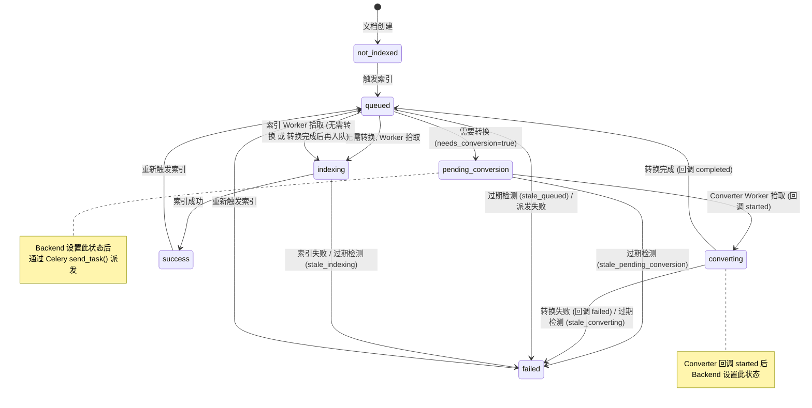
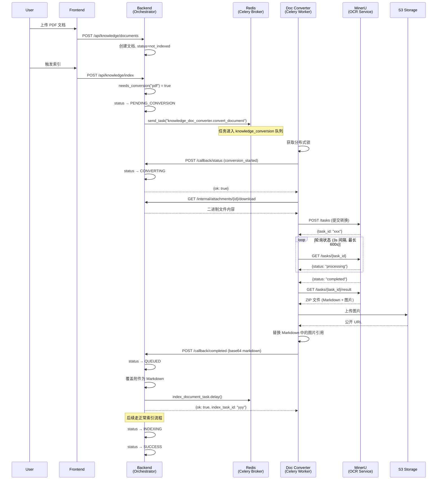
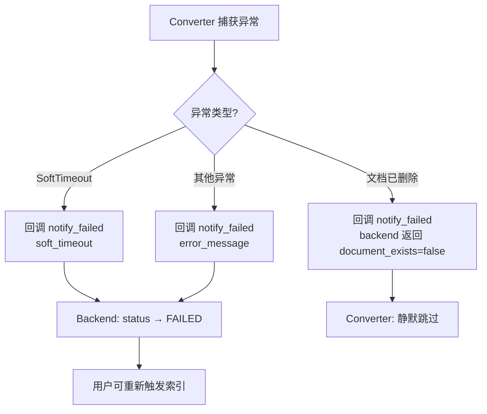
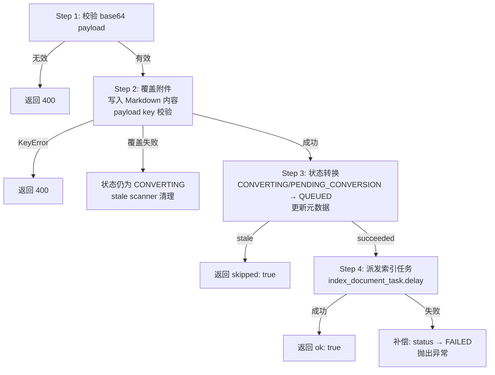
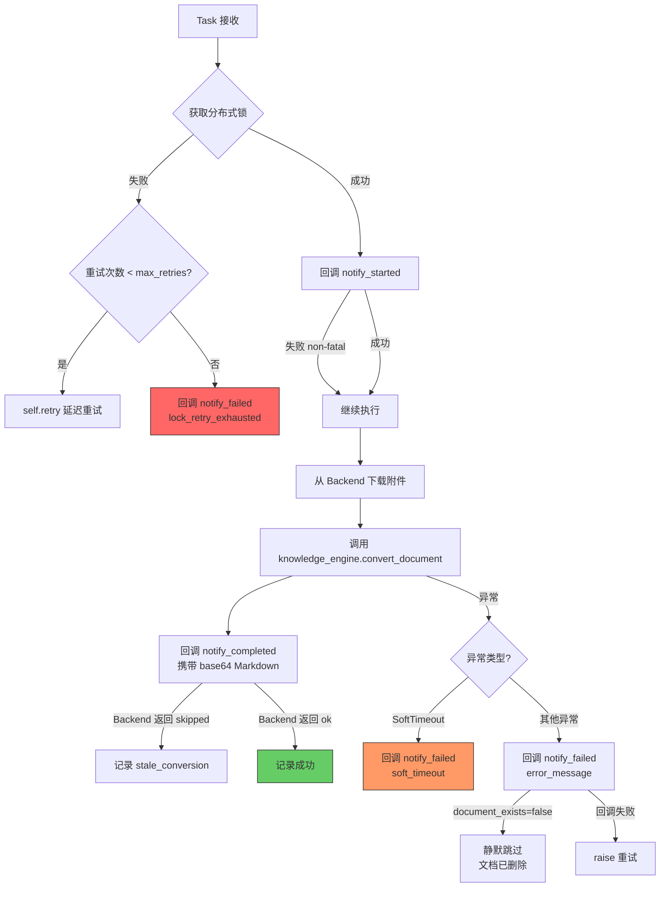
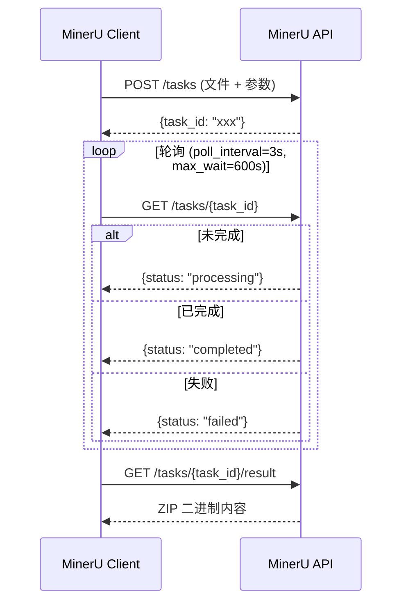

# 知识库文档转换服务设计文档

> PDF/PPTX/DOCX → Markdown OCR 转换管道

## 1 背景与目标

### 1.1 背景

知识库系统原先仅支持纯文本和 Markdown 文件的 RAG 索引。PDF、DOCX、PPTX、XLSX 等格式无法直接被向量化检索，需要先通过 OCR 引擎将文档转为 Markdown，再走索引流程。

### 1.2 目标

- 支持 PDF / DOCX / PPTX / XLSX 等格式自动转换为 Markdown
- 转换服务独立部署，与 Backend 无 DB 耦合，便于独立扩展
- 转换后的图片上传至 S3，Markdown 中引用替换为 S3 公开 URL
- 完整的监控、重试、过期检测和分布式锁机制

---

## 2 整体架构

### 2.1 分层架构

```
┌─────────────────────────────────────────────────────────┐
│                       Frontend                          │
│            DocumentItem (状态展示 + i18n)                 │
└──────────────────────────┬──────────────────────────────┘
                           │ REST API
┌──────────────────────────▼──────────────────────────────┐
│                      Backend                            │
│  ┌───────────┐  ┌──────────────┐  ┌──────────────────┐ │
│  │  Orchestr  │  │  State       │  │  Callback API    │ │
│  │  ator      │  │  Machine     │  │  (HTTP 内部端点)  │ │
│  └─────┬─────┘  └──────────────┘  └────────┬─────────┘ │
│        │                                    │           │
│        │ celery_app.send_task()             │ HTTP 回调  │
└────────┼────────────────────────────────────┼───────────┘
         │                                    │
         │ Celery Broker (Redis)              │
         │ knowledge_conversion queue         │
         │                                    │
┌────────▼────────────────────────────────────┼───────────┐
│            Knowledge Doc Converter          │           │
│  ┌──────────────────────────────────────┐   │           │
│  │  Conversion Task (Celery Worker)     │   │           │
│  │  ┌────────┐ ┌─────────┐ ┌────────┐  │   │           │
│  │  │ Lock   │ │ Callback│ │Content │  │   │           │
│  │  │Service │ │ Client  │ │Fetcher │  │   │           │
│  │  └────────┘ └────┬────┘ └───┬────┘  │   │           │
│  └──────────────────┼──────────┼────────┘   │           │
│                     │          │            │           │
│  ┌──────────────────▼──────────▼────────┐   │           │
│  │       Knowledge Engine               │   │           │
│  │  ┌──────────┐ ┌──────┐ ┌─────────┐  │   │           │
│  │  │ MinerU   │ │ ZIP  │ │ S3      │  │   │           │
│  │  │ Client   │ │Extra │ │Uploader │  │   │           │
│  │  └──────────┘ └──────┘ └─────────┘  │   │           │
│  └──────────────────────────────────────┘   │           │
└─────────────────────────────────────────────┼───────────┘
                                              │
                        ┌─────────────────────▼──────────┐
                        │         MinerU Service          │
                        │     (GPU 密集型, 独立部署)       │
                        └────────────────────────────────┘
```

### 2.2 核心设计原则

| 原则 | 实现方式 |
|------|----------|
| **无 DB 耦合** | Converter 微服务不连接 Backend 数据库，通过 HTTP 回调通知状态变更 |
| **异步解耦** | Backend 通过 Celery `send_task()` 跨服务派发任务，共享 Redis broker |
| **幂等性** | 所有状态转换使用 generation 校验，stale 任务不会覆盖新状态 |
| **可观测性** | Prometheus 指标 + 结构化日志 + OpenTelemetry tracing |
| **容错** | 分布式锁 + 指数退避重试 + 过期检测 + soft/hard 超时 |

### 2.3 模块职责划分

```
┌──────────────────────────────────────────────────────────┐
│ Backend (知识库索引入口)                                   │
│                                                          │
│  · 判断文件是否需要转换 (needs_conversion)                  │
│  · 派发转换任务到 Celery 队列                               │
│  · 接收回调，执行状态转换 + 附件覆盖 + 索引派发               │
│  · 过期检测 (scan_stale_index_tasks)                       │
├──────────────────────────────────────────────────────────┤
│ Knowledge Doc Converter (独立 Celery 微服务)               │
│                                                          │
│  · 获取分布式锁，防止同一文档并发转换                         │
│  · 回调通知 Backend 状态变更                                │
│  · 从 Backend 下载附件二进制                                │
│  · 调用 Knowledge Engine 执行转换                           │
│  · 回调通知 Backend 转换结果                                │
├──────────────────────────────────────────────────────────┤
│ Knowledge Engine / conversion (转换引擎，共享库)            │
│                                                          │
│  · MinerU API 客户端 (提交 → 轮询 → 下载)                   │
│  · ZIP 提取 (Markdown + 图片 + 引用替换)                    │
│  · S3 图片上传                                             │
│  · 统一入口 convert_document()                             │
└──────────────────────────────────────────────────────────┘
```

---

## 3 文档索引状态机

### 3.1 状态定义

在原有 5 个状态基础上新增 2 个转换状态：

| 状态 | 值 | 说明 |
|------|-----|------|
| NOT_INDEXED | `not_indexed` | 初始状态，未索引 |
| QUEUED | `queued` | 排队中，等待索引（或转换完成后等待索引） |
| **PENDING_CONVERSION** | **`pending_conversion`** | **新增** — 排队等待转换 Worker 拾取 |
| **CONVERTING** | **`converting`** | **新增** — 转换 Worker 已拾取，正在转换 |
| INDEXING | `indexing` | 正在索引 |
| SUCCESS | `success` | 索引成功 |
| FAILED | `failed` | 索引失败（含转换失败） |

### 3.2 状态流转



### 3.3 活跃状态与过期检测

以下 4 个状态属于"活跃索引状态"，会被 `scan_stale_index_tasks` 定时扫描：

| 活跃状态 | 过期阈值 | 过期原因标识 |
|----------|----------|-------------|
| QUEUED | `KNOWLEDGE_INDEX_STALE_QUEUED_SECONDS` (600s) | `stale_queued` |
| PENDING_CONVERSION | `KNOWLEDGE_INDEX_STALE_PENDING_CONVERSION_SECONDS` (7200s) | `stale_pending_conversion` |
| CONVERTING | `KNOWLEDGE_INDEX_STALE_CONVERTING_SECONDS` (14400s) | `stale_converting` |
| INDEXING | `KNOWLEDGE_INDEX_STALE_INDEXING_SECONDS` (2700s) | `stale_indexing` |

> CONVERTING 阈值 (14400s) 远大于其他状态，因为文档转换（尤其是 OCR）耗时长，需避免误判过期。QUEUED 和 INDEXING 保持原有阈值（600s / 2700s），不受转换功能影响。

### 3.4 Generation 机制

每个文档有 `index_generation` 字段，每次重新触发索引时递增。所有状态转换函数在更新前校验 generation，确保 stale 任务不会覆盖新状态：

- `mark_document_conversion_started`: 校验 `document.index_generation == generation`，不匹配则返回 `stale_generation`
- `mark_document_conversion_succeeded`: WHERE 条件包含 `index_generation == generation AND index_status == CONVERTING`，不匹配则 `updated == 0`
- `mark_document_index_failed`: 同样校验 generation

---

## 4 端到端流程

### 4.1 转换流程（需要转换的文件）



### 4.2 直接索引流程（无需转换的文件）

无需转换的文件走原有路径，不经过 Converter：

```
not_indexed → queued → indexing → success
```

### 4.3 转换失败流程



---

## 5 Backend 集成

### 5.1 配置项

| 配置项 | 默认值 | 说明 |
|--------|--------|------|
| `KNOWLEDGE_CONVERSION_ENABLED` | `false` | 转换功能总开关 |
| `KNOWLEDGE_CONVERSION_FILE_TYPES` | `""` | 需要转换的文件扩展名，逗号分隔（如 `pdf,docx,pptx`） |
| `KNOWLEDGE_CONVERSION_QUEUE` | `"knowledge_conversion"` | 转换任务的 Celery 队列名 |
| `KNOWLEDGE_INDEX_STALE_PENDING_CONVERSION_SECONDS` | `7200` | PENDING_CONVERSION 过期阈值 (秒) |
| `KNOWLEDGE_INDEX_STALE_CONVERTING_SECONDS` | `14400` | CONVERTING 过期阈值 (秒)，比 lock_timeout 多 20% |

> MinerU、S3、锁相关配置已迁移至 `knowledge_doc_converter` 微服务，参见第 6 节。

### 5.2 needs_conversion 判断逻辑

Orchestrator 在调度索引时通过 `settings.needs_conversion(extension)` 判断文件是否需要转换：

```
needs_conversion(ext) = KNOWLEDGE_CONVERSION_ENABLED
                       AND KNOWLEDGE_CONVERSION_FILE_TYPES 非空
                       AND ext (去除点号、小写) 在配置的文件类型列表中
```

### 5.3 Orchestrator 转换分支

当 `needs_conversion()` 返回 `true` 时，Orchestrator 执行以下操作：

1. 将文档状态从 `QUEUED` 改为 `PENDING_CONVERSION`，commit
2. 查询附件信息获取原始文件名
3. 构建 `index_dispatch_payload`（透传给 Converter，完成后原样回传用于派发索引任务）
4. 通过 `celery_app.send_task()` 派发任务到 `knowledge_conversion` 队列
5. 若 `send_task` 失败，调用 `mark_document_index_enqueue_failed` 回滚状态

`send_task()` 而非 `.delay()` 的原因：`convert_document` 任务注册在 Converter 微服务的 Celery app 中，Backend 只需知道任务名和队列名即可跨服务派发。

> **异常窗口**：Step 1 commit `PENDING_CONVERSION` 和 Step 4 `send_task` 在同一个 `try` 块中，但 Step 2 查询附件和 Step 4 发送任务都可能失败。失败后 `mark_document_index_enqueue_failed` 会将 `PENDING_CONVERSION` 回滚为 `FAILED`（该函数接受 `QUEUED` 和 `PENDING_CONVERSION` 作为有效前状态），但 Step 1 commit 后到异常发生之间的窗口内，文档处于 `PENDING_CONVERSION` 状态且没有任务在执行。

### 5.4 内部 API 端点

所有内部端点受 `INTERNAL_SERVICE_TOKEN` 认证保护。

| 端点 | 方法 | 功能 |
|------|------|------|
| `/api/internal/attachments/{id}/download` | GET | 下载附件二进制（供 Converter 下载文件） |
| `/api/internal/conversion/callback/status` | POST | 转换状态回调（started / failed） |
| `/api/internal/conversion/callback/completed` | POST | 转换完成回调 |

### 5.5 转换完成回调的操作序列

`conversion_completed_callback` 端点按顺序执行 4 步操作。附件覆盖在状态转换之前执行，确保覆盖失败时文档状态仍为 `CONVERTING`（stale scanner 可正确清理），且不会出现元数据已更新为 md 格式但附件内容仍为 PDF 的不一致。



### 5.6 index_dispatch_payload 透传机制

Orchestrator 构建的 payload 包含索引任务所需的全部参数，Converter 原样回传：

```
┌───────────────┐         ┌───────────────┐         ┌───────────────┐
│   Backend     │  派发    │   Converter   │  回传    │   Backend     │
│  Orchestrator │ ──────→ │  (透传 payload)│ ──────→ │  Callback API │
└───────────────┘         └───────────────┘         └───────────────┘

Payload 包含:
  · knowledge_base_id
  · attachment_id
  · retriever_name / retriever_namespace
  · embedding_model_name / embedding_model_namespace
  · user_id / user_name
  · document_id
  · index_generation
  · splitter_config_dict
  · trigger_summary
```

Converter 不需要理解索引逻辑，只负责透传。这实现了"转换服务无需了解索引语义"的解耦目标。Callback API 对 payload 的 key 进行校验，缺失时返回 400 而非 500。

---

## 6 Knowledge Doc Converter 微服务

### 6.1 目录结构

```
knowledge_doc_converter/
├── knowledge_doc_converter/
│   ├── __init__.py              # 版本号 1.0.0
│   ├── config.py                # pydantic-settings 配置
│   ├── celery_app.py            # Celery 应用 + 信号处理 + Prometheus 启动
│   ├── core/
│   │   ├── logging.py           # 小时轮转日志 + request_id 过滤器
│   │   └── metrics.py           # Prometheus 多进程指标
│   ├── services/
│   │   ├── callback_client.py   # Backend HTTP 回调 (指数退避重试)
│   │   ├── content_fetcher.py   # 从 Backend 下载附件二进制
│   │   └── lock_service.py      # Redis 分布式锁 + Watchdog 续期
│   └── tasks/
│       └── conversion_task.py   # 转换任务主逻辑
├── tests/
│   ├── test_callback_client.py
│   ├── test_content_fetcher.py
│   ├── test_conversion_task.py
│   ├── test_lock_service.py
│   └── test_metrics.py
├── pyproject.toml
├── .env.example
├── README.md
└── start.sh
```

### 6.2 配置项

| 分组 | 配置项 | 默认值 | 说明 |
|------|--------|--------|------|
| **Backend 回调** | `BACKEND_BASE_URL` | `http://backend:8000` | Backend 服务地址 |
| | `BACKEND_INTERNAL_TOKEN` | `""` | 内部服务认证 Token |
| **Redis** | `REDIS_PASSWORD` | `""` | Redis 密码，自动注入到所有 Redis URL |
| **Celery** | `CELERY_BROKER_URL` | `redis://redis:6379/0` | Celery broker |
| | `CELERY_RESULT_BACKEND` | `redis://redis:6379/1` | Celery 结果后端 |
| | `KNOWLEDGE_CONVERSION_QUEUE` | `knowledge_conversion` | 任务队列名 |
| **分布式锁** | `KNOWLEDGE_CONVERSION_LOCK_TIMEOUT_SECONDS` | `12000` | 锁超时 (秒) |
| | `KNOWLEDGE_CONVERSION_LOCK_EXTEND_INTERVAL_SECONDS` | `60` | Watchdog 续期间隔 |
| | `KNOWLEDGE_CONVERSION_LOCK_MAX_RETRIES` | `2` | 锁获取最大重试次数 |
| | `KNOWLEDGE_CONVERSION_LOCK_RETRY_DELAY_SECONDS` | `30` | 重试延迟 |
| **MinerU** | `MINERU_API_BASE_URL` | `""` | MinerU API 地址 |
| | `MINERU_BACKEND` | `pipeline` | MinerU 后端模式 |
| | `MINERU_PARSE_METHOD` | `ocr` | 解析方法 |
| | `MINERU_LANG_LIST` | `ch` | 语言列表 |
| | `MINERU_POLL_INTERVAL_SECONDS` | `3` | 状态轮询间隔 |
| | `MINERU_MAX_WAIT_SECONDS` | `600` | 最大等待时间 |
| **S3** | `WORKER_CONVERSION_S3_ENABLED` | `false` | S3 上传开关 |
| | `WORKER_CONVERSION_S3_ENDPOINT` | `""` | S3 endpoint |
| | `WORKER_CONVERSION_S3_BUCKET_NAME` | `""` | S3 bucket |
| **超时** | `CONVERSION_TASK_SOFT_TIME_LIMIT` | `9000` | 软超时 (可捕获, 150min) |
| | `CONVERSION_TASK_TIME_LIMIT` | `10000` | 硬超时 (SIGKILL, ~167min) |

### 6.3 分布式锁 (Lock Service)

使用 Redis 分布式锁 + Watchdog 后台线程防止长任务锁过期：

```
┌──────────────────────────────────────────┐
│          DistributedLock                  │
│                                          │
│  acquire(name, expire_seconds)           │
│    → Redis SET NX EX                     │
│                                          │
│  release(name)                           │
│    → Redis DEL                           │
│                                          │
│  extend(name, expire_seconds)            │
│    → Redis EXPIRE                        │
├──────────────────────────────────────────┤
│  _WatchdogContext (上下文管理器)           │
│                                          │
│  __enter__:                              │
│    · acquire lock                        │
│    · 启动 Watchdog 后台线程               │
│                                          │
│  _watchdog (后台线程):                    │
│    · 每 extend_interval 秒续期一次        │
│    · stop_event 控制退出                  │
│                                          │
│  __exit__:                               │
│    · stop_event.set()                    │
│    · join Watchdog 线程                   │
│    · release lock                        │
└──────────────────────────────────────────┘
```

锁名称格式: `wegent:lock:knowledge:convert_document:{document_id}`

### 6.4 回调客户端 (Callback Client)

三种回调方法，均使用指数退避重试 (3 次: 2s → 4s → 8s)：

| 方法 | HTTP 端点 | 触发时机 |
|------|----------|----------|
| `notify_started` | `/callback/status` | Worker 拾取任务后 |
| `notify_completed` | `/callback/completed` | 转换成功后，携带 base64 编码的 Markdown |
| `notify_failed` | `/callback/status` | 转换失败后，携带 error_message |

`notify_started` 失败时为 **non-fatal**：不中断转换流程。`mark_document_conversion_succeeded` 同时接受 `CONVERTING` 和 `PENDING_CONVERSION` 作为有效前状态，因此即使 `notify_started` 失败导致文档状态停留在 `PENDING_CONVERSION`，后续 `notify_completed` 仍能正确完成状态转换。

### 6.5 转换任务主流程



---

## 7 Knowledge Engine 转换引擎

### 7.1 模块结构

```
knowledge_engine/conversion/
├── __init__.py           # 公开 API 导出
├── converter.py          # 统一入口: 提交 MinerU → 下载 ZIP → 提取 → S3 上传
├── mineru_client.py      # MinerU HTTP 客户端: 提交 → 轮询 → 下载
├── s3_uploader.py        # S3 图片上传 (懒初始化, 线程安全)
└── zip_extractor.py      # ZIP 提取: Markdown + 图片引用替换
```

### 7.2 convert_document 统一入口

```
convert_document(binary_data, file_extension, mineru_config, s3_config?, s3_base_path?)
    │
    ├── 校验文件扩展名是否支持
    │
    ├── asyncio.run(submit_and_wait(...))     ← 兼容 Celery 同步环境
    │   │                                       (若已在事件循环中则用 ThreadPool)
    │   ├── submit_task() → task_id
    │   ├── poll_until_done() → 等待完成
    │   └── download_result() → ZIP bytes
    │
    ├── extract_markdown_from_zip(zip_content, s3_uploader?, s3_base_path?)
    │   ├── 找到 .md 文件
    │   ├── 提取图片 → S3 上传 → 替换引用
    │   └── 返回 ExtractionResult {markdown_bytes, uploaded_images}
    │
    └── 返回 ConversionResult {markdown_bytes, uploaded_images}
```

### 7.3 MinerU 客户端交互流程



MinerU 提交参数：

| 参数 | 说明 | 默认值 |
|------|------|--------|
| `backend` | 后端模式 | `pipeline` |
| `parse_method` | 解析方法 | `ocr` |
| `lang_list` | 语言列表 | `ch` |
| `formula_enable` | 启用公式识别 | `true` |
| `table_enable` | 启用表格识别 | `true` |
| `return_md` | 返回 Markdown | `true` |
| `return_images` | 返回图片 | `true` |
| `response_format_zip` | ZIP 格式返回 | `true` |

> **轮询容错**：轮询期间 HTTP 错误使用连续错误计数器，超过 5 次连续错误后提前抛出 `RuntimeError`，避免无效等待和日志洪泛。

### 7.4 ZIP 提取与图片引用替换

MinerU 返回的 ZIP 文件结构示例：

```
document/
├── document.md          ← 主 Markdown 文件
├── ocr/
│   ├── fig1.png
│   ├── fig2.jpg
│   └── table1.png
└── images/
    └── diagram.png
```

Markdown 中的原始图片引用：

```markdown


```

替换策略（多路径匹配）：

```
ZIP 内查找图片的候选路径:
  1. 原始路径:           ocr/fig1.png
  2. 相对路径:           ./ocr/fig1.png
  3. 文件名:             fig1.png
  4. document/ 前缀:     document/ocr/fig1.png
  5. document/ocr/ 前缀: document/ocr/fig1.png
  6. ZIP 遍历匹配:       以 /fig1.png 结尾的路径
```

替换后的 Markdown：

```markdown


```

### 7.5 S3 上传

```
S3Uploader
  ├── 懒初始化: 首次调用时创建 boto3 client (双重检查锁 + threading.Lock)
  ├── upload_image(image_data, object_name, content_type) → public_url
  │     ├── PUT object 到 S3
  │     └── 构造公开 URL: {endpoint}/{bucket}/{URL-encoded path}
  └── 线程安全: 适用于 Celery prefork worker
```

S3 object key 格式: `{safe_kb_name}/{document_id}/{safe_filename}/{zip内路径}`

### 7.6 支持的文件类型

| 扩展名 | MIME 类型 |
|--------|-----------|
| `pdf` | `application/pdf` |
| `docx` | `application/vnd.openxmlformats-officedocument.wordprocessingml.document` |
| `doc` | `application/msword` |
| `pptx` | `application/vnd.openxmlformats-officedocument.presentationml.presentation` |
| `ppt` | `application/vnd.ms-powerpoint` |
| `xlsx` | `application/vnd.openxmlformats-officedocument.spreadsheetml.sheet` |
| `xls` | `application/vnd.ms-excel` |

---

## 8 跨服务配置约束链

超时和锁相关配置分布在 Backend 和 Converter 两个服务中，必须满足以下约束：

```
soft_time_limit  <  time_limit  <  lock_timeout  <  stale_threshold
    9000s             10000s         12000s           14400s
   (150min)          (167min)       (200min)         (240min)

┌─────────────────────────────────────────────────────────────────┐
│  Converter 微服务配置                  │  Backend 配置            │
│                                      │                         │
│  CONVERSION_TASK_SOFT_TIME_LIMIT=9000│                         │
│  CONVERSION_TASK_TIME_LIMIT=10000    │                         │
│  LOCK_TIMEOUT=12000                  │  STALE_CONVERTING=14400 │
└──────────────────────────────────────┴─────────────────────────┘
```

**约束含义**：

- `soft < hard`: 软超时先触发，任务有机会执行清理（回调通知 Backend），然后硬超时强制终止
- `hard < lock_timeout`: 任务被强制终止前锁不会过期，避免另一 Worker 接手导致并发转换
- `lock_timeout < stale_threshold`: 锁过期后仍有 20% 余量，避免 stale scanner 误杀刚接手的新任务

---

## 9 前端变更

### 9.1 TypeScript 类型

`DocumentIndexStatus` 新增两个值：

```
'not_indexed' | 'queued' | 'pending_conversion' | 'converting' | 'indexing' | 'success' | 'failed'
```

### 9.2 DocumentItem 组件

`isBackendIndexing` 条件扩展，将 `pending_conversion` 和 `converting` 也视为"索引中"状态：

```
isBackendIndexing = isQueued || isPendingConversion || isConverting || isIndexing
```

不同状态的展示：

| 状态 | Badge 文案 (中文) | Tooltip 提示 |
|------|-------------------|-------------|
| `pending_conversion` | 待转换 | 文档正在等待转换为可检索的格式 |
| `converting` | 转换中 | 文档正在转换为可检索的格式，可能需要几分钟 |

### 9.3 i18n

中英文各新增 4 个翻译 key，位于 `knowledge` 命名空间的 `document.document.indexStatus` 下。

---

## 10 部署方案

### 10.1 Docker Compose

```yaml
knowledge_doc_converter:
  build:
    context: .
    dockerfile: docker/knowledge_doc_converter/Dockerfile
  container_name: wegent-knowledge-doc-converter
  restart: always
  depends_on:
    redis:
      condition: service_healthy    # 确保 Redis 就绪
  environment:
    BACKEND_BASE_URL: http://backend:8000
    CELERY_BROKER_URL: redis://redis:6379/0
    # ... (完整配置见 .env.example)
  ports:
    - "9090:9090"    # Prometheus metrics
  volumes:
    - ./logs/knowledge_doc_converter:/app/logs
```

### 10.2 Dockerfile 构建顺序

```
1. 安装 shared 包      (基础工具库)
2. 安装 knowledge_engine (转换引擎)
3. 安装 knowledge_doc_converter (微服务本体)
4. 删除 [tool.uv.sources] 段 (容器内不需要 editable path)
5. 启动 Celery Worker
```

启动命令: `celery -A knowledge_doc_converter.celery_app worker --queues=knowledge_conversion --concurrency=2`

> 并发度 2 与 MinerU 的计算密集型特性匹配。

### 10.3 外部依赖

MinerU 服务需要独立部署（GPU 密集型），通过 `MINERU_API_BASE_URL` 环境变量指定。

### 10.4 Celery Beat

Backend 的 Celery Beat 新增定时任务：

```python
"scan-stale-index-tasks": {
    "task": "app.tasks.knowledge_tasks.scan_stale_index_tasks",
    "schedule": 300,  # 每 5 分钟
}
```

---

## 11 监控指标

### 11.1 Prometheus 指标

| 指标名 | 类型 | 标签 | 说明 |
|--------|------|------|------|
| `converter_conversion_requests_total` | Counter | `status` (started/succeeded/failed/skipped) | 转换请求总数 |
| `converter_conversion_duration_seconds` | Histogram | `file_extension` | 转换耗时 |
| `converter_conversion_input_size_bytes` | Histogram | `file_extension` | 输入文档大小 |
| `converter_conversion_output_size_bytes` | Histogram | `file_extension` | 输出 Markdown 大小 |
| `converter_file_types_total` | Counter | `file_extension` | 文件类型分布 |
| `converter_conversion_active` | Gauge | - | 当前活跃转换数 (multiprocess livesum) |
| `converter_lock_results_total` | Counter | `result` (acquired/retry/exhausted) | 锁获取结果 |
| `converter_callback_results_total` | Counter | `request_type`, `status` | HTTP 请求结果（回调 + 下载） |

### 11.2 多进程支持

Celery prefork 模式下，每个子进程有独立内存空间。通过 `prometheus_client` 的 multiprocess 模式解决：

1. Worker 启动时设置 `PROMETHEUS_MULTIPROC_DIR` 环境变量（在 import prometheus_client 之前）
2. 每个子进程将指标写入共享目录
3. 主进程的 HTTP 服务器在每次 scrape 时聚合所有子进程的指标

指标标签 `request_type` 区分请求类型：回调类（`started`、`completed`、`failed`）和非回调类（`download`）。`content_fetcher` 使用 `record_http_request_success/failed`，`callback_client` 使用 `record_callback_success/failed`，两者共享同一 Counter 指标但语义独立。

---

## 12 故障处理

### 12.1 故障场景与恢复机制

| 故障场景 | 检测方式 | 恢复机制 |
|----------|----------|----------|
| Converter Worker 崩溃 | `scan_stale_index_tasks` 检测 CONVERTING 状态超时 | 标记 FAILED，用户可重新触发 |
| MinerU 不可用 | `submit_and_wait` 超时或返回错误 | Converter 回调 `notify_failed`，Backend 标记 FAILED |
| Backend 短暂不可用 | `notify_started` HTTP 失败 | Non-fatal，转换继续执行，`notify_completed` 时 `mark_document_conversion_succeeded` 接受 PENDING_CONVERSION 作为有效前状态 |
| Backend 长时间不可用 | 所有回调重试耗尽 | Converter raise 异常，Celery 重试任务；Backend 恢复后 stale scanner 清理 |
| 同一文档重复入队 | 分布式锁互斥 | 第二个 Worker 获取锁失败后重试，重试耗尽后回调 notify_failed |
| 文档在转换期间被删除 | `notify_failed` 返回 `document_exists=false` | Converter 静默跳过，不触发重试 |
| Stale 任务覆盖新状态 | Generation 校验 | 状态转换函数 WHERE 条件包含 generation，不匹配则跳过 |
| 转换完成但索引派发失败 | `index_document_task.delay` 抛异常 | Callback API 补偿调用 `mark_document_index_failed`，回滚为 FAILED |

### 12.2 软超时与硬超时

```
┌───────────────────────────────────────────────────┐
│  Task 执行时间线                                    │
│                                                   │
│  0s              9000s            10000s           │
│  ├───────────────┤───────────────┤                │
│  │  正常执行      │  SoftTimeout  │  HardTimeout   │
│  │               │  (可捕获)      │  (SIGKILL)     │
│  │               │  执行清理回调   │  强制终止       │
│  └───────────────┴───────────────┘                │
│                                                   │
│  soft_time_limit < time_limit 保证有时间执行:       │
│  · 回调 notify_failed(soft_timeout)               │
│  · 释放分布式锁                                    │
│  · 记录 Prometheus 指标                            │
└───────────────────────────────────────────────────┘
```

---

## 13 安全

| 安全措施 | 说明 |
|----------|------|
| 内部服务认证 | 所有 `/api/internal/` 端点受 `INTERNAL_SERVICE_TOKEN` 认证保护 |
| S3 路径清理 | `safe_kb_name` / `safe_filename` 去除 `..` 和 `\`，防止路径穿越 |
| 行级锁 | 状态转换使用 `with_for_update()` 行锁，防止并发写入 |
| Generation 校验 | 所有状态变更函数校验 `index_generation`，防止 stale 任务覆盖 |
| 分布式锁 | Redis 分布式锁 + Watchdog 续期，防止同一文档并发转换 |
| 附件下载鉴权 | `/internal/attachments/{id}/download` 验证 context_type 为 ATTACHMENT |