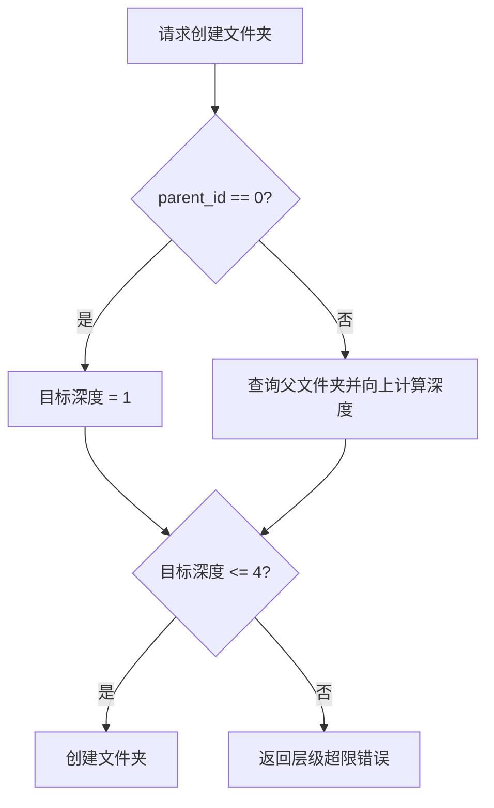
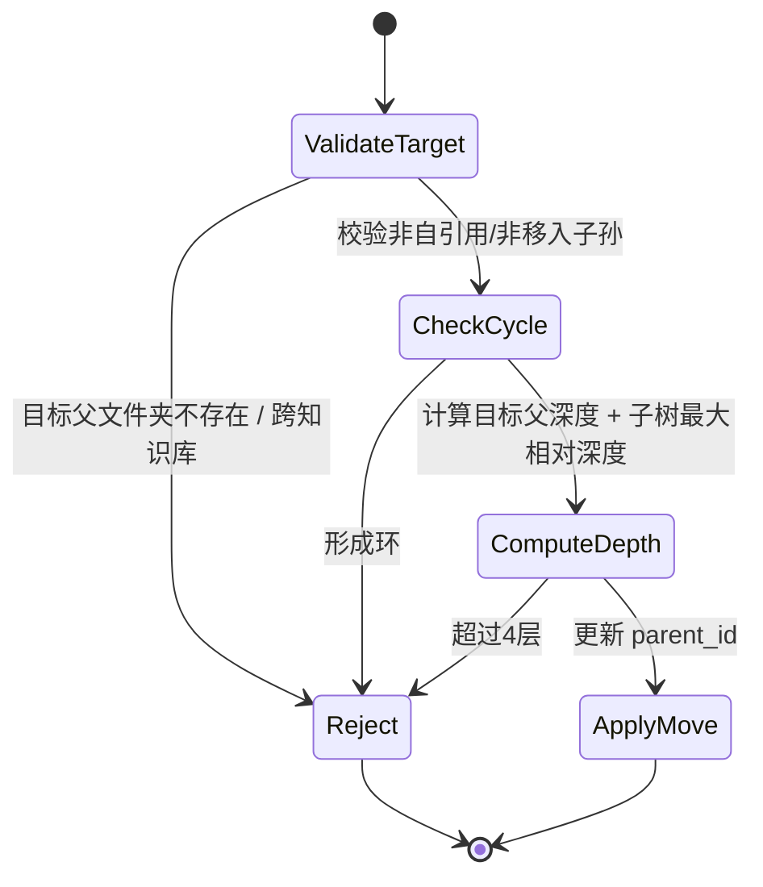

# 知识库文件夹层级限制设计方案

## 问题背景

当前知识库支持在文档下构建多层文件夹树，但没有明确的层级上限约束。  
这会带来几个现实问题：

1. 文件夹树可能无限增长，用户在 UI 中越来越难以定位文档
2. 深层路径会放大移动、删除、展示和权限校验的复杂度
3. 文档结构过深后，树状视图在桌面和移动端都会显著变差
4. 缺少统一规则时，不同入口对层级的容忍度可能不一致

本次需求明确约束为：

- **知识库本身算第 1 层**
- **知识库下面最多允许再建 4 层文件夹**

因此允许的最大结构是：

```text
第1层  知识库
第2层  文件夹 1
第3层  文件夹 2
第4层  文件夹 3
第5层  文件夹 4
第6层  文档（可放在第4层文件夹内）
```

文档允许放在第 4 层文件夹内，但不允许落到更深的文件夹层级中。

## 设计目标

1. 在后端统一强制文件夹层级上限，避免前端绕过
2. 覆盖所有会改变层级结构的入口，而不是只修一个接口
3. 保持现有文件夹树模型不变，不引入数据库结构调整
4. 错误信息清晰，让前端能直接提示用户
5. 用最小改动实现稳定约束，不把问题升级成大规模重构

## 适用规则

### 层级定义

```text
知识库 = 第1层
根目录文件夹 = 第2层
根目录文件夹的子文件夹 = 第3层
继续向下最多到第5层
```

为了便于后端判断，本方案内部采用：

- 根目录 `folder_id = 0` 的深度记为 `0`
- 根目录下第一层文件夹深度记为 `1`
- 最大允许文件夹深度 = `4`

也就是：

```text
知识库(root) depth = 0
folder depth 1      = 第2层
folder depth 2      = 第3层
folder depth 3      = 第4层
folder depth 4      = 第5层
```

## 影响范围

本次限制必须覆盖四类入口：

1. 创建文件夹
2. 移动文件夹
3. 创建文档到指定文件夹
4. 移动文档到指定文件夹

如果只限制其中一类，就会出现“入口 A 不允许，入口 B 仍可绕过”的不一致状态。

## 分层架构

```text
┌────────────────────────────────────────────────────────────┐
│                        Frontend UI                         │
│  CreateFolderDialog / MoveDocumentDialog / DocumentList    │
│  只负责提交用户操作，不负责最终约束真相                    │
└────────────────────────────────────────────────────────────┘
                             │
                             │ HTTP Request
                             ▼
┌────────────────────────────────────────────────────────────┐
│                         API Layer                          │
│  /knowledge-bases/{id}/folders                             │
│  /knowledge-documents/{id}/move                            │
│  负责参数接收与错误透传                                    │
└────────────────────────────────────────────────────────────┘
                             │
                             │ Service Call
                             ▼
┌────────────────────────────────────────────────────────────┐
│                    Domain Service Layer                    │
│                                                            │
│  KnowledgeFolderService                                    │
│  - create_folder                                           │
│  - update_folder                                           │
│  - move_document                                           │
│  - depth validation                                        │
│                                                            │
│  KnowledgeService                                          │
│  - create_document                                         │
│  - folder target validation                                │
└────────────────────────────────────────────────────────────┘
                             │
                             │ ORM Query
                             ▼
┌────────────────────────────────────────────────────────────┐
│                        Data Layer                          │
│  knowledge_folders                                         │
│  knowledge_documents                                       │
└────────────────────────────────────────────────────────────┘
```

## 核心设计决策

### 一、以后端为单一事实来源

前端可以做引导，但不能作为最终约束来源。原因很直接：

- 还有 API、脚本、MCP、批量任务等入口
- 浏览器层校验天然可绕过
- 结构约束属于业务一致性规则，必须由后端兜底

因此本方案要求：

- 所有层级限制必须在 service 层统一生效
- API 层只负责把 `ValueError` 等业务错误转成可见错误响应

### 二、使用“文件夹深度”而不是“路径字符串长度”

当前模型已经是树结构：

- `KnowledgeFolder.parent_id`
- 根目录用 `0` 表示

所以最自然的限制方式是：

1. 从目标文件夹开始向上追溯 `parent_id`
2. 统计深度
3. 比较是否超过 `MAX_FOLDER_DEPTH = 4`

这样不依赖路径缓存字段，不需要新增 schema 或迁移。

### 三、文档与文件夹共用同一套深度规则

规则不是“只限制文件夹创建”，而是：

- 任何最终会让节点落在超过允许深度的位置上的操作，都必须失败

这保证了：

- 新建文件夹不会超深
- 通过移动文件夹也不会超深
- 文档不会被创建到非法深度
- 文档不会被移动到非法深度

## 详细方案

### 1. 创建文件夹

创建文件夹时，目标深度由 `parent_id` 决定：

```text
new_folder_depth = parent_folder_depth + 1
```

判断规则：

- 如果 `new_folder_depth <= 4`，允许创建
- 如果 `new_folder_depth > 4`，拒绝创建

#### 流程图



### 2. 移动文件夹

移动文件夹比创建更复杂，因为它影响的是整个子树。

需要同时考虑：

1. 新父文件夹本身的深度
2. 被移动文件夹子树的最大相对深度

计算逻辑：

```text
new_subtree_max_depth = target_parent_depth + moving_subtree_relative_max_depth
```

判断规则：

- 如果 `new_subtree_max_depth <= 4`，允许移动
- 否则拒绝移动

#### 说明

这里不能只检查“被移动文件夹的根节点”是否超限。  
因为根节点可能合法，但它的孙子节点会在移动后越界。

#### 状态图



### 3. 创建文档到指定文件夹

文档本身不参与“继续往下建层级”，但它的目标文件夹必须处于允许范围内。

判断规则：

- 根目录 `folder_id = 0` 总是允许
- 若指定文件夹深度 `<= 4`，允许
- 若指定文件夹深度 `> 4`，拒绝

这里的原因是：

- 第 4 层文件夹是知识库下面允许的最后一层文件夹
- 文档可以放在这一层文件夹里
- 但不能再落到更深的文件夹层级中

### 4. 移动文档到指定文件夹

规则与“创建文档到指定文件夹”保持一致：

- 校验目标文件夹存在且属于同一知识库
- 校验目标文件夹深度不能超过允许范围

这样可以保证老文档也不能通过移动绕过限制。

## 错误语义设计

建议统一使用明确的业务错误信息，让前端可以直接展示：

### 文件夹相关

```text
Folder hierarchy exceeds the maximum depth of 4 levels under a knowledge base
```

### 文档相关

```text
Documents can only be placed within the 4th folder level under a knowledge base or above
```

这样前端无需做特殊映射，也能给用户足够明确的提示。

## 为什么不做前端预判为主

前端当然可以做辅助提示，但不应该成为主约束层。原因：

1. 前端拿到的 folder tree 可能是旧数据
2. 并发操作下，用户打开弹窗时合法，提交时可能已不合法
3. 还有 API、脚本、MCP 等非前端入口

所以推荐策略是：

- 后端强校验
- 前端只负责展示错误，未来如需要再补“预判禁用某些选项”

## 测试策略

### 必测场景

1. **允许创建到第 4 层文件夹**
   - 用例证明边界内是合法的

2. **拒绝创建第 5 层文件夹**
   - 用例证明边界外会被拦截

3. **拒绝将文件夹子树移动到会超深的位置**
   - 用例证明不是只检查根节点，而是检查整个子树

4. **允许在第 4 层文件夹中创建文档**
   - 用例证明边界内的文档落点是合法的

5. **允许把已有文档移动到第 4 层文件夹**
   - 用例证明文档移动入口与规则保持一致

6. **拒绝把文档放入超过第 4 层的历史脏数据文件夹**
   - 用例证明即使历史脏数据存在，文档入口也不会继续扩散违规结构

7. **原有删除知识库与文件夹清理逻辑不受影响**
   - 防止新规则影响历史能力

### 测试层级

优先在 service 层补测试，因为：

- 规则核心就在 service
- service 测试更稳定
- API 层只负责透传错误，不需要重复覆盖全部组合

## 兼容性与迁移影响

### 对数据库

- 不新增字段
- 不新增表
- 不需要 Alembic migration

### 对现有数据

如果历史上已经存在超过约束的深层文件夹：

- 本方案不会自动清理旧数据
- 但会阻止新的超深创建/移动
- 并阻止把文档继续放入超深目标位置

这意味着旧数据会被“冻结”，但不会继续扩散。

### 对前端

- 当前前端无需改协议
- 只要正确展示后端报错即可

未来如果体验需要优化，可以再做：

- 在“新建文件夹”按钮上提前禁用
- 在“移动文档”弹窗中过滤非法目标文件夹

这些都属于增强项，不影响本次规则落地。

## 风险与取舍

### 风险一：历史脏数据仍存在

本方案不主动修复历史已经超深的数据，只阻止新增违规结构。

取舍：

- 这样改动小、风险低
- 不会把一次约束升级成一次数据修复项目

### 风险二：深度计算增加少量查询成本

文件夹深度需要向上追溯父链，移动文件夹还要计算子树深度。

取舍：

- 文件夹操作不是高频热点路径
- 正确性比微小的查询成本更重要
- 当前树深受控后，计算成本也天然有上限

## 最终结论

本方案采用“后端统一约束 + 所有入口一致生效”的策略，实现以下规则：

- 知识库下最多 4 层文件夹
- 任何会导致结构超过该上限的操作都必须失败

覆盖入口包括：

1. 创建文件夹
2. 移动文件夹
3. 创建文档到文件夹
4. 移动文档到文件夹

这样能以最小改动获得稳定一致的层级约束能力，同时避免前后端规则不一致或单入口绕过的问题。
