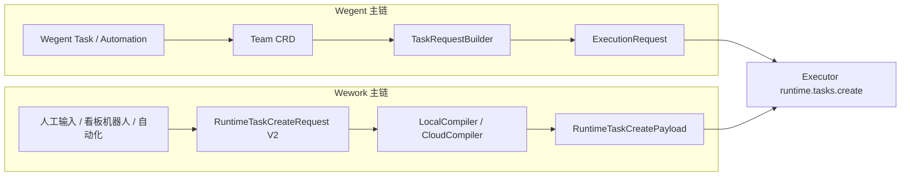
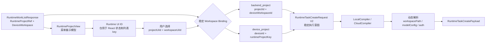
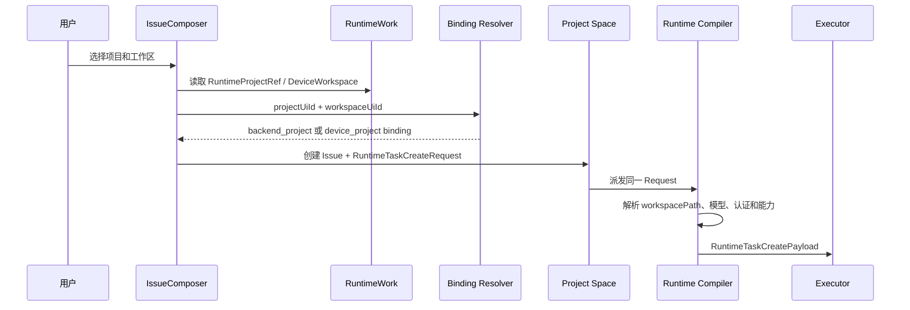
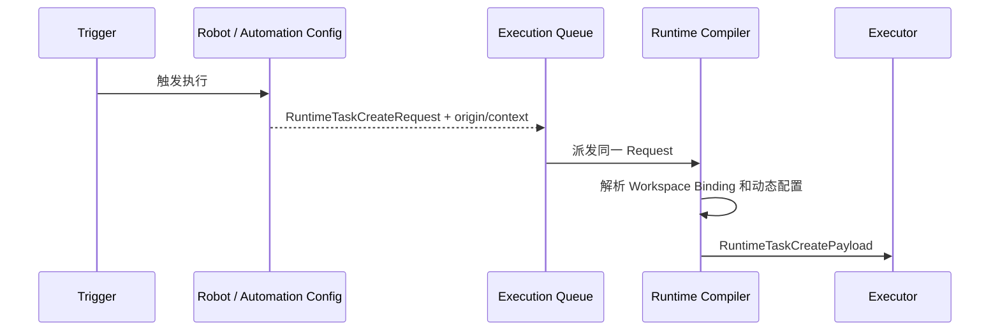

# RuntimeTaskCreateRequest 统一派发实施计划

## 目标

将 Wework 现有 `RuntimeTaskCreateRequest` 建设为唯一标准任务创建协议。

人工输入、Backend 自动化、本地自动化和看板机器人都必须构造同一种请求，并以相同语义派发到本地或云端 Executor。输入框能够配置的执行能力，包括目标设备、工作区模式、模型、权限、计划模式、Goal、Supervisor、附件、Skills 和上下文，都必须完整保留。

最终链路：

```text
人工输入 / Backend 自动化 / 本地自动化
    -> RuntimeTaskCreateRequest
    -> LocalCompiler 或 CloudCompiler
    -> RuntimeTaskCreatePayload
    -> Executor runtime.tasks.create
```

## 核心原则

1. `RuntimeTaskCreateRequest` 只表达稳定的执行意图。
2. `RuntimeTaskCreatePayload` 承载解析后的设备路径、模型配置、认证和 Executor 请求。
3. 人工、Backend 和本地自动化仅在 `origin`、`requestedBy` 和业务上下文上不同。
4. Local/Cloud Compiler 可以使用不同资源 Resolver，但不得改变请求语义。
5. `workspacePath` 属于设备动态状态，不写入机器人持久化配置。
6. 确定性配置错误必须返回 `failed`；只有投递结果无法确认时才能进入 `unknown`。
7. 历史版本兼容集中在协议边界，禁止在业务代码中散落 fallback。
8. Workspace Binding 复用机器人现有 `metadata` JSON，禁止新增数据表或数据库字段。

## 当前问题

### 协议不一致

- Wework TypeScript `RuntimeTaskCreateRequest` 已支持 Goal、Supervisor、权限、附件和工作区等能力。
- Backend Python 同名 Schema 缺少部分字段。
- Executor 直接消费动态 JSON，缺少跨端统一契约校验。

### 派发主链路分叉

- 普通 Runtime 创建走 `runtime_work_service`，由 Backend 解析 Project、DeviceWorkspace 和 `workspacePath`。
- 本地机器人队列由 Wework 根据 runtime work 解析工作区。
- 云端机器人队列通过 `WeworkExecutionProfile.build_runtime_payload()` 单独重建 payload，绕过标准创建服务。

### Workspace 身份混乱

`local_project_id` 同时可能表示：

- Backend 中心 Project ID。
- 设备根据 `deviceId + runtimeProjectKey` 生成的 Runtime UI ID。

相同整数类型承载不同身份，导致 Executor 无法可靠解析工作区。

### 启动失败状态不准确

Executor 在创建任务前拒绝请求时，云端队列未获得明确业务结果，最终通过租约过期进入“状态待核实”。

## 架构基线（2026-08-21）

### Wegent 与 Wework 是两条独立主链



Wework 不读取 Team CRD，不调用 Wegent 的 `TaskRequestBuilder`。两条主链只在
Executor 的 `ExecutionRequest` / Runtime 协议层汇合。

Wework 原生任务链路不请求 `defaultTeam`，也不把 Team 作为创建任务的前置条件。
共享 `ExecutionRequest` 当前仍保留 `team_id/team_name` 兼容字段；Wework 仅写入
`0/Wework` 中性执行身份，不查询、不解析、也不持有任何 Team CRD。显式选择
Wegent Manager 时进入独立的 Wegent 适配分支，不得复用 Wework 原生创建链路。

### Wework 项目选择与执行模型



边界规则：

1. `RuntimeProjectRef` 是 Runtime 资源身份，不是 Backend Project。
2. `runtimeProjectUiId()` 的数值只服务 UI，禁止进入 API、数据库或机器人配置。
3. 中心项目使用 `projectId + deviceWorkspaceId`。
4. 设备项目使用 `deviceId + runtimeProjectKey`。
5. `workspacePath` 是 Compiler 解析出的动态值，禁止由 Issue Composer 持久化。
6. 人工输入与机器人都直接持有同一种 `RuntimeTaskCreateRequest`，不得增加
   `runtimeProjectId`、`localProjectId` 等旁路字段补充请求语义。

### 人工创建 Issue 并执行



### 机器人或自动化执行



人工和机器人只在 `origin`、业务上下文和触发方式上不同；项目绑定、模型、权限、
Skills、Goal、Supervisor 和编译规则完全相同。

## 目标模型

### RuntimeTaskCreateRequest

标准输入协议，包含：

- 目标环境和设备。
- Project、DeviceWorkspace 或设备 Runtime Project 绑定。
- current、worktree、standalone、inherit 工作区模式。
- Runtime、模型选择和权限模式。
- 计划模式、Goal 和 Supervisor。
- 附件、Skills、Plugins 和 AdditionalContext。
- 任务来源和业务身份。

不得包含：

- 设备实际 `workspacePath`。
- 模型密钥。
- Runtime 认证令牌。
- 已 materialize 的完整 `modelConfig`。

### RuntimeTaskCreatePayload

Compiler 生成并发送给 Executor，包含：

- `taskId`。
- `workspacePath`。
- 实际 workspace source 和 worktree 参数。
- materialized 模型配置。
- Runtime permission profile。
- 用户和认证上下文。
- 完整 `ExecutionRequest`。
- `initialGoal` 和 materialized `initialSupervisor`。

## Workspace Binding

停止使用含义模糊的 `local_project_id` 作为统一绑定。

```text
backend_device_workspace:
    projectId
    deviceWorkspaceId

device_project:
    deviceId
    runtimeProjectKey

standalone:
    无项目绑定
```

云端机器人使用 `projectId + deviceWorkspaceId`。本地机器人使用 `deviceId + runtimeProjectKey`。

## 历史版本兼容

### 协议版本

新增 `schemaVersion`：

```text
无 schemaVersion -> V1
schemaVersion = 2 -> 统一协议
```

Executor 连接时上报：

- 支持的协议版本。
- Goal、Supervisor、DeviceWorkspace Binding、worktree 等能力。

### Legacy Adapter

集中实现一个 V2 到 V1 Adapter，只转换语义等价的字段。

旧 Executor 不支持的新能力必须返回 `executor_feature_unsupported`，禁止静默删除配置。

### 历史机器人迁移

对旧 `local_project_id`：

1. 根据执行环境、设备和 runtime work 映射尝试唯一解析。
2. 唯一匹配时生成新版 Workspace Binding。
3. 无匹配或多匹配时标记 `needs_rebind`。
4. 禁止猜测路径。
5. 迁移完成后，新执行主链路不再读取旧字段。

## 实施阶段

### Phase 1：建立唯一协议规范

涉及：

- Wework TypeScript 请求类型。
- Backend Pydantic Schema。
- Executor 请求解析。

任务：

1. 以当前 Wework `RuntimeTaskCreateRequest` 为基础整理 V2 Schema。
2. 明确 intent 字段与 materialized 字段边界。
3. 增加 JSON Schema 和跨端 golden fixtures。
4. 为 TS、Python、Rust 增加相同 fixture 的契约测试。

完成标准：

- 三端对字段名称、可选性、枚举和默认值的解释一致。
- Backend 不再静默忽略 Wework 已支持的字段。

### Phase 2：拆分 Request 与 Payload

任务：

1. 保留 `RuntimeTaskCreateRequest` 作为公共输入。
2. 新增内部 `RuntimeTaskCreatePayload`。
3. 禁止公共 Request 携带路径、密钥和 materialized 配置。
4. 明确 Executor `runtime.tasks.create` 接收的 Payload 契约。

完成标准：

- 编译阶段前后类型边界明确。
- 动态设备数据不会进入机器人配置或自动化规则。

### Phase 3：提取统一 Compiler

新增统一编译接口：

```text
compile_runtime_task_create(request, context)
    -> RuntimeTaskCreatePayload
```

任务：

1. 从 `runtime_work_service.create_runtime_task()` 提取目标解析和请求构造能力。
2. 实现 CloudResolver。
3. 从 Wework 本地任务创建逻辑提取 LocalResolver。
4. 统一 workspace、模型、权限、附件、Goal 和 Supervisor 的编译规则。

完成标准：

- 相同 Request 在 Local/Cloud 下除动态解析值外保持相同语义。
- `ExecutionRequest` 不再由多个业务入口重复拼装。

### Phase 4：修正 Workspace Binding

任务：

1. 增加明确的 Workspace Binding 数据结构。
2. 更新机器人创建和编辑 API。
3. 更新 Wework 机器人配置 UI 提交值。
4. 在现有机器人 `metadata` JSON 中持久化新版 binding。
5. 通过集中式 Legacy Adapter 解析历史 `local_project_id`，并输出
   `needs_rebind` 状态。
6. 删除新执行路径对 `local_project_id` 的依赖。

完成标准：

- Backend Project ID 和设备 Runtime Project ID 不再共用同一字段。
- 当前故障中的云端机器人可以通过 DeviceWorkspace 映射取得正确路径。

### Phase 5：统一任务生产者

任务：

1. 人工输入框直接生成标准 Request。
2. Backend 自动化通过机器人最新配置、自动化规则和 Issue 上下文生成标准 Request。
3. 本地自动化生成标准 Request。
4. 看板人工分配机器人生成标准 Request。
5. 删除 `WeworkExecutionProfile.build_runtime_payload()` 机器人专用主链路。
6. 删除本地机器人专用的重复执行请求构造。

完成标准：

- 所有任务来源都经过统一 Compiler。
- 任务来源差异不会改变输入框能力的支持范围。

### Phase 6：完整支持输入框能力

优先覆盖：

1. Goal。
2. Supervisor。
3. 计划模式。
4. 模型和 permission mode。
5. current/worktree/standalone/inherit。
6. 附件。
7. Skills 和 Plugins。
8. AdditionalContext。

Goal 和 Supervisor 必须作为 `runtime.tasks.create` 的原子配置，在第一轮启动前生效。

完成标准：

- 人工输入框支持的每个字段都有 Backend 和 Executor 契约测试。
- Backend 自动化和本地自动化能够构造相同配置。

### Phase 7：统一启动确认

Executor 创建结果：

```text
accepted:
    taskId

rejected:
    errorCode
    error
```

状态映射：

```text
workspace_unavailable -> failed
model_unavailable -> failed
permission_invalid -> failed
invalid_request -> failed
device_offline -> queued/retry
transport_unknown -> unknown
accepted -> starting
首个 Runtime Event -> running
```

完成标准：

- `workspacePath is required` 等错误不再进入“状态待核实”。
- `unknown` 只表示真实的传输结果不确定。

### Phase 8：移除历史协议

任务：

1. 上报 V1/V2 使用指标。
2. 完成 Executor、Backend、Wework 的顺序发布。
3. 等待 V1 使用率归零。
4. 删除 Legacy Adapter。
5. 删除旧字段和旧协议测试。

## 发布顺序

1. Executor：接受 V1/V2，并上报 capabilities。
2. Backend：接受 V1/V2，启用 Compiler 和 Legacy Adapter。
3. 执行历史机器人数据迁移。
4. Wework：发送 V2，并按 capabilities 启用输入框能力。
5. Backend 自动化和本地自动化切换到 V2。
6. 观察指标并移除 V1。

## 测试矩阵

每项能力至少覆盖：

| 来源 | 本地 Executor | 云端 Executor |
| --- | --- | --- |
| 人工输入框 | 必测 | 必测 |
| Backend 自动化 | 必测 | 必测 |
| 本地自动化 | 必测 | 必测 |
| 看板机器人分配 | 必测 | 必测 |

核心场景：

- current workspace。
- Git worktree。
- standalone workspace。
- inherited workspace。
- Goal。
- Supervisor。
- 计划模式。
- 模型与 permission mode。
- 附件、Skills、Plugins、AdditionalContext。
- 设备离线。
- Project 或 DeviceWorkspace 不存在。
- 模型不可用。
- Runtime 明确拒绝。
- Runtime 投递结果无法确认。
- V1 客户端、V1 Executor 和旧机器人数据。

## 验收标准

1. 同一输入框配置通过人工、Backend 自动化和本地自动化派发时，Executor 获得相同执行语义。
2. 本地和云端差异仅限路径、密钥、认证和设备能力等动态数据。
3. 输入框新增能力后，契约测试会强制 Backend 和 Executor 同步支持。
4. Goal 和 Supervisor 在第一轮执行前生效。
5. 云端机器人不再依赖含义模糊的 `local_project_id`。
6. 确定性错误直接显示失败原因。
7. 旧版本继续执行其原有能力；不支持的新能力明确要求升级。
8. 机器人专用 payload builder 和重复执行主链路被删除。

## 最终完成定义

只有满足以下条件，重构才算完成：

- 所有任务生产者使用统一 `RuntimeTaskCreateRequest`。
- 所有派发路径使用统一 Compiler。
- Executor 接收统一 `RuntimeTaskCreatePayload`。
- 历史数据迁移完成。
- V1 兼容有明确退出机制。
- 四类来源、两类目标环境和全部输入框能力通过自动化测试。
