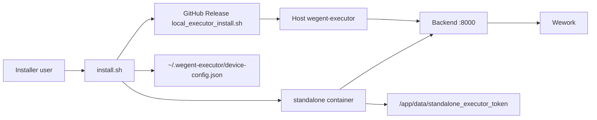

# Standalone Executor Mode Selection

## Context

Standalone mode currently starts Backend, Frontend, Wework, Redis, and an executor inside one Docker container. That is a good quick-start path, but it is a poor default on macOS when users expect coding agents to run macOS commands such as `open`, `osascript`, Terminal operations, Keychain-backed tools, or other host-only workflows. Docker Desktop containers run Linux processes, so Claude Code or Codex inside the standalone container cannot directly execute macOS commands.

The local executor release installer already exists at `executor/scripts/local_executor_install.sh` and downloads `wegent-executor` from GitHub Releases. The standalone installer should use that release path instead of requiring users to build executor binaries from a source checkout.

## Goals

- Let users choose where standalone coding tasks execute: container, host, or both.
- Default macOS interactive standalone installs to host executor.
- Preserve current automation behavior for non-interactive installs.
- Use GitHub Release executor binaries for host executor installation.
- Keep existing standalone container behavior available for Linux and quick evaluation.
- Make the selected execution mode visible in install output and documentation.

## Non-Goals

- Do not create a transparent Docker escape where arbitrary container commands run on the host.
- Do not require local source builds for executor installation.
- Do not redesign device routing, task dispatch, or project execution semantics.
- Do not remove the container executor option.

## User-Facing Modes

The standalone installer exposes three executor modes:

| Mode | Behavior | Intended Use |
| --- | --- | --- |
| `container` | Start only the executor inside the standalone container. | Linux quick start, lowest setup complexity, existing behavior. |
| `host` | Skip the container executor and start a release-installed executor on the host. | Default for macOS interactive installs; required for macOS host commands. |
| `hybrid` | Start both container and host executors. | Advanced users who want the current container device plus host-native capabilities. |

Defaults:

- macOS interactive standalone install: `host`.
- Linux interactive standalone install: `container`.
- Non-interactive standalone install: `container`, unless explicitly overridden.
- Standard multi-container deployment is unchanged.

## Installer Interface

`install.sh` adds:

- `--executor-mode container|host|hybrid`
- `WEGENT_STANDALONE_EXECUTOR_MODE=container|host|hybrid`

The flag applies only to standalone mode. In standard mode, the installer ignores it with an informational warning.

Interactive standalone install prompts after deployment mode selection:

```text
Select standalone executor mode:
  [1] Host executor (recommended on macOS)
  [2] Container executor
  [3] Hybrid
```

The default option is computed from OS and prompt mode as described above.

## Container Runtime

The standalone container startup script adds a real executor switch:

- `STANDALONE_EXECUTOR_ENABLED=true|false`

When false, `docker/standalone/start.sh` skips `start_executor()` and keeps service supervision working without an `EXECUTOR_PID`. The container still starts Redis, Backend, Frontend, and Wework. The backend may still have `STANDALONE_EXECUTOR_ENABLED=false` in its environment so in-process standalone executor routing is not selected when no explicit device is provided.

Mode mapping:

- `container`: container env `STANDALONE_EXECUTOR_ENABLED=true`
- `host`: container env `STANDALONE_EXECUTOR_ENABLED=false`
- `hybrid`: container env `STANDALONE_EXECUTOR_ENABLED=true`

## Host Executor Installation

For `host` and `hybrid`, `install.sh` performs host setup after the standalone Backend is healthy:

1. Install or update `wegent-executor` from GitHub Release by invoking the release installer:

   ```bash
   curl -fsSL https://github.com/wecode-ai/Wegent/releases/latest/download/local_executor_install.sh | bash
   ```

2. Read the standalone API key from the container:

   ```bash
   docker exec wegent-standalone sh -lc 'cat /app/data/standalone_executor_token'
   ```

3. Write host executor config at `~/.wegent-executor/device-config.json`:

   ```json
   {
     "mode": "local",
     "device_type": "local",
     "bind_shell": "claudecode",
     "connection": {
       "backend_url": "http://127.0.0.1:8000",
       "auth_token": "wg-..."
     }
   }
   ```

4. Start or restart the host executor from the installed binary.

The installer must not print the full token. Logs may show only a redacted prefix such as `wg-abcd...`.

## Data Flow



Task routing remains device-based. When host mode is selected, the host executor registers as a local device and Wework should select that device by default for new standalone coding work. Hybrid mode leaves both devices available.

## Error Handling

- Invalid executor mode fails fast with accepted values.
- If host executor installation fails, show the release installer command and do not silently fall back to container mode.
- If token extraction fails, show a concise message directing the user to check `docker logs wegent-standalone`.
- If the host executor cannot start, leave the standalone services running and print the exact command to retry.
- If `--no-prompt` is used without an explicit executor mode, use `container` to preserve existing behavior.

## Documentation Updates

Update Chinese docs first, then English:

- `docs/zh/deployment/standalone-mode.md`
- `docs/en/deployment/standalone-mode.md`
- Local device user guide if the host executor setup flow changes.

Docs must explain that host mode is the macOS default because Docker containers cannot run macOS system commands directly.

## Testing

Focused tests should cover:

- `install.sh` argument parsing for `--executor-mode`.
- OS/default selection logic for macOS, Linux, and non-interactive mode.
- Generated `docker run` command includes the correct `STANDALONE_EXECUTOR_ENABLED` value.
- `docker/standalone/start.sh` handles `STANDALONE_EXECUTOR_ENABLED=false` without waiting on an unset executor PID.
- Existing standalone contract tests continue to pass for default container mode.

Manual verification:

- macOS interactive install defaults to host executor.
- macOS `--executor-mode container` keeps current container-only behavior.
- macOS `--executor-mode hybrid` shows both devices online.
- Host executor can run a macOS-only command through a selected host device.
