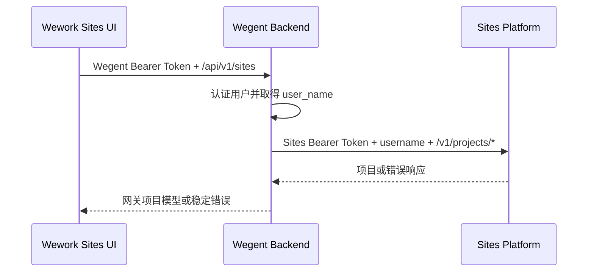

# Wework Sites 项目接口迁移设计

## 背景

Wework 的 Sites 页面目前通过 Wegent Backend 网关访问旧 Sites 服务。旧服务使用
`/api/v1/sites` 资源路径、offset 分页和站点发布状态字段。新服务使用
`/v1/projects/*` 操作路径、cursor 分页和 `network` 项目模型，并要求所有请求携带
面向 Sites 平台的 Bearer Token。

专用 Token 不得进入 Wework 渲染进程、浏览器存储、前端构建产物或日志。Wework
继续使用 Wegent 登录 Token 访问 Backend；Backend 使用环境变量中的专用 Token
访问上游服务。

## 目标

- 将 Sites 列表、搜索、删除和发布功能迁移到新的项目管理接口。
- 在站点操作菜单中增加重命名入口。
- 保持 Wework 到 Wegent Backend 的认证与代理边界。
- 使用新服务的真实项目字段和 cursor 分页，不伪造旧字段。
- 在桌面本地优先模式和常规 Backend 模式下保持相同的 Sites 行为。
- 为上游认证失败、校验失败、资源不存在和删除冲突提供稳定的错误行为。

## 非目标

- 不在 Wework 中保存或刷新 Sites 平台 Token。
- 不新增站点创建 API；“创建站点”继续启动已安装的 Sites 插件工作流。
- 不实现从 `outer` 切回 `inner`；附件没有提供对应接口。
- 不展示发布历史、异步发布进度或上次发布失败原因；新接口没有这些字段。
- 不保留旧 `/api/v1/sites` 上游协议的兼容或回退路径。
- 不修改主 Web 前端的 Sites 功能。

## 方案选择

采用“Backend 安全适配、Wework 按新模型迁移”的方案。

Wework 保留 `/api/v1/sites` 作为 Wegent Backend 网关命名空间，但网关返回新项目模型，
并在内部只访问新 `/v1/projects/*` 上游接口。这样既不暴露专用 Token，也不会把
`network`、`url` 和 cursor 分页伪造成旧的发布状态、双 URL 和 offset/total。

不采用以下方案：

- Backend 将新响应强行转换成旧 `internal_url`、`external_url` 和
  `publish_status`。这些字段无法从新协议无损推导，offset/total 也无法从 cursor
  可靠重建。
- Wework 直接访问 Sites 服务。该方案必须把专用 Token 下发到客户端，违反安全边界。

## 架构与认证



Backend 配置增加：

- `SITES_API_BASE_URL`：上游服务地址，例如测试环境
  `http://10.54.33.62:18080`。默认保持为空，未配置时 Sites 页面显示不可用状态。
- `SITES_API_TOKEN`：上游平台 Bearer Token，使用敏感配置类型读取，默认保持为空。
  配置缺失时与缺少 base URL 一样返回 `sites_not_available`。

Token 只用于构造 Backend 到上游的 `Authorization` 请求头。异常、慢请求日志和测试
断言都不得输出 Token。配置更新随 Backend 进程重启生效；本次不实现运行时刷新。

Wegent Backend 从已认证用户读取 `user_name`，并将它作为上游 `username`。Wework
不能覆盖该字段。这保留了当前的用户隔离边界，也避免客户端使用测试用户名访问其他
用户资源。

## Backend 网关契约

网关项目模型为：

```json
{
  "id": "prj_01KXN31C03C3MVD878RPP1PFX7",
  "network": "inner",
  "title": "Codex Search Alpha Site",
  "url": "https://example.invalid",
  "snapshot": "https://cdn.example.invalid/snapshot.png",
  "created_at": "2026-07-16T09:10:03.865Z"
}
```

### 搜索与分页

```http
GET /api/v1/sites?q=<search>&cursor=<project-id>&limit=<1-100>
```

Backend 将请求映射为：

```http
GET /v1/projects/search?username=<current-user>&sitename=<search>&cursor=<cursor>&limit=<limit>
```

`q` 缺失或只有空白时，上游 `sitename` 使用空字符串。网关响应保持上游 cursor 语义：

```json
{
  "items": [],
  "next_cursor": null
}
```

Wework 发起新搜索或刷新时清空已有项目和 cursor；“加载更多”传入最近一次返回的
`next_cursor`，并按项目 `id` 去重追加。没有 `next_cursor` 时隐藏“加载更多”。

### 发布到外网

```http
POST /api/v1/sites/{project_id}/publish
```

Backend 调用：

```http
POST /v1/projects/deploy/outer
Content-Type: application/json

{"username":"<current-user>","project_id":"<project_id>"}
```

网关返回上游更新后的项目。Wework 仅为 `network = inner` 的项目显示发布按钮；请求
进行中显示本地加载态，成功后使用完整返回对象替换列表项。`network = outer` 的项目
直接显示其当前公网 URL，不提供重复发布按钮。

### 删除

```http
DELETE /api/v1/sites/{project_id}
```

Backend 调用：

```http
POST /v1/projects/del
Content-Type: application/json

{"username":"<current-user>","project_id":"<project_id>"}
```

只有上游返回 `{"deleted": true}` 时网关才返回 `204 No Content`。Backend 不再先请求
项目详情；新服务自身使用 `username + project_id` 执行归属校验。Wework 仅在 204 后
移除列表项。失败时保留列表项和确认对话框，以便重试。

### 重命名

```http
POST /api/v1/sites/{project_id}/rename
Content-Type: application/json

{"title":"New site title"}
```

Backend 校验 `title` 去除首尾空白后长度为 1 到 255，再调用：

```http
POST /v1/projects/update
Content-Type: application/json

{
  "username":"<current-user>",
  "project_id":"<project_id>",
  "sitename":"New site title"
}
```

网关返回更新后的项目。Wework 使用返回对象替换列表项，不在客户端猜测 URL 或其他
字段变化。

## Wework 交互

Sites 页面继续复用现有表格、搜索框、刷新、加载更多、创建入口和操作菜单。

- 缩略图读取 `snapshot`；图片为空或加载失败时显示现有占位图标。
- 主标题读取 `title`，唯一键和测试标识使用项目 `id`。
- 链接统一读取 `url`。`inner` 使用内网语义标签，`outer` 使用外网语义标签。
- 发布按钮只在 `inner` 项目中显示。
- 操作菜单新增“重命名”，同时保留“删除”。所有新增交互元素使用稳定的
  `data-testid`。
- 重命名对话框默认填入当前标题，空标题或超过 255 个字符时禁止提交；提交期间禁止
  重复操作。
- 搜索、重命名和错误提示在中英文 `sites` 命名空间中同时维护。

本次不改变整体布局、密度或响应式断点。

## 错误处理

Backend 解析上游统一错误结构：

```json
{
  "error": {
    "code": "NOT_FOUND",
    "message": "Project not found"
  }
}
```

- 未配置 base URL 或 Token：返回 503，错误码 `sites_not_available`。
- 网络失败、非 JSON 成功响应或项目响应不符合 schema：返回 502，错误码
  `sites_upstream_unavailable`。
- 上游 401 表示 Backend 的 Sites 专用 Token 失效，不表示 Wework 用户登录失效。
  Backend 将其转换为 502 和 `sites_upstream_auth_failed`，不得向 Wework 返回 401，
  避免错误清除 Wegent 登录状态。
- 上游 400、404、409 和 413 保留 HTTP 状态及上游错误码和消息。
- 发布和重命名失败时保留原项目；删除失败时保留项目和确认对话框。用户可以修正输入
  或重试。
- 搜索失败且页面已有项目时保留已有项目并显示非阻塞错误；首次加载失败显示现有重试
  状态。

## 测试与验证

### Backend 自动化测试

- 未认证用户仍无法访问 Sites 网关。
- 缺少 URL 或 Token 时返回 `sites_not_available`。
- 搜索正确注入登录用户名、空或非空 `sitename`、cursor、limit 和上游 Bearer 头。
- 搜索响应验证新项目 schema 和 `next_cursor`。
- 发布、删除和重命名使用正确路径、方法和 JSON 请求体。
- 删除只在 `deleted = true` 时返回 204。
- 上游 401 转换为 `sites_upstream_auth_failed`，不会成为客户端 401。
- 上游标准错误和无效响应按错误处理章节映射。

### Wework 自动化测试

- API 客户端发送 cursor 分页请求，并调用发布、删除和重命名网关端点。
- 页面展示 `snapshot`、`title`、`url` 和网络语义。
- 搜索或刷新重置 cursor，加载更多追加且不丢失已有项目。
- `inner` 项目可发布并使用返回对象更新为 `outer`；`outer` 项目没有发布按钮。
- 重命名对话框覆盖成功、校验失败、服务失败和重试。
- 删除覆盖成功、409 失败和重试。
- 现有创建站点插件流程保持通过。

### 真实桌面验证

按照 `wework/AGENTS.md` 使用隔离的真实 Tauri 会话验证：

1. 使用有效的测试 URL、专用 Token 和测试用户启动 Backend。
2. 在 Sites 页面验证首次加载、搜索、cursor 加载更多和刷新。
3. 对一个 `inner` 项目验证重命名和发布到外网。
4. 对可安全删除的测试项目验证删除确认和成功移除。
5. 使用无效专用 Token 验证错误可恢复且 Wegent 登录状态保留。
6. 停止隔离会话并清理仅用于验证的测试项目。

当前提供的测试 Token 已在 2026-07-17 15:21:50（北京时间）过期。真实服务验证开始前
需要提供新的短时 Token；Token 只写入本地未跟踪环境配置。

---

# Wework Sites Project API Migration Design

## Context

The Wework Sites page currently reaches the legacy Sites service through the Wegent Backend
gateway. The legacy service uses `/api/v1/sites`, offset pagination, and publication-state
fields. The new service uses `/v1/projects/*`, cursor pagination, and a `network`-based project
model. Every upstream request requires a Sites-platform Bearer token.

The dedicated token must never enter the Wework renderer, browser storage, frontend bundles,
or logs. Wework continues to authenticate to Wegent Backend with its Wegent token. Backend
uses the dedicated token from environment configuration for upstream calls.

## Goals

- Migrate list, search, delete, and publish behavior to the new project APIs.
- Add site renaming to the existing actions menu.
- Preserve the Wework-to-Backend authentication and proxy boundary.
- Use the real project fields and cursor semantics without inventing legacy fields.
- Keep Sites behavior aligned in local-first desktop and regular Backend modes.
- Provide stable handling for upstream authentication, validation, not-found, and conflict
  failures.

## Non-Goals

- Do not store or refresh the Sites platform token in Wework.
- Do not add a site-creation API; creation still starts the installed Sites plugin workflow.
- Do not implement `outer` to `inner` conversion because the supplied API does not expose it.
- Do not show deployment history, asynchronous progress, or last deployment failures because
  the new contract does not expose those fields.
- Do not retain an upstream fallback to the legacy `/api/v1/sites` protocol.
- Do not change the main web frontend.

## Selected Architecture

Use Backend as a secure adapter and migrate Wework to the new model. Wework keeps
`/api/v1/sites` as its Wegent gateway namespace, while the gateway returns the new project
model and exclusively calls `/v1/projects/*` upstream. Backend injects the authenticated
Wegent user's `user_name` and a dedicated `SITES_API_TOKEN`.

The gateway surface is:

- `GET /api/v1/sites?q=&cursor=&limit=` maps to `GET /v1/projects/search` and returns
  `items` plus `next_cursor`.
- `POST /api/v1/sites/{project_id}/publish` maps to
  `POST /v1/projects/deploy/outer`.
- `DELETE /api/v1/sites/{project_id}` maps to `POST /v1/projects/del` and returns 204 only
  when the upstream response confirms deletion.
- `POST /api/v1/sites/{project_id}/rename` with `{ "title": "..." }` maps to
  `POST /v1/projects/update` with the upstream `sitename` field.

`SITES_API_BASE_URL` and `SITES_API_TOKEN` are required server configuration. Missing either
returns `sites_not_available`. The token is treated as sensitive data and never logged.

## Wework Behavior

The UI model contains only `id`, `network`, `title`, `url`, `snapshot`, and `created_at`.
Search and refresh reset the cursor. Load-more appends deduplicated projects and is shown only
when `next_cursor` exists. `inner` projects expose the publish action; successful publication
replaces the list item with the returned `outer` project. `outer` projects show their current
public URL without another publish action.

The actions menu adds rename alongside delete. Rename validates a trimmed title of 1 to 255
characters and replaces the list item with the complete server response. Delete removes an
item only after Backend returns 204. Failed mutations preserve the current project and allow
retry. New text is added to both Chinese and English Sites namespaces, and every new
interactive control receives a stable `data-testid`.

## Error Handling

Missing configuration returns 503. Network failures, invalid success payloads, and malformed
JSON return 502. An upstream 401 means the server-side Sites token is invalid; Backend maps it
to 502 `sites_upstream_auth_failed` so Wework does not clear its Wegent login. Upstream 400,
404, 409, and 413 retain their status, code, and message. Existing projects stay visible when
a paginated load or mutation fails.

## Verification

Backend tests cover authentication, secure token injection, cursor parameters, new response
schemas, all mutation bodies, confirmed deletion, upstream error mapping, and invalid
responses. Wework tests cover the API adapter, cursor state, network-specific actions,
renaming, deletion conflicts, search refresh, and the unchanged plugin creation flow.

The change also requires isolated real-Tauri verification under `wework/AGENTS.md`, using a
fresh untracked test token. The token supplied with the request expired at 2026-07-17 15:21:50
China Standard Time and cannot be used for the final live verification.
