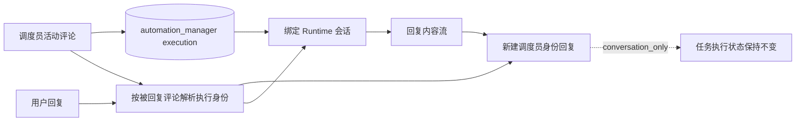
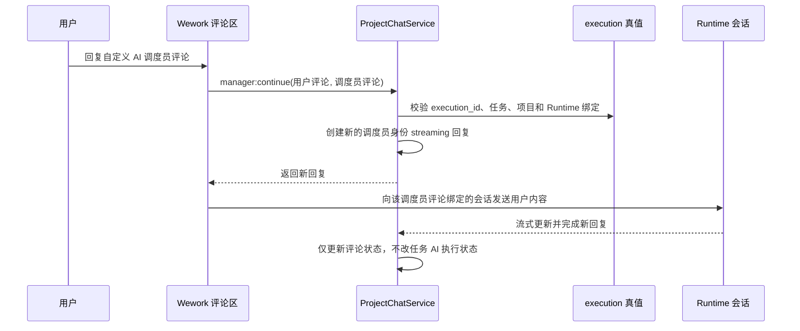

# 自定义 AI 调度员评论续聊

| 边界 | 代码归属 |
| --- | --- |
| 评论识别与路由 | `wework/src/features/todo/TaskActivityView.tsx` |
| Socket 合约 | `wework/src/api/backend/projectChatSocket.ts`、`backend/app/api/ws/wework_runtime_namespace.py` |
| execution 与评论校验 | `backend/app/services/project_chat/service.py` |
| Runtime 会话继续 | `wework/src/features/workbench/` |

不变量：续聊目标由被回复评论绑定的 execution 和 Runtime 会话决定，不得由任务当前负责人决定；仅自定义 `automation_manager` execution 可以进入此路径；用户回复和调度员回答必须是两条新评论，既有评论作者身份不可修改；续聊复用原调度员会话；对话回复不得覆盖任务当前机器人的执行状态、负责人或看板状态。
