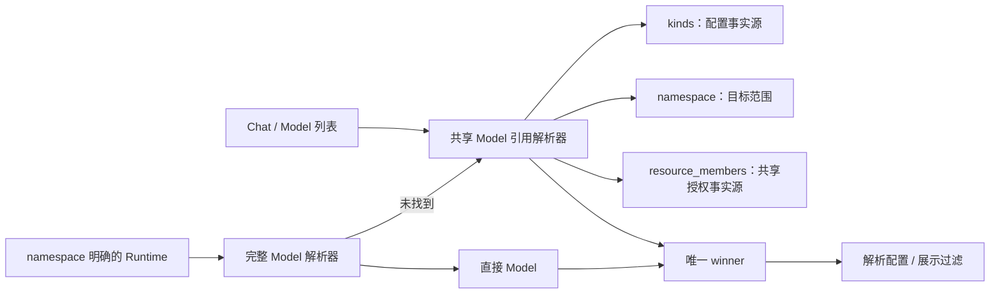
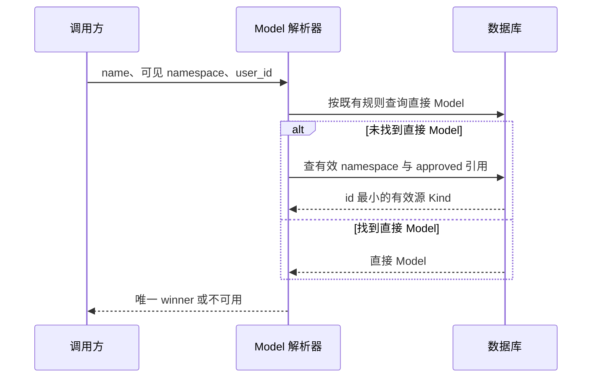

# 共享 Model 引用解析

## 范围

约束共享 Model 引用在所有调用方中解析到唯一源 Kind 的过程；可见
namespace 明确的 Runtime 调用方还必须复用同一个直接优先解析器。

## 连线图

## 时序图

## 代码归属

| 职责 | 归属 |
| --- | --- |
| 直接 Model 与共享引用的唯一选择规则 | `shared/db/capability_reference.py` |
| 共享关系创建、解绑、列表和 Backend 委托入口 | `backend/app/services/capability_reference_service.py` |
| Backend RAG 配置构建 | `backend/app/services/rag/runtime_resolver.py` |
| Knowledge Runtime 配置构建 | `knowledge_runtime/knowledge_runtime/services/config_resolver.py` |
| Model 列表 winner 与展示过滤 | `backend/app/services/model_aggregation_service.py` |

## 必要不变量

- `Kind` 是能力配置的唯一事实源；共享不得复制配置或密钥。
- `ResourceMember` 是共享授权事实源；共享引用仅在目标 namespace 有效且为 approved 时可解析。
- 引用中的 namespace 表示调用方可见范围，不要求等于源 Kind 的 namespace。
- 同一可见范围存在多个同名共享 Model 时，选择 `Kind.id` 最小的记录。
- 团队 namespace 内存在历史同名直接 Model 时，选择 `Kind.id` 最小的记录；其所有权边界是 namespace，不是当前调用用户。
- 调用方保留既有直接 Model 查询；仅在未找到时解析共享引用。
- Backend RAG 与 Knowledge Runtime 必须复用同一个完整 Model 解析器；解绑或停用后必须立即不可用。
- Model 列表必须先确定同名 winner，再应用类别、Shell 兼容性和客户端可见性过滤；过滤不得改选更大 id 的同名 Model。
