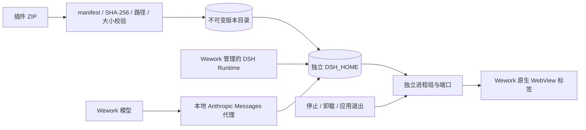
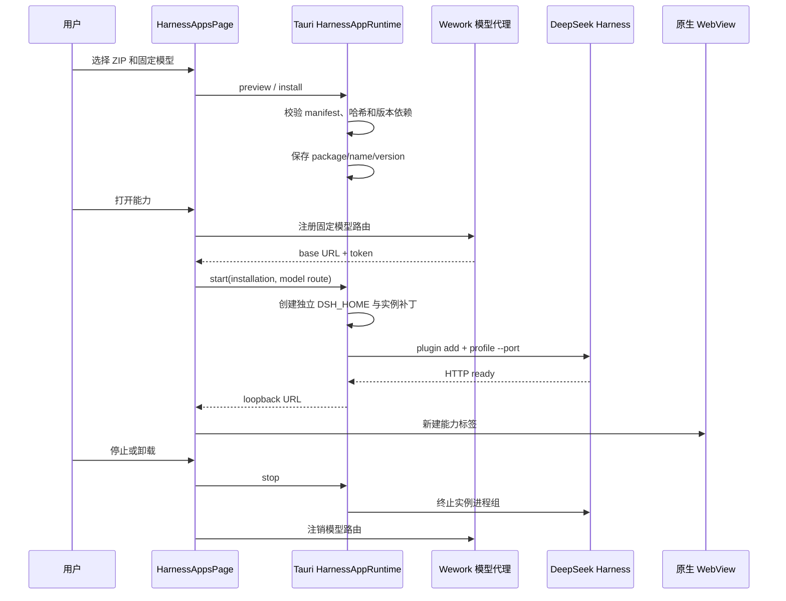

# DeepSeek Harness 能力应用

范围：Wework 导入本地 DeepSeek Harness 插件包，在不修改 Harness 源码的前提下，将其绑定到一个 Wework 模型并作为独立工作区标签运行。

| 边 | 代码归属 |
| --- | --- |
| ZIP、manifest、版本和落盘校验 | `wework/src-tauri/src/harness_apps.rs` |
| Runtime 解析、实例目录、进程组和端口 | `wework/src-tauri/src/harness_apps.rs` |
| Wework 模型到 Anthropic Messages 代理 | `wework/src/features/local-harness/localHarnessModels.ts` |
| 安装、管理和生命周期 UI | `wework/src/pages/HarnessAppsPage.tsx` |
| 工作区标签与原生 WebView | `wework/src/App.tsx`、`wework/src/features/workspace-tabs/workspaceTabs.ts` |

不变量：DeepSeek Harness 源码保持只读；安装包必须先校验再写入不可变的 `name/version` 目录；插件声明的 DSH 版本范围必须包含实际 Runtime 版本；每个能力实例拥有独立 `DSH_HOME`、端口和进程组；模型选择在安装记录中固定，模型凭据只存在于运行期代理和子进程环境中；一个实例的启动、停止或失败不得影响其他实例；没有活动状态 API 时实例按显式生命周期常驻；停止、卸载和 Wework 退出都必须回收完整进程组；只有 HTTP 就绪后才能创建标签页。
