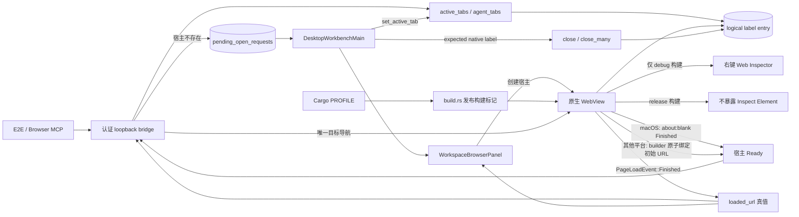
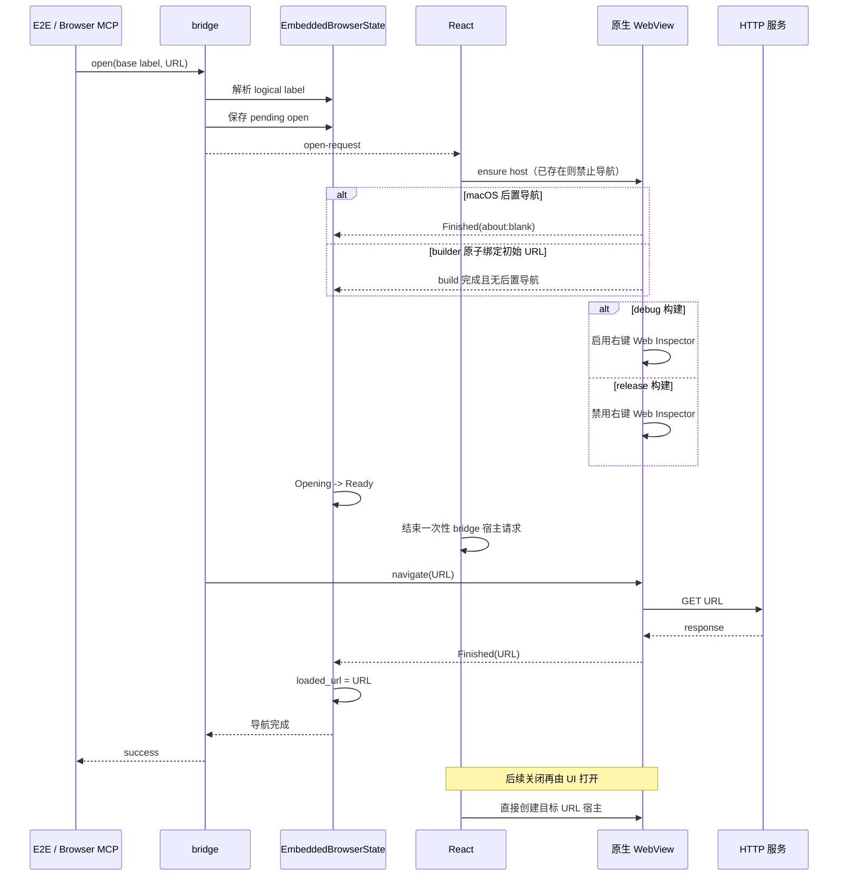

# 内置浏览器导航与多标签

范围：Agent/测试通过 bridge 首次打开页面，右侧多个浏览器标签的路由、加载真值和关闭，以及内置浏览器 Web Inspector 的构建边界。

| 边                                            | 代码归属                                                                  |
| --------------------------------------------- | ------------------------------------------------------------------------- |
| bridge 认证与分发                             | `wework/src-tauri/src/embedded_browser/bridge_server.rs`                  |
| logical-label 路由、pending request、导航真值 | `wework/src-tauri/src/embedded_browser.rs`                                |
| 标签创建、选择和关闭                          | `wework/src/components/layout/DesktopWorkbenchMain.tsx`                   |
| `about:blank` 宿主创建与 UI 状态              | `wework/src/components/layout/workspace-panels/WorkspaceBrowserPanel.tsx` |
| Cargo 发布构建标记                            | `wework/src-tauri/build.rs`                                               |
| Web Inspector 的 debug/release 构建边界       | `wework/src-tauri/src/embedded_browser.rs`                                |
| 多标签真实桌面回归                            | `wework/e2e/desktop/scenarios/embedded-browser-multi-tabs.scenario.mjs`   |

不变量：base label 只负责入口路由；每个标签拥有独立 logical label 和 WebView；bridge 请求只在首次宿主创建期间有效，React 用 ensure-host 创建宿主且复用时禁止导航；macOS 的 `build()` 只代表对象创建，后置 bootstrap `about:blank` 的 `Finished` 才能把宿主从 `Opening` 变为 `Ready`，其他平台由 builder 原子绑定初始 URL，无后置导航竞争；bridge 是首次目标 URL 的唯一后置导航者；目标 URL 的 `Finished → loaded_url` 才能完成 `open`；关闭只能销毁 expected native label；内置浏览器只在 debug 构建暴露右键 Web Inspector，release 构建标记优先于 `debug_assertions`，即使发布配置重新启用断言或编译了主 WebView 的诊断能力也不得让子 WebView 可检查。

详细能力与验证说明见 [内置浏览器开发指南](../wework/developer-guide/wework-embedded-browser.md)。
