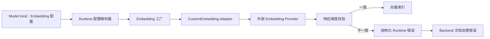
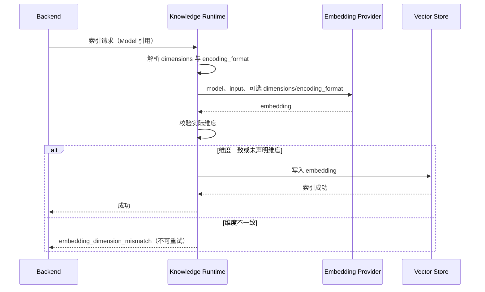

# Embedding 维度契约

## 范围

约束 Model 中声明的 Embedding 配置从 Backend 与 Knowledge Runtime 解析到
`CustomEmbedding` Provider 请求、响应校验和文档索引失败投影的过程。
原生 SDK Adapter 的响应契约与物理索引隔离策略不在本主题范围内。

## 连线图

## 时序图

## 代码归属

| 职责 | 归属 |
| --- | --- |
| Model Embedding 配置结构 | `backend/app/schemas/kind.py` |
| Backend RAG 配置构建 | `backend/app/services/rag/runtime_resolver.py` |
| Backend 本地 CRD 配置构建 | `backend/app/services/rag/embedding/factory.py` |
| Knowledge Runtime 配置构建 | `knowledge_runtime/knowledge_runtime/services/config_resolver.py` |
| Provider 请求与响应维度保证 | `knowledge_engine/knowledge_engine/embedding/custom.py` |
| Embedding Adapter 选择 | `knowledge_engine/knowledge_engine/embedding/factory.py` |
| Runtime 结构化错误响应 | `knowledge_runtime/knowledge_runtime/main.py` |
| Backend 索引失败投影 | `backend/app/services/knowledge/processing_errors.py` |

## 必要不变量

- `embeddingConfig` 是期望输出格式的事实源；配置解析不得丢失 `dimensions` 或 `encoding_format`。
- 路由到 `CustomEmbedding` 时，配置的可选请求参数必须传给 Provider；未配置的参数不得擅自补默认值。
- 路由到 `CustomEmbedding` 且声明 `dimensions` 时，每个 Provider 响应向量的实际长度必须与其相等。
- 维度不一致必须在 Provider Adapter 内立即失败，禁止继续写入向量索引。
- 维度不一致是不可重试的配置错误，Runtime 与 Backend 必须保留稳定错误码。
- 错误日志可记录模型、期望维度和实际维度，不得记录凭据、输入正文或向量内容。
