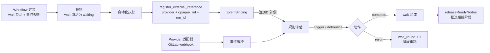
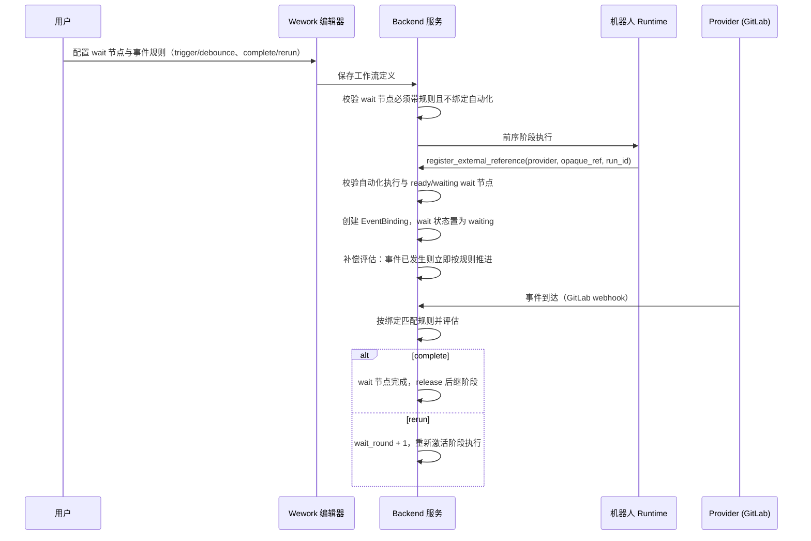

# 外部事件订阅与 Wait 节点

范围：wait 节点状态机、事件规则匹配、外部引用注册、GitLab 事件接入、等待轮次与补偿。

| 边 | 代码归属 |
| --- | --- |
| wait 节点与事件规则定义 | Issue workflow schema、Wework 工作流编辑器 |
| 注册与绑定 | `external_events/registration.py`、`binding.py`、`wework-space` MCP、Executor `mcp.rs` |
| Provider 事件接入 | `external_events/adapters.py`、`project_incoming_hooks.py` |
| 缓冲与规则评估 | `external_events/buffer.py`、`evaluate.py` |
| wait 状态投影与推进 | `project_workflow_projection.py`、`issueWorkflow.ts` |

不变量：

- wait 节点必须配置至少一条事件类型非空的规则，且不得绑定自动化规则；start 节点不得依赖其他节点，end 节点不得被依赖。
- 只有执行预设工作流且存在 `ready`/`waiting` wait 节点的自动化执行才允许注册外部引用；注册以 `automation_run_id` 为执行作用域。
- 绑定三元组（provider、opaque_ref、workflow node + automation run）唯一；重复注册幂等，不产生重复推进。
- 只有匹配绑定规则的事件类型才改变 wait 状态；不匹配事件只记录，不得推进或重跑。
- `trigger` 模式事件一到即评估；`debounce` 模式按窗口聚合后再评估。
- `complete` 动作完成 wait 节点并释放后继；`rerun` 动作递增 `wait_round` 并仅重跑该阶段。
- 注册时若事件已发生，立即补偿评估，避免错过等待窗口。
- start/end 为结构性 DAG 边界，不参与自动化执行；任何删除与重排不得破坏边界。
