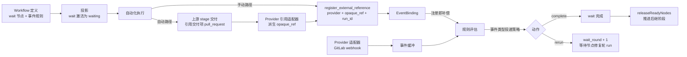
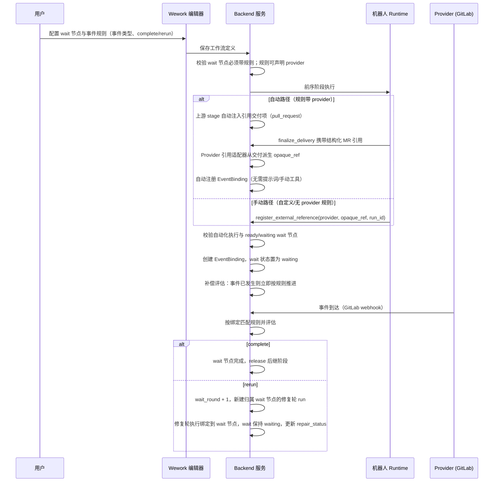

# 外部事件订阅与 Wait 节点

范围：wait 节点状态机、事件规则匹配、外部引用注册（手动与交付自动绑定）、GitLab 事件接入、等待轮次与补偿。

| 边 | 代码归属 |
| --- | --- |
| wait 节点与事件规则定义 | Issue workflow schema、Wework 工作流编辑器 |
| 注册与绑定（含交付自动绑定） | `external_events/registration.py`、`binding.py`、`reference.py`、`wework-space` MCP、Executor `mcp.rs` |
| Provider 事件接入与事件类型投递策略 | `external_events/adapters.py`、`project_incoming_hooks.py` |
| Provider 引用适配器与 opaque_ref 派生 | `external_events/adapters.py`（`PROVIDER_REFERENCE_ADAPTERS`） |
| 缓冲、规则评估与窗口结算 | `external_events/buffer.py`、`evaluate.py`、`tasks/external_event_tasks.py` |
| wait 状态投影与推进 | `project_workflow_projection.py`、`issueWorkflow.ts` |

不变量：

- wait 节点必须配置至少一条事件类型非空的规则，且不得绑定自动化规则。
- 规则可声明 `provider`（从事件目录选择时自动带上）；匹配按（provider、event_type）双条件，规则 provider 为空时匹配任意 provider。一个 wait 节点可同时声明多个 provider 的规则。
- 只有执行预设工作流且存在 `ready`/`waiting` wait 节点的自动化执行才允许注册外部引用；注册以 `automation_run_id` 为执行作用域。
- 绑定三元组（provider、opaque_ref、workflow node + automation run）唯一；重复注册幂等，不产生重复推进。
- 上游自动绑定：规则带 provider 的 wait 节点会使其直接前驱 stage 动态获得一个引用必交付项（由 provider 引用适配器声明交付类型，如 GitLab 为 `pull_request`），该要求随 wait 规则实时重算，不落库、不依赖作者配置；stage 交付时缺该项即被 finalize 校验拒绝。交付完成后系统用 provider 引用适配器从交付派生 opaque_ref 并自动注册绑定；绑定随 wait 节点完成而归档。
- Provider 引用适配器是自动绑定的唯一扩展点：新增 provider（包括非 GitLab 的任意引用形态，如视频链接）只需注册一个 `ProviderReferenceAdapter`（声明交付类型 + opaque_ref 派生），路由、交付、工作流代码零改动；未注册适配器的 provider 走手动路径。
- 外部引用 provider 分两类：原生适配器（目前仅 `gitlab`，gitlab.com 与自托管实例 webhook 负载一致，注册时 opaque_ref 为 `group/project!<iid>`）与通用信封（其余名称，webhook 须携带同名 `x-event-provider` 头及 opaque_ref/event_type，未设置时用 `generic`）；原生集合由 `PROVIDER_EVENT_TYPES` 派生，新增适配器即注册事件类型。
- 只有匹配绑定规则的事件类型才改变 wait 状态；不匹配事件只记录，不得推进或重跑。
- 投递策略由事件类型在 provider 目录中声明（`window_seconds` + `merge_while_running`），wait 节点规则不再携带触发策略；目录外事件类型（自定义/泛型）回退到默认即发即得。
- `merged` 声明即发即得（leading edge）：空闲时事件一到立即开启一轮修复；修复轮运行期间到达的事件排队，运行结束后逐条各触发一轮，不合并。
- `ci_failed` 声明运行期合并（`merge_while_running`）：空闲时第一条事件立即触发；修复轮运行期间到达的事件合并，运行结束后一起触发一轮。
- `review_comment` 声明 5 秒短时聚合 + 运行期合并（`window_seconds=5`、`merge_while_running=true`）：同一 wait 节点上窗口内到达的评论合并为一轮触发，窗口外开启新一轮；窗口到期时若修复轮仍在运行，评论先聚合，运行结束后再触发。
- 结算按（provider、event_type）分组，各事件类型按自己声明的策略出队：即发即得逐条各开一轮，运行期合并整组开一轮；其他类型继续排队等下一轮。
- 同一 wait 节点不得同时存在两轮修复执行：修复轮运行期间到达的事件一律先缓冲，绝不并发启动第二轮。
- `complete` 动作完成 wait 节点并释放后继；`rerun` 动作递增 `wait_round`，并为该轮新建一个归属 wait 节点的 run（`workflow_node_id` 指向 wait 节点，stage input 的 `target_stage` 为 wait 节点且 prompt 为重跑指令）。wait 节点在整个修复轮期间保持 `waiting`，只更新 `repair_status` 与任务/交付归属，不得改写已完成的上游阶段。
- 注册时若事件已发生，立即补偿评估，避免错过等待窗口。
- 阶段 DAG 没有结构化的开始/结束节点，也没有结束标志：无前置节点的阶段是入口，流程在最后一个阶段自然结束。`complete` 完成 wait 节点后，由全部 required 阶段完成承担 Issue 进入待确认；旧数据中的 start/end 节点在加载与投影时一律剥离。
