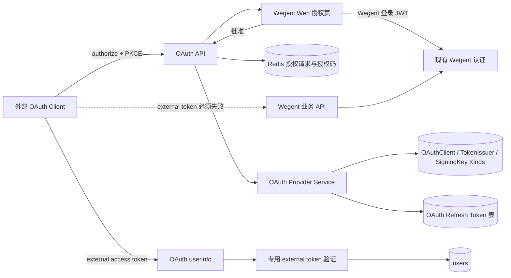
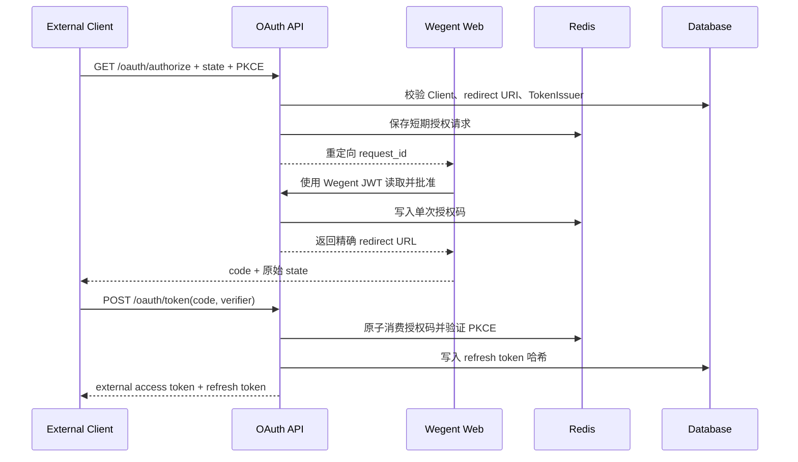
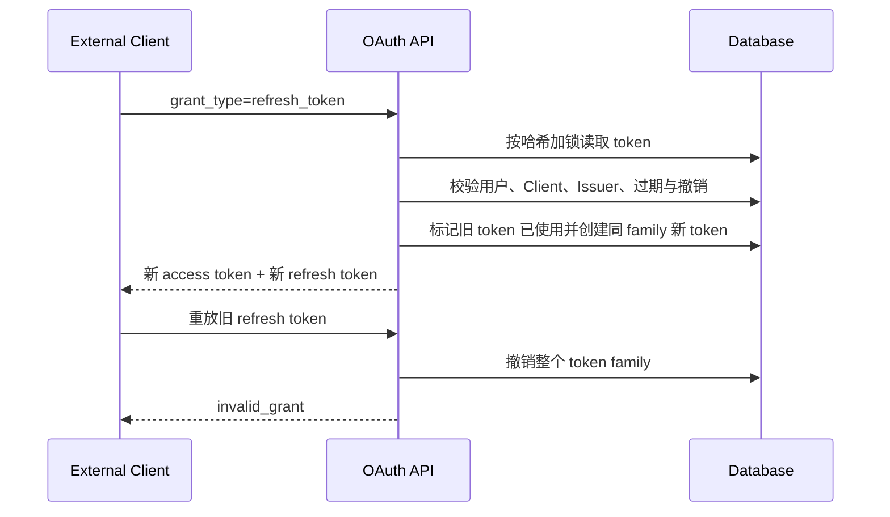

# 外部 OAuth 身份令牌

## 范围

Wegent 作为受限 OAuth 2 授权服务器，只向已登记的外部 Client 证明当前用户身份。外部 access token 只能读取专用 userinfo，不授予 Wegent API 或外部业务权限。

## 连线图

## 授权码时序

## 刷新时序

## 代码归属

| 责任 | 归属 |
| --- | --- |
| OAuth 协议端点与错误响应 | `backend/app/api/endpoints/oauth_provider.py` |
| Client、授权码、JWT 与 refresh 轮换 | `backend/app/services/auth/oauth_provider.py` |
| OAuth 请求、响应和 Kind 结构 | `backend/app/schemas/oauth_provider.py` |
| Refresh token 持久化 | `backend/app/models/oauth_refresh_token.py` |
| Client 管理 API | `backend/app/api/endpoints/admin/oauth_clients.py` |
| Client 管理与用户授权 UI | `frontend/src/features/admin/`、`frontend/src/app/auth/oauth/authorize/` |

## 必要不变量

- external access token 只允许访问 OAuth userinfo；现有 Wegent JWT、API Key、Task Token 认证不得接受它。
- userinfo 只返回 `id`、`user_name`、`email`，不返回角色、认证来源、偏好、Git 信息或资源权限。
- audience 固定为 `wegent-userinfo`，scope 固定为 `userinfo.read`，Client 不能请求扩大。
- redirect URI 必须与 Client 登记值完全匹配；授权码必须使用格式合法的 PKCE S256、短期且只能消费一次。
- Client 的 access token TTL 不得超过 TokenIssuer 上限；被 Client 引用的 TokenIssuer 不得删除或改成其他 audience。
- 只有 Client 和 redirect URI 均已验证时，授权错误才可携带原始 `state` 重定向；否则必须返回本地错误，避免开放重定向。
- refresh token 只存哈希并每次轮换；已使用 token 被重放时撤销整个 family。
- Client 被禁用、删除、轮换 secret、切换类型或更换 TokenIssuer 时，必须撤销其现存 refresh token。
- 用户、Client、TokenIssuer 或 SigningKey 失效后，不得签发或刷新 token。
- 日志不得记录 access token、refresh token、授权码、client secret 或 Authorization header。
