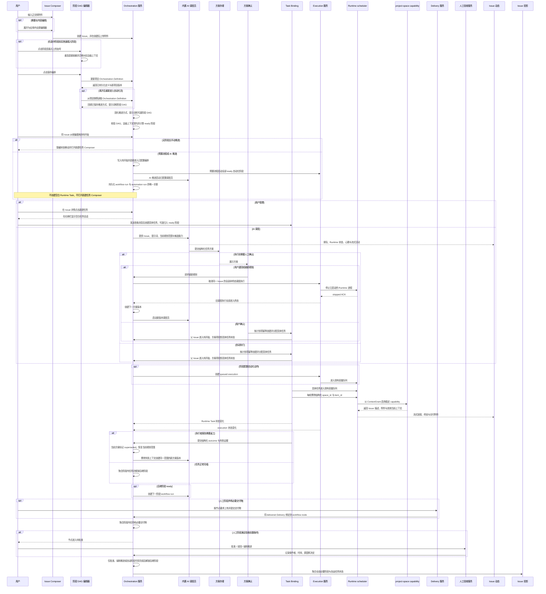

# Issue、任务与工作流编排

范围：Issue 的任务组织方式、推进方式、项目阶段 DAG、Issue 阶段快照、AI 方案草案与确认、具体任务与执行记录的引用、依赖就绪判断、恢复与重跑、工作空间继承、动态投影和 Issue 状态聚合。

```mermaid
flowchart LR
    COMPOSER[Issue Composer<br/>紧凑输入 / 应用内全屏编辑] --> ISSUE
    COMPOSER --> ATTACHMENT[标题 / 正文 / 待上传附件]
    ATTACHMENT --> ISSUE
    EDITOR[阶段 DAG 编辑器] -->|新增 / 插入阶段| TEMPLATE[(项目 Orchestration Definition)]
    EDITOR -->|显式保存| PROJECT_API[ProjectSpace update API]
    PROJECT_API --> TEMPLATE
    TEMPLATE -->|重新进入时回填| EDITOR
    TEMPLATE --> SNAPSHOT[(Issue Orchestration Snapshot)]
    ISSUE[(LoopItem / Issue)] --> SNAPSHOT
    SNAPSHOT --> MODE{推进方式}
    MODE -->|用户管理| HUMAN[用户拆解与分配]
    MODE -->|AI 调度| RUN[(Workflow Run)]
    RUN --> AUTO_RUN[(Coordinator Automation Run)]
    AUTO_RUN --> COORD_EXEC[(Coordinator Execution)]
    COORD_EXEC --> COORD_ACTIVITY[Issue 动态中的运行活动]
    RUN --> SCOPE{规划范围}
    SCOPE -->|无阶段| ISSUE_SCOPE[整个 Issue]
    SCOPE -->|有阶段| READY_SCOPE[当前 ready 阶段]
    ISSUE_SCOPE --> AI[内置调度员读取范围、提示词与候选能力]
    READY_SCOPE --> AI
    AI --> PLAN[(Workflow Plan Items)]
    PLAN --> POLICY{执行前需要人工确认}
    POLICY -->|是| APPROVAL{用户确认}
    APPROVAL -->|退回| RUN
    APPROVAL -->|确认| MATERIALIZE[幂等物化具体任务]
    POLICY -->|否| MATERIALIZE
    ISSUE --> ENTRY{收集箱拖到待开始}
    ENTRY -->|无阶段 + 手动推进| TASK_COMPOSER
    ENTRY -->|预置流程| START_READY[启动 ready 自动化阶段]
    ENTRY -->|AI 推进| RUN
    START_READY --> STAGE
    SNAPSHOT --> GRAPH{是否设置阶段 DAG}
    GRAPH -->|无阶段| FREE[自由任务集合]
    GRAPH -->|有阶段| STAGE[Stage / Node / Milestone]
    STAGE --> EDGE[依赖边 / Context Contract]
    EDGE --> STAGE
    STAGE --> REQUIREMENT[必要交付物契约]
    HUMAN --> BINDING[(LoopItemTaskBinding)]
    MATERIALIZE --> BINDING
    FREE --> BINDING
    STAGE --> BINDING
    ISSUE --> TASK_COMPOSER[右侧空白任务会话]
    TASK_COMPOSER -->|首条消息| BINDING
    BINDING -->|打开已有任务| SIDEBAR[右侧任务会话]
    BINDING --> TASK[(Wework Runtime Task)]
    TASK_COMPOSER --> CONTEXT[结构化 Issue 来源<br/>space_id + item_id]
    SIDEBAR --> CONTEXT
    CONTEXT --> TASK
    TASK --> GRANT[Session ContextGrant]
    GRANT --> SPACE_MCP[稳定 wework-space capability]
    SPACE_MCP --> ISSUE
    SPACE_MCP --> ATTACHMENT
    STAGE -->|阶段自动化规则| EXEC[(LoopItemExecution)]
    EXEC --> RUNTIME[现有 Runtime / Team / API 激活器]
    TASK --> WORKSPACE[现有 workspace / worktree / branch 真值]
    WORKSPACE -->|inherit| NEXT[后继具体任务]
    TASK --> AGGREGATE[Issue 状态聚合器]
    EXEC --> AGGREGATE
    STAGE --> AGGREGATE
    AGGREGATE --> ISSUE
    TASK --> ACTIVITY[Issue 动态]
    EXEC --> ACTIVITY
    TASK --> DELIVERY[阶段交付物]
    REQUIREMENT --> DELIVERY
    DELIVERY --> REVIEW{人工验收}
    REVIEW -->|批准| AGGREGATE
    REVIEW -->|驳回| TASK
    REVIEW -->|强制推进 + 原因| AGGREGATE
    ACTIVITY --> STREAM[流式执行卡片 / Final 摘要 / 附件事件]
    TASK -->|结构化结果 needs_rework| REWORK[同一规划范围的新方案版本]
    REWORK --> RUN
    AGGREGATE -->|解锁下一阶段| RUN
    RUN -->|暂停 / 恢复 / 从阶段重跑| RUN
```

| 边                                   | 代码归属                                                                  |
| ------------------------------------ | ------------------------------------------------------------------------- |
| Issue Composer → Issue、草稿与附件   | Wework `IssueComposer`、ProjectSpace API；同一草稿在紧凑与全屏视图间共享  |
| 阶段 DAG 编辑与前后插入              | Wework `ProjectWorkflowEditor`                                            |
| 编排显式保存与重新进入回填           | Wework `ProjectAutomationView`、`ProjectWorkflowEditor`、ProjectSpace API |
| 项目编排定义与 Issue 快照            | Backend workflow schema/service；Wework 自动化页 DAG UI                   |
| AI 调度 → 方案版本与确认             | Backend workflow run/plan service；Wework Issue 编排方案 UI               |
| Workflow run → 调度执行与活动        | `project_automation_execution.py`、`loop_item_executions/service.py`、`TaskActivityView` |
| 重新规划 → 取消旧调度执行            | `project_workflow_orchestration.py`、`loop_item_executions/service.py`、`robot_queue_tasks.py` |
| 已确认方案 → 具体任务                | Backend workflow materializer；标准 LoopItem 创建与指派服务               |
| 依赖边 → 后继阶段上下文              | Workflow node dependency context；Composer / automation instruction       |
| 用户管理 / AI 调度 → 具体任务        | 标准 Wework Composer、AI manager、`LoopItemTaskBinding`                   |
| Issue 新建任务 / 已有任务 → 右侧会话 | `CloudTodoWorkspace`、`TodoEditor`、`AiChatModal`                         |
| Runtime Task 绑定 → 阶段状态同步     | `projectSpaceSelection`、`WorkbenchProvider`、ProjectSpace API            |
| 节点交付物 → 人工验收与推进          | Delivery API、workflow decision service、`IssueWorkflowDag`               |
| Issue 看板入口 → 手动任务或编排      | `CloudTodoWorkspace`、`workItemTaskInput`、Issue workflow snapshot        |
| Issue 会话 → 项目空间当前上下文      | Runtime metadata、ContextGrant、内置 `wework-space` Plugin、Local Gateway |
| 阶段 → 自动化执行                    | `project_automation_execution.py`、`loop_item_executions/service.py`      |
| 工作空间与后继任务继承               | Runtime Task summary、Wework project work controls                        |
| DAG 就绪判断、阶段与 Issue 状态聚合  | Backend workflow service；本地 ProjectSpace 服务；Wework 实时投影         |
| 执行真值 → Issue 动态                | Project chat stream、Task activity cards、Delivery/attachment projection  |

不变量：

- `LoopItem` 是 Issue 和业务聚合容器，不是一次执行。
- Issue 创建的紧凑视图和应用内全屏视图必须编辑同一份正文和待上传附件；切换视图不得重建草稿、重复上传或改变“创建 Issue / 创建任务”语义。
- 应用内全屏编辑器必须覆盖当前看板工作区的左侧项目列表和右侧任务区域，同时保留顶层 38px Tab/标题栏，并在其余三边及标题栏下方使用标准内容边距。
- 应用内全屏编辑器的收起与关闭操作必须在标题栏右侧成组排列；正文与附件区域必须使用可用宽度，仅保留标准页面内边距，不得用固定窄宽度制造大面积无效留白。
- Issue 文本草稿按目标项目空间和创建模式持久化，待上传 `File` 只保存在当前应用进程内；普通关闭必须保留草稿，仅创建成功或用户显式清除时删除。
- Issue 创建不提供独立标题字段，紧凑视图与应用内全屏视图都必须通过既有默认规则从正文生成标题。附件继续通过既有 ProjectSpace 附件 API 在 Issue 创建后上传。
- Stage / Node / Milestone 是任务的逻辑分类和依赖节点，不是一次执行，也不是执行者类型。
- Wework Runtime Task、Wegent Task 和 `LoopItemExecution` 继续分别承担具体任务与执行真值；阶段只引用它们，不复制状态、工作目录、worktree、分支或队列字段。
- 阶段 DAG 与推进方式正交。用户管理和 AI 调度都可在“无阶段”或“有阶段”下工作。
- 无阶段 AI 调度使用内部 Issue 级规划范围，不向 Issue 快照写入虚拟阶段或节点，`current_stage_id` 保持为空。
- 依赖边既表示就绪约束，也定义前序阶段向后继阶段传递的上下文。Issue 基础信息始终传递；边只配置是否附加前序任务最终结果、交付附件和执行过程。
- 边级上下文策略属于后继节点对某个前置节点的输入声明；删除依赖时必须同时删除对应策略，不能留下悬空配置。
- 在阶段前后插入新阶段必须重连该方向上的全部直接依赖，并把被替换边的上下文策略迁移到语义等价的新边；不得丢失分支、产生悬空上下文或引入环。
- 编排编辑是本地草稿，只有用户触发清晰可见的“保存编排”主操作后才写入项目；保存成功必须使用服务端返回的定义与项目版本更新页面真值，离开后重新进入必须从项目持久化定义完整回填。
- AI 调度必须通过创建、指派和启动具体任务推进 Issue。有阶段时每个 AI 创建的任务必须归入一个阶段，并遵守该阶段依赖；无阶段时 AI 可根据 Issue 和提示词自由拆解。
- AI 调度员是内置云端角色；项目只保存一个云端模型标识，不创建用户可见的调度员实体，也不保存模型密钥。
- AI 只能提交结构化方案。`approval_policy=required` 时必须停在 `awaiting_approval`，确认前不得创建、指派或启动具体任务；`approval_policy=automatic` 时方案校验成功后立即物化。两种策略都必须通过同一套标准 LoopItem 创建与指派路径，且默认值为 `required`。
- 方案确认并物化具体任务后，父 Issue 至少进入“待开始”；方案项必须直接展示其具体任务的真实状态并作为重入入口，不能只显示静态方案文案，让用户误以为任务尚未创建。
- 执行者发现需要返工时必须提交结构化 outcome；`needs_rework` 只废弃当前活动方案，并在有 DAG 时创建同阶段新版本、无 DAG 时创建 Issue 级新版本，不修改历史任务，也不在阶段 DAG 中创建回边。
- 重复上报同一个任务的同一返工结果必须幂等，不得重复创建方案版本或重复启动调度 AI。
- 每个方案版本不可变；计划项使用稳定幂等键。重复确认、服务重启或事件重放只能补齐缺失任务，不能重复创建。
- Issue 快照只保存当前编排摘要和活动 run/version 指针；方案历史与计划项作为独立持久资源保存，不把完整历史堆入 Issue JSON。
- 活动 run 指针必须同时校验所属 Issue 和项目；客户端提交的快照不得借此读取或操作其他 Issue 的方案。
- AI 编排只能绑定当前项目内已启用的云端调度规则。进入新规划版本、恢复失败规划或推进到下一阶段时必须实际触发一次调度；触发失败必须把规划标记为 failed，不能永久停在 planning。
- 一个 workflow run 最多绑定一个 coordinator automation run；事件重放必须复用该关联，重新规划必须先创建新 workflow run，不能为同一方案版本并行创建多个调度执行。
- 用户重新规划前必须取消同一 Issue 的全部非终态 coordinator execution。queued 或尚未发送 Start 的 claimed execution 可直接终结；已发送 Start 或 running 的 execution 必须等待 Runtime stopped ACK 后才能创建并调度新方案版本。取消未确认时重新规划失败，不得让新旧调度员并发。
- Issue 方案区只能投影 coordinator automation run 与 execution 的真实排队、启动、Runtime、心跳和终态；`planning` 不能单独证明 AI 仍在运行。完整流式内容继续由 Issue 动态承载，并通过稳定的 activity message id 定位。
- 父 Issue 推进和新版本创建必须持有父记录行锁；并发任务完成和重复事件不能创建两个下一阶段 run。
- 暂停只阻止新规划和新物化；已有执行继续按 execution 真值回写。继续执行从第一个未完成检查点恢复。
- 从某阶段重跑必须保留上游可信结果，将该阶段及下游活动方案标记为 superseded，并在停止受影响的活动执行后创建新版本。
- Issue 从“收集箱”拖到“待开始”时，任务入口必须读取该 Issue 的编排快照。仅“无阶段 + 手动推进”属于自己管理任务，需暂缓移动并打开新建任务 Composer；预置流程必须直接写入“待开始”并启动全部 ready 的自动化阶段，AI 推进必须启动快照绑定的调度员。两者都不得打开新建任务 Composer，也不得为绕过弹窗而创建空白 Runtime Task；重复进入不得为同一阶段或 AI 调度员创建重复运行。
- 预置流程中的人工阶段由用户显式开始。Issue 详情必须在缩放流程图之外展示所有 ready 人工阶段的主操作，明确标注“人工执行”并提供“开始处理”；流程图只承担结构与进度展示，不能把唯一入口藏在会缩放的节点内部。点击“开始处理”只打开绑定该阶段的任务 Composer，首条消息发送前仍不得创建空白 Runtime Task。
- 人工阶段的 Runtime Task 创建后，只先写入 `LoopItemTaskBinding`。Runtime Task 云上下文必须返回该绑定的 `workflow_node_id`，绑定完成必须触发已知 Runtime 生命周期重放；不得把人工任务写成 `LoopItemExecution` 的 queued 状态，也不得在 Runtime 尚未确认 running 时由 UI 伪造“排队中”或“进行中”。
- 人工阶段状态机是 `blocked → ready → running → awaiting_approval → completed`。驳回进入 `changes_requested` 并允许继续原任务；强制推进进入 `forced_completed`。`queued` 仅用于已经创建真实自动化执行且等待 Runtime 容量的自动阶段，不得用于未执行的人工阶段。
- 节点可声明零个或多个必要交付物。任务 Composer 和 Issue 详情必须明示这些要求及上传方法；提交的 Delivery 必须通过来源 TaskBinding 归属到唯一 `workflow_node_id`。未满足必要交付物时不得批准，但允许具有权限的用户填写原因后强制推进。
- 人工任务全部成功且必要交付物已提交后，节点只能进入 `awaiting_approval`，不能自动完成。只有用户批准或带原因强制推进后，后继节点才可解锁；驳回必须保留任务、交付物和历史决定，不得回滚或覆盖审计记录。
- 节点决定必须记录 action、actor user id、reason 和 timestamp。强制推进必须填写非空原因；普通批准可选备注；驳回必须填写原因。
- Issue 详情必须同时提供已有任务重入、交付物上传、批准、驳回和强制推进入口。节点内任务行是稳定重入入口，关闭右侧会话后仍可再次打开。
- Issue 详情中的“新建任务”只打开与已有任务会话同位置的右侧空白 Composer；首条消息发送前不得创建 Runtime Task 或 `LoopItemTaskBinding`。
- 从 Issue 发起或继续的每一轮 Runtime 对话都必须携带结构化 `space_id` 与 `item_id`，并转换为会话隔离的 ContextGrant。不得按任务动态注入完整 MCP Server 配置，也不得只依赖自然语言提示词或 `cloud://` 文本探测；具体能力生命周期见 [项目空间 Agent 能力](project-space-agent-capability.md)。
- 一个 Issue 可以绑定多个异构任务，一个阶段也可聚合多个具体任务。任务仍可在 Wework 任务列表中找到。
- 阶段自动化只决定何时、如何创建或启动具体执行，不是与“任务”并列的实体类型。
- `inherit` 只从明确的前驱 Runtime Task 读取已确认的 workspace/worktree/branch；没有可继承来源时必须回到标准 Composer 选择，不得猜测目录。
- queued、待审批或依赖未满足只投影为“待开始”；只有 Runtime 确认 running 才投影为“进行中”。
- 自动阶段完成由阶段内执行的可信终态聚合得到；人工阶段完成还必须经过批准或强制推进。Issue 完成由全部必要阶段和自由任务聚合得到。任一单个任务或交付物完成不得直接完成仍有未验收工作的阶段或 Issue。
- DAG 必须无环；任务归入阶段前，该阶段必须存在；阶段开始前依赖必须全部满足；边级上下文只能引用直接前置阶段；UI 不得直接写 running。
- Issue“动态”是执行过程的统一投影。流式卡片只展示 Runtime 真值的紧凑摘要；完成后展示 final content 摘要；附件事件引用真实交付资产。
