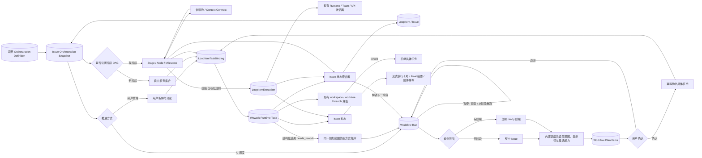
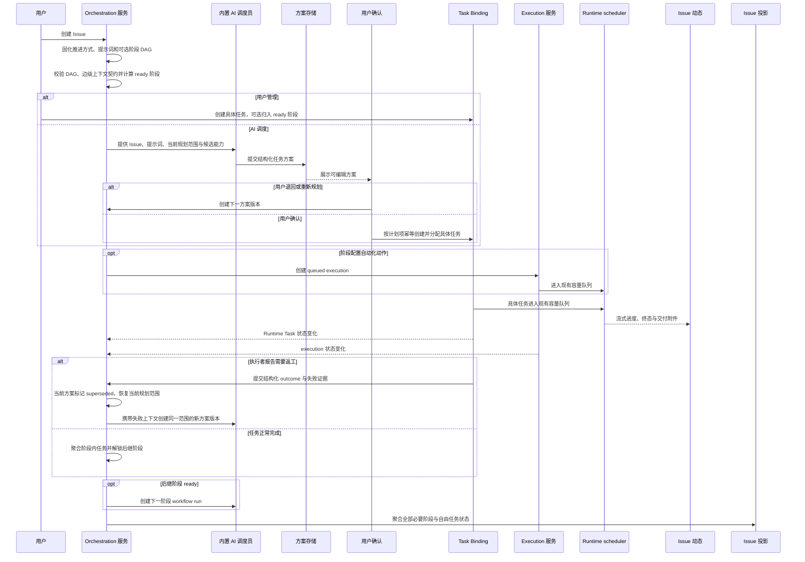

# Issue、任务与工作流编排

范围：Issue 的任务组织方式、推进方式、项目阶段 DAG、Issue 阶段快照、AI 方案草案与确认、具体任务与执行记录的引用、依赖就绪判断、恢复与重跑、工作空间继承、动态投影和 Issue 状态聚合。

| 边                                  | 代码归属                                                                 |
| ----------------------------------- | ------------------------------------------------------------------------ |
| 项目编排定义与 Issue 快照           | Backend workflow schema/service；Wework 自动化页 DAG UI                  |
| AI 调度 → 方案版本与确认            | Backend workflow run/plan service；Wework Issue 编排方案 UI              |
| 已确认方案 → 具体任务               | Backend workflow materializer；标准 LoopItem 创建与指派服务              |
| 依赖边 → 后继阶段上下文             | Workflow node dependency context；Composer / automation instruction      |
| 用户管理 / AI 调度 → 具体任务       | 标准 Wework Composer、AI manager、`LoopItemTaskBinding`                  |
| 阶段 → 自动化执行                   | `project_automation_execution.py`、`loop_item_executions/service.py`     |
| 工作空间与后继任务继承              | Runtime Task summary、Wework project work controls                       |
| DAG 就绪判断、阶段与 Issue 状态聚合 | Backend workflow service；本地 ProjectSpace 服务；Wework 实时投影        |
| 执行真值 → Issue 动态               | Project chat stream、Task activity cards、Delivery/attachment projection |

不变量：

- `LoopItem` 是 Issue 和业务聚合容器，不是一次执行。
- Stage / Node / Milestone 是任务的逻辑分类和依赖节点，不是一次执行，也不是执行者类型。
- Wework Runtime Task、Wegent Task 和 `LoopItemExecution` 继续分别承担具体任务与执行真值；阶段只引用它们，不复制状态、工作目录、worktree、分支或队列字段。
- 阶段 DAG 与推进方式正交。用户管理和 AI 调度都可在“无阶段”或“有阶段”下工作。
- 无阶段 AI 调度使用内部 Issue 级规划范围，不向 Issue 快照写入虚拟阶段或节点，`current_stage_id` 保持为空。
- 依赖边既表示就绪约束，也定义前序阶段向后继阶段传递的上下文。Issue 基础信息始终传递；边只配置是否附加前序任务最终结果、交付附件和执行过程。
- 边级上下文策略属于后继节点对某个前置节点的输入声明；删除依赖时必须同时删除对应策略，不能留下悬空配置。
- AI 调度必须通过创建、指派和启动具体任务推进 Issue。有阶段时每个 AI 创建的任务必须归入一个阶段，并遵守该阶段依赖；无阶段时 AI 可根据 Issue 和提示词自由拆解。
- AI 调度员是内置云端角色；项目只保存一个云端模型标识，不创建用户可见的调度员实体，也不保存模型密钥。
- AI 只能提交结构化方案草案。确认前不得创建、指派或启动具体任务；确认后必须通过标准 LoopItem 创建与指派路径物化。
- 执行者发现需要返工时必须提交结构化 outcome；`needs_rework` 只废弃当前活动方案，并在有 DAG 时创建同阶段新版本、无 DAG 时创建 Issue 级新版本，不修改历史任务，也不在阶段 DAG 中创建回边。
- 重复上报同一个任务的同一返工结果必须幂等，不得重复创建方案版本或重复启动调度 AI。
- 每个方案版本不可变；计划项使用稳定幂等键。重复确认、服务重启或事件重放只能补齐缺失任务，不能重复创建。
- Issue 快照只保存当前编排摘要和活动 run/version 指针；方案历史与计划项作为独立持久资源保存，不把完整历史堆入 Issue JSON。
- 活动 run 指针必须同时校验所属 Issue 和项目；客户端提交的快照不得借此读取或操作其他 Issue 的方案。
- AI 编排只能绑定当前项目内已启用的云端调度规则。进入新规划版本、恢复失败规划或推进到下一阶段时必须实际触发一次调度；触发失败必须把规划标记为 failed，不能永久停在 planning。
- 父 Issue 推进和新版本创建必须持有父记录行锁；并发任务完成和重复事件不能创建两个下一阶段 run。
- 暂停只阻止新规划和新物化；已有执行继续按 execution 真值回写。继续执行从第一个未完成检查点恢复。
- 从某阶段重跑必须保留上游可信结果，将该阶段及下游活动方案标记为 superseded，并在停止受影响的活动执行后创建新版本。
- 一个 Issue 可以绑定多个异构任务，一个阶段也可聚合多个具体任务。任务仍可在 Wework 任务列表中找到。
- 阶段自动化只决定何时、如何创建或启动具体执行，不是与“任务”并列的实体类型。
- `inherit` 只从明确的前驱 Runtime Task 读取已确认的 workspace/worktree/branch；没有可继承来源时必须回到标准 Composer 选择，不得猜测目录。
- queued、待审批或依赖未满足只投影为“待开始”；只有 Runtime 确认 running 才投影为“进行中”。
- 阶段完成由阶段内全部必要任务/执行的可信终态聚合得到；Issue 完成由全部必要阶段和自由任务聚合得到。任一单个任务完成不得直接完成仍有未完成工作的阶段或 Issue。
- DAG 必须无环；任务归入阶段前，该阶段必须存在；阶段开始前依赖必须全部满足；边级上下文只能引用直接前置阶段；UI 不得直接写 running。
- Issue“动态”是执行过程的统一投影。流式卡片只展示 Runtime 真值的紧凑摘要；完成后展示 final content 摘要；附件事件引用真实交付资产。
