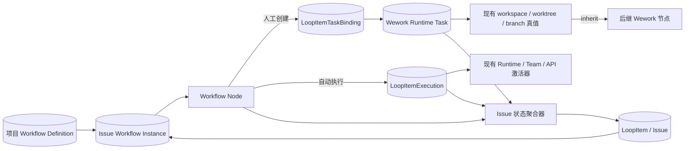
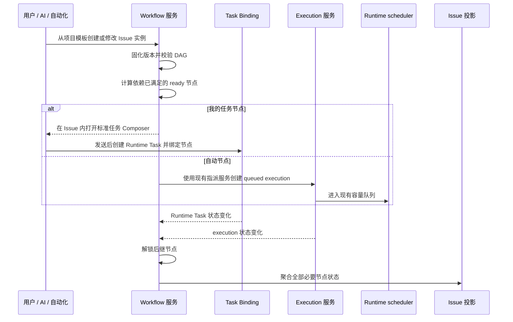

# Issue、任务与工作流编排

范围：项目工作流模板、Issue 工作流实例、现有任务与执行记录的引用、依赖就绪判断、工作空间继承和 Issue 状态聚合。

| 边                            | 代码归属                                                               |
| ----------------------------- | ---------------------------------------------------------------------- |
| 项目模板与 Issue 实例         | Backend workflow schema/service；Wework project-space workflow UI      |
| 节点 → 我的任务               | 标准 Wework Composer、Runtime Task 创建、`LoopItemTaskBinding`         |
| 节点 → 自动执行               | `project_automation_execution.py`、`loop_item_executions/service.py`   |
| 工作空间与后继继承            | Runtime Task summary、Wework project work controls                     |
| DAG 就绪判断与 Issue 状态聚合 | Backend workflow service；本地 ProjectSpace 服务；Wework 实时投影       |

不变量：

- `LoopItem` 是 Issue 和业务聚合容器，不是一次执行。
- Wework Runtime Task、Wegent Task 和 `LoopItemExecution` 继续分别承担实际任务与执行真值；工作流节点只引用它们，不复制状态、工作目录、worktree、分支或队列字段。
- 一个 Issue 可以绑定多个异构任务；“我的任务”节点只创建当前用户可在 Wework 任务列表找到的任务。
- 手工添加节点和自动化/AI 生成节点使用同一 DAG、执行者、依赖和工作空间策略结构。
- `inherit` 只从明确的前驱 Runtime Task 读取已确认的 workspace/worktree/branch；没有可继承来源时必须回到标准 Composer 选择，不得猜测目录。
- queued、待审批或依赖未满足只投影为“待开始”；只有 Runtime 确认 running 才投影为“进行中”。
- Issue 完成由全部必要节点的可信终态聚合得到；任一单个任务完成不得直接完成包含其他必要节点的 Issue。
- DAG 必须无环；节点执行前依赖必须全部满足；UI 不得直接写 running。
