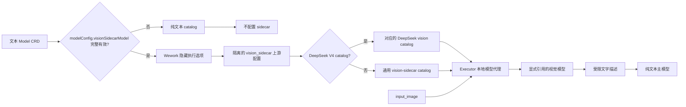
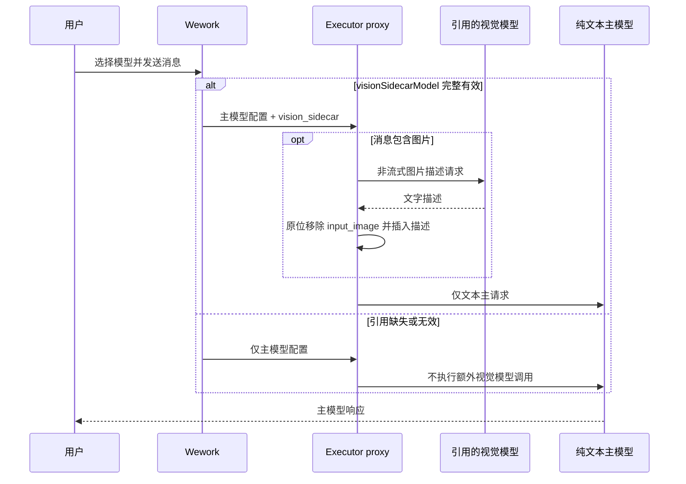

# 文本模型视觉委托

范围：Wework 使用纯文本模型执行带图片的 Codex 请求时，依据 Model CRD 中显式配置的视觉模型引用构造 sidecar，并在主请求前把图片替换为文字描述。DeepSeek V4 Pro/Flash 是首个保留自身 catalog 能力的适配对象。

| 边                                     | 代码归属                                                 |
| -------------------------------------- | -------------------------------------------------------- |
| 云端显式引用的编辑与能力约束           | `frontend/src/features/settings/`                        |
| Model CRD 安全配置聚合                 | `backend/app/services/model_aggregation_service.py`      |
| 云端引用校验与隐藏执行选项             | `wework/src/features/workbench/runtimeModelSelection.ts` |
| 本地/云端 sidecar 上游与 catalog 选择  | `wework/src/api/local/localServices.ts`                  |
| DeepSeek 文本及视觉委托 catalog        | `shared/assets/codex-models/deepseek.json`               |
| 图片描述、缓存、限制和原位替换         | `executor/src/server/local_model_proxy/vision.rs`        |
| 代理注册与主请求转发                   | `executor/src/server/local_model_proxy/mod.rs`           |
| 云端 Model 到 Codex catalog 的身份映射 | Wework 运行时选择与 Backend 触发链路                     |

不变量：视觉模型只能来自 `modelConfig.visionSidecarModel` 的显式引用，不按登录态、模型名称或默认模型自动选择；引用缺失或结构无效时不得配置 sidecar、提升图片能力或发起额外模型调用；显式引用必须包含模型名称、类型、命名空间、资源所有者和协议，Wework 不接收凭据；只有配置 sidecar 的 DeepSeek V4 Pro/Flash 才使用对应的视觉 catalog，未配置时保持纯文本 catalog；原始图片只发送给引用的视觉模型，主模型只能收到文字；sidecar 超时、无效图片或上游失败必须移除原图并插入明确失败描述；日志不得包含图片、密钥或提示词正文。

详细配置和限制见 [Wework 设置](../wework/settings.md)。
