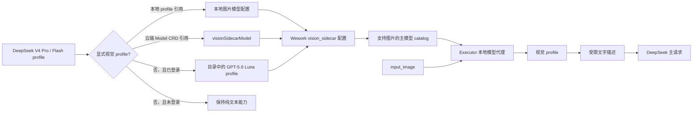
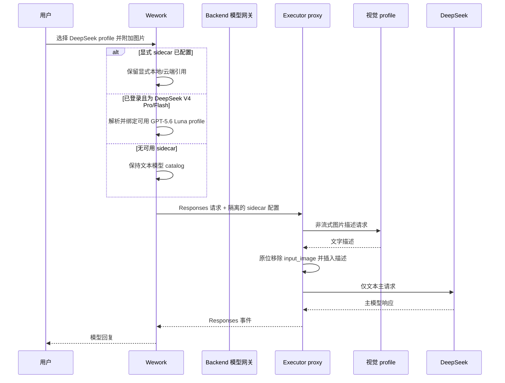

# 文本模型视觉委托

范围：Wework 通过本地或云端 Codex 执行 DeepSeek V4 Pro/Flash Responses profile 时，选择视觉 profile、构造 sidecar 上游，并在主请求前把图片替换成文字描述。

| 边                                 | 代码归属                                                   |
| ---------------------------------- | ---------------------------------------------------------- |
| 本地显式视觉 profile 的保存与校验  | `wework/src/features/model-settings/localModelSettings.ts` |
| 登录模型目录中的 DeepSeek 默认选择 | `wework/src/api/hybrid/hybridServices.ts`                  |
| 本地/云端显式引用的执行选项序列化  | `wework/src/features/workbench/runtimeModelSelection.ts`   |
| 本地/云端 sidecar 上游配置         | `wework/src/api/local/localServices.ts`                    |
| catalog 图片能力                   | `executor/src/server/codex_model_catalog.rs`               |
| 图片描述、缓存、限制和原位替换     | `executor/src/server/local_model_proxy/vision.rs`          |
| 代理注册与主请求转发               | `executor/src/server/local_model_proxy/mod.rs`             |
| 本地和云端桌面回归                 | `wework/e2e/desktop/modules/conversation-navigation.mjs`   |

不变量：显式视觉 profile 始终覆盖默认值；登录态默认只应用于确认的 `deepseek-v4-pro` 和 `deepseek-v4-flash` Responses 模型；默认 profile 必须从当前登录用户的云端目录按 `modelId=gpt-5.6-luna` 和声明的图片输入能力解析，优先使用公共 profile，并保留实际名称、类型、命名空间和资源所有者；未登录或目录中没有合格 Luna profile 时不得伪造云端身份或路由；只有配置有效 sidecar 的主模型才使用支持图片的 catalog，DeepSeek 专属变体继承主模型的推理、工具、上下文和输出元数据，其他模型才回退到通用 `wework-vision-sidecar`；原始图片只发送给视觉 profile，DeepSeek 主请求只能收到文字；sidecar 超时、无效图片或上游失败必须移除原图并插入明确失败描述；日志不得包含图片、密钥或提示词正文。

详细配置和限制见 [Wework 设置](../wework/settings.md)。
