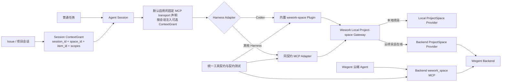
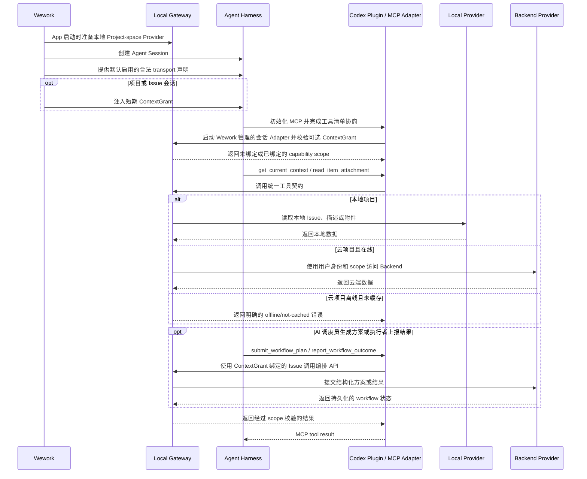

# 项目空间 Agent 能力

范围：Wework 中项目空间工具的安装、会话启用、Issue 上下文绑定、本地离线访问、云端路由和 Agent Harness 适配。

| 边                                           | 代码归属                                                          |
| -------------------------------------------- | ----------------------------------------------------------------- |
| Wework 启动 → Local Provider 生命周期        | Wework Tauri local executor；Executor local ProjectSpace provider |
| Agent Session → ContextGrant                 | Wework Runtime 消息元数据；Executor session context registry      |
| Agent Session → 默认启用的固定 MCP transport | Executor Codex adapter；Harness-specific MCP adapter              |
| Codex → project-space capability             | Wework 内置 `wework-space` Codex Plugin；Executor Codex adapter   |
| 其他 Harness → project-space capability      | Harness-specific MCP adapter                                      |
| Gateway → Local Provider                     | Executor `task_runtime` 与本地 ProjectSpace provider              |
| Gateway → Backend Provider                   | Executor authenticated Backend ProjectSpace client                |
| 云端 Agent → Backend MCP                     | Backend `wework_space` MCP                                        |
| 统一工具契约 → 全部 Adapter                  | 共享 schema、工具名、权限语义与契约测试                           |

不变量：

- MCP 能力的安装和服务声明是稳定配置；`space_id`、`item_id` 与权限是会话数据。不得再通过修改任务的完整 MCP Server 列表来表达 Issue 上下文。
- Wework 不连接 Backend 时，本地项目的 Issue、描述和附件读取必须可用；Backend 是云项目 Provider，不是本地能力成立的前提。
- Plugin 只是 Codex Adapter。Gateway、ContextGrant 和工具契约不得依赖 Codex 专有类型。
- Plugin 的 MCP 声明是产品打包入口；Runtime 负责提供默认启用状态、实际 Executor 路径和可选的会话 ContextGrant，不能依赖插件市场页面曾被打开或异步安装时序。
- 项目空间 MCP 默认对所有 Agent session 启用。普通任务保持未绑定状态，可显式选择项目；项目或 Issue 会话通过 ContextGrant 获得默认 `space_id/item_id` 和越界保护。
- ContextGrant 必须按 Agent session 隔离且不向模型暴露。其一小时有效期只限制新 MCP 会话的启动，启动后租约跟随该会话 Adapter 生命周期；长任务不会在执行中断权，Adapter 退出即撤销。模型参数、prompt 文本和全局“当前项目”均不是授权来源。
- 普通任务不绑定项目上下文；项目会话可只绑定 `space_id`，Issue 会话绑定 `space_id + item_id`。
- `get_current_context` 在无绑定时返回明确的未绑定结果；MCP 启动失败、无权限、云项目离线和未缓存必须是不同错误。
- Gateway 必须拒绝超出 ContextGrant scope 的显式 `space_id/item_id`，不能信任模型传入的标识。
- Runtime 在首轮前只校验固定能力配置与 ContextGrant，不得用全局 MCP 工具清单阻塞模型。工具清单诊断异步执行；能力调用失败必须返回明确错误，并由会话 UI 保留用户消息和失败回复。
- 本地、远程和 Backend MCP 使用相同工具 schema 与契约测试；Provider 只决定数据来源，不改变工具语义。
- AI 调度员会话必须暴露 `get_current_context`、`get_board_item`、`get_assignment_candidates`、`assign_board_item` 和 `submit_workflow_plan`；任务执行者会话必须可用 `report_workflow_outcome`。Executor Adapter 与 Backend MCP 必须代理同名、同 schema、同授权语义的工具，不能让提示词要求一个实际工具清单中不存在的能力。
- 迁移完成后必须删除 `ensure_space_mcp_server` 的逐任务服务注入路径，不能长期保留双主路径。
